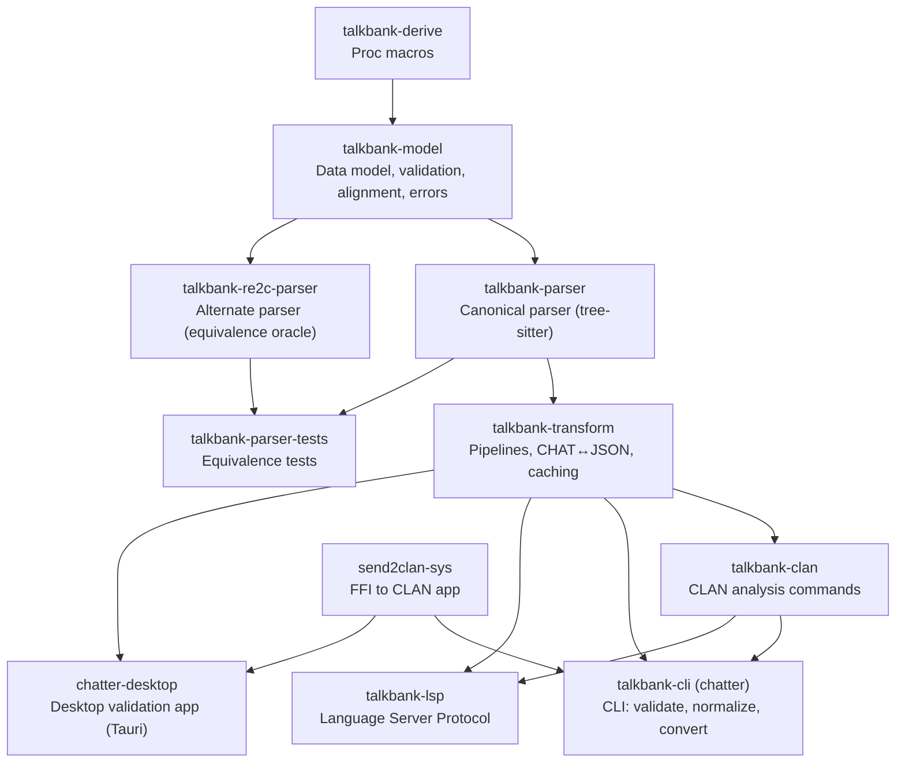

# CLAUDE.md

**Last modified:** 2026-04-16 16:19 EDT

This file provides guidance to Claude Code (claude.ai/code) when working with code in this repository.

## Cross-Cutting Design Rules

These rules matter because contributors often read code before they read docs.

1. **Types are the first layer of documentation.** Prefer named structs, enums,
   traits, and newtypes over raw primitives when the value has stable meaning.
2. **No primitive obsession at stable boundaries.** Do not introduce raw
   strings, integers, or booleans for domain concepts such as CHAT text,
   language IDs, spans, indices, counts, parser modes, recovery modes, or
   parse-health states.
3. **No tuple-packed domain seams.** If a pair or tuple has stable field
   meaning, name it with a struct or newtype.
4. **Avoid boolean blindness.** Use enums or state types when there are
   multiple meaningful states or invalid state combinations.
5. **No panic-based control flow in long-lived logic.** Do not add
   `unwrap()`, `expect()`, or equivalent panics in parser, model, validation,
   CLI, LSP, or background-tooling paths that should report typed failures.
6. **Use real domain errors.** Prefer `thiserror`-based error types and
   diagnostics over stringly failures.
7. **Keep modules browseable.** Split catch-all modules when they start
   combining unrelated concerns. Code organization should help a contributor
   find parser, validation, alignment, or spec logic quickly.
8. **Use methods when they clarify ownership.** Behavior that depends on a
   type's invariants should usually live with that type. Keep free functions
   for symmetric transforms, adapters, or orchestration glue.
9. **Touched docs need timestamps.** Any documentation file changed in a patch
   must update its `Last modified` field with date and time. **Always run
   `date '+%Y-%m-%d %H:%M %Z'` to get the actual system time** — do not
   guess, hardcode, or use the conversation date.

## Overview

Unified TalkBank CHAT toolchain: tree-sitter grammar, Rust crates (parsing, data model, validation, transformation, CLAN analysis), CLI (`chatter`), LSP server, VS Code extension, and FFI bindings.

**Supported platforms:** Windows, macOS, and Linux. All code must build and run correctly on all three platforms. CI tests on Ubuntu; release builds target all three (macOS ARM + Intel, Linux x86 + ARM, Windows x86).

Data flows: **spec** (source of truth) → **grammar** (`grammar/`) → **crates** (parsers, model, transform, clan, cli, lsp).

## Running in Development

The CLI binary is called `chatter` (package `talkbank-cli`).

```bash
# Run chatter directly (debug build, recompiles as needed)
cargo run -p talkbank-cli -- validate path/to/file.cha
cargo run -p talkbank-cli -- to-json path/to/file.cha
cargo run -p talkbank-cli -- clan freq path/to/file.cha

# Release build for large-scale work (much faster runtime)
cargo run --release -p talkbank-cli -- validate path/to/corpus/ --force

# Build the release binary once, then run it directly
cargo build --release -p talkbank-cli
./target/release/chatter validate path/to/file.cha
```

No special setup beyond a working Rust toolchain. `cargo run` handles incremental compilation automatically.

## Build, Test, and Lint

```bash
# Monorepo-level (run `make help` for all 29 targets)
make build          # Generate symbols + build Rust workspace
make test           # Rust workspace tests + doctests + spec tools
make check          # Fast compile check (both workspaces)
make verify         # Canonical pre-merge gates (G0–G13)
make test-gen       # Regenerate tests from specs
make smoke CRATE=x  # Fast: compile check + test one crate
make check-specs    # Verify every error code has a spec file
make ci-local       # Quick local CI approximation
make coverage       # Code coverage report

# Rust workspace
cargo fmt
cargo check --workspace --all-targets
cargo nextest run --workspace                # Preferred: parallel per-test
cargo nextest run -p talkbank-model          # Single crate
cargo clippy --all-targets -- -D warnings    # Periodic lint check

# Single test by name
cargo nextest run -E 'test(test_name)'

# Parser equivalence
cargo nextest run -p talkbank-parser-tests -E 'test(parser_equivalence)'

# Doctests (nextest can't run these)
cargo test --doc

# Tree-sitter grammar (intra-repo)
cd grammar && tree-sitter generate
cd grammar && tree-sitter test
cd grammar && tree-sitter parse path/to/file.cha

# Spec tools (SEPARATE Cargo workspace — must cd)
cd spec/tools && cargo test
cd spec/tools && cargo check --all-targets

# VS Code extension
cd vscode && npm run compile && npm test && npm run lint

# Desktop app (Tauri v2)
cd desktop && npm install && cargo tauri dev   # dev mode with hot reload
cd desktop && cargo tauri build                # distributable app bundle

# CLAN golden tests (requires CLAN binaries)
cargo nextest run -p talkbank-clan -E 'test(golden)'

# Fuzz testing (from fuzz/ directory)
cd fuzz && cargo fuzz run fuzz_parse_chat_file
```

## Architecture

**CHAT manual:** https://talkbank.org/0info/manuals/CHAT.html — the authoritative reference for the transcript format this project parses and validates.

```
grammar/        Tree-sitter grammar for CHAT format
  grammar.js      Grammar definition (edit this)
  src/            Generated C parser (do not edit)
  test/corpus/    Generated corpus tests (do not edit)

spec/           Source of truth: CHAT specification
  constructs/     Valid CHAT examples
  errors/         Invalid CHAT examples
  symbols/        Shared symbol registry (JSON + generators)
  tools/          Generators (separate Cargo workspace)

crates/         All Rust crates (see below)
corpus/         Reference corpus (88 files, must pass 100%)
  reference/      Sacred 88-file set (20 languages, 100% coverage)
tests/          Integration tests and fixtures
schema/         JSON Schema for ChatFile AST
vscode/         VS Code extension (TypeScript)
desktop/        Desktop validation app (Tauri v2, React + TypeScript)
fuzz/           Fuzz testing targets (separate Cargo workspace)
```

### Crate Dependency Flow



Downstream consumer: `batchalign3` (path deps to this workspace's crates).

### Crate Summaries

| Crate | Key Modules | Purpose |
|-------|-------------|---------|
| `talkbank-model` | `model/`, `validation/`, `alignment/` | Data types, WriteChat, Validate trait, tier alignment, content walker |
| `talkbank-derive` | `semantic_eq.rs`, `span_shift.rs`, `error_code_enum.rs` | SemanticEq, SpanShift, ValidationTagged, error_code_enum proc macros |
| `talkbank-parser` | `api/`, `parser/` | CST-to-model conversion via tree-sitter |
| `talkbank-transform` | pipelines, serialization, caching | Parse+validate pipeline, CHAT↔JSON roundtrip |
| `talkbank-clan` | `framework/`, `commands/`, `transforms/`, `converters/` | CLAN analysis (FREQ, MLU, etc.), transforms (FLO, etc.), format converters |
| `talkbank-cli` | `cli/`, `commands/`, `ui/` | `chatter` binary: validate, normalize, to-json, clan dispatch |
| `talkbank-lsp` | `backend/`, `alignment/`, `graph/` | LSP server with tree-sitter incremental parsing |
| `send2clan-sys` | `ffi.rs`, `api/` | C FFI to CLAN app (macOS Apple Events, Windows WM_APP) |
| `talkbank-re2c-parser` | `re2c/`, `lexer.rs`, `parser.rs` | Alternate parser using re2c lexer (equivalence oracle for tree-sitter parser) |
| `talkbank-parser-tests` | golden word lists, `generated/` | Parser equivalence, roundtrip, property tests |
| `chatter-desktop` | `commands.rs`, `events.rs` | Native desktop validation app (Tauri v2, React) |
| `xtask` | `main.rs` | Cargo xtask build helpers (symbol generation, etc.) |

### Two Cargo Workspaces (plus desktop)

1. **Root workspace** (`Cargo.toml`) — all Rust crates under `crates/` + `desktop/src-tauri`
2. **Spec workspace** (`spec/Cargo.toml`) — `spec/tools` for core generation and `spec/runtime-tools` for runtime-aware spec tooling

Use the relevant manifest path for spec tooling:
- `spec/tools/Cargo.toml` for generation
- `spec/runtime-tools/Cargo.toml` for bootstrap/mining/runtime validation

### Shared Symbol Registry

Symbols (language codes, error markers, etc.) are defined once in `spec/symbols/symbol_registry.json` and generated into grammar JS and Rust code:
```bash
make symbols-gen    # Validates registry, generates grammar + Rust symbol sets
```

## Grammar Change Workflow (Required)

**CRITICAL: `src/parser.c` (in `grammar/`) is a GENERATED artifact.** Produced by `tree-sitter generate` from `grammar.js`. Never edit `parser.c` directly.

**`tree-sitter test` does NOT detect stale parser.c** — it regenerates before testing. Only `cargo test`/`cargo build` will exhibit bugs from a stale parser.c.

When any grammar source changes (especially `grammar/grammar.js`), run this full sequence:
1. `cd grammar && tree-sitter generate` — **MANDATORY after every grammar.js edit, including reverts**
2. `cd grammar && tree-sitter test`
3. Regenerate typed CST traversal (requires `~/tree-sitter-grammar-utils`):
   ```bash
   cd ~/tree-sitter-grammar-utils && cargo run --example generate_traversal \
     -p tree-sitter-node-types -- \
     ~/talkbank/talkbank-tools/grammar/src/grammar.json \
     ~/talkbank/talkbank-tools/grammar/src/node-types.json \
     --skip whitespaces \
     2>/dev/null > ~/talkbank/talkbank-tools/crates/talkbank-parser-tests/src/generated_traversal.rs
   ```
4. `make test-gen` — regenerate corpus tests and error tests from specs
5. `cargo nextest run -p talkbank-parser && cargo nextest run -p talkbank-parser-tests`
6. `cargo nextest run --test bare_timestamp_regression`
7. Re-run at least one real-file CLI validation command covering the changed syntax path.
8. `make generated-check`

Rules:
- Do not trust parser/validator debugging output until step 1 is complete.
- **After reverting a grammar.js change**, you MUST re-run `tree-sitter generate`.
- Do not regenerate corpus expectations blindly; review failures first.
- `cargo nextest run -p talkbank-parser-tests` is a required compatibility gate.

### Grammar Design: Strict + Catch-All Pattern

For header fields with a closed set of valid values, the grammar uses the **strict + catch-all** pattern ("parse, don't validate"): known values as named nodes (syntax highlighting), generic catch-all for unknown values (flagged by Rust validator). 10 rules use this pattern (`option_name`, `media_type`, `id_sex`, `id_ses`, etc.). See `grammar/CLAUDE.md` for details.

## Spec Change Workflow

After modifying specs in `spec/constructs/` or `spec/errors/`:
```bash
make test-gen       # Regenerates into: grammar/test/corpus/, crates/talkbank-parser-tests/tests/generated/, docs/errors/
make verify         # Run all verification gates
```

## Critical Policies

### Always Fix Root Causes, Never Symptoms

When a bug is found, trace it to its architectural origin and fix it
there. Do not add workarounds, "pragmatic" patches, or band-aids that
mask the real problem. "Pragmatic" is banned as a justification for
incomplete fixes.

When you discover a wrong architecture, fix it — do not perpetuate it.
If a bug reveals an incorrect architectural assumption, note the flaw
explicitly, then fix the architecture. A detection/workaround that
prevents a crash is not a fix — it is evidence the architecture needs
changing.

### Test Failures Are Bugs Until Proven Otherwise

**When a test fails, STOP and ask the user.** Do not assume the test
expectation is wrong. Do not update test expectations to match new
behavior without explicit approval.

CHAT semantics are subtle and domain-specific. The grammar, parser, and
model encode years of decisions about how overlap markers, lengthening,
CA notation, zero-words, and other CHAT constructs interact. An LLM
cannot reliably judge whether a behavioral change is correct by reading
code alone.

**The rule:**
1. If a test fails after your change, report the failure with the
   exact `left`/`right` values and the test name.
2. Explain what your change did and why you think the behavior changed.
3. **Ask the user** whether the old expectation or the new behavior is
   correct. Do not guess.
4. Only update the test after the user confirms the new behavior is
   intended.

This applies especially to:
- `cleaned_text()` expectations (what counts as "spoken text")
- Overlap marker handling (⌈⌉⌊⌋ — structural vs content)
- CA notation (°, ↑, ↓, ∆, etc.)
- Lengthening vs colon disambiguation
- Zero-word and omission semantics
- Any grammar change that alters the CST structure

**Postmortem (2026-03-24):** A grammar fix for stacked CA markers
(`°↑ho:v°`) changed how `word_body` parsed marker-initial words. Six
overlap marker tests failed. Instead of asking the user, the wrong
assumption was made that the tests needed updating. The tests were
actually correct — they documented intentional semantics. Always ask.

### Grammar/Parser Bug Fixes Require Specs and Reference Corpus

**Every grammar or parser bug fix MUST be TDD'd with specs and reference
corpus entries based on actual data.** This prevents regressions and
documents the fix for successors.

**The workflow:**
1. Find the bug (error in corpus data, failing parse, wrong CST)
2. **RED:** Add a spec in `spec/constructs/` or `spec/errors/` that
   captures the exact input pattern. Add a reference corpus file in
   `corpus/reference/` using real data from the affected corpus.
3. Run `make test-gen` to generate the test. Verify it fails (or would
   fail without the fix).
4. **GREEN:** Fix the grammar/parser. Run `tree-sitter generate`,
   `tree-sitter test`, then the specific Rust parser test.
5. **REFACTOR:** Clean up. Run `make verify` only as a final gate
   before commit — never during iterative development (it takes minutes).

**Specs are permanent regression gates.** A bug that has a spec can never
silently regress. A bug fixed without a spec WILL regress eventually.

### Exhaustive Match on Content Types
Every `match` on `UtteranceContent` or `BracketedItem` must explicitly list all variants — no `_ =>` catch-alls that silently discard unhandled content types. All group types must recurse into their `BracketedContent`.

### "Consecutive" Means In-Order Traversal
When CHAT rules refer to "consecutive", "sequential", or "adjacent" items on the main tier, this ALWAYS means **document order via recursive traversal** — NOT adjacent indices in the flat `Vec<UtteranceContent>`. Items inside groups (`<...>`, `"..."`, etc.) are part of the sequence. Always use `walk_words` or equivalent in-order walker, never raw index adjacency.

### Reference Corpus (100% Required)
`corpus/reference/` (88 files) is the sacred reference corpus. Every file MUST be valid CHAT. All files must pass:
```bash
make verify
cargo nextest run -p talkbank-parser-tests --test roundtrip_reference_corpus
```

### Mandatory Regression Gate (Parser/Model/Alignment)
For any change touching parser, data model, validation, alignment, serialization, or roundtrip logic:
1. `cargo nextest run -p talkbank-parser-tests -E 'test(parser_equivalence)'`
2. `cargo nextest run -p talkbank-parser-tests --test roundtrip_reference_corpus`
3. Both must show `93 passed, 0 failed` before any commit.

### Pre-Push Gate: `make verify` is MANDATORY

**`make verify` MUST pass before pushing any commit.** This is the single
gate that catches all regressions. It runs 14 gates (G0–G13) covering:
compile checks, spec tools, parser equivalence, golden roundtrips,
fragment semantics, wor alignment, node coverage, generated-artifact
freshness (G12), and fuzz workspace isolation (G13).

**Install the pre-push hook on every fresh clone:**
```bash
make install-hooks   # symlinks scripts/pre-push.sh → .git/hooks/pre-push
```
`make verify` begins with a `hooks-check` that warns if the hook isn't
installed. The hook itself runs the fast subset (fmt, affected compile,
parser guardrail, `generated-check`, `fuzz-check`) — enough to catch
every content-level CI failure without running the full test suite.

**Postmortem (2026-03-23):** Multiple commits were pushed without running
`make verify`, resulting in 41+ pre-existing test failures that went
undetected for days. The dual-parser test infrastructure silently broke
after the Chumsky elimination, and 112 error specs drifted from the
grammar's actual behavior. All were eventually fixed, but at significant
cost. This must not happen again.

**Postmortem (2026-04-15):** Commit `8b483edef` added the `E316` error
spec but did not regenerate `docs/errors/index.md`. CI's `Generated
Artifacts Up To Date` job caught it; pre-push did not, because neither
`scripts/pre-push.sh` nor `make verify` ran `generated-check` (only
`make ci-full` did). A simultaneous pre-existing `Fuzz Smoke Test`
failure — `fuzz/Cargo.toml` missing from `workspace.exclude` — had been
red since the job was added on 2026-04-13, hidden by
`continue-on-error: true`. Fixes: `generated-check` is now G12,
`fuzz-check` is G13, and `scripts/pre-push.sh` runs both.

**The rule:**
```bash
make verify          # MUST pass before git push
```

If `make verify` fails and the fix is not immediately clear, do NOT push.
Investigate first. See also: Grammar Change Workflow section.

**Ordering: `generated-check` is a post-commit check, not a pre-commit
check.** The target runs `git diff --exit-code` against `HEAD` on the
generated-artifact paths. If you regenerate (e.g. via `make test-gen`)
and then run `generated-check` *before* committing, it fails — because
the regenerated files in your working tree differ from the yet-unchanged
HEAD. That's not a real failure; the check is working correctly. The
right sequence when your working tree has a pending regen is:

1. Run the non-git hygiene (`fmt`, `check`, `parser-guard`, `fuzz-check`)
   and fix any real problems.
2. Commit the staged work (squash if it's a cleanup commit).
3. *Then* the pre-push hook's `generated-check` runs against HEAD and
   passes, because HEAD now contains the regenerated output.

This is exactly what happens on `git push`: the hook fires after the
commit exists. Running `scripts/pre-push.sh` manually pre-commit will
report a spurious `generated-check` failure that resolves itself as
soon as you commit.

### Known Testing Gaps (not_implemented specs)

69 of 190 error specs are marked `Status: not_implemented` — the parser/validator
does not yet produce the expected error code for the given input. These are
tracked in `spec/errors/` files with `- **Status**: not_implemented`.

To find all not-implemented specs:
```bash
grep -rl "Status.*not_implemented" spec/errors/ | wc -l
```

These generate `#[ignore]` tests via `make test-gen`. Each represents a
validation check that needs implementing. They are NOT test failures — they
are honest markers of unfinished work.

### Parser Recovery and Data Integrity
- Do not fabricate dummy model values during parser recovery.
- On malformed input, report diagnostics and mark parse-taint (`ParseHealth`).
- Alignment/validation must honor parse-taint and skip mismatched-domain checks.
- Prefer cheap byte-oriented prefix dispatch before heavier parser machinery.
- Prefer shared diagnostic constructors over ad hoc `ParseError::new(...)`.

### CST Traversal Rules (talkbank-parser)
- `WHITESPACES` nodes: skip with comment explaining no semantic content.
- Unrecognized CST nodes: MUST report via `ErrorSink` using `unexpected_node_error()`.
- Group content dispatch: all nested content types must be explicitly dispatched.

### Test File Policy
Never create ad hoc `.cha` test files. Use existing files from `corpus/reference/` or ask the user to provide test files.

### Error Code Testing Policy
All error code tests flow through `spec/errors/`. Every error code MUST have a spec in `spec/errors/E###_*.md`. Tests are GENERATED via `make test-gen` — never hand-written. After adding new error codes to `error_code.rs`, run `make check-specs` to verify all codes have spec files.

### Cache Policy
The validation cache lives in the OS cache directory (`~/Library/Caches/talkbank-chat/` on macOS, `~/.cache/talkbank-chat/` on Linux, `%LocalAppData%\talkbank-chat\` on Windows). Use `--force` to refresh specific paths.

## Rust Coding Standards

### Edition and Tooling
- Rust **2024 edition**.
- `cargo fmt` before committing. Use `cargo fmt` (not standalone `rustfmt`) for workspace-consistent formatting.
- **Prefer `cargo nextest run`** for faster parallel-per-test execution. Use `cargo test --doc` for doctests (nextest can't run those).
- Run `cargo clippy --all-targets -- -D warnings` periodically (dedicated lint passes), not on every change. Fix real issues; do not silence with `#[allow(clippy::...)]` without explicit approval.

### Error Handling
- **No panics for recoverable conditions.** Use typed errors (`thiserror`); use `miette` for rich diagnostics where appropriate.
- **No silent swallowing.** Every unexpected condition must be handled with explicit error reporting — no `.ok()`, `.unwrap_or_default()`, or silent fallbacks that hide bugs.

### Output and Logging
- **Library crates:** `tracing` macros (`tracing::info!`, `tracing::warn!`, etc.) — never `println!`/`eprintln!`.
- **CLI binaries:** `println!`/`eprintln!` for user-facing output; `tracing` for debug logging.
- **Test code:** `println!` is acceptable (cargo captures it).

### Lazy Initialization
- `LazyLock<Regex>` (from `std::sync`) for constant regex patterns. Never call `Regex::new()` inside functions or loops.
- `OnceLock` for per-instance memoization of runtime-determined values.
- Prefer `const` when possible (even better than lazy).
- All lazy init via `std::sync` — no external crate dependencies needed.

### Type Design
- **No boolean blindness.** Enums over bools for anything beyond simple on/off. This is a hard rule.
  - **Banned:** 2+ bool parameters on a function, 2+ related bool fields on a struct, opposite bool pairs (`foo`/`no_foo`), bool return where meaning is unclear without reading docs.
  - `#[derive(Default, clap::ValueEnum)]` enum with named variants. For clap CLI args, use `#[arg(value_enum)]` instead of `--flag`/`--no-flag` pairs.
  - **OK as bool:** `verbose`, `force`, `quiet`, `test_echo`, `dry_run`, single `include_*`/`skip_*` flags — anything where the parameter name fully communicates what `true` means.
  - **Not OK as bool:** engine selection, mode switching (`tui: bool, no_tui: bool`), `valid: bool` return from cache (use `enum CacheOutcome { Valid, Invalid }`).
- **`BTreeMap` for deterministic JSON** in tests and snapshot tests (not `HashMap`). Ensures consistent, reviewable diffs.
- Prefer explicit enums over ambiguous `Option` when there are multiple meaningful states.

### Newtypes Over Primitives
- **No primitive obsession.** Domain values must have domain types. Function signatures should be self-documenting through type names, not parameter names.
- Use newtype structs (e.g., `struct TimestampMs(u64)`, `struct SpeakerId(String)`) or the `interned_newtype!` / `string_newtype!` macros from `talkbank-model`. Newtypes should implement `Display`, `From`/`Into` for the underlying type, and derive `Clone`, `Debug`, `PartialEq`, `Eq` as appropriate.
- **Scope:** Applies to public API boundaries, struct fields, and function signatures. Local variables inside a function body may use bare primitives when the context is unambiguous.
- **Parsing boundaries:** Parse raw strings into newtypes at the boundary (file I/O, CLI args, IPC). Interior code should never handle raw strings for typed values.
- **No ad-hoc format parsing.** Use real parsers (XML: `quick-xml`, JSON: `serde_json`, etc.) not regex or string splitting for structured formats. Regex is appropriate only for flat text pattern matching (search, normalization, validation of simple formats).

### Integer Discipline
- **Distinguish meaning.** Not all `usize` values are interchangeable. Separate:
  - **Index** — position into a collection (`UtteranceIndex`, `GraIndex`)
  - **Count** — accumulated quantity (`WordCount`, `UtteranceCount`)
  - **Limit** — upper bound for iteration or reporting (`UtteranceLimit`, `WordLimit`)
  - **Threshold** — minimum value for inclusion (`FrequencyThreshold`)
  - **ID** — opaque identifier (`NodeId`, `SpeakerIndex`)
- Non-negative quantities use unsigned types; newtypes enforce domain semantics.
- **No bare numeric literals** except `0`, `1`, and simple loop bounds. All other numbers must be named constants. Assess whether each constant should be configurable.

### Closed-Set Strings and Constants
- **Closed sets must be enums.** If a string value comes from a known finite set (tier labels, command names, output formats), represent it as an `enum` with a `FromStr` parser and `Display` serializer. Use `Other(String)` escape hatch only when the set is genuinely extensible.
- **All remaining string literals must be defined constants.** No scattered `"mor"` or `"cod"` strings — use `TierKind::Mor` or `const DEFAULT_TIER: &str = "cod"`.
- **Config defaults:** Use `const` values or enum variants in `Default` impls, not `"string".to_owned()` (avoids runtime allocation, makes the default visible at the type level).

### File Path Discipline
- File paths use `PathBuf`/`&Path`, never `String`. Convert to strings only at display/serialization boundaries via `.display()` or `.to_string_lossy()`.
- Distinguish base filename (e.g., `MediaFilename` newtype, no extension) from full filesystem path (`PathBuf`).
- Use `.display()` for user-facing output; `.to_string_lossy()` only for cache keys or hashing.

### Configurability
- Hardcoded thresholds and limits belong in config struct fields with documented defaults.
- If a default is useful to change per-invocation → CLI flag.
- If a default is useful to change per-user → future `defaults.toml` file (not yet implemented).
- Config structs must be constructible in tests without filesystem or network access.

### Rustdoc as Primary Documentation
- **Types are the primary documentation layer.** A reader of crates.io rustdocs should understand the domain by reading type definitions alone.
- Every `pub` type and function must have a doc comment explaining role, ownership, invariants, and CHAT manual references where applicable.
- Newtypes must document valid values, units, and meaningful operations.
- Enum variants must document when each variant applies.

### File Size Limits
- **Recommended:** ≤400 lines per file.
- **Hard limit:** ≤800 lines per file (must be split).

### Testability
- **No global mutable state.** All command state flows through explicit `State` types (the `AnalysisCommand` trait pattern). Enforce this going forward.
- Config structs must be constructible in tests without filesystem, network, or environment setup.
- Stateful resources (caches, pools, registries) must accept injected dependencies for test control.

### Refactoring Triggers
Stop and refactor when you see:
- `x: i32, y: i32` for domain data → use domain structs
- `start_ms: u64, end_ms: u64` → use `TimestampMs` newtype or `TimeSpan` struct
- `fn foo(lang: &str, speaker: &str, path: &str)` → use `LanguageCode`, `SpeakerId`, typed path
- Multiple booleans for state → use enum with variants
- `fn foo(a: bool, b: bool)` or `--flag`/`--no-flag` pairs → use enum with `clap::ValueEnum`
- `fn parse() -> Option<T>` where failure reason matters → use `Result<T, ParseError>`
- `match s { "win" => ... }` on raw strings → parse to `enum` at boundary
- `"mor"` or `"cod"` string literals → use `TierKind::Mor` or `TierKind::Cod`
- `limit: usize` or `max_X: usize` → use domain-specific newtype (`UtteranceLimit`, `WordLimit`)
- Bare `0.5` or `60` in logic → named constant or config field
- Regex or `split()`/`find()` on XML, JSON, or other structured formats → use a proper parser

### Diagram Authoring Rules

**Architecture and design documentation MUST include Mermaid diagrams.**
GitHub renders Mermaid natively; all mdBook builds have `mdbook-mermaid` enabled.

#### When to Create a Diagram

Add a diagram when documenting:
- Data flow pipelines (how data transforms through stages)
- Architecture boundaries (what owns what, who calls whom)
- State machines and lifecycles (valid transitions, terminal states)
- Decision trees (option routing, engine selection, fallback paths)
- Type relationships (trait hierarchies, enum variants, ownership)
- Protocols (request/response sequences, IPC message flows)

**If a page describes a pipeline, boundary, or decision flow in prose
without a diagram, the page is incomplete.**

#### Diagram Type Selection

| Situation | Use | Not |
|-----------|-----|-----|
| Data flows through stages | `flowchart TD` or `flowchart LR` | `sequenceDiagram` (no named participants) |
| Request/response between components | `sequenceDiagram` | `flowchart` (hides back-and-forth) |
| Type hierarchies, trait impls | `classDiagram` | `flowchart` (wrong semantics) |
| State transitions, lifecycles | `stateDiagram-v2` | `flowchart` (no state semantics) |
| Decision trees, option routing | `flowchart TD` with diamond nodes | Text lists (hard to follow branches) |

#### The Seven Diagram Rules

These rules exist because a successor who has never met the team will
read these diagrams to understand the system. Every rule directly
addresses a documented failure mode that produces misleading diagrams.

**Rule 1: Name every resource.**
Every node must have a specific name AND its type/role.
Not `"Server"` — use `"Rust Server\n(batchalign-app)"`.
Not `"Cache"` — use `"moka hot cache\n(10k entries)"` or
`"SQLite cold cache\n(cache.db)"`.
A reader must be able to grep the codebase for the node label and find it.

**Rule 2: One concept per diagram.**
Each diagram tells one coherent story. If a page covers multiple
concerns (runtime ownership AND deploy topology AND protocol messages),
use separate diagrams for each. The batchalign3 `server-architecture.md`
pattern (4 focused perspectives on one system) is the model. When in
doubt, split.

**Rule 3: No conveyor belts for interactive flows.**
If two components exchange messages (request/response, IPC, HTTP),
use `sequenceDiagram` to show the actual back-and-forth. A `flowchart`
hides retry loops, error paths, and temporal ordering. Reserve
`flowchart` for genuinely one-directional data pipelines.

**Rule 4: Show real decision points.**
Decision diamonds must use real function names, flag names, and
condition expressions — not `"check condition"`. Example:
`{--before path\nprovided?}` not `{check input?}`. The batchalign3
`command-flowcharts.md` align diagram is the gold standard.

**Rule 5: Include error and fallback paths.**
Every decision node must show what happens on failure. A diagram
showing only the happy path is misleading. Show retry logic, fallback
engines, cache misses, and error propagation. Mark optional paths
with dashed lines (`-.->`) and error paths with descriptive labels.

**Rule 6: Anchor to source locations.**
Architecture diagram nodes should include the crate, module, or file
path in the label or in prose immediately below. A reader should go
from diagram node to source file in one step. Example:
`"AnalysisRunner::run()\n(framework/runner.rs)"`.

**Rule 7: Never generate diagrams from source code without verification.**
AI-generated diagrams from source code hallucinate components, invent
connections, and omit critical paths. When creating a diagram of
existing code:
1. Read the actual source files for every entity in the diagram
2. Verify every node corresponds to a real module, function, or type
3. Verify every arrow corresponds to a real call, dependency, or data flow
4. Cross-check against existing diagrams on the same or related pages
5. If you cannot verify a connection, omit it — gaps are better than lies
6. After writing the diagram, list in a comment the source files you
   verified against

**Diagram verification is not optional.** An unverified diagram is worse
than no diagram — it teaches a newcomer a wrong mental model that they
will carry forward and build upon.

#### Formatting Standards

- **Node labels:** `["Name\n(role or path)"]` for multi-line
- **Decision nodes:** `{"condition?\ndetail"}` diamond syntax
- **Edge labels:** `-->|"label"| target` for all non-trivial edges
- **Subgraphs:** Use only for ownership boundaries (e.g., separating
  talkbank-tools crates from batchalign3 crates in cross-repo diagrams)
- **Colors/styles:** Do not use custom colors. Default Mermaid themes
  ensure consistent rendering across GitHub and mdBook
- **Size limit:** Keep diagrams under 30 nodes. If larger, split into
  focused diagrams. The batchalign3 align command flowchart (~35 nodes)
  is at the practical upper limit
- **Angle bracket escaping:** Raw angle brackets in Mermaid labels
  (`Arc<str>`, `Cow<str>`, `&str`) trigger mdBook "unclosed HTML tag"
  warnings. Escape as `&lt;str&gt;` inside labels. In rendered HTML
  contexts use `<code>Arc&lt;str&gt;</code>`. Rerun `mdbook build`
  after changing any page with Mermaid or generics

#### Placement

- Place each diagram **inline**, immediately after the prose paragraph
  that introduces the concept it illustrates
- Every diagram must have a prose introduction explaining what it shows
  and why the reader should care
- For complex topics, use the multi-perspective pattern: one overview
  diagram early, then focused detail diagrams in each subsection

### Git
Conventional Commits format: `<type>[scope]: <description>`
Types: `feat`, `fix`, `docs`, `style`, `refactor`, `perf`, `test`, `build`, `ci`, `chore`

### Content Walker (shared primitive)

`talkbank-model` exports `walk_words()` / `walk_words_mut()` — closure-based walkers that centralize the recursive traversal of `UtteranceContent` (24 variants) and `BracketedItem` (22 variants). Callers provide only a leaf-handling closure receiving `WordItem` or `WordItemMut` (Word, ReplacedWord, or Separator).

Domain-aware gating is built in: `Some(Mor)` skips retrace groups, `Some(Pho|Sin)` skips PhoGroup/SinGroup, `None` recurses everything. Used by `talkbank-model` (%wor generation) and `batchalign-chat-ops` (word extraction, FA injection/postprocess).

## CLAN-Specific Standards

- **Typed data, not string hacking.** Use the AST (`word.category`, `word.untranscribed()`), not string-prefix checks.
- **Never round-trip through CHAT text** to inspect or edit structure. Read typed fields directly.
- **Serializer output is for boundaries, not internal logic.** Use serializer only for final CHAT output.
- **No silent fallback behavior.** Return explicit errors instead of lossy text hacks.
- **Typed results.** Every command defines its own result struct implementing `CommandOutput`.
- **Stateless commands.** All mutable state goes in the `State` type.
- **Use framework utilities.** `countable_words()` for word iteration, `NormalizedWord` for frequency maps.

### Adding a New CLAN Command

1. Create `crates/talkbank-clan/src/commands/<name>.rs` with `Config`, `State`, `Result`, `Command`
2. Register in `src/commands/mod.rs`
3. Add CLI subcommand in `crates/talkbank-cli/src/cli/args.rs` (`ClanCommands` enum)
4. Wire dispatch in `crates/talkbank-cli/src/commands/clan.rs` (`run_clan()`)
5. Add golden test in `tests/clan_golden.rs`

### CLAN Flag Mapping

Legacy `+flag`/`-flag` syntax is rewritten to `--flag` equivalents by `clan_args::rewrite_clan_args()`. Key mappings: `+t*CHI` → `--speaker CHI`, `+s<word>` → `--include-word <word>`, `+z25-125` → `--range 25-125`.

## LSP Reliability Rules

- Backend initialization failures must surface as diagnostics, not panics.
- Request handlers should degrade gracefully when parser services are unavailable.
- Keep LSP diagnostics aligned with parser parse-health semantics.

## Large-Scale Corpus Validation

```bash
chatter validate path/to/corpus/ --force             # Validation only
chatter validate path/to/corpus/ --roundtrip --force  # + roundtrip check
chatter validate path/to/corpus/ --skip-alignment     # Faster (skip tier alignment)
```

Key flags: `--roundtrip`, `--force`, `--skip-alignment`, `--max-errors N`, `--jobs N`, `--quiet`, `--format json`.

## Re2c Parser Parity Testing

The `talkbank-re2c-parser` crate is an independent CHAT parser used as a
**specification oracle**. Its purpose is to find gaps in specs and reference
corpus — every divergence between re2c and TreeSitter is a missing test.

**The parser is the testing tool. Specs are the output.**

### Workflow

1. Run the full corpus comparison (99,744 files, ~20 min in release):
   ```bash
   cargo test -p talkbank-re2c-parser --test full_corpus_parse_test --release -- --ignored --nocapture
   ```

2. Categorize divergences:
   ```bash
   cargo test -p talkbank-re2c-parser --test categorize_divergences --release -- --ignored --nocapture
   ```

3. For each divergence category:
   a. Find a representative file from the wild corpus
   b. Identify the CHAT construct causing the divergence
   c. **Add a construct spec** in `spec/constructs/`
   d. **Add or update a reference corpus file** in `corpus/reference/`
   e. Run `make test-gen` to regenerate tests
   f. Fix the re2c parser to match (or file a bug on TreeSitter if it's wrong)

4. Re-run the corpus comparison to verify reduction.

### Reports

Corpus tests write to `/tmp/re2c_*.json`. Always check timestamps.
Do NOT pipe corpus test output through grep — run directly and tail the output file.

### CLI Integration

```bash
chatter validate --parser re2c corpus/reference/   # Validate with re2c parser
chatter validate --parser re2c --roundtrip corpus/  # + roundtrip test
```

TreeSitterParser is the default. Re2c is opt-in via `--parser re2c`.
LSP always uses TreeSitterParser (needs incremental parsing).

### Current Status

See `crates/talkbank-re2c-parser/docs/parity-report.md` for detailed metrics.

## Status and Limitations

- Specs are the source of truth; regenerate tests/docs after spec changes.
- Generated artifacts should not be edited by hand.
- Tree-sitter parser is the default. Re2c parser available via `--parser re2c`.
- Do not delete the validation cache (`~/Library/Caches/talkbank-chat/` on macOS, `~/.cache/talkbank-chat/` on Linux, `%LocalAppData%\talkbank-chat\` on Windows) without explicit request.
- Rust edition 2024.

## Sub-Project CLAUDE.md Files

| File | Scope |
|------|-------|
| `grammar/CLAUDE.md` | Tree-sitter grammar design, 4-step verification, strict+catch-all pattern |
| `spec/CLAUDE.md` | Specification structure, templates, `make test-gen` workflow |
| `spec/tools/CLAUDE.md` | Spec generator binaries, spec/runtime-tools sibling crate |
| `crates/talkbank-lsp/CLAUDE.md` | LSP crate: **alignment lives in `talkbank-model`, do not reimplement**; three `%mor`/`%gra` index spaces; RPC and feature handler rules |
| `crates/talkbank-re2c-parser/CLAUDE.md` | Re2c parser crate (alternate parser / spec oracle) |
| `vscode/CLAUDE.md` | VS Code extension: presentation-only layer, no domain logic on the TS side |
| `desktop/CLAUDE.md` | Desktop app (Tauri v2, React) — **mandates TUI parity** |

## Sub-Project mdBooks (in this repo)

Two mdBooks live inside this repo. Both are listed in the cross-repo
inventory at `../docs/inventory.md` §2 along with the rest of the
workspace's books.

| Path | Title | Audience |
|------|-------|----------|
| `book/` | TalkBank Tooling | CLI (`chatter`), CHAT format, grammar, parser, model, alignment algorithms, contributing |
| `vscode/book/` | TalkBank CHAT Editor | VS Code extension — user guide, architecture, developer guide, integrator RPC reference |
| `crates/talkbank-clan/book/` | CLAN Commands | CLAN users; per-command reference for the 33 implemented analyses |

**Policy.** The book is the canonical user / developer documentation for
each subsystem. Keep only one top-level `README.md` per repo (for the
marketplace / GitHub landing page); everything else lives in the book.
Do not add parallel `GUIDE.md` / `DEVELOPER.md` / similar — if the book
doesn't yet cover a topic, add a book chapter.
