# CLAUDE.md

This file provides guidance to Claude Code (claude.ai/code) when working with code in this repository.

## Overview

Unified TalkBank CHAT toolchain: tree-sitter grammar, Rust crates (parsing, data model, validation, transformation, CLAN analysis), CLI (`chatter`), LSP server, VS Code extension, and FFI bindings.

**Supported platforms:** Windows, macOS, and Linux. All code must build and run correctly on all three platforms. CI tests on Ubuntu; release builds target all three (macOS ARM + Intel, Linux x86 + ARM, Windows x86).

Data flows: **spec** (source of truth) → **grammar** (`grammar/`) → **crates** (parsers, model, transform, clan, cli, lsp).

## Running in Development

The CLI binary is called `chatter` (package `talkbank-cli`).

```bash
# Run chatter directly (debug build, recompiles as needed)
cargo run -p talkbank-cli -- validate path/to/file.cha
cargo run -p talkbank-cli -- to-json path/to/file.cha
cargo run -p talkbank-cli -- clan freq path/to/file.cha

# Release build for large-scale work (much faster runtime)
cargo run --release -p talkbank-cli -- validate path/to/corpus/ --force

# Build the release binary once, then run it directly
cargo build --release -p talkbank-cli
./target/release/chatter validate path/to/file.cha
```

No special setup beyond a working Rust toolchain. `cargo run` handles incremental compilation automatically.

## Build, Test, and Lint

```bash
# Monorepo-level
make build          # Generate symbols + build Rust workspace
make test           # Rust workspace tests + doctests + spec tools
make check          # Fast compile check (both workspaces)
make verify         # Canonical pre-merge gates (G0–G10)
make test-gen       # Regenerate tests from specs
make smoke CRATE=x  # Fast: compile check + test one crate
make check-specs    # Verify every error code has a spec file

# Rust workspace
cargo fmt
cargo check --workspace --all-targets
cargo nextest run --workspace                # Preferred: parallel per-test
cargo nextest run -p talkbank-model          # Single crate
cargo clippy --all-targets -- -D warnings    # Periodic lint check

# Single test by name
cargo nextest run -E 'test(test_name)'

# Parser equivalence
cargo nextest run -p talkbank-parser-tests -E 'test(parser_equivalence)'

# Doctests (nextest can't run these)
cargo test --doc

# Tree-sitter grammar (intra-repo)
cd grammar && tree-sitter generate
cd grammar && tree-sitter test
cd grammar && tree-sitter parse path/to/file.cha

# Spec tools (SEPARATE Cargo workspace — must cd)
cd spec/tools && cargo test
cd spec/tools && cargo check --all-targets

# VS Code extension
cd vscode && npm run compile && npm test && npm run lint

# Desktop app (Tauri v2)
cd desktop && npm install && cargo tauri dev   # dev mode with hot reload
cd desktop && cargo tauri build                # distributable app bundle

# CLAN golden tests (requires CLAN binaries)
cargo nextest run -p talkbank-clan -E 'test(golden)'

# Fuzz testing (from fuzz/ directory)
cd fuzz && cargo fuzz run fuzz_parse_chat_file
```

## Architecture

```
grammar/        Tree-sitter grammar for CHAT format
  grammar.js      Grammar definition (edit this)
  src/            Generated C parser (do not edit)
  test/corpus/    Generated corpus tests (do not edit)

spec/           Source of truth: CHAT specification
  constructs/     Valid CHAT examples
  errors/         Invalid CHAT examples
  symbols/        Shared symbol registry (JSON + generators)
  tools/          Generators (separate Cargo workspace)

crates/         All Rust crates (see below)
corpus/         Reference corpus (74 files, must pass 100%)
  reference/      Sacred 74-file set (20 languages, 100% coverage)
tests/          Integration tests and fixtures
schema/         JSON Schema for ChatFile AST
vscode/         VS Code extension (TypeScript)
desktop/        Desktop validation app (Tauri v2, React + TypeScript)
fuzz/           Fuzz testing targets (separate Cargo workspace)
```

### Crate Dependency Flow

```mermaid
flowchart TD
    model["talkbank-model\nData model, validation, alignment, errors"]
    derive["talkbank-derive\nProc macros"]
    parser["talkbank-parser\nCanonical parser (tree-sitter)"]
    dp["talkbank-direct-parser\nAlternative parser (chumsky)"]
    transform["talkbank-transform\nPipelines, CHAT↔JSON, caching"]
    clan["talkbank-clan\nCLAN analysis commands"]
    cli["talkbank-cli (chatter)\nCLI: validate, normalize, convert"]
    lsp["talkbank-lsp\nLanguage Server Protocol"]
    s2c["send2clan-sys\nFFI to CLAN app"]
    desktop["chatter-desktop\nDesktop validation app (Tauri)"]
    tests["talkbank-parser-tests\nEquivalence tests"]

    derive --> model
    model --> parser & dp
    parser & dp --> transform
    transform --> clan & cli & lsp & desktop
    clan --> cli & lsp
    s2c --> cli & desktop
    parser & dp --> tests
```



Downstream consumer: `batchalign3` (path deps to this workspace's crates).

### Crate Summaries

| Crate | Key Modules | Purpose |
|-------|-------------|---------|
| `talkbank-model` | `model/`, `validation/`, `alignment/` | Data types, WriteChat, Validate trait, tier alignment, content walker |
| `talkbank-derive` | `semantic_eq.rs`, `span_shift.rs`, `error_code_enum.rs` | SemanticEq, SpanShift, ValidationTagged, error_code_enum proc macros |
| `talkbank-parser` | `api/`, `parser/` | CST-to-model conversion via tree-sitter |
| `talkbank-direct-parser` | `mor_tier.rs`, `word.rs`, `dependent_tier.rs` | Isolated parsing of CHAT fragments (words, tiers, headers) |
| `talkbank-transform` | pipelines, serialization, caching | Parse+validate pipeline, CHAT↔JSON roundtrip |
| `talkbank-clan` | `framework/`, `commands/`, `transforms/`, `converters/` | CLAN analysis (FREQ, MLU, etc.), transforms (FLO, etc.), format converters |
| `talkbank-cli` | `cli/`, `commands/`, `ui/` | `chatter` binary: validate, normalize, to-json, clan dispatch |
| `talkbank-lsp` | `backend/`, `alignment/`, `graph/` | LSP server with tree-sitter incremental parsing |
| `send2clan-sys` | `ffi.rs`, `api/` | C FFI to CLAN app (macOS Apple Events, Windows WM_APP) |
| `talkbank-parser-tests` | golden word lists, `generated/` | Parser equivalence, roundtrip, property tests |
| `chatter-desktop` | `commands.rs`, `events.rs` | Native desktop validation app (Tauri v2, React) |

### Two Cargo Workspaces (plus desktop)

1. **Root workspace** (`Cargo.toml`) — all Rust crates under `crates/` + `desktop/src-tauri`
2. **Spec tools** (`spec/tools/Cargo.toml`) — generators that produce tests/docs from specs

Always `cd spec/tools` before running cargo commands for spec tooling.

### Shared Symbol Registry

Symbols (language codes, error markers, etc.) are defined once in `spec/symbols/symbol_registry.json` and generated into grammar JS and Rust code:
```bash
make symbols-gen    # Validates registry, generates grammar + Rust symbol sets
```

## Grammar Change Workflow (Required)

**CRITICAL: `src/parser.c` (in `grammar/`) is a GENERATED artifact.** Produced by `tree-sitter generate` from `grammar.js`. Never edit `parser.c` directly.

**`tree-sitter test` does NOT detect stale parser.c** — it regenerates before testing. Only `cargo test`/`cargo build` will exhibit bugs from a stale parser.c.

When any grammar source changes (especially `grammar/grammar.js`), run this full sequence:
1. `cd grammar && tree-sitter generate` — **MANDATORY after every grammar.js edit, including reverts**
2. `cd grammar && tree-sitter test`
3. `cargo nextest run -p talkbank-parser && cargo nextest run -p talkbank-parser-tests`
4. `cargo nextest run --test bare_timestamp_regression`
5. Re-run at least one real-file CLI validation command covering the changed syntax path.
6. `make generated-check`

Rules:
- Do not trust parser/validator debugging output until step 1 is complete.
- **After reverting a grammar.js change**, you MUST re-run `tree-sitter generate`.
- Do not regenerate corpus expectations blindly; review failures first.
- `cargo nextest run -p talkbank-parser-tests` is a required compatibility gate.

### Grammar Design: Strict + Catch-All Pattern

For header fields with a closed set of valid values, the grammar uses the **strict + catch-all** pattern ("parse, don't validate"): known values as named nodes (syntax highlighting), generic catch-all for unknown values (flagged by Rust validator). 10 rules use this pattern (`option_name`, `media_type`, `id_sex`, `id_ses`, etc.). See `grammar/CLAUDE.md` for details.

## Spec Change Workflow

After modifying specs in `spec/constructs/` or `spec/errors/`:
```bash
make test-gen       # Regenerates into: grammar/test/corpus/, crates/talkbank-parser-tests/tests/generated/, docs/errors/
make verify         # Run all verification gates
```

## Critical Policies

### Exhaustive Match on Content Types
Every `match` on `UtteranceContent` or `BracketedItem` must explicitly list all variants — no `_ =>` catch-alls that silently discard unhandled content types. All group types must recurse into their `BracketedContent`.

### Reference Corpus (100% Required)
`corpus/reference/` (74 files) is the sacred reference corpus. Every file MUST be valid CHAT. All files must pass:
```bash
make verify
cargo nextest run -p talkbank-parser-tests --test roundtrip_reference_corpus
```

### Mandatory Regression Gate (Parser/Model/Alignment)
For any change touching parser, data model, validation, alignment, serialization, or roundtrip logic:
1. `cargo nextest run -p talkbank-parser-tests -E 'test(parser_equivalence)'`
2. `cargo nextest run -p talkbank-parser-tests --test roundtrip_reference_corpus`
3. Both must show `73 passed, 0 failed` before any commit.

### Parser Recovery and Data Integrity
- Do not fabricate dummy model values during parser recovery.
- On malformed input, report diagnostics and mark parse-taint (`ParseHealth`).
- Alignment/validation must honor parse-taint and skip mismatched-domain checks.
- Prefer cheap byte-oriented prefix dispatch before heavier parser machinery.
- Prefer shared diagnostic constructors over ad hoc `ParseError::new(...)`.

### CST Traversal Rules (talkbank-parser)
- `WHITESPACES` nodes: skip with comment explaining no semantic content.
- Unrecognized CST nodes: MUST report via `ErrorSink` using `unexpected_node_error()`.
- Group content dispatch: all nested content types must be explicitly dispatched.

### Test File Policy
Never create ad hoc `.cha` test files. Use existing files from `corpus/reference/` or ask the user to provide test files.

### Error Code Testing Policy
All error code tests flow through `spec/errors/`. Every error code MUST have a spec in `spec/errors/E###_*.md`. Tests are GENERATED via `make test-gen` — never hand-written. After adding new error codes to `error_code.rs`, run `make check-specs` to verify all codes have spec files.

### Cache Policy
The validation cache lives in the OS cache directory (`~/Library/Caches/talkbank-chat/` on macOS, `~/.cache/talkbank-chat/` on Linux, `%LocalAppData%\talkbank-chat\` on Windows). Use `--force` to refresh specific paths.

## Rust Coding Standards

### Edition and Tooling
- Rust **2024 edition**.
- `cargo fmt` before committing. Use `cargo fmt` (not standalone `rustfmt`) for workspace-consistent formatting.
- **Prefer `cargo nextest run`** for faster parallel-per-test execution. Use `cargo test --doc` for doctests (nextest can't run those).
- Run `cargo clippy --all-targets -- -D warnings` periodically (dedicated lint passes), not on every change. Fix real issues; do not silence with `#[allow(clippy::...)]` without explicit approval.

### Error Handling
- **No panics for recoverable conditions.** Use typed errors (`thiserror`); use `miette` for rich diagnostics where appropriate.
- **No silent swallowing.** Every unexpected condition must be handled with explicit error reporting — no `.ok()`, `.unwrap_or_default()`, or silent fallbacks that hide bugs.

### Output and Logging
- **Library crates:** `tracing` macros (`tracing::info!`, `tracing::warn!`, etc.) — never `println!`/`eprintln!`.
- **CLI binaries:** `println!`/`eprintln!` for user-facing output; `tracing` for debug logging.
- **Test code:** `println!` is acceptable (cargo captures it).

### Lazy Initialization
- `LazyLock<Regex>` (from `std::sync`) for constant regex patterns. Never call `Regex::new()` inside functions or loops.
- `OnceLock` for per-instance memoization of runtime-determined values.
- Prefer `const` when possible (even better than lazy).
- All lazy init via `std::sync` — no external crate dependencies needed.

### Type Design
- **No boolean blindness.** Enums over bools for anything beyond simple on/off. This is a hard rule.
  - **Banned:** 2+ bool parameters on a function, 2+ related bool fields on a struct, opposite bool pairs (`foo`/`no_foo`), bool return where meaning is unclear without reading docs.
  - `#[derive(Default, clap::ValueEnum)]` enum with named variants. For clap CLI args, use `#[arg(value_enum)]` instead of `--flag`/`--no-flag` pairs.
  - **OK as bool:** `verbose`, `force`, `quiet`, `test_echo`, `dry_run`, single `include_*`/`skip_*` flags — anything where the parameter name fully communicates what `true` means.
  - **Not OK as bool:** engine selection, mode switching (`tui: bool, no_tui: bool`), `valid: bool` return from cache (use `enum CacheOutcome { Valid, Invalid }`).
- **`BTreeMap` for deterministic JSON** in tests and snapshot tests (not `HashMap`). Ensures consistent, reviewable diffs.
- Prefer explicit enums over ambiguous `Option` when there are multiple meaningful states.

### Newtypes Over Primitives
- **No primitive obsession.** Domain values must have domain types. Function signatures should be self-documenting through type names, not parameter names.
- Use newtype structs (e.g., `struct TimestampMs(u64)`, `struct SpeakerId(String)`) or the `interned_newtype!` macro from `talkbank-model`. Newtypes should implement `Display`, `From`/`Into` for the underlying type, and derive `Clone`, `Debug`, `PartialEq`, `Eq` as appropriate.
- **Scope:** Applies to public API boundaries, struct fields, and function signatures. Local variables inside a function body may use bare primitives when the context is unambiguous.
- **Parsing boundaries:** Parse raw strings into newtypes at the boundary (file I/O, CLI args, IPC). Interior code should never handle raw strings for typed values.
- **No ad-hoc format parsing.** Use real parsers (XML: `quick-xml`, JSON: `serde_json`, etc.) not regex or string splitting for structured formats. Regex is appropriate only for flat text pattern matching (search, normalization, validation of simple formats).

### File Size Limits
- **Recommended:** ≤400 lines per file.
- **Hard limit:** ≤800 lines per file (must be split).

### Refactoring Triggers
Stop and refactor when you see:
- `x: i32, y: i32` for domain data → use domain structs
- `start_ms: u64, end_ms: u64` → use `TimestampMs` newtype or `TimeSpan` struct
- `fn foo(lang: &str, speaker: &str, path: &str)` → use `LanguageCode`, `SpeakerId`, typed path
- Multiple booleans for state → use enum with variants
- `fn foo(a: bool, b: bool)` or `--flag`/`--no-flag` pairs → use enum with `clap::ValueEnum`
- `fn parse() -> Option<T>` where failure reason matters → use `Result<T, ParseError>`
- `match s { "win" => ... }` on raw strings → parse to `enum` at boundary
- Regex or `split()`/`find()` on XML, JSON, or other structured formats → use a proper parser

### Mermaid Diagrams
**Use Mermaid diagrams extensively** in documentation (CLAUDE.md files, mdBook pages). GitHub renders Mermaid natively; all mdBook builds have `mdbook-mermaid` enabled.

When to add: data flow pipelines, architecture boundaries, state machines, decision trees, type relationships.

Guidelines: `flowchart TD`/`LR` for data flows, `sequenceDiagram` for protocols, `stateDiagram-v2` for lifecycles, `classDiagram` for type relationships. One concept per diagram, inline near the text they illustrate.

**mdBook/Markdown gotcha:** be careful with raw angle brackets in prose, tables, and Mermaid labels. Strings like `Arc<str>`, `Cow<str>`, or Mermaid labels containing `&str` can be interpreted as HTML and trigger mdBook warnings such as "unclosed HTML tag `<str>`". When writing docs:

- escape generics in rendered HTML contexts (`<code>Arc&lt;str&gt;</code>`, `<code>DashMap&lt;K, V&gt;</code>`)
- escape Mermaid label contents (`&amp;str`, `&lt;...&gt;`)
- rerun `mdbook build` after changing docs or book pages that contain generics, Mermaid, or raw HTML

### Git
Conventional Commits format: `<type>[scope]: <description>`
Types: `feat`, `fix`, `docs`, `style`, `refactor`, `perf`, `test`, `build`, `ci`, `chore`

### Content Walker (shared primitive)

`talkbank-model` exports `for_each_leaf()` / `for_each_leaf_mut()` — closure-based walkers that centralize the recursive traversal of `UtteranceContent` (24 variants) and `BracketedItem` (22 variants). Callers provide only a leaf-handling closure receiving `ContentLeaf` or `ContentLeafMut` (Word, ReplacedWord, or Separator).

Domain-aware gating is built in: `Some(Mor)` skips retrace groups, `Some(Pho|Sin)` skips PhoGroup/SinGroup, `None` recurses everything. Used by `talkbank-model` (%wor generation) and `batchalign-chat-ops` (word extraction, FA injection/postprocess).

## CLAN-Specific Standards

- **Typed data, not string hacking.** Use the AST (`word.category`, `word.untranscribed()`), not string-prefix checks.
- **Never round-trip through CHAT text** to inspect or edit structure. Read typed fields directly.
- **Serializer output is for boundaries, not internal logic.** Use serializer only for final CHAT output.
- **No silent fallback behavior.** Return explicit errors instead of lossy text hacks.
- **Typed results.** Every command defines its own result struct implementing `CommandOutput`.
- **Stateless commands.** All mutable state goes in the `State` type.
- **Use framework utilities.** `countable_words()` for word iteration, `NormalizedWord` for frequency maps.

### Adding a New CLAN Command

1. Create `crates/talkbank-clan/src/commands/<name>.rs` with `Config`, `State`, `Result`, `Command`
2. Register in `src/commands/mod.rs`
3. Add CLI subcommand in `crates/talkbank-cli/src/cli/args.rs` (`ClanCommands` enum)
4. Wire dispatch in `crates/talkbank-cli/src/commands/clan.rs` (`run_clan()`)
5. Add golden test in `tests/clan_golden.rs`

### CLAN Flag Mapping

Legacy `+flag`/`-flag` syntax is rewritten to `--flag` equivalents by `clan_args::rewrite_clan_args()`. Key mappings: `+t*CHI` → `--speaker CHI`, `+s<word>` → `--include-word <word>`, `+z25-125` → `--range 25-125`.

## LSP Reliability Rules

- Backend initialization failures must surface as diagnostics, not panics.
- Request handlers should degrade gracefully when parser services are unavailable.
- Keep LSP diagnostics aligned with parser parse-health semantics.

## Large-Scale Corpus Validation

```bash
chatter validate path/to/corpus/ --force             # Validation only
chatter validate path/to/corpus/ --roundtrip --force  # + roundtrip check
chatter validate path/to/corpus/ --skip-alignment     # Faster (skip tier alignment)
```

Key flags: `--roundtrip`, `--force`, `--skip-alignment`, `--max-errors N`, `--jobs N`, `--quiet`, `--format json`.

## Status and Limitations

- Specs are the source of truth; regenerate tests/docs after spec changes.
- Generated artifacts should not be edited by hand.
- Tree-sitter parser is the canonical parser; direct parser is experimental and partial.
- Do not delete the validation cache (`~/Library/Caches/talkbank-chat/` on macOS, `~/.cache/talkbank-chat/` on Linux, `%LocalAppData%\talkbank-chat\` on Windows) without explicit request.
- Rust edition 2024.

## See Also

- `desktop/CLAUDE.md` — Desktop validation app (Tauri v2, React) — **mandates TUI parity**
- `vscode/CLAUDE.md` — VS Code extension (TypeScript)
- `spec/CLAUDE.md` — specification structure and templates
- `grammar/CLAUDE.md` — tree-sitter grammar design patterns

---
Last Updated: 2026-03-10
