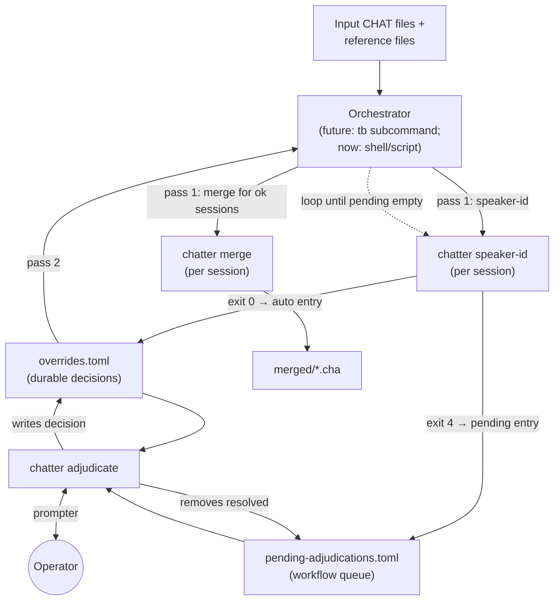

# Adjudication Workflow

**Status:** Draft
**Last updated:** 2026-05-27 10:54 EDT

This page specifies how human-in-the-loop adjudication fits into
the merge pipeline. Several pipeline stages have decision points
where the algorithm cannot or should not auto-decide; this
document specifies how those refusals reach an operator, how the
operator's decision is recorded, and how the pipeline resumes
with the decision applied.

The design satisfies two constraints set explicitly upstream:

- **Test the interaction.** Every operator-decision path must be
  exercisable in automated tests by providing synthetic operator
  choices. No hardcoded stdin reads in the decision core; a
  pluggable prompter abstraction is mandatory.
- **Batch-then-review is the default workflow.** No mid-batch
  interactive pauses in the main pipeline. The optional
  `--interactive` flag exists on the adjudication tool only, for
  small-batch debugging, and rides on the same data contract.

Companion documents:

- [Merge Override File Format](../chatter/integrating/merge-overrides.md) —
  the on-disk record of decisions.
- [Domain Types](./merge-domain-types.md) — `SpeakerMapping`,
  `MergeOverride`, etc.
- [Test Plan](./merge-test-plan.md) — where the adjudication
  tests live.
- [Crate Architecture](./merge-architecture.md) — where the
  adjudication code lives.

## Why batch-then-review, and not real-time

Every adjudication point in the pipeline is **per-session local**:
the operator's decision affects *this session's* output and no
other session in the same batch. There is no case where an
operator decision propagates forward to influence how other
sessions get processed.

The cases that might appear to want real-time interaction are
better served by sampling:

| Case | Real-time approach | Better approach |
|---|---|---|
| Systematic pipeline failure (everything refuses) | Watch each refusal, abort batch | Run a 5–10-session canary first; examine; abort or proceed |
| Confidence-threshold calibration on a new corpus | Adjust threshold mid-batch | Run canary; pick threshold; full batch |
| Cross-session pattern (one contributor always has PAR0 = clinician) | Notice during interactive review | Run canary; observe pattern; add per-contributor explicit mapping to orchestrator config |
| Operator wants per-session progress visibility | Watch each step | `chatter adjudicate --interactive` after a batch run, walking the same pending queue |

TalkBank's operational reality makes batch-then-review strictly
better:

- Batches are research-scale (hundreds of sessions per donor).
  Forcing operator presence during the batch run = forcing hours
  of babysitting.
- Overnight and fleet runs are routine; interactive doesn't work
  for those.
- Focused operator review of all refusals together is more
  efficient than scattered per-batch decisions (less
  context-switching; easier to spot patterns across sessions).
- Aligns with the project's "academic research, accuracy is the
  standard, take however long it takes" rule: operator
  efficiency dominates wall-clock latency.

The `--interactive` flag is preserved for the small-batch
debugging case but is explicitly NOT the dominant workflow.

## The known adjudication points

The pipeline has at least five points where adjudication may be
needed. Each is recorded as one or more entries in the override
file via the same schema.

| # | Adjudication point | Trigger | Operator's decision | Affects |
|---|---|---|---|---|
| 1 | **Speaker-id low confidence** | `chatter speaker-id` Jaccard margin < threshold | Per-speaker mapping (drop/rename) and `inserted_role` | Speaker labeling, drop set, downstream merge |
| 2 | **Parent role lookup** | Parent-sample session needs `MOT` vs `FAT` decision | `inserted_role.code` and `.tag` for this session | The merged file's headers + main-tier prefixes |
| 3 | **Diarization-mix flag** | Operator observes Batchalign collapsed multiple real-world speakers into one label | `flags = ["diarization-mixed"]` plus a note | Downstream consumers know output is imperfect; might gate publication |
| 4 | **Post-merge sanity scan** | Auto-scan flags retained-speaker utterances with high-text-similarity inserted-speaker utterances nearby (suggesting speaker-id misclassification) | Confirm or override the original speaker-id mapping | Triggers re-run of speaker-id + merge for the session |
| 5 | **Unbulleted reference file** | Reference CHAT file has no time bullets; merge can't proceed | Either bullet the reference upstream, or request fresh authoritative data | Pipeline blocked for this session pending external fix |

Points 1–4 are handled by the unified `chatter adjudicate` tool
specified below. Point 5 is an out-of-scope failure mode: the
adjudication tool records that the session is blocked, but the
fix lives outside this pipeline (operator contacts the
contributor or runs forced-alignment first).

## Data flow



The orchestrator runs **two passes**:

**Pass 1**: for every input session, run `chatter speaker-id` in
reference mode. Successful auto-decides write to the override
file with `mode = "auto"` and immediately proceed to `chatter
merge`. Refusals (exit code 4) and other adjudication-requiring
states write a *pending entry* to `pending-adjudications.toml`
and the session is skipped for the rest of pass 1.

**Pass 2** (after operator runs `chatter adjudicate`): the
orchestrator re-runs `chatter speaker-id` for the previously
skipped sessions, now finding decisions in the override file
(`mode = "override"`). Sessions complete; pending entries are
removed.

The pipeline is **idempotent**: re-running pass 1 on a partially
adjudicated batch produces no spurious work — sessions with
already-recorded decisions skip to merge directly.

## The pending-adjudications artifact

Separate from the override file, a `pending-adjudications.toml`
file holds in-flight workflow state. Its purpose is to carry
the *evidence* the operator needs (per-speaker scores, opening
utterance previews) from the orchestrator's pass 1 to the
adjudication tool, without polluting the override file with
"to-do" entries.

### Schema

```toml
schema_version = 1

[[entries]]
session_id = "session-102-t1"
kind = "speaker-id-low-confidence"
created_at = 2026-05-27T11:00:00-04:00

# Inputs the adjudication tool needs:
input_path = "asr/session-102-t1.cha"
reference_path = "chi-only/session-102-t1.cha"
anchor_speaker = "CHI"

# Evidence for the operator:
scores = { PAR0 = 0.6286, PAR1 = 0.3457 }
margin = 1.82
threshold_used = 2.0

# Opening turns (first N utterances per speaker) for context:
preview = """
*CHI:    they start to bite . [0_1708]
*PAR0:   They start to bite . [75_1165]
*PAR1:   They do what . [1515_2245]
... (further preview)
"""

# Suggested defaults the operator can accept-as-is:
suggested = { mapping = { PAR0 = "drop", PAR1 = "rename" }, inserted_role = { code = "INV", tag = "Investigator" } }

[[entries]]
session_id = "session-103-t1-parent"
kind = "parent-role-lookup"
# ... different evidence for the MOT-vs-FAT case ...
```

### Schema characteristics

- **`kind` discriminates the adjudication type** (one of
  `speaker-id-low-confidence`, `parent-role-lookup`,
  `diarization-mix-review`, `sanity-scan-misclassification`).
  Each kind has its own required field set; the adjudication
  tool dispatches on `kind` to choose the right prompt template
  and the right validator for the operator's response.
- **`suggested` carries what the algorithm WOULD have chosen
  had the threshold been lower** (for speaker-id) or a parsed
  default (for parent-role). The operator can accept-as-is or
  override.
- **Entries are a `[[entries]]` array of tables** (not a
  session-keyed `[<session_id>]` map) because the same session
  could conceivably have multiple pending decisions (e.g., a
  speaker-id refusal AND a parent-role lookup), each a separate
  array entry.

### Lifecycle

- **Written by**: the orchestrator's pass 1, when `chatter
  speaker-id` exits with code 4 or when other adjudication
  triggers fire.
- **Consumed by**: `chatter adjudicate`, which reads it, prompts
  the operator entry-by-entry, writes decisions to the override
  file, and removes resolved entries.
- **Cleaned up**: an empty `entries` array is the "all clear"
  state; pass 2 of the orchestrator can proceed.

## `chatter adjudicate` — CLI surface

A new chatter subcommand in `talkbank-cli`. Its job is to walk
a pending-adjudications file and write decisions to an override
file.

```text
chatter adjudicate <PENDING_FILE> --override-file <OVERRIDE_FILE> [OPTIONS]

ARGUMENTS:
  <PENDING_FILE>   Path to pending-adjudications.toml.

REQUIRED OPTIONS:
  --override-file <PATH>
      Path to the override file (created if missing, appended if
      existing). Decisions go here.

OPTIONS:
  --interactive
      (default) Prompt the operator for each pending entry via
      a terminal UI. This is the only mode for v1; later UI
      backends may add e.g. --backend=web for web-served prompts.

  --scripted <PATH>
      Read pre-canned decisions from a TOML file. Used in tests
      and in automated bulk-decision workflows (e.g., the
      operator has prepared a decision sheet in advance).
      Mutually exclusive with --interactive.

  --kind <KIND>
      Process only pending entries whose `kind` matches. Useful
      when the operator wants to batch through one class of
      decision at a time (e.g., do all parent-role lookups
      first, then all speaker-id refusals).

  --skip-on-error
      If the operator's response cannot be applied (e.g., they
      typed an invalid speaker code), log and skip rather than
      abort. Default: abort on first invalid response.

  --operator <NAME>
      Operator identifier recorded in override entries.
      Default: $USER.

  --dry-run
      Read pending and prompt the operator, but do NOT write to
      the override file. Useful for previewing what decisions
      look like before committing.
```

Exit codes:

| Code | Meaning |
|---|---|
| 0 | All pending entries decided; pending file updated |
| 1 | I/O error (missing file, unparseable, write failure) |
| 2 | Operator-supplied decision rejected as invalid (when `--skip-on-error` not set) |
| 3 | Internal error |
| 4 | Operator deferred at least one entry (used `:skip` in the prompt); pending file still has entries |

The `--scripted` mode is the testability seam. A scripted
decision file looks like:

```toml
schema_version = 1

[[decisions]]
session_id = "session-102-t1"
kind = "speaker-id-low-confidence"
choice = { kind = "accept-suggested", note = "verified by listening" }

[[decisions]]
session_id = "session-103-t1-parent"
kind = "parent-role-lookup"
choice = { kind = "override", inserted_role = { code = "FAT", tag = "Father" }, note = "per contributor data sheet" }
```

The adjudication tool reads the scripted file, matches decisions
to pending entries by `session_id` + `kind`, applies each as
though the operator had typed it. If a scripted decision has no
matching pending entry, or a pending entry has no scripted
decision, the run aborts with a clear error.

## The prompter abstraction (testability)

The adjudication tool's core flow is:

```rust,ignore
// pseudocode — actual signatures live in talkbank-transform
pub fn run_adjudication(
    pending: PendingAdjudications,
    override_file: &mut OverrideFile,
    prompter: &mut dyn Prompter,
    operator: OperatorId,
) -> Result<AdjudicationOutcome, AdjudicationError> {
    for entry in pending.entries() {
        let context = build_context(entry);
        let decision = prompter.ask(&context)?;
        apply_decision(override_file, entry, decision, &operator);
    }
    Ok(...)
}

pub trait Prompter {
    fn ask(&mut self, context: &AdjudicationContext)
        -> Result<OperatorDecision, PrompterError>;
}
```

Production implementations:

- `TerminalPrompter` — prints `context` to stdout, reads
  operator response from stdin. Used by `--interactive`.

Test implementations:

- `ScriptedPrompter::from_decisions(Vec<(SessionId, OperatorDecision)>)` —
  returns each decision in turn, errors if asked for an
  unprovided session. Used by L2 transform tests.
- `ScriptedTomlPrompter::read(path)` — reads the same TOML
  format as `--scripted`. Used by L3 CLI tests so subprocess
  tests and library-level tests share fixture format.

This means:

- **Every adjudication test path is automated.** No subprocess
  PTY hackery, no expect-script DSL. Tests construct
  `ScriptedPrompter`, run the adjudication core, assert on the
  resulting `OverrideFile`.
- **The terminal UI is dumb.** All it does is `Display`-format
  the context and parse the operator's response into an
  `OperatorDecision`. No business logic in the UI layer.
- **Future UI backends (web) implement `Prompter`** and
  drop in. The adjudication core is unchanged.

## The `OperatorDecision` type

```rust,ignore
pub enum OperatorDecision {
    /// Accept the algorithm's suggested mapping verbatim.
    AcceptSuggested { note: Option<String> },

    /// Override with an operator-supplied mapping (speaker-id).
    OverrideMapping {
        mapping: SpeakerMapping,
        note: Option<String>,
    },

    /// Override the inserted role only (parent-role lookup).
    OverrideInsertedRole {
        inserted_role: InsertedRole,
        note: Option<String>,
    },

    /// Add or update flags on an existing entry.
    Flag { flags: Vec<MergeFlag>, note: Option<String> },

    /// Defer this entry; leave it in pending for later review.
    Defer { reason: String },

    /// Mark the session as blocked (e.g., unbulleted reference);
    /// requires upstream action before pipeline can resume.
    Block { reason: String },
}
```

Each variant maps cleanly to one or more adjudication kinds:

| Kind | Allowed `OperatorDecision` variants |
|---|---|
| `speaker-id-low-confidence` | `AcceptSuggested`, `OverrideMapping`, `Defer` |
| `parent-role-lookup` | `AcceptSuggested`, `OverrideInsertedRole`, `Defer` |
| `diarization-mix-review` | `Flag`, `Defer` |
| `sanity-scan-misclassification` | `OverrideMapping`, `Flag`, `Defer` |
| (any) | `Block` is always available |

The kind → allowed-variants mapping is enforced by the
adjudication tool: a `kind = "parent-role-lookup"` entry that
gets an `OverrideMapping` decision is rejected with a clear
error (`AdjudicationError::DecisionKindMismatch`).

## Operator terminal UX (interactive mode)

What the operator sees when running `chatter adjudicate
pending.toml --override-file overrides.toml --interactive`:

```text
═══════════════════════════════════════════════════════════════
ADJUDICATION  [1 / 14]  session-102-t1   kind = speaker-id-low-confidence
═══════════════════════════════════════════════════════════════

Reference file:  chi-only/session-102-t1.cha
Donor file:      asr/session-102-t1.cha
Anchor speaker:  CHI

Per-speaker Jaccard scores against reference's CHI:
  PAR0 = 0.6286   ◄── higher
  PAR1 = 0.3457
  margin = 1.82×   (threshold was 2.00×)

Opening turns side-by-side:

  *CHI    [0_1708]    they start to bite .
  *PAR0   [75_1165]   They start to bite .
  *PAR1   [1515_2245] They do what .

  *CHI    [1708_5966] they put up their shields at some point .
  *PAR0   [2755_4405] They put up those heels .
  *PAR1   [4865_6045] At some point oh .

  (3 more turns shown; press 'm' for more)

Algorithm-suggested mapping:
  PAR0 → drop   (winner — matches CHI content)
  PAR1 → rename to INV:Investigator

Your decision?
  [a] Accept suggested
  [o] Override mapping
  [f] Flag and defer
  [d] Defer (review later)
  [b] Block (needs upstream fix)
  [m] Show more context
  [p] Play media (uses $TB_MEDIA_PLAYER)
  [q] Quit (save progress and exit)
> 
```

When the operator types `a` and then is prompted for an
optional note, the tool writes the decision to the override
file and advances to the next pending entry.

The `[p] Play media` action is just a wrapper around
`Command::new($TB_MEDIA_PLAYER).arg(media_path).spawn()` — the
adjudication tool doesn't bundle an audio player. The operator
configures their preferred player via the environment.

## Adjudication contexts beyond speaker-id

The same `chatter adjudicate` tool handles all five adjudication
points by dispatching on `kind`. For each, the displayed
context and the allowed decisions differ:

### parent-role-lookup

Shown context: the session is a parent sample (basename
contains `parent`-suffix conventionally, or contributor data
sheet says so). The merged output needs an inserted-role code
of `MOT`, `FAT`, or `PAR`. The operator picks.

```text
Session: session-103-t1-parent
Kind: parent-role-lookup

This is a parent-sample session. The merged file's inserted
speaker (currently labeled PAR0 → ???) needs a CHAT role.

Contributor data sheet (if attached): not available
Audio preview duration: 8m 14s

Algorithm-suggested:  INV : Investigator   (default for ambiguity)

Your decision?
  [a] Accept suggested (INV : Investigator)
  [m] MOT : Mother
  [f] FAT : Father
  [p] PAR : Adult (gender unknown)
  [c] Custom role
  [d] Defer
  [b] Block (needs upstream metadata)
> 
```

### diarization-mix-review

Triggered by the operator (or a post-merge auto-scan) observing
that an ASR speaker's content mixes real-world speakers. The
adjudication is to add the `"diarization-mixed"` flag plus a
note explaining the mix.

### sanity-scan-misclassification

Triggered by the post-merge sanity scan when a retained-speaker
utterance has high text similarity with a temporally-adjacent
inserted-speaker utterance. The operator either confirms
("the original speaker-id was wrong, swap the mapping") or
overrides ("the duplication is real — both speakers said the
same thing at the same time").

## Resumption and re-adjudication

The pending-adjudications file is the source of truth for
"what still needs deciding." If the operator quits mid-review
(via `[q]` or process-kill), the next `chatter adjudicate`
invocation picks up where they left off — already-decided
entries have already been removed from pending and written to
the override file.

Re-adjudication of an already-decided entry is supported
explicitly:

```bash
chatter adjudicate --re-adjudicate <SESSION_ID> --override-file overrides.toml
```

This loads the existing override entry, presents it as the
"current decision," and asks the operator if they want to keep
or replace it. The operator's decision overwrites the entry;
the prior decision is preserved in a `history` array on the
entry (recording the prior `mode`, `mapping`, `operator`,
`decided_at`, and `note`).

The override-file schema will need a small extension to support
this — a per-entry optional `history: Vec<MergeOverride>` field.
This is a minor schema change; if it ships in v1, no schema
bump is needed; if it ships later, that's a `schema_version =
2` migration.

## Composition with the orchestrator

The orchestrator (proposed `tb merge` or similar) drives the
pipeline. Its high-level flow:

```rust,ignore
// pseudocode for the orchestrator's main loop
let inputs = discover_input_sessions(input_dir);
let override_file = OverrideFile::read_or_default(override_path);
let mut pending = PendingAdjudications::default();

for session in inputs {
    if let Some(decision) = override_file.get(&session.id) {
        // Already adjudicated; apply directly.
        let labeled = apply_mapping(&session.donor, &decision.mapping)?;
        let merged = merge(&session.reference, &labeled, &session.retain)?;
        write_merged(merged, &session.output_path)?;
    } else {
        // Try auto-decide.
        match identify_mapping(&session.donor, &session.reference, ...) {
            Ok(mapping) => {
                let labeled = apply_mapping(&session.donor, &mapping)?;
                let merged = merge(...)?;
                write_merged(merged, &session.output_path)?;
                override_file.insert(session.id.clone(), record_auto_decision(&mapping));
            }
            Err(SpeakerIdError::LowConfidence { scores, margin, threshold }) => {
                pending.push(PendingEntry::speaker_id_low_confidence(
                    session.id.clone(),
                    scores, margin, threshold,
                    /* preview */ build_preview(&session),
                ));
            }
            Err(other) => return Err(other),
        }
    }
}

pending.write(pending_path)?;
override_file.write(override_path)?;

if !pending.is_empty() {
    eprintln!(
        "Pipeline complete for {} sessions; {} sessions need adjudication.\n\
         Run: chatter adjudicate {} --override-file {}",
        decided_count, pending.len(), pending_path, override_path
    );
    return Ok(ExitCode::NeedsAdjudication);
}
```

The orchestrator is the layer that hasn't been designed yet at
the type level. It's likely a `tb` subcommand (since `tb` is
the workflow tool for multi-repo / multi-step ops), with a
fallback shell-script form for the v0 pipeline.

## What this design does NOT cover

- **The orchestrator binary itself.** That's a separate design
  pass; this doc only specifies the contract between the
  pipeline stages and the adjudication tool.
- **GUI/web adjudication backends.** v1 is terminal-only. The
  `Prompter` trait is the extension point; future backends
  implement it. The data contract (`pending.toml`,
  `overrides.toml`) does not change.
- **Audio playback / waveform display.** v1 launches the
  operator's `$TB_MEDIA_PLAYER` and gets out of the way. A
  future TUI with inline audio scrubbing is conceivable but is
  a major UI project, not v1.
- **ML-suggested decisions.** A future version could feed
  pending entries to a classifier that pre-fills "suggested"
  with model output. Out of scope; the `suggested` field
  exists today as a hook.

## Test coverage

Every behavior of `chatter adjudicate` is tested via the
scripted-prompter abstraction. See the
[Test Plan](./merge-test-plan.md) (TBD section L4) for the
test inventory. Coverage spans:

- Each adjudication kind's happy path (operator accepts
  suggested, decision written to override file)
- Each adjudication kind's override path (operator types an
  alternative, decision validated and recorded)
- Each adjudication kind's defer path (entry stays in pending)
- Each adjudication kind's block path (entry marked blocked;
  pipeline reports blocker)
- Re-adjudication path (operator changes their mind; prior
  decision preserved in `history`)
- Mutually-exclusive flag enforcement (`--interactive` +
  `--scripted` rejected)
- Invalid operator response handling (with and without
  `--skip-on-error`)
- Schema-version refusal on the pending file
- Empty pending file (no-op, exit 0)
