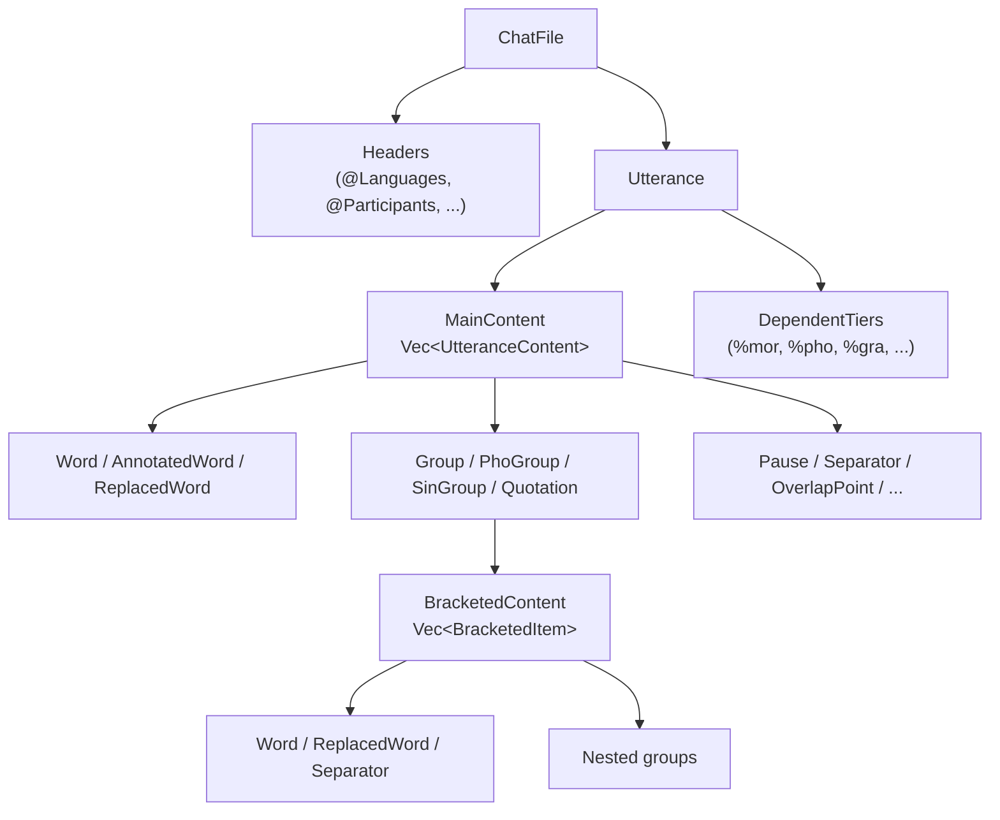
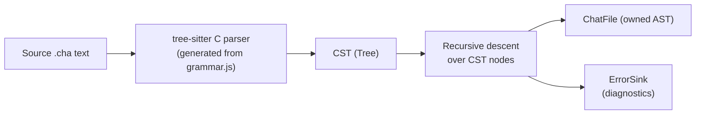

# Algorithms and Data Structures

**Status:** Current
**Last updated:** 2026-05-19 14:18 EDT

This chapter documents the key algorithms and data structure decisions across
the TalkBank Rust crates.

## CHAT AST Representation

The CHAT model is a tree of owned enums. The two central types are:

- **`UtteranceContent`** — 24 variants covering all main-tier content
- **`BracketedItem`** — 22 variants for content inside groups/brackets



**Memory layout:** Large variants (e.g., `AnnotatedWord` with scoped annotations)
are `Box`ed to keep the enum's stack size bounded.

### Content Walker

**Location:** `talkbank-model/src/alignment/helpers/walk/`

Closure-based recursive traversal centralizing the walk over all 24+22 variants:

```rust,ignore
pub fn for_each_leaf<'a>(
    content: &'a [UtteranceContent],
    domain: Option<AlignmentDomain>,
    f: &mut impl FnMut(ContentLeaf<'a>),
)
```

**Domain-aware gating:**
- `Some(Mor)` — skips retrace groups (retrace words aren't morphologically analyzed)
- `Some(Pho | Sin)` — skips PhoGroup/SinGroup (treated as atomic by those tiers)
- `None` — recurses everything unconditionally

Both immutable (`for_each_leaf`) and mutable (`for_each_leaf_mut`) versions exist.
Used by talkbank-model (%wor generation) and batchalign (word extraction,
FA injection, postprocessing).

## Parsing Strategies

### Tree-Sitter (Canonical Parser)



- Grammar defined in `grammar/grammar.js` (source of truth)
- `parser.c` is generated — never edit directly
- CST-to-model conversion: recursive dispatch on node kind, skip `WHITESPACES`,
  report unrecognized nodes via `ErrorSink`
- **Strict + catch-all pattern:** Known header values get named grammar rules
  (syntax highlighting); unknown values hit a catch-all (flagged by validator)

### Fragment Parsing

`TreeSitterParser` provides fragment methods for parsing individual CHAT
fragments (a word, a tier line) directly. Methods like
`parser.parse_word_fragment()`, `parser.parse_main_tier_fragment()`, etc.
are used when synthesizing CHAT from non-CHAT sources (ASR output, UD
annotations).

> **Historical note:** A Chumsky-based direct parser previously provided
> combinator-based fragment parsing. It was removed in March 2026; tree-sitter
> is now the sole parser.

## Sequence Alignment

### Hirschberg (Linear-Space Edit Distance)

**Location:** `crates/talkbank-transform/src/dp_align/`

| Property | Value |
|----------|-------|
| Algorithm | Hirschberg divide-and-conquer |
| Time | O(mn) |
| Space | O(min(m,n)) — linear |
| Cost model | Match=0, Substitution=2, Gap=1 |

**Optimizations:**
1. **Prefix/suffix stripping** — O(n) pre-pass removes identical leading/trailing
   elements. For WER (80–95% accuracy), reduces effective DP size by 10–100x.
2. **Small-problem cutoff** (2048 elements) — switches to full flat DP table to
   avoid recursion overhead.
3. **Scratch buffer reuse** — `clear()` + `swap()` avoids allocation per DP row.
4. **Generic `Alignable` trait** — monomorphized for both `String` (word-level)
   and `char` (character-level) without code duplication.

**Entry points:** `align()` for word sequences, `align_chars()` for character-level.
**Match modes:** `Exact` (byte equality), `CaseInsensitive` (ASCII case folding).

### Tier Alignment (1:1 Positional)

**Location:** `talkbank-model/src/alignment/traits.rs`

Generic `positional_align()` pairs main-tier words with dependent-tier items by
position (O(n)). Traits: `AlignableTier`, `TierAlignmentResult`, `AlignableContent`.

- `%pho`, `%sin`, `%wor` — use generic positional alignment
- `%mor`, `%gra` — domain-specific custom implementations
- Mismatch diagnostics via `similar` crate (Patience diff algorithm, O(n log n))

## Caching

The CHAT-core validation cache is documented separately in
[Validation Cache](parser-and-grammar/validation-cache.md). The
Batchalign audio-task cache (FA / UTR ASR / media conversion) is in
[Audio-Task Cache](runtime/audio-task-cache.md).

## CLAN Analysis Algorithms

### VOCD (Vocabulary Diversity)

**Location:** `talkbank-clan/src/commands/vocd.rs`

Bootstrap sampling + least-squares curve fitting:
1. For each of 3 trials: for each sample size N in \[35..50]: draw 100 random
   samples of N tokens → compute mean TTR
2. Fit empirical (N, TTR) curve to theoretical `TTR(N) = (D/N)[√(1+2N/D) − 1]`
   via gradient descent (step 0.001)
3. Average D across trials

### DSS (Developmental Sentence Scoring)

**Location:** `talkbank-clan/src/commands/dss.rs`

Rule-based pattern matching on %mor POS tags. 10-category scoring
(copula, conjunction, personal pronouns, etc.), 1–3 points per category per
utterance, averaged across up to 50 utterances per speaker.

### IPSyn (Index of Productive Syntax)

**Location:** `talkbank-clan/src/commands/ipsyn.rs`

Syntactic structure coverage scoring: 56 rules across 4 categories (N, V, Q, S).
Each rule earns max 2 points (discovery + variety). Total range: 0–112.

## Text Processing

### Regex Compilation

All regex patterns use `LazyLock<Regex>` from `std::sync` — compiled once at
first use, lock-free thereafter. Never call `Regex::new()` inside functions or
loops.

### WER Word Conforming

**Location:** `crates/talkbank-transform/src/wer_conform.rs`

Priority-ordered 10-step rule chain for word normalization before WER comparison:

1. Compound splitting (O(1) hash lookup, 3,584 pairs)
2. Abbreviation letter expansion
3. Contraction expansion (`'s` → `is`, etc.)
4. Filler normalization (`um`, `uhm`, `eh` → `um`)
5. Hyphen splitting
6. Special word expansion (`gonna` → `going to`)
7. Name replacement (6,700 names → `"name"`)
8. Acronym expansion
9. Underscore splitting
10. Passthrough (lowercased)

### Deterministic Output

- `BTreeMap` for all test/snapshot JSON (lexicographic key ordering)
- `IndexMap` for participant/speaker ordering (preserves encounter order per spec)
- Frequency results collected into `BTreeMap<NormalizedWord, Count>`

## Pipeline Dependency Resolution (batchalign)

**Location:** `batchalign/src/pipeline/plan.rs`

DAG-based greedy execution of 16 pipeline stages. Each stage declares
dependencies; enabled stages execute when all deps complete. Cycle/deadlock
detection if no progress is made in a pass. No external topological sort
library — the stage count is small enough for inline scheduling.
