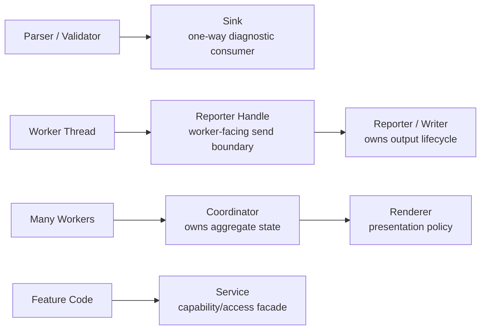
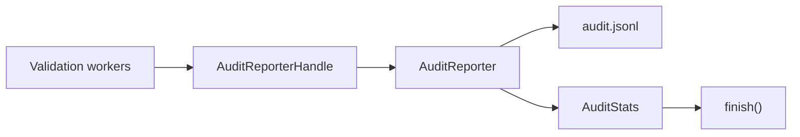

# Boundary Vocabulary

This page defines the naming rules used for major architecture seams in `talkbank-tools`. It started with the audit of `*sink*` abstractions, but the same vocabulary now covers renderers, services, coordinators, and reporters.

## Why vocabulary matters

Many recent refactors introduced explicit boundaries:

- diagnostics stream through `ErrorSink`
- audit mode owns a dedicated reporting thread
- validation output goes through renderer implementations
- the LSP backend exposes parser and semantic-token access through language services
- dashboard and roundtrip flows keep aggregate state in one coordinator path

Those patterns are easier to preserve when the names describe the responsibility correctly.

## `Sink`

Use `Sink` only for a narrow one-way reporting abstraction.

A sink should:

- accept diagnostics or events from producers
- avoid owning orchestration
- be swappable with another implementation

Current examples:

- `ErrorSink`
- `ErrorCollector`
- `ChannelErrorSink`
- `AsyncChannelErrorSink`
- `NullErrorSink`
- `ConfigurableErrorSink`
- `OffsetAdjustingErrorSink`
- `TeeErrorSink`
- `TerminalErrorSink`

These remain good uses of the term because callers only care that they can stream diagnostics into them. `ErrorCollector` is the concrete in-memory collector for cases that need stored diagnostics after a parse or validation pass.

Current code layout:

- `crates/talkbank-model/src/errors/error_sink.rs` for the trait and lightweight forwarding sinks
- `crates/talkbank-model/src/errors/collectors.rs` for in-memory collectors and counters
- `crates/talkbank-model/src/errors/async_channel_sink.rs` for the async channel-backed sink
- `crates/talkbank-model/src/errors/configurable_sink.rs`, `offset_adjusting_sink.rs`, and `tee_sink.rs` for adapters

## `Reporter` or `Writer`

Use `Reporter` or `Writer` when a type owns output lifecycle.

A reporter usually:

- owns a file, socket, or worker thread
- has explicit finish or shutdown semantics
- may also own summary accounting

Current example:

- `AuditReporter` in `crates/talkbank-cli/src/commands/validate/audit_reporter.rs`

That type is intentionally not called a sink anymore because it owns the audit writer thread and final summary assembly. Worker threads only hold an `AuditReporterHandle`.

## `Coordinator`

Use `Coordinator` for the part of the system that owns aggregate state from multiple workers.

A coordinator should:

- receive worker results
- update shared summary state in one place
- forward downstream events as needed

Current examples by role:

- `tests/roundtrip_corpus/runner.rs` owns `RoundtripStats`
- `test-dashboard` splits worker emission from UI-owned reducer state

If workers need a shared mutex for counters, the likely missing abstraction is a coordinator.

## `Renderer`

Use `Renderer` for output-shaping policy.

A renderer should:

- turn events into terminal, JSON, or UI output
- not own discovery, cancellation, or worker orchestration

Current example:

- `crates/talkbank-cli/src/commands/validate_parallel/renderer.rs`

## `Service`

Use `Service` for a capability boundary that hides access mechanics.

A service may:

- wrap thread-local or cached internals
- expose small closures or methods to feature code
- keep storage details out of callers

Current example:

- `crates/talkbank-lsp/src/backend/language_services.rs`

## Review rule

Before naming a new architecture boundary, ask:

1. Is this just a one-way consumer?
2. Does it own finish or shutdown semantics?
3. Does it aggregate state from multiple workers?
4. Is it presentation policy?
5. Is it a capability/access façade?

If one type answers "yes" to several of those at once, split it before naming it.
