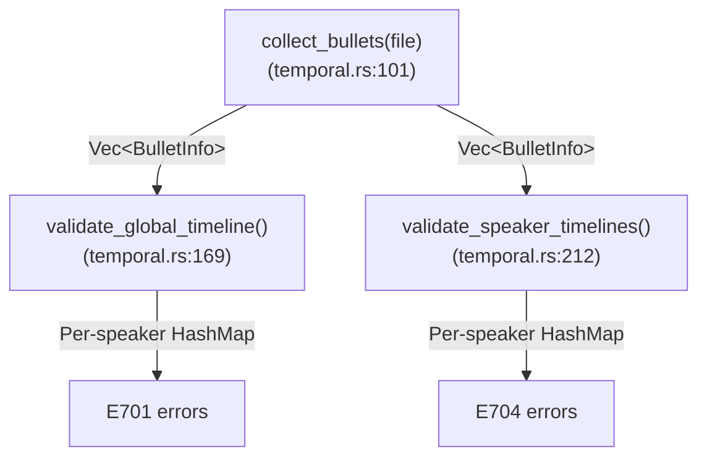

# Bullet Validation

**Last updated:** 2026-03-29 23:08 EDT

Media bullets are timestamps embedded in CHAT utterances that link transcript
text to audio/video. They appear as `•start_end•` at the end of a main tier
line (e.g., `*CHI: hello . •1000_2000•`). Validating that these timestamps are
internally consistent is one of the more subtle parts of CHAT validation,
because the "obvious" rules turn out to be wrong for multi-party conversation.

This chapter documents what CLAN CHECK does, where its implementation falls
short of its own intent, and how `chatter validate` interprets and improves on
that intent.

## The three temporal checks

There are three distinct temporal constraints that can be checked on bullet
timestamps. They differ in scope, severity, and whether they should run by
default.

### E701: Same-speaker start-time monotonicity (CLAN Error 83)

**Rule:** For each speaker, their utterances' start times must be
non-decreasing. If speaker CHI has utterance A starting at 10,000ms and
utterance B (later in document order) starting at 8,000ms, that is an error —
CHI's timeline has gone backward.

**Scope:** Per-speaker. Cross-speaker non-monotonicity is allowed (see
[Why cross-speaker non-monotonicity is not an error](#why-cross-speaker-non-monotonicity-is-not-an-error)).

**Severity:** Error.

### E704: Same-speaker self-overlap (CLAN Error 133)

**Rule:** For each speaker, the current utterance's start time must not be more
than 500ms before the same speaker's previous utterance's end time. In other
words, a speaker cannot overlap with themselves by more than 500ms.

**Scope:** Per-speaker. The 500ms tolerance accounts for annotation rounding
and minor timing imprecision at boundaries.

**Severity:** Error.

### E729: Cross-speaker overlap (CLAN Error 84)

**Rule:** The current utterance's start time must not be before the previous
utterance's (any speaker) end time. This checks for any temporal overlap between
adjacent utterances, regardless of speaker.

**Scope:** Global (cross-speaker). Only fires with CLAN's `+c0` flag.

**Severity:** Warning. **Not part of default validation.**

This check is part of CLAN's "strict timeline contiguity" mode, which requires
that every utterance's start time equals the previous utterance's end time —
no gaps (Error 85) and no overlaps (Error 84). It is designed for a very
specific use case: verifying that audio has been exhaustively and
non-redundantly segmented. In normal conversational transcripts, cross-speaker
overlap is ubiquitous, so this check would be absurd as a default.

## What CLAN CHECK does

CLAN CHECK implements bullet validation in the function
`check_checkBulletsConsist()` in `check.cpp`. Understanding its implementation
is essential because it has several accidental behaviors that affect the error
counts users see.

### The snapshot-and-compare pattern

The function uses a global pair (`check_SNDBeg`, `check_SNDEnd`) to hold the
"current" bullet timing, and saves the previous values into local variables
(`tBegTime`, `tEndTime`) at the start of each call. The comparison flow is:

```
1. Save previous: tBegTime = check_SNDBeg, tEndTime = check_SNDEnd
2. Parse new bullet into check_SNDBeg, check_SNDEnd
3. Check error 83: check_SNDBeg < tBegTime?           (cross-speaker comparison)
4. Check error 133: speaker's last END - check_SNDBeg > 500?  (same-speaker)
5. If +c0 mode: check error 84 (overlap) and error 85 (gap)
6. Update speaker's last END time via check_setLastTime()
```

### The early-return shadowing bug

The critical implementation detail is that error 83 fires via `return(83)` at
step 3. This causes the function to **exit immediately**, skipping steps 4
through 6. Two consequences follow:

1. **Error 83 shadows error 133.** An utterance that triggers error 83 (global
   non-monotonicity) can never also trigger error 133 (same-speaker overlap) in
   the same call, even if both conditions are true. This is not intentional —
   it is an artifact of C-style early-return control flow.

2. **Speaker state goes stale.** Step 6 (`check_setLastTime`) updates the
   speaker's per-speaker tracking in the `SPLIST` linked list. When error 83
   fires, this update is skipped. All subsequent error-133 checks for that
   speaker compare against a stale `endTime` value, causing **cascading state
   corruption** that suppresses legitimate error 133 reports.

### Error 83 is global, not per-speaker

CLAN fires error 83 by comparing the current utterance's start time against the
*previous utterance's* start time, regardless of speaker. In a multi-party
conversation:

```
*PIL: something . •100000_102000•
*UEL: response .  •99500_101000•      ← Error 83: 99500 < 100000
```

This fires error 83 because UEL's start time (99,500ms) is before PIL's start
time (100,000ms). But this is just two people talking at the same time — normal
conversational overlap. The `[>]` and `[<]` markers in CHAT explicitly annotate
this as intentional simultaneous speech.

In files with many speakers (the Koine/bre corpus has 7-9 speakers per file,
including children talking over each other), this fires on a huge fraction of
utterances. CLAN's accidental shadowing partially masks the problem by
suppressing downstream error-133 reports when error 83 fires.

## Why cross-speaker non-monotonicity is not an error

Consider a classroom recording with a teacher (PIL) and seven children. The
teacher asks a question, and three children answer simultaneously:

```
*PIL: qué es esto ?        •50000_52000•
*UEL: un coche .           •51200_52500•   ← started during PIL's question
*MAR: coches .             •51000_51800•   ← started even earlier
*REN: es un coche grande . •51500_53000•   ← started between UEL and MAR
```

In document order, the start times are: 50000, 51200, 51000, 51500. This is
non-monotonic (51000 < 51200), but there is nothing wrong with this data. The
children are simply talking at the same time. No amount of reordering the
utterances in the file would make all start times monotonically increasing while
preserving the speaker-turn structure.

Cross-speaker non-monotonicity is an inherent property of multi-party
conversation, not a data error. Flagging it as an error produces thousands of
false positives on any corpus with overlapping speech.

### When IS non-monotonic start time an error?

Same-speaker non-monotonicity IS an error. If CHI speaks at 10,000ms, then
later in the file CHI speaks again at 8,000ms, CHI's timeline has gone
backward. This almost certainly indicates a transcription or alignment mistake.

The test is simple: **within the same speaker's utterance sequence, start times
must be non-decreasing.** This is what `chatter validate` checks for E701.

## How chatter validate implements bullet validation

### E701: Per-speaker monotonicity (not global)

`chatter validate` tracks each speaker's last start time in a `HashMap`. E701
only fires when the *same speaker's* start time goes backward. Cross-speaker
non-monotonicity is silently accepted.

This is an intentional semantic divergence from CLAN CHECK, which fires error 83
globally. We believe CLAN's global check reflects the implementation
(comparing against a single global `tBegTime`) rather than the intent (detecting
disordered timestamps). The per-speaker version matches the intent without
drowning users in false positives from normal conversational overlap.

### E704: Per-speaker overlap with 500ms tolerance

`chatter validate` tracks each speaker's last end time in a `HashMap`. E704
fires when the overlap exceeds 500ms (same threshold as CLAN Error 133).

Unlike CLAN, E704 runs independently of E701. An utterance can trigger both
errors if it is both non-monotonic (E701) and self-overlapping (E704). CLAN's
early-return pattern prevents error 133 from firing when error 83 fires,
which is a bug, not a feature.

Speaker state is always updated regardless of whether errors fire. This avoids
the cascading state corruption that CLAN's implementation suffers from.

### E729: Not in default validation

E729 (CLAN Error 84, cross-speaker overlap) is implemented but not called
during default validation. It exists for future use in a strict-bullet mode
equivalent to CLAN's `+c0` flag.

### Untranscribed utterances are skipped

Utterances containing only untranscribed markers (`www`, `xxx`, `yyy`) are
skipped for E704 checks. These utterances often carry broad segment bullets
(covering a long span of background speech) that would create false self-overlap
reports. This matches CLAN CHECK's behavior, where untranscribed tiers do not
contribute to timing comparisons.

### CA mode disables all temporal checks

When the file header includes `@Options: CA`, all temporal validation is
skipped. Conversation Analysis mode intentionally relaxes timing constraints
because CA transcription conventions use overlapping and non-sequential timing
as part of the analytic notation.

## Comparison: CLAN CHECK vs chatter validate

The following table summarizes the behavioral differences:

```
┌────────────────────────────┬──────────────┬─────────────────┐
│ Behavior                   │ CLAN CHECK   │ chatter validate│
├────────────────────────────┼──────────────┼─────────────────┤
│ Error 83 / E701 scope      │ Global       │ Per-speaker     │
│ Error 133 / E704 scope     │ Per-speaker  │ Per-speaker     │
│ Error 84 / E729 default    │ Off (+c0)    │ Off             │
│ 83 shadows 133             │ Yes (bug)    │ No              │
│ 83 corrupts speaker state  │ Yes (bug)    │ No              │
│ E701 + E704 independent    │ No           │ Yes             │
│ Speaker state always fresh │ No           │ Yes             │
│ Untranscribed skipped      │ Implicit     │ Explicit        │
│ CA mode bypass             │ Yes          │ Yes             │
│ 500ms tolerance (E704)     │ Yes          │ Yes             │
└───��────────────────────────┴──────────────┴─────────��───────┘
```

### Expected count differences

On multi-party files with overlapping speech:

- **E701 count will be lower than CLAN's error 83 count.** CLAN fires error 83
  on cross-speaker non-monotonicity; we don't. The difference represents
  legitimate conversational overlap that we intentionally do not flag.

- **E704 count will be higher than CLAN's error 133 count.** CLAN's
  early-return shadowing prevents error 133 from firing when error 83 fires,
  and the stale speaker state causes further suppression. Our correctly
  maintained per-speaker tracking reports all genuine self-overlaps.

On single-speaker files or files with minimal overlap, the counts should be
very close or identical.

## Implementation details

The implementation lives in
`crates/talkbank-model/src/validation/temporal.rs`.

### Data flow



### BulletInfo

Each utterance with a bullet produces a `BulletInfo` containing:

- `utterance_idx` — 0-based index in the file
- `speaker` — the speaker code (e.g., `"CHI"`, `"PIL"`)
- `bullet` — the `Bullet` struct with `start_ms` and `end_ms`
- `has_timeable_content` — whether the utterance contains transcribed words
  (used to skip untranscribed-only turns for E704)

Only main speaker tiers are collected. Dependent tiers (`%mor`, `%gra`, etc.)
are excluded.

### Per-speaker tracking

Both E701 and E704 use `HashMap<&str, ...>` keyed by speaker code:

- **E701**: stores `(utterance_idx, start_ms)` — the speaker's most recent
  start time
- **E704**: stores `(utterance_idx, end_ms)` �� the speaker's most recent
  end time

State is always updated after processing each bullet, regardless of whether an
error was reported. This ensures clean tracking for subsequent comparisons.

## CLAN source reference

For readers who want to trace the CLAN implementation:

- **Function**: `check_checkBulletsConsist()` in `OSX-CLAN/src/clan/check.cpp`,
  lines 3849-3967
- **Error 83**: lines 3883-3890 (early `return(83)`)
- **Error 133**: lines 3892-3895 (only reached if error 83 did not fire)
- **Speaker state update**: line 3909 (`check_setLastTime`) — only reached if
  no error fired
- **Per-speaker tracking**: `SPLIST` linked list, lookup via
  `check_getLatTime()` / `check_setLastTime()`
- **+c0 mode**: `checkBullets` flag, set via `+c0` command-line option
  (line 5920), guards errors 84/85 at lines 3897 and 3953
- **Call site**: `check_ParseWords()` line 4801, guarded by
  `utterance->speaker[0] == '*'` (main tiers only)
