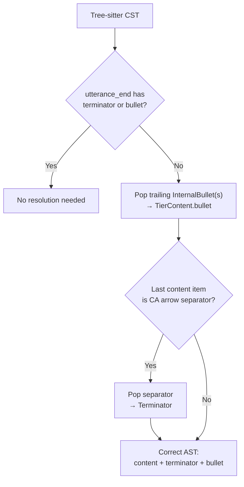

# CA Terminator Resolution

**Status:** Current
**Last updated:** 2026-03-30 20:13 EDT

## The Problem

CA intonation arrows (`→ ↗ ⇗ ↘ ⇘`) serve two roles in CHAT:

1. **Utterance-final terminator** — marks the prosodic end of an utterance,
   replacing standard terminators (`.` `?` `!`) in CA mode
2. **Mid-content prosodic marker** — annotates the intonation contour of a
   phrase within an utterance

```
*KE: I like LA the best → ⌈15⌉1000_5000⌈15⌉    ← → is TERMINATOR
*NUR: would you like toast↗ (0.6) ⌈15⌉1721_2980⌈15⌉  ← ↗ is PROSODIC MARKER
```

The same Unicode character has different semantic roles depending on position.

## The LR(1) Limitation

Tree-sitter's grammar uses a greedy `repeat1` for the `contents` rule:

```javascript
contents: $ => repeat1(choice(
  $.whitespaces,
  $.content_item,   // includes media_url → InternalBullet
  $.separator,       // includes CA arrows
  $.overlap_point,
))
```

When the parser sees `→`, it has two options:
- **Continue** `contents` (match `→` as separator, continue matching)
- **End** `contents` and start `utterance_end` (match `→` as terminator)

LR(1) parsers resolve shift/reduce conflicts by preferring shift (continue
matching). So `contents` ALWAYS consumes the arrow as a separator. Any
subsequent bullet (`⌈15⌉..⌈15⌉`) is also consumed as an `InternalBullet`
content item. The `utterance_end` rule receives nothing.

This is not a grammar bug — it's an inherent limitation of LR(1) parsing
with greedy repetition. The grammar correctly lists arrows in both
`separator` and `terminator`, but the parser's conflict resolution always
prefers the `separator` path.

**Why we can't remove bullets from `content_item`:** 86.4% of
`InternalBullet` items in the corpus (1.5M+ across 1,885 files) are
legitimate LENA/HomeBank sub-utterance event timing on continuation lines.
Removing `media_url` from `content_item` would break all of them.

## The Resolution

The Rust parser resolves the ambiguity in the CST→AST conversion phase
(`convert_main_tier_node`). After tree-sitter produces the CST, the
function `resolve_ca_terminator()` checks whether `utterance_end` has
neither terminator nor bullet. If so, it promotes trailing content items:

1. Trailing `InternalBullet`(s) → `TierContent.bullet` (last one wins)
2. Trailing CA arrow `Separator` → `Terminator`



**Source:** `crates/talkbank-parser/src/parser/tree_parsing/main_tier/structure/convert/mod.rs`
— `resolve_ca_terminator()`.

## What Is NOT Affected

- **Mid-content arrows** (followed by more words/pauses): `utterance_end`
  already has a terminator from the grammar (or at least has content after
  the arrow), so the resolution doesn't trigger
- **LENA/HomeBank InternalBullets**: These appear on continuation lines where
  the terminator is on a later line. `utterance_end.terminator` is `Some`,
  so the resolution doesn't trigger
- **Standard terminators** (`.` `?` `!`): Correctly routed by the grammar —
  `utterance_end.terminator` is `Some`
- **Downstream consumers (batchalign3)**: The data model (`Terminator` enum)
  already has all 5 CA variants. Consumers see correct `Terminator::CaLevel`
  etc. without needing any changes

## Corpus Validation

Tested on all 995 CA files in the TalkBank corpus plus all 87 reference
corpus files:

| Corpus | Files | Baseline errors | After-change errors | Regressions |
|--------|------:|----------------:|--------------------:|:-----------:|
| CA files | 995 | 2 | 2 | 0 |
| Reference corpus | 87 | 0 | 0 | 0 |

The 2 pre-existing errors are in `ca-data/CallFriend/eng-n/4889.cha` and
`ca-data/Jefferson/LinguaFranca/bs4.cha` (both on `+≈` lines with unusual
content — data quality issues, not grammar bugs).

## Data Model

The `Terminator` enum (in `talkbank-model`) already has all 5 CA intonation
variants:

| Variant | Unicode | CHAT Token |
|---------|---------|-----------|
| `CaRisingToHigh` | U+21D7 | ⇗ |
| `CaRisingToMid` | U+2197 | ↗ |
| `CaLevel` | U+2192 | → |
| `CaFallingToMid` | U+2198 | ↘ |
| `CaFallingToLow` | U+21D8 | ⇘ |

The `Separator` enum has corresponding variants for mid-content use, plus
`is_ca_intonation_arrow()` and `to_ca_terminator()` conversion helpers.

## Why Not a Different Grammar Design?

Several alternatives were evaluated and rejected:

| Alternative | Why rejected |
|-------------|-------------|
| Remove arrows from `separator` | Breaks 24,764 mid-utterance arrow uses |
| Remove `media_url` from `content_item` | Breaks 1.5M+ LENA/HomeBank InternalBullets |
| Use `prec.left()` on arrows in `contents` | Would always reduce (end contents), breaking mid-utterance arrows |
| Make arrows part of `word_body` | Arrows are utterance-level features, not word annotations. Data shows 46% are standalone (space-separated from words) |
| External scanner | Viable but complex; CST→AST resolution is simpler and equally correct |

The CST→AST resolution is the standard compiler technique for context-sensitive
disambiguation in LR parsers. The grammar captures the raw tokens; the semantic
pass assigns roles based on structural context.
