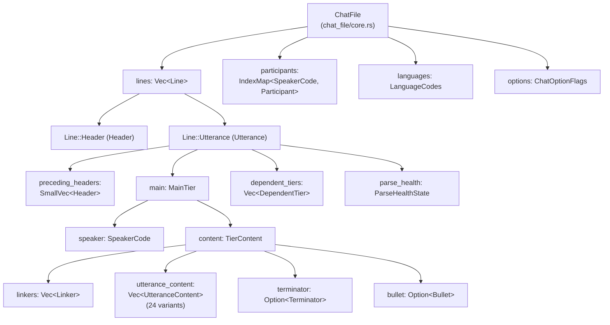
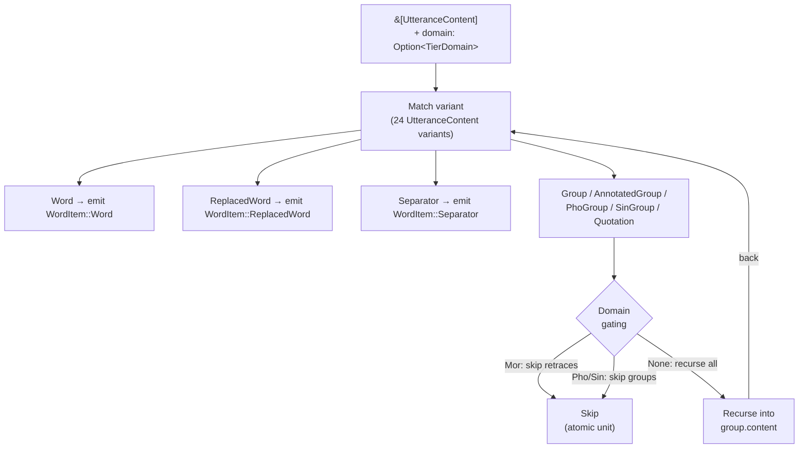
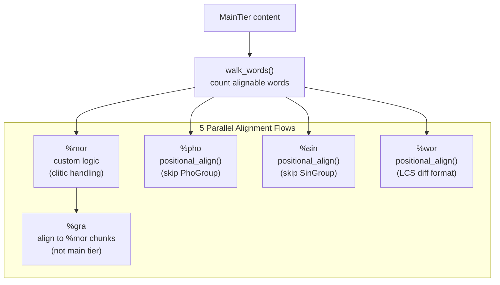

# CHAT Data Model

**Status:** Current
**Last updated:** 2026-05-01 15:57 EDT

The `talkbank-model` crate defines the typed AST for CHAT files. Every
other crate — parser, transform, CLAN, CLI, LSP, and the entire batchalign
runtime — depends on it. This page describes the model itself, the
three-level content hierarchy, the content-walker primitives, and the
extract → infer → inject pattern that all NLP tasks follow.

## ChatFile

The root type is `ChatFile`, representing a complete CHAT transcript:

```rust
pub struct ChatFile {
    pub lines: Vec<Line>,
    pub participants: IndexMap<SpeakerCode, Participant>,
    pub languages: LanguageCodes,
    pub options: ChatOptionFlags,
}
```

Each `Line` is either a `Header` or an `Utterance`. The full ownership
tree:



The `DependentTier` enum has 25 variants: structured linguistic
(`Mor`/`Gra`/`Pho`/`Mod`/`Sin`/`Act`/`Cod`/`Wor`), with-inline-bullets
(`Add`/`Com`/`Exp`/`Gpx`/`Int`/`Sit`/`Spa`), text-only
(`Alt`/`Coh`/`Def`/`Eng`/`Err`/`Fac`/`Flo`/`Gls`/`Ort`/`Par`/`Tim`),
Phon-project (`Modsyl`/`Phosyl`/`Phoaln`), and `UserDefined` /
`Unsupported`.

## Three-Level Content Hierarchy

CHAT main-tier content is a tree with three nesting levels. Every
content traversal must understand all three.

```
ChatFile
└── Line::Utterance
    └── MainTier
        └── TierContent
            ├── content: Vec<UtteranceContent>     ← Level 1
            │   ├── Word(Box<Word>)
            │   │   └── content: Vec<WordContent>  ← Level 3
            │   ├── OverlapPoint(OverlapPoint)
            │   ├── Group(Group)
            │   │   └── BracketedContent
            │   │       └── Vec<BracketedItem>     ← Level 2
            │   ├── PhoGroup, SinGroup, Quotation
            │   │   └── (same BracketedContent)
            │   ├── Retrace(Box<Retrace>)
            │   ├── Pause, Event, Separator, ...
            │   └── AnnotatedWord, AnnotatedGroup, ...
            ├── bullet: Option<Bullet>
            ├── linkers: Linkers
            └── terminator: Terminator
```

### Level 1 — `UtteranceContent` (24 variants)

What you iterate when walking `utterance.main.content.content.0`:

| Category | Variants |
|---|---|
| Words | `Word`, `AnnotatedWord`, `ReplacedWord` |
| Groups | `Group`, `AnnotatedGroup`, `PhoGroup`, `SinGroup`, `Quotation` |
| CA markers | `OverlapPoint`, `Separator` |
| Events | `Event`, `AnnotatedEvent`, `OtherSpokenEvent` |
| Actions | `AnnotatedAction` |
| Timing | `InternalBullet` |
| Scope markers | `LongFeatureBegin/End`, `NonvocalBegin/End/Simple`, `UnderlineBegin/End` |
| Other | `Freecode`, `Pause` |

**Critical rule:** every `match` on `UtteranceContent` must explicitly
list all 24 variants. No `_ =>` catch-alls. Project policy: silent data
loss when new variants are added is unacceptable.

### Level 2 — `BracketedItem` (22 variants)

Content inside groups (`<...>`, `‹...›`, `〔...〕`, `"..."`). Accessed via
`group.content.content.0` (the double `.content.content.0` is not a
typo — `Group.content` is `BracketedContent`, which has `.content:
BracketedItems`, which has `.0: Vec<BracketedItem>`).

`BracketedItem` mirrors `UtteranceContent` closely. Retrace content
(`<word word> [/]`, `word [//]`) is a dedicated `Retrace` variant at
both levels, not hidden inside `AnnotatedGroup`. Groups can nest
arbitrarily deep.

### Level 3 — `WordContent` (11 variants)

Content inside a single word token, accessed via `word.content`:

| Variant | Example |
|---|---|
| `Text` | plain text segment |
| `Shortening` | `(lo)` omitted sound |
| `OverlapPoint` | `butt⌈er⌉` — overlap inside a word |
| `CAElement` | `↑ ↓` prosody markers |
| `CADelimiter` | `° ∆` paired delimiters |
| `StressMarker` | `ˈ ˌ` |
| `Lengthening` | `:` |
| `SyllablePause` | `^` |
| `CompoundMarker` | `+` in `ice+cream` |
| `UnderlineBegin/End` | scope delimiters |

**Key insight:** overlap markers can appear at all three levels — as
standalone `UtteranceContent::OverlapPoint` (space-separated:
`⌈ word ⌉`), as `BracketedItem::OverlapPoint` (inside groups), or as
`WordContent::OverlapPoint` (intra-word: `butt⌈er⌉`). Any traversal
looking for overlap markers must check all three levels.

## Annotated Wrappers and Replaced Words

### `Annotated<T>`

Adds scoped annotations (`[/]`, `[* m]`, `[= explanation]`, etc.) to any
annotatable inner type:

```rust
pub struct Annotated<T> {
    pub inner: T,
    pub annotations: Vec<ContentAnnotation>,
    pub span: Span,
}
```

At Level 1: `AnnotatedWord(Box<Annotated<Word>>)`,
`AnnotatedGroup(Annotated<Group>)`,
`AnnotatedEvent(Annotated<Event>)`,
`AnnotatedAction(Annotated<Action>)`. Same variants exist at Level 2.

### `ReplacedWord`

Represents `word [: replacement]` — a surface form with a replacement:

```rust
pub struct ReplacedWord {
    pub word: Word,
    pub replacement: Replacement,
}
pub struct Replacement {
    pub words: Vec<Word>,
}
```

Convention when extracting words for NLP: use replacement words if
non-empty, else the surface form (Wor and Mor domains both follow this,
each with its own `counts_for_tier` filter).

## Tier Domains

Different NLP tasks need different views of the same content. The
`TierDomain` enum controls which words count for each tier and how
groups are traversed:

| Domain | Used by | Skips | Counts separators? |
|---|---|---|---|
| `Mor` | `%mor` / `%gra` generation | Retrace groups | Yes — `,` `„` `‡` carry mor items (`cm\|cm`, `end\|end`, `beg\|beg`) |
| `Wor` | `%wor` generation, FA | Nothing | No |
| `Pho` | `%pho` alignment | `PhoGroup` | No |
| `Sin` | `%sin` alignment | `SinGroup` | No |

The content walker takes `Option<TierDomain>`: `Some(domain)` for
domain-aware gating, `None` to recurse everything unconditionally.

## Content Walkers

`talkbank-model` exports closure-based walkers. Two layers:

- `walk_content` — generic, visits all content items (custom
  traversals).
- `walk_words` / `walk_words_mut` — filtered to words / replaced words
  / separators, with domain-aware gating. The primary primitive.

```rust
use talkbank_model::alignment::helpers::{
    walk_words, walk_words_mut,
    WordItem, WordItemMut,
    TierDomain,
};

walk_words(content, Some(TierDomain::Wor), &mut |leaf| {
    match leaf {
        WordItem::Word(word) => { /* ... */ }
        WordItem::ReplacedWord(replaced) => { /* ... */ }
        WordItem::Separator(sep) => { /* ... */ }
    }
});
```



### What `walk_words` does NOT visit

Only words and separators. Not `OverlapPoint` (any level), not
`CAElement` within words, not events / pauses / actions, not internal
bullets. For these, write a custom traversal — see
`talkbank-model/validation/utterance/overlap.rs` for the reference
pattern.

### `walk_overlap_points` — overlap marker iterator

```rust
walk_overlap_points(content, &mut |visit| {
    // visit.point.kind, visit.point.index, visit.word_position
});
```

Visits every `OverlapPoint` at all three content levels with its
word-position context. Used by the alignment pipeline (onset estimation)
and the validator (pairing checks). For region-level analysis (pairing
⌈ with ⌉ by index), use `extract_overlap_info()` which builds
`OverlapRegion` structs. For whole-file analysis,
`analyze_file_overlaps()` matches top regions (⌈) with bottom regions
(⌊) across utterances with 1:N support (used by E347 and
`chatter debug overlap-audit`).

## Extract → Infer → Inject Pattern

Every NLP task follows the same pattern:

```
┌─────────┐     ┌──────────┐     ┌──────────┐     ┌──────────┐
│  Parse  │────▶│ Extract  │────▶│  Infer   │────▶│  Inject  │
│  CHAT   │     │  Words   │     │ (Python) │     │ Results  │
└─────────┘     └──────────┘     └──────────┘     └──────────┘
   Rust            Rust              IPC             Rust
```

1. **Parse** — `parse_lenient()` or `parse_strict()` → `ChatFile` AST.
2. **Extract** — `walk_words` collects words / payloads.
3. **Infer** — structured payload to Python worker via IPC; raw ML
   output back.
4. **Inject** — `walk_words_mut` writes results back into the AST.

| Task | Extract module | Inject module | Domain |
|---|---|---|---|
| Morphosyntax | `morphosyntax.rs::collect_payloads` | `morphosyntax.rs::inject` | `Mor` |
| Utterance segmentation | `utseg.rs::collect_payloads` | `utseg.rs::apply` | `Wor` |
| Translation | `translate.rs::collect_payloads` | `translate.rs::inject_translation` | n/a (text) |
| Coreference | `coref.rs::collect_payloads` | `coref.rs::inject_coref` | `Wor` |
| Forced alignment | `fa/extraction.rs::collect_fa_words` | `fa/injection.rs` | `None` (all words) |

**Critical invariant:** the extract and inject traversals must visit
words in the same order. The walker guarantees this — same domain
argument, same traversal order.

## Validation

Beyond what the grammar enforces, `validate_with_alignment()` checks
semantic constraints:

- `%mor` alignment: number of MOR items matches alignable main-tier words.
- `%gra` structure: sequential indices, ROOT checks, circular dependency.
- Header consistency: `@ID` codes match `@Participants`.
- Speaker references: all `*SPEAKER:` codes declared.

Five parallel alignment flows are computed against the main tier:



For the alignment algorithms themselves, see
[Alignment](../alignment.md).

## Common Pitfalls

1. **"Consecutive" means in-order traversal, not adjacent array
   indices.** When CHAT tools speak of "consecutive" or "sequential"
   items on the main tier, this **always** means document order via
   recursive traversal — accounting for groups (`<...>`), retrace groups
   (`<...> [/]`), quotations (`"..."`), and all other bracketed
   structures. Never check adjacency in the flat
   `Vec<UtteranceContent>` — use `walk_words` or equivalent in-order
   traversal.
2. **Missing intra-word content.** Overlap markers, CA elements, and
   other markers can appear inside `Word.content`. Checking only
   `UtteranceContent::OverlapPoint` misses `WordContent::OverlapPoint`
   (e.g., `butt⌈er⌉`, `a⌈nd`).
3. **Missing annotated variants.**
   `UtteranceContent::AnnotatedWord` and `AnnotatedGroup` wrap inner
   types in `Annotated<T>` and are easy to forget.
4. **`BracketedContent` access.** `Group.content` →
   `BracketedContent`, with `.content: BracketedItems`, with
   `.0: Vec<BracketedItem>`.
5. **Separator counter sync (Mor domain).** Tag-marker separators
   (`,` `„` `‡`) count as NLP words because they have %mor items. Any
   code counting words in the Mor domain must count these separators
   too.

## Serialization

- **CHAT** — `WriteChat` trait writes any model type back to CHAT format.
- **JSON** — all model types implement `Serialize`/`Deserialize`. Format
  per the [JSON Schema](../../chatter/integrating/json-schema.md).
- **JSON Schema** — derived via `JsonSchema`. Run
  `cargo test --test generate_schema` to regenerate
  `schema/chat-file.schema.json`.

## Memory and Interning

String-heavy types (`PosCategory`, `MorStem`, `MorFeature`) use
`Arc<str>` with a global interner — significant memory savings on large
corpora where the same POS tags and lemmas appear thousands of times.

Collections that are typically small use `SmallVec` for inline storage:

- `SmallVec<[MorFeature; 4]>` — features per word (usually 0–4).
- `SmallVec<[MorWord; 2]>` — post-clitics (usually 0–1).
