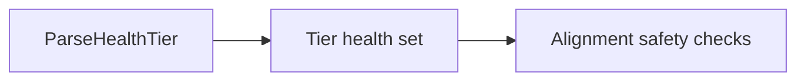
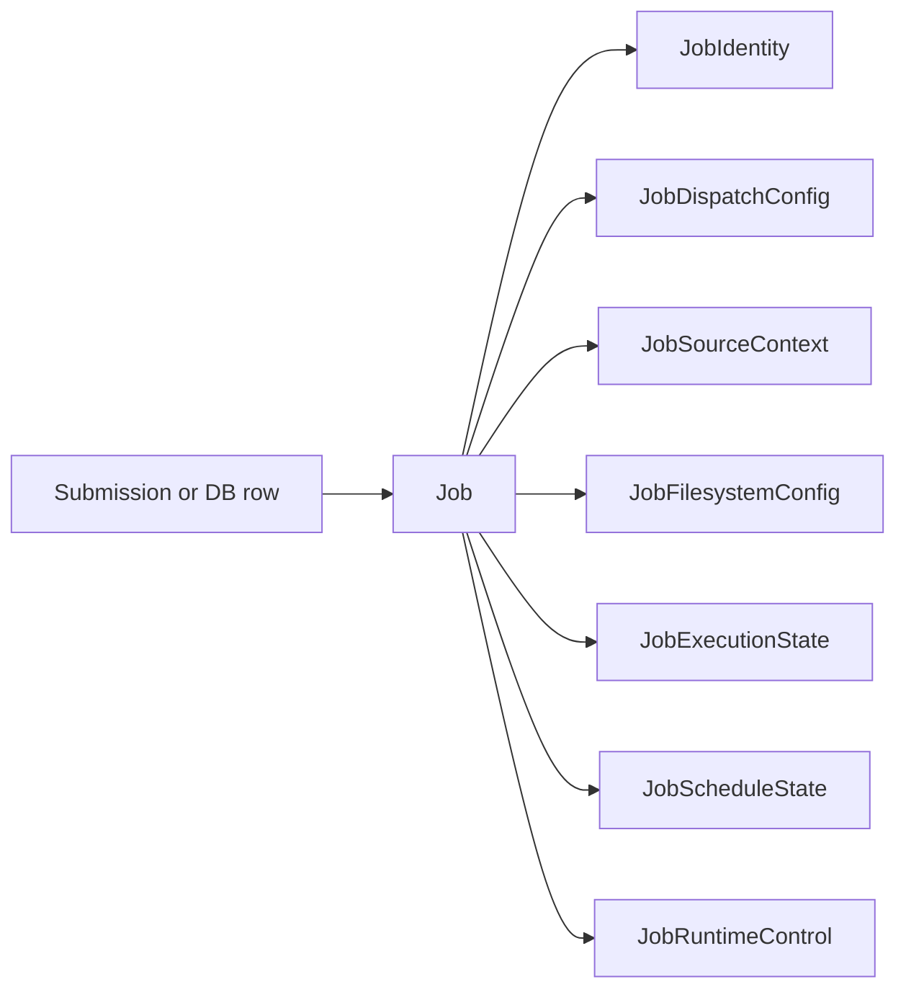
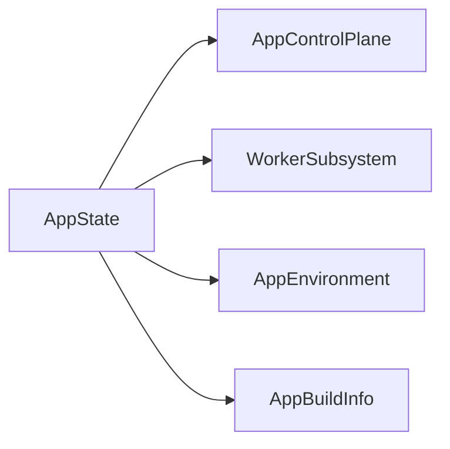

# Wide Struct Audit

**Status:** Current
**Last updated:** 2026-05-19 14:18 EDT

A workspace-wide audit rule for struct shape. Applies to all crates in
`talkbank-tools` (parsing, model, validation, transform, CLI, batchalign
runtime).

A struct with many fields is not automatically wrong. The smell is:

- many unrelated concerns packed into one value
- several related booleans that act like implicit policy enums
- repeated field-name prefixes that point to missing sub-structs
- parallel vectors or stringly runtime fields
- runtime code reaching into many unrelated fields of the same value

The repo therefore treats **10 or more named fields** as an audit threshold,
not as an automatic ban.

## Categories

Wide structs fall into four categories.

### 1. Boundary shim — may stay wide

CLI, JSON, or clap boundary types. Acceptable if they are converted into
typed policies or sub-structs before entering core runtime code.

Examples: `GlobalOpts`, `AlignArgs`, `TranscribeArgs`, `BenchmarkArgs`.

### 2. Transport or schema record — may stay wide

DB rows, HTTP response shapes, JSON schema mirrors. Acceptable as long as
they don't become the internal runtime shape.

Examples: `JobRow`, `NewJobRecord`, `JobSubmission`, `JobInfo`,
`HealthResponse`, `WordJsonSchema`, `DbMetadata`, `CoverageReport`.

### 3. Real aggregate — may stay wide

Domain values whose fields all answer one coherent question and whose callers
consume the whole rather than spelunking through unrelated subsets.

Examples: `FileStatus`, `AttemptRecord`, plus metric records like
`SpeakerEval`, `SpeakerKideval`, `SpeakerComplexity`, `SpeakerFluency`
(report records, not runtime coordination).

### 4. Refactor target — must be split

Mix of policy and state, multiple responsibilities, or callers needing to
know the whole subsystem to use a subset of fields.

## Design Rules

1. Treat 10 or more named fields as an audit trigger.
2. Treat 3 or more related boolean fields as a smell even below that threshold.
3. Boundary and transport records may stay wide when they mirror a real
   external shape.
4. Runtime coordination structs prefer named sub-structs over flat bags.
5. Replace parallel vectors with per-item records where possible.
6. If a wide struct stays wide, it must be recorded explicitly in the audit
   test with a reason and a field-count cap.

## Refactor Examples

### `ValidateDirectoryOptions` (talkbank-cli) — was a flat bag

Used to be a flat bag of format, cache, traversal, roundtrip, parser, audit,
and TUI flags. Now grouped by concern:

- `ValidationRules`
- `ValidationExecution`
- `ValidationTraversalMode`
- `ValidationPresentation`

Shape this audit wants for policy-rich CLI boundaries: one small top-level
struct with explicit sub-objects and enums rather than a dozen flat fields.

### `ParseHealth` (talkbank-model) — was a ten-boolean state vector

Now stores taint as a compact tier bitset keyed by `ParseHealthTier`, the
shape this audit expects for fixed domain sets.

### `Job` (batchalign) — interior runtime, grouped by concern

`crates/batchalign/src/store/job/types.rs` now decomposes into:

- `JobIdentity`
- `JobDispatchConfig`
- `JobSourceContext`
- `JobFilesystemConfig`
- `JobExecutionState`
- `JobScheduleState`
- `JobRuntimeControl`

The matching runner-facing projection (`RunnerJobIdentity`,
`RunnerDispatchConfig`, `RunnerFilesystemConfig`) is the worker-facing view.

### `AppState` (batchalign) — service-root aggregate

`crates/batchalign/src/state.rs` keeps server route state shallow under named
sub-aggregates:

That is the expected shape for owned root state: one small root, named
sub-aggregates for real seams, no caches or runner-only data threaded through
every handler.

## Open Hotspots

### Dashboard and TUI state bags

Real state owners that still want grouping by concern (selection vs. progress
vs. render flags vs. status):

- `src/test_dashboard/app.rs` `AppState`
- `crates/talkbank-cli/src/ui/validation_tui/state.rs` `TuiState`

### Metric structs

`SpeakerEval`/`SpeakerKideval` are acceptable as report records. If output
renderers keep needing subsets (lexical metrics, morphosyntax metrics, error
counts, derived scores), those records should eventually nest along those
lines.

## Audit Guardrail

The xtask `cargo run -p xtask -- lint-wide-structs`
(`xtask/src/wide_struct_audit.rs`) classifies the current wide structs,
fails when a new one appears without an explicit review entry, and
enforces field caps on reviewed structs.
