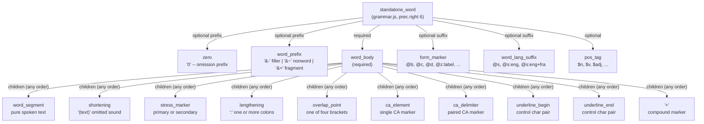

# The CHAT Word

**Status:** Current
**Last updated:** 2026-03-24 01:32 EDT

"Word" is the most complex and most misunderstood concept in CHAT. This
chapter documents what a word actually is, how the grammar parses it, and
how the Rust model represents it. If you maintain this codebase, you will
encounter word-level bugs. This chapter exists so you can understand them.

## The Fundamental Rule

**Whitespace delimits words.** Contiguous non-whitespace characters form
one word token. This applies everywhere on the main tier.

```
*CHI:   hello world .
        ^^^^^              word: "hello"
              ^^^^^        word: "world"
```

The grammar uses `extras: $ => []` -- no implicit whitespace. Whitespace
nodes (`whitespaces`, `space`) are explicit in the CST. Tree-sitter does
not skip whitespace between tokens. This is the foundation of every
tokenization decision in the grammar.

There are no exceptions to this rule. Every ambiguity described in this
chapter is resolved by applying this rule consistently.

## Word Structure

A word in the grammar is `standalone_word` -- a sequence of an optional
prefix, a required body, optional suffixes, and an optional POS tag.

The following diagram shows the full decomposition. All named nodes are
separate CST children.



In the grammar (`grammar.js` lines 1145-1197), the rules are:

```javascript
standalone_word: $ => prec.right(6, seq(
  optional(choice($.word_prefix, $.zero)),
  $.word_body,
  optional($.form_marker),
  optional($.word_lang_suffix),
  optional($.pos_tag),
)),

word_body: $ => prec.right(choice(
  seq(
    choice($.word_segment, $.shortening, $.stress_marker),
    repeat(choice($.word_segment, $.shortening, $.stress_marker, $._word_marker)),
  ),
  seq(
    choice($.overlap_point, $.ca_element, $.ca_delimiter, $.underline_begin),
    choice($.word_segment, $.shortening, $.stress_marker),
    repeat(choice($.word_segment, $.shortening, $.stress_marker, $._word_marker)),
  ),
)),
```

`word_body` has two branches:

1. **Standard start**: the word begins with `word_segment`, `shortening`,
   or `stress_marker`, followed by any number of body children.
2. **Marker-initial**: the word begins with a structural marker (overlap,
   CA, underline), but that marker must be immediately followed by text
   content. This prevents degenerate words like a standalone overlap marker
   from forming a valid `standalone_word`.

Lengthening and `+` (compound marker) are excluded from starting a word
body. This is how standalone `:` falls through to `separator(colon)` --
see Section 5 (Tokenization Ambiguities) below.

## The word_segment Purity Invariant

**`word_segment` contains ONLY pure spoken text.** All structural markers
are separate typed children in `word_body`, never consumed by `word_segment`.

This is a hard invariant with three consequences:

1. **`cleaned_text()` never scans for markers.** It concatenates `Text` and
   `Shortening` elements. No stripping needed.
2. **Validation finds ALL markers by type.** Overlap markers, CA elements,
   and underline pairs are always `WordContent` variants, regardless of
   position within the word.
3. **Editors get typed CST nodes.** Syntax highlighting, bracket matching,
   and hover info work on individual markers, not opaque substrings.

### How it works

`word_segment` is a DFA token at `prec(5)` with a regex that _excludes_
all structural characters. The exclusions are generated from the **symbol
registry** (`grammar/src/generated_symbol_sets.js`) -- never hand-written.

```javascript
word_segment: $ => token(prec(5, seq(
  WORD_SEGMENT_FIRST_RE,    // generated: excludes structural chars + '0' at start
  WORD_SEGMENT_REST_RE,     // generated: excludes structural chars
))),
```

### Full exclusion table

Every character in this table is excluded from `word_segment` and
becomes a separate typed node in the CST.

| Category | Characters | CST node type |
|----------|-----------|---------------|
| Overlap markers | `⌈` `⌉` `⌊` `⌋` | `overlap_point` |
| CA elements | `↑` `↓` `≠` `∾` `⁑` `⤇` `∙` `Ἡ` `↻` `⤆` | `ca_element` |
| CA delimiters | `∆` `∇` `°` `▁` `▔` `☺` `♋` `⁇` `∬` `Ϋ` `∮` `↫` `⁎` `◉` `§` | `ca_delimiter` |
| Stress markers | `ˈ` `ˌ` | `stress_marker` |
| Colons | `:` | `lengthening` |
| Underline markers | `\x02\x01`, `\x02\x02` | `underline_begin` / `underline_end` |
| Brackets | `[` `]` `<` `>` `(` `)` `{` `}` | structural (annotations, groups) |
| Punctuation | `.` `!` `?` `,` `;` `+` | terminators, separators, compound |
| CHAT prefixes | `@` `$` `&` `*` `%` | headers, events, speakers |
| Intonation contours | `⇗` `↗` `→` `↘` `⇘` `≈` `≋` `∞` `≡` | content-level markers |
| Group delimiters | `‹` `›` `"` `"` `〔` `〕` | pho/sin groups, quotes |
| Control chars | `\x01`-`\x08`, `\x15` | bullets, underline |

**First-character-only exclusion:** `0` is excluded from the first
character of `word_segment` (it is the omission prefix). `0` in
non-initial positions is valid: `200`, `h0me`, `abc0` all parse correctly.

## The Rust Data Model

### Word struct

The `Word` struct (`crates/talkbank-model/src/model/content/word/word_type.rs`)
is the canonical typed representation:

```rust
pub struct Word {
    pub span: Span,
    pub word_id: Option<SmolStr>,
    pub(crate) raw_text: SmolStr,
    pub content: WordContents,
    pub category: Option<WordCategory>,
    pub form_type: Option<FormType>,
    pub lang: Option<WordLanguageMarker>,
    pub part_of_speech: Option<SmolStr>,
    pub inline_bullet: Option<Bullet>,
}
```

Key fields:

- **`raw_text`**: the exact text from the input, including all markers.
  Used for roundtrip serialization.
- **`content`**: a `WordContents` (SmallVec-backed sequence of `WordContent`
  elements). This is the structured decomposition. Most words have 1-2
  elements; SmallVec avoids heap allocation for the common case.
- **`category`**: optional prefix (`Omission`, `CAOmission`, `Filler`,
  `Nonword`, `PhonologicalFragment`).
- **`form_type`**: optional `@` suffix (`@c` child-invented, `@d` dialect,
  `@z:label` user-defined, etc.).
- **`lang`**: optional `@s` language marker (`Shortcut`, `Explicit`,
  `Multiple`, `Ambiguous`).
- **`part_of_speech`**: optional `$` tag.

### WordContent enum

`WordContent` (`crates/talkbank-model/src/model/content/word/content.rs`)
is the enum of everything that can appear inside a word body. Each variant
maps directly to a grammar node.

| Grammar node | `WordContent` variant | Rust type | Example |
|---|---|---|---|
| `word_segment` | `Text` | `WordText(NonEmptyString)` | `hello`, `want` |
| `shortening` | `Shortening` | `WordShortening(NonEmptyString)` | `(be)` in `(be)cause` |
| `overlap_point` | `OverlapPoint` | `OverlapPoint` | `⌈`, `⌉2` |
| `ca_element` | `CAElement` | `CAElement` | `↑`, `↓` |
| `ca_delimiter` | `CADelimiter` | `CADelimiter` | `∆`, `°` |
| `stress_marker` | `StressMarker` | `WordStressMarker` | `ˈ` primary, `ˌ` secondary |
| `lengthening` | `Lengthening` | `WordLengthening { count: u8 }` | `:` = 1, `::` = 2, `:::` = 3 |
| (caret in word) | `SyllablePause` | `WordSyllablePause` | `^` in `o^ver` |
| `underline_begin` | `UnderlineBegin` | `UnderlineMarker` | `\x02\x01` |
| `underline_end` | `UnderlineEnd` | `UnderlineMarker` | `\x02\x02` |
| `+` (compound) | `CompoundMarker` | `WordCompoundMarker` | `+` in `ice+cream` |

### cleaned_text()

`Word::cleaned_text()` derives NLP-ready text from `content` by
concatenating only `Text` and `Shortening` variants:

```rust
pub fn compute_cleaned_text(&self) -> String {
    let mut result = String::new();
    for item in &self.content {
        match item {
            WordContent::Text(t) => result.push_str(t.as_ref()),
            WordContent::Shortening(s) => result.push_str(s.as_ref()),
            _ => {}
        }
    }
    result
}
```

This works because the purity invariant guarantees that `Text` elements
never contain structural markers. There is nothing to strip.

Examples:

| Input | `content` | `cleaned_text()` |
|---|---|---|
| `hello` | `[Text("hello")]` | `hello` |
| `(be)cause` | `[Shortening("be"), Text("cause")]` | `because` |
| `no::` | `[Text("no"), Lengthening(2)]` | `no` |
| `ice+cream` | `[Text("ice"), CompoundMarker, Text("cream")]` | `icecream` |
| `le~ha` | `[Text("le"), CliticBoundary, Text("ha")]` | `leha` |
| `ja^ja` | `[Text("ja"), SyllablePause, Text("ja")]` | `jaja` |
| `he↑llo` | `[Text("he"), CAElement(PitchUp), Text("llo")]` | `hello` |
| `°soft°` | `[CADelimiter(Softer), Text("soft"), CADelimiter(Softer)]` | `soft` |
| `ˈhello` | `[StressMarker(Primary), Text("hello")]` | `hello` |
| `⌈hello⌉` | `[OverlapPoint(TopBegin), Text("hello"), OverlapPoint(TopEnd)]` | `hello` |

The result is cached via `OnceLock` on first access.

### What is included in cleaned_text vs what is stripped

The following table is the **complete inventory** of how every word-internal
element contributes to (or is excluded from) `cleaned_text()`. This must
match what NLP pipelines (Stanza, etc.) expect as input.

| `WordContent` variant | Character(s) | In `cleaned_text`? | Rationale |
|---|---|---|---|
| `Text` | spoken text | **YES** | The actual word |
| `Shortening` | `(be)` | **YES** | Shortened form is still spoken |
| `CompoundMarker` | `+` | No | Structural boundary, not spoken |
| `CliticBoundary` | `~` | No | Morphological boundary, not spoken |
| `SyllablePause` | `^` | No | Pause between syllables, not spoken |
| `Lengthening` | `:` `::` `:::` | No | Prosodic marker, not spoken |
| `StressMarker` | `ˈ` `ˌ` | No | Prosodic marker, not spoken |
| `OverlapPoint` | `⌈` `⌉` `⌊` `⌋` | No | Timing marker, not spoken |
| `CAElement` | `↑` `↓` `≠` `∾` `⁑` `⤇` `∙` `Ἡ` `↻` `⤆` | No | Prosodic annotation |
| `CADelimiter` | `∆` `∇` `°` `▁` `▔` `☺` `♋` `⁇` `∬` `Ϋ` `∮` `↫` `⁎` `◉` `§` | No | Voice quality annotation |
| `UnderlineBegin` | `\x02\x01` | No | Formatting marker |
| `UnderlineEnd` | `\x02\x02` | No | Formatting marker |

**Characters that stay in word_segment (ARE spoken text):**
- Letters (all Unicode)
- Digits (in non-initial position; `0` in initial = omission prefix)
- Hyphen (`-`) — part of word text, e.g., `ice-cream`, `self-conscious`
- Apostrophe (`'`) — contractions, e.g., `don't`, `it's`
- Hash (`#`) — appears in some transcription conventions
- Underscore (`_`) — compound boundary in some conventions

**Characters NOT in word_segment (excluded by symbol registry):**
See the full exclusion table in
[Precedence Decisions](../grammar/docs/precedence-decisions.md#word-segment-purity-invariant).

### Comparison with batchalign2

batchalign2's `annotation_clean()` (60 lines of `.replace()` calls) strips
all the same characters that our grammar excludes from `word_segment`.
Key differences:

1. **Parentheses**: ba2 COMMENTED OUT the strip. We handle them as
   `Shortening` — the content inside parens IS included in `cleaned_text`.
2. **IPA characters** (`ạ ā ʔ ʕ ʰ`): ba2 incorrectly strips them. We
   correctly keep them — they are real phonetic content.
3. **Hyphen** (`-`): ba2 strips it. We keep it in word_segment because
   hyphen is a valid word character (contractions, compounds, morphological
   suffixes in `%mor` tier).

Our design eliminates the need for character-by-character stripping entirely.
`cleaned_text()` is a simple concatenation of `Text` + `Shortening`
elements, with zero scanning.

## The Six Tokenization Ambiguities

CHAT was designed for human readability, not machine parsing. Six
characters have context-dependent meanings that the grammar must
disambiguate. Full details with proof grammars are in
`grammar/docs/tokenization-rules.md` and `grammar/docs/precedence-decisions.md`.
What follows is a summary for orientation.

### 1. Overlap markers (⌈⌉⌊⌋)

Adjacent to text = part of the word. Space-separated = standalone
`overlap_point`.

```
Yeah⌋⌈2 hey      ONE word: "Yeah⌋⌈2"
Yeah ⌋ ⌈2 hey    three tokens: "Yeah", ⌋, ⌈2
```

Maximal munch at `prec(5)` makes `word_segment` consume adjacent overlap
characters. Overlap markers are only recognized as `overlap_point` when
space-separated on both sides.

### 2. Zero/omission prefix (0)

Adjacent to word body = omission prefix. Space-separated = action marker.

```
0die              ONE word: standalone_word(zero, word_body("die"))
0 die             TWO tokens: nonword(zero), word("die")
```

`standalone_word` at `prec.right(6)` beats `nonword` at `prec(1)`.
The `extras: []` setting prevents whitespace from being skipped between
`zero` and `word_body`. The `zero` token is inlined directly into
`standalone_word` (not through `word_prefix`) because tree-sitter's
precedence does not propagate through intermediate rules. This was proven
empirically with a minimal test grammar -- see `grammar/docs/precedence-decisions.md`.

### 3. CA parenthetical vs shortening

In CA mode (`@Options: CA`), a fully parenthesized word `(word)` is an
uncertain/omitted word (`CAOmission`), semantically equivalent to `0word`.
Partially parenthesized `hel(lo)` is always a shortening.

```
@Options: CA
*CHI:   (ja) .            CAOmission: uncertain "ja"
*CHI:   hel(lo) .         Shortening: "(lo)" is the shortened part
```

Distinguishing these requires file-level context (`@Options` header).
The parser sets `WordCategory::CAOmission` when the word is fully
parenthesized in CA mode. Isolated `parser.parse_word_fragment()` calls
cannot determine CA mode -- they need a `FragmentSemanticContext`.

### 4. Colon -- lengthening vs separator

Inside a word (after text): prosodic lengthening. Standalone: separator.

```
no::              ONE word: Text("no") + Lengthening(2)
hello : world     separator(colon)
```

The DFA always produces `lengthening` for `:` (higher precedence). But
`word_body` rejects `lengthening` as a first element, so standalone `:`
cannot form a valid word and falls through to `separator(colon)`. This is
the "constrain the parser, not the DFA" pattern.

### 5. Plus (+) -- compound vs terminator vs linker

Inside a word: compound marker. At line end: terminator prefix. At line
start: linker prefix.

```
ice+cream         ONE word with compound marker
and then +...     terminator: trailing_off (prec 10 beats prec 5)
+< but I +/.      linker: lazy_overlap, terminator: interruption
```

Terminators and linkers use `prec(10)`, which beats `word_segment` at
`prec(5)`. No valid CHAT word ends with `+` -- the grammar enforces this
by structure.

### 6. Bracket annotations vs plain brackets

Bracket annotations (`[= text]`, `[=! text]`, `[% text]`) use `prec(8)`
prefix tokens to beat generic bracket handling.

## Historical Context: The Coarsening and Its Reversal

### The original structured grammar (pre-coarsening)

The original grammar (preserved in
`grammar/docs/pre-coarsening-grammar.js.reference`) had all word-internal
markers as children of `word_content`:

```javascript
// Pre-coarsening: every marker was a child of word_content
word_content: $ => choice(
  $.word_segment,
  $.shortening,
  $.stress,
  $.colon,
  $.caret,
  $.tilde,
  $.plus,
  $.overlap_point,
  $.ca_element,
  $.ca_delimiter,
  $.underline_begin,
  $.underline_end,
),
```

### The coarsening decision

At one point, `standalone_word` was coarsened into an **opaque token** --
a single DFA regex that consumed the entire word as one undifferentiated
string. The rationale was:

- Simpler grammar with fewer tree-sitter conflicts.
- A Chumsky-based direct parser in Rust would re-parse the opaque token
  into structured `WordContent` elements.

This worked but had costs:

- Two parsers (tree-sitter + Chumsky) with independent bugs.
- Validation could not find structural markers without re-parsing.
- Editors got one opaque node instead of typed children.
- `cleaned_text()` had to scan for and strip marker characters.

### The reversal (Chumsky elimination)

When the Chumsky direct parser was eliminated (making tree-sitter the sole
parser), the structured word grammar was restored. The key decisions:

1. All marker characters were re-excluded from `word_segment` using the
   symbol registry as the single source of truth.
2. Each marker type became a separate CST child in `word_body`.
3. The `WordContent` enum in the Rust model was aligned 1:1 with the
   grammar nodes.
4. The word_segment purity invariant was established as a TDD gate.

The result is one parser, one source of truth for exclusions, and typed
markers from grammar through model.

## Testing: The word_segment Purity Gate

The file `grammar/test/corpus/word/word_segment_purity.txt` contains 8
tests that enforce the purity invariant. Each test verifies that a
specific structural marker produces a separate CST child and is not
consumed by `word_segment`.

The tests cover:

| Test name | Input | Asserts |
|---|---|---|
| `word_segment_purity_overlap` | `butt⌈er⌉` | `word_segment`, `overlap_point`, `word_segment`, `overlap_point` |
| `word_segment_purity_ca_pitch_up` | `he↑llo` | `word_segment`, `ca_element`, `word_segment` |
| `word_segment_purity_ca_pitch_down` | `he↓llo` | `word_segment`, `ca_element`, `word_segment` |
| `word_segment_purity_ca_faster` | `∆hello∆` | `ca_delimiter`, `word_segment`, `ca_delimiter` |
| `word_segment_purity_ca_softer` | `°hello°` | `ca_delimiter`, `word_segment`, `ca_delimiter` |
| `word_segment_purity_underline` | `\x02\x01hello\x02\x02` | `underline_begin`, `word_segment`, `underline_end` |
| `word_segment_purity_lengthening` | `no::` | `word_segment`, `lengthening` |
| `word_segment_purity_stress` | `ˈhello` | `stress_marker`, `word_segment` |

### How to add a new purity test

If you add a new structural marker to the grammar:

1. Add its characters to the symbol registry
   (`spec/symbols/symbol_registry.json`).
2. Run `make symbols-gen` to regenerate the exclusion sets.
3. Add a purity test in `grammar/test/corpus/word/word_segment_purity.txt`
   that embeds the marker inside a word and asserts it is a separate child.
4. Run the full verification sequence:
   ```bash
   cd grammar && tree-sitter generate && tree-sitter test
   cargo nextest run -p talkbank-parser
   cargo nextest run -p talkbank-parser-tests
   make verify
   ```

## Key Source Files

| File | What it defines |
|---|---|
| `grammar/grammar.js` (lines 1145-1227) | `standalone_word`, `word_body`, `word_segment`, `_word_marker` |
| `grammar/src/generated_symbol_sets.js` | Character exclusion sets (generated, do not edit) |
| `grammar/test/corpus/word/word_segment_purity.txt` | 8 purity gate tests |
| `grammar/docs/tokenization-rules.md` | The 6 tokenization ambiguities with full examples |
| `grammar/docs/precedence-decisions.md` | Precedence proofs (zero, colon, purity invariant) |
| `grammar/docs/pre-coarsening-grammar.js.reference` | Historical: the grammar before coarsening |
| `crates/talkbank-model/src/model/content/word/word_type.rs` | `Word` struct |
| `crates/talkbank-model/src/model/content/word/content.rs` | `WordContent` enum (11 variants) |
| `crates/talkbank-model/src/model/content/word/word_contents.rs` | `WordContents` (SmallVec-backed sequence) |
| `crates/talkbank-model/src/model/content/word/category.rs` | `WordCategory` enum (5 variants) |
| `crates/talkbank-model/src/model/content/word/form.rs` | `FormType` enum (22 variants) |
| `crates/talkbank-model/src/model/content/word/language.rs` | `WordLanguageMarker` enum (4 variants) |
