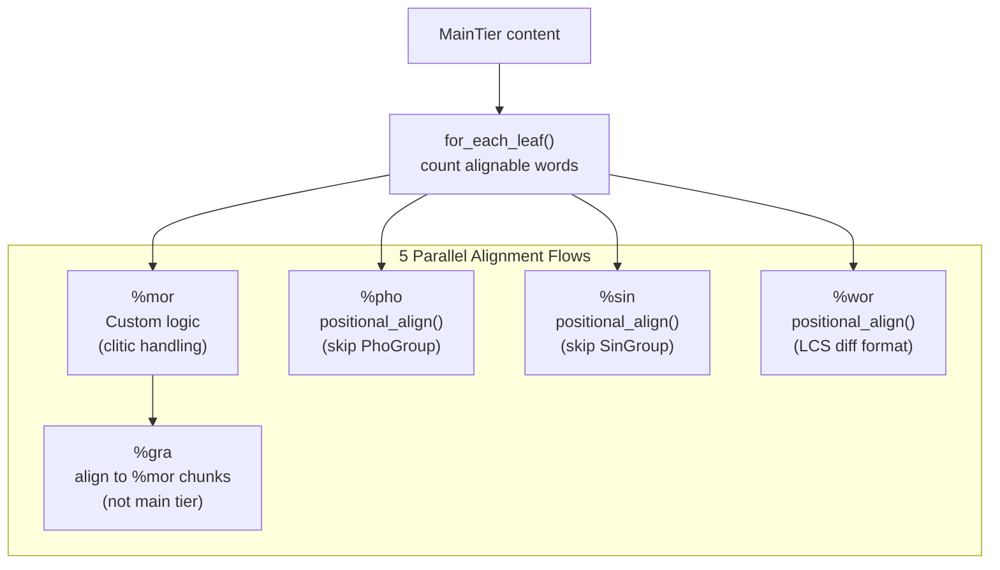
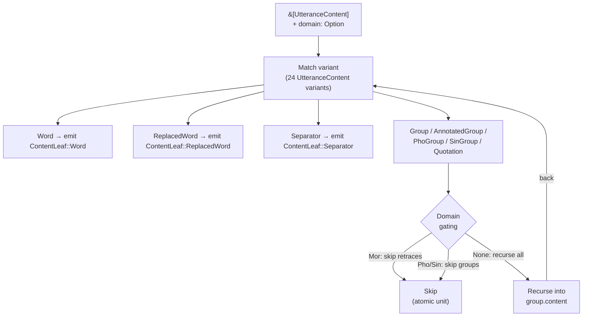

# Data Model

The `talkbank-model` crate defines the typed AST for CHAT files. It is the central crate that all other crates depend on.

## ChatFile

The root type is `ChatFile`, representing a complete CHAT transcript:

```rust
pub struct ChatFile {
    pub headers: Headers,
    pub utterances: Vec<Utterance>,
}
```

## Key Types

### Headers

```rust
pub struct Headers {
    pub participants: Vec<Participant>,
    pub languages: Vec<Language>,
    pub ids: Vec<IdHeader>,
    pub date: Option<Date>,
    pub media: Option<Media>,
    pub comments: Vec<Comment>,
    // ... other optional headers
}
```

### Utterance

```rust
pub struct Utterance {
    pub speaker: Speaker,
    pub content: MainTierContent,
    pub terminator: Terminator,
    pub dependent_tiers: Vec<DependentTier>,
    pub bullet: Option<Bullet>,
}
```

### Dependent Tiers

The `DependentTier` enum covers all tier types:

```rust
pub enum DependentTier {
    Mor(MorTier),
    Gra(GraTier),
    Pho(PhoTier),
    Wor(WorTier),
    Sin(SinTier),
    Com(ComTier),
    Act(ActTier),
    // ... 20+ variants total
}
```

### MOR Tier

The MOR tier has a rich type hierarchy:

```rust
pub struct MorTier {
    pub tier_type: MorTierType,
    pub items: Vec<Mor>,
    pub terminator: Option<String>,
}

pub struct Mor {
    pub main: MorWord,
    pub post_clitics: Vec<MorWord>,
}

pub struct MorWord {
    pub pos: PosCategory,
    pub lemma: MorStem,
    pub features: SmallVec<[MorFeature; 4]>,
}
```

`MorFeature` supports both flat values (`Plur`) and Key=Value pairs (`Number=Plur`). See [The %mor Tier](../chat-format/mor-tier.md) for details.

## Interning

String-heavy types like `PosCategory`, `MorStem`, and `MorFeature` use `Arc<str>` with a global interner for deduplication. This significantly reduces memory usage when processing large corpora where the same POS tags and lemmas appear thousands of times.

## Validation

The model includes a validation system that checks semantic constraints beyond what the grammar enforces:

- `%mor` alignment: number of MOR items must match alignable main tier words
- `%gra` structure: sequential indices, ROOT checks, circular dependency detection
- Header consistency: `@ID` codes match `@Participants`
- Speaker references: all `*SPEAKER:` codes declared

Validation runs after parsing via `validate_with_alignment()`.

### Tier Alignment Flows

Each dependent tier aligns to the main tier (or to %mor) using domain-specific logic:



## Serialization

### CHAT (WriteChat)

The `WriteChat` trait serializes model types back to CHAT format:

```rust
pub trait WriteChat {
    fn write_chat(&self, writer: &mut impl Write) -> io::Result<()>;
}
```

### JSON (Serde)

All model types implement `Serialize`/`Deserialize` for JSON roundtrip. The JSON format follows the [JSON Schema](../integrating/json-schema.md).

### Schema (Schemars)

Model types derive `JsonSchema` for automatic JSON Schema generation. Run `cargo test --test generate_schema` to regenerate `schema/chat-file.schema.json`.

## Content Walker



The `talkbank-model` crate provides a closure-based content tree walker for leaf items (words, replaced words, separators), centralizing the recursive traversal of `UtteranceContent` (24 variants) and `BracketedItem` (22 variants).

```rust
pub enum ContentLeaf<'a> {
    Word(&'a Word, &'a [ScopedAnnotation]),
    ReplacedWord(&'a ReplacedWord),
    Separator(&'a Separator),
}

pub fn for_each_leaf(
    content: &[UtteranceContent],
    domain: Option<AlignmentDomain>,
    f: &mut impl FnMut(ContentLeaf<'_>),
);

pub fn for_each_leaf_mut(
    content: &mut [UtteranceContent],
    domain: Option<AlignmentDomain>,
    f: &mut impl FnMut(ContentLeafMut<'_>),
);
```

**Domain-aware gating** is built into the walker:
- `domain = Some(Mor)` → skip `AnnotatedGroup`s with retrace annotations
- `domain = Some(Pho|Sin)` → skip `PhoGroup`/`SinGroup` (treated as atomic units)
- `domain = None` → recurse all groups unconditionally

The walker handles all 5 group types (`Group`, `AnnotatedGroup`, `PhoGroup`, `SinGroup`, `Quotation`) and their `BracketedContent` recursion. Callers provide only leaf-handling logic: `word_is_alignable()` filtering, `ReplacedWord` branch logic, separator filtering.

Used by `main_tier.rs` (%wor generation) and `batchalign-chat-ops` (word extraction, FA extraction/injection/postprocess).

**Not suitable for**: `strip_timing_from_content()` (container mutation via `retain()`) or `count.rs` (Pho/Sin domains treat PhoGroup/SinGroup as counted atomic units).

### Overlap Marker Iterator

A second closure-based iterator visits CA overlap markers (⌈⌉⌊⌋) at all
three content levels — `UtteranceContent`, `BracketedItem`, and
`WordContent` (for intra-word markers like `butt⌈er⌉`):

```rust
pub fn for_each_overlap_point(
    content: &[UtteranceContent],
    visitor: &mut impl FnMut(OverlapPointVisit<'_>),
);
```

For region-level analysis (pairing ⌈ with ⌉ by index), use
`extract_overlap_info()` which returns `OverlapMarkerInfo` with
properly paired `OverlapRegion` structs. See [Alignment](alignment.md#overlap-marker-iteration) for details.

## SmallVec Optimization

Collections that are typically small use `SmallVec` for inline storage:
- `SmallVec<[MorFeature; 4]>` — features per word (usually 0-4)
- `SmallVec<[MorWord; 2]>` — post-clitics (usually 0-1)

This avoids heap allocation for the common case.
