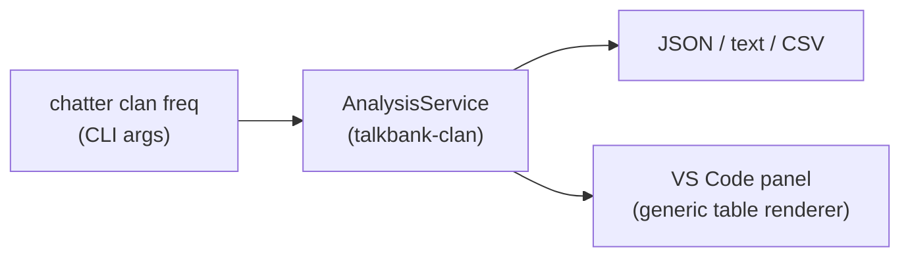
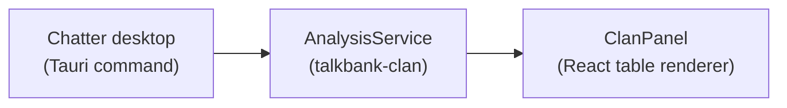

# Proposal: CLAN Analysis in the Chatter Desktop App

**Status:** Draft
**Last updated:** 2026-03-16

## Motivation

The Chatter desktop app currently validates CHAT files. Users who want to run
CLAN analysis commands (freq, mlu, vocd, etc.) must either install VS Code with
the TalkBank extension or use the `chatter clan` CLI. Both require technical
comfort that many researchers lack.

Adding CLAN analysis to the desktop app would make it a single standalone tool
for the most common corpus workflows: check files for errors, then run analysis.
No terminal, no VS Code, no setup.

## Integration Surface

The `talkbank-clan` crate already provides a clean library boundary:

```
AnalysisService::execute_json(request, files) → serde_json::Value
```

All 35 analysis commands implement `CommandOutput` with `Serialize`. The VS Code
extension already renders this JSON generically — arrays of objects become
tables, objects with keys become labeled sections. The desktop app can reuse
the same rendering strategy.

### What exists today



### What this proposal adds



No new Rust library code. The desktop app calls the same `AnalysisService` that
the CLI and LSP already use.

## Proposed Design

### Rust backend

One new Tauri command:

```rust
#[tauri::command]
pub async fn run_analysis(
    command: String,      // "freq", "mlu", "vocd", etc.
    paths: Vec<String>,   // files or directories
    options: Value,       // speaker, gem, word filters as JSON
) -> Result<Value, String>
```

This calls `AnalysisService::execute_json()` directly — same validation engine,
same caching, same filter composition. No subprocess, no IPC.

Add `talkbank-clan` as a path dependency in `desktop/src-tauri/Cargo.toml`
(one line).

### React frontend

Three new components:

| Component | Purpose | Estimated size |
|-----------|---------|----------------|
| `CommandPicker` | Dropdown or button group for selecting a command + entering options (speaker filter, keywords) | ~150 lines |
| `ClanPanel` | Generic JSON-to-table renderer (same approach as VS Code's `analysisPanel.ts`) | ~200 lines |
| `FilterBar` | Speaker, gem, word, range filters — shared with validation file tree | ~100 lines |

### UI flow

The top bar gains an **Analyze** dropdown next to the existing file picker
buttons:

```
┌──────────────────────────────────────────────────────┐
│  [Choose Files]  [Choose Folder]  [Analyze ▾]        │
│                                    ├ freq             │
│                                    ├ mlu              │
│                                    ├ mlt              │
│                                    ├ kwal             │
│                                    ├ vocd             │
│                                    └ More...          │
├──────────────────┬───────────────────────────────────┤
│  File tree       │  Results: freq — corpus/          │
│                  │                                   │
│                  │  Speaker: CHI                     │
│                  │  ┌─────────────┬───────┐          │
│                  │  │ Word        │ Count │          │
│                  │  ├─────────────┼───────┤          │
│                  │  │ the         │    42 │          │
│                  │  │ I           │    38 │          │
│                  │  └─────────────┴───────┘          │
│                  │  Types: 234  Tokens: 1,205        │
│                  │  TTR: 0.194                       │
│                  │                                   │
├──────────────────┴───────────────────────────────────┤
│  [Export CSV]  [Export JSON]                          │
└──────────────────────────────────────────────────────┘
```

The right panel switches between **error details** (when a file is selected in
the tree) and **analysis results** (when a command is run). A tab or toggle
could allow both to be accessible.

### Command tiers

Not all 35 commands need to ship at once. A phased rollout by user frequency:

| Tier | Commands | Why |
|------|----------|-----|
| **Tier 1** (ship first) | freq, mlu, mlt, kwal, vocd | Most-used by researchers; simple config |
| **Tier 2** | combo, timedur, wdlen, freqpos, chip | Common secondary analyses |
| **Tier 3** | eval, kideval, dss, ipsyn, sugar, complexity | Clinical tools; complex configs |
| **Tier 4** | All remaining | Completeness |

### Filter options

The `FilterConfig` from `talkbank-clan` supports:

- `--speaker` / `--exclude-speaker` → dropdown populated from `@Participants`
- `--gem` → dropdown from `@BG`/`@EG` markers in files
- `--include-word` / `--exclude-word` → text input
- `--range` → utterance range slider or text input
- `--format` → export as text, JSON, or CSV

These can be exposed as a collapsible filter bar above the results panel.

## Effort Estimate

| Task | Effort |
|------|--------|
| Tauri command + `talkbank-clan` dep | ~2 hours |
| `CommandPicker` component | ~3 hours |
| `ClanPanel` generic renderer | ~4 hours |
| `FilterBar` component | ~3 hours |
| Wiring, state management, panel switching | ~3 hours |
| Testing with reference corpus | ~2 hours |
| **Total** | **~2 days** |

The heavy lifting — command framework, result serialization, filter composition,
35 command implementations — is already done in `talkbank-clan`.

## Relationship to Other Tools

After this change, the tool landscape would be:

| Tool | Validates | Analyzes | Edits | Media | Audience |
|------|-----------|----------|-------|-------|----------|
| **Chatter desktop** | Yes | Yes | No | No | Researchers who don't code |
| **VS Code extension** | Yes | Yes | Yes | Yes | Editors, annotators, developers |
| **`chatter` CLI** | Yes | Yes | No | No | Power users, CI, scripts |

The desktop app and VS Code extension share the same engine but serve different
workflows. VS Code is for people who edit files and need live diagnostics,
media, and the full editor experience. The desktop app is for people who receive
a corpus and need to validate and analyze it without any setup.

## Open Questions

1. **Per-file vs aggregate results.** The CLI supports `--per-file` mode. Should
   the desktop app show per-file results in the file tree (click a file → see
   its freq table) or only aggregate results? Per-file would integrate naturally
   with the existing tree, but aggregate is what most users expect.

2. **Long-running commands.** vocd and ipsyn can take minutes on large corpora.
   Should analysis commands stream progress like validation does, or show a
   simple spinner? The `AnalysisRunner` currently processes files sequentially
   without progress callbacks — adding streaming would require a small runner
   change.

3. **Command configuration.** Some commands have complex options (dss scoring
   tables, ipsyn level, mortable categories). A generic "options JSON" input
   works for the CLI but may be confusing in a GUI. Tier 1 commands have simple
   configs; defer complex command UIs to later tiers.
