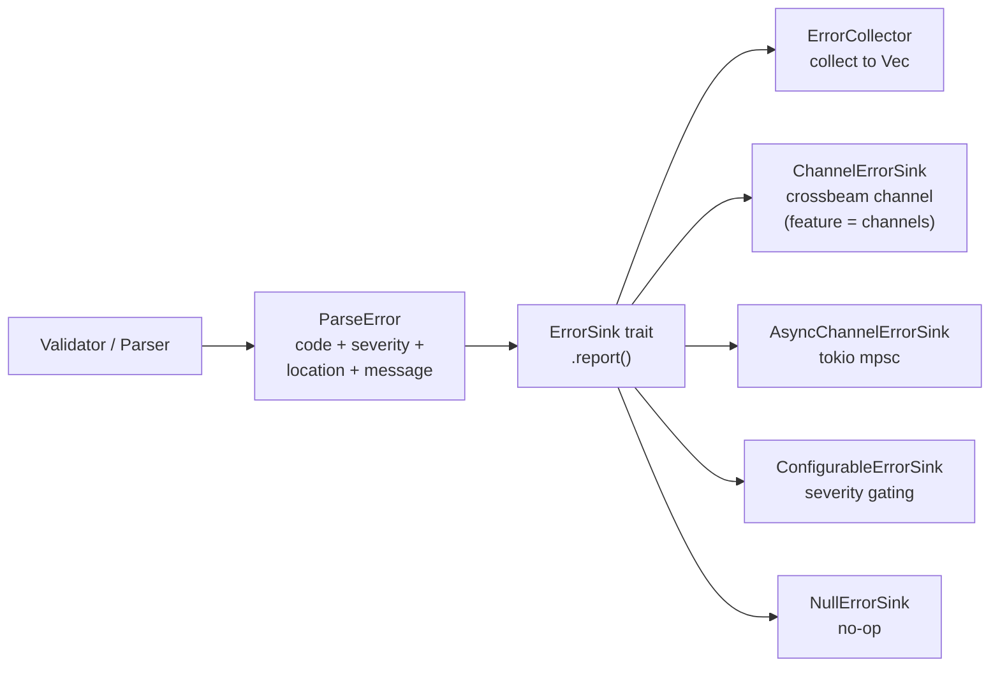

# Error System

The `talkbank-model` crate defines the error infrastructure used across all TalkBank crates (in its `errors` module).

## Core Types

### ParseError

Every diagnostic is a `ParseError` with:

```rust
pub struct ParseError {
    pub code: ErrorCode,
    pub severity: Severity,
    pub location: SourceLocation,
    pub context: ErrorContext,
    pub message: String,
}
```

### ErrorCode

Error codes follow a structured numbering scheme:

| Range | Category |
|-------|----------|
| E1xx | Encoding |
| E2xx | File structure |
| E3xx | Headers |
| E4xx | Main tier |
| E5xx | Words and content |
| E6xx | Speakers |
| E7xx | Dependent tiers |
| W1xx-Wxxx | Warnings (same categories) |

### Severity

Two levels:
- **Error** — must be fixed; indicates invalid CHAT
- **Warning** — should be fixed; indicates questionable but parseable CHAT

### SourceLocation

Provides byte offsets into the source text:

```rust
pub struct SourceLocation {
    pub start: usize,
    pub end: usize,
}
```

### Span

A lightweight span type used throughout the model for tracking source positions:

```rust
pub struct Span {
    pub start: usize,
    pub end: usize,
}
```

## ErrorSink Trait

The central abstraction for error reporting:



```rust
pub trait ErrorSink {
    fn report(&self, error: ParseError);
}
```

All parsing and validation functions accept `&impl ErrorSink` rather than returning errors directly. This allows:

- **Collecting** all errors (for batch processing)
- **Printing** errors in real-time (for interactive use)
- **Filtering** by severity or code
- **Counting** errors without storing them

The trait uses `&self` (not `&mut self`) so it can be shared across threads. Implementations typically use interior mutability (`Mutex<Vec<ParseError>>`).

`ErrorCollector` is the in-memory collector in `errors/collectors.rs`. The stored-diagnostics role is explicit in both code and docs.

Current module layout in `talkbank-model`:

- `errors/error_sink.rs` for the trait and lightweight forwarding sinks
- `errors/collectors.rs` for in-memory collectors and counters
- `errors/async_channel_sink.rs` for Tokio-channel streaming
- `errors/configurable_sink.rs`, `errors/offset_adjusting_sink.rs`, and `errors/tee_sink.rs` for adapters

`ChannelErrorSink` is now an opt-in surface behind the `channels` feature so
the default `talkbank-model` dependency does not pull in crossbeam just to own
the core error trait and in-memory collectors.

## Error Context

`ErrorContext` carries the source fragment around the error location, providing context for diagnostic messages:

```rust
pub struct ErrorContext {
    pub source_fragment: String,
    pub byte_range: Range<usize>,
    pub node_kind: String,
}
```

## Two Error Layers

Errors are detected at two layers:

1. **Parser layer** — structural errors caught during `parse_chat_file()`. These prevent the file from being fully parsed (e.g., missing `@Begin`, invalid syntax).

2. **Validation layer** — semantic errors caught by `validate_with_alignment()` after a successful parse. The file parsed correctly but violates constraints (e.g., `%mor` alignment mismatch, undeclared speakers).

This distinction matters for spec testing: parser-layer specs test that `parse_chat_file` returns `Err`, while validation-layer specs test that validation reports specific error codes.
