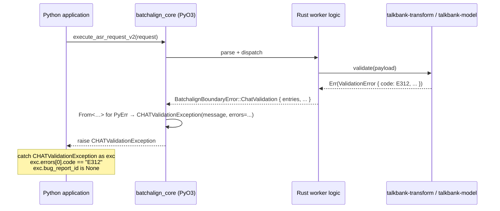

# Errors at the Python ↔ Rust Boundary

**Status:** Current
**Last updated:** 2026-05-01 17:07 EDT

How errors crossing the PyO3 boundary between the Rust worker
runtime (`batchalign_core`) and the Python ML hosting layer
(`batchalign/...`) carry typed structure into the Python exception
hierarchy. For the boundary itself (what crosses, capability
discovery, executor layout) see
[Python–Rust Boundary](../python-rust-boundary/python-rust-boundary.md).
For Batchalign-side error flow (parse modes, runtime
classification, CLI failure summary) see
[Errors — Batchalign Runtime](batchalign-errors.md).

## Typed boundary error

Rust crossings emit `BatchalignBoundaryError`, defined in
`crates/batchalign-pyo3/src/error.rs`. Each variant maps to one
Python exception subclass and carries the structured fields that
subclass needs:

```rust
#[derive(Debug, thiserror::Error)]
pub enum BatchalignBoundaryError {
    /// CHAT validation produced a structured error list.
    /// Maps to `CHATValidationException`.
    #[error("CHAT validation failed: {message}")]
    ChatValidation {
        message: String,
        entries: Vec<ValidationErrorEntry>,
        bug_report_id: Option<BugReportId>,
    },

    /// A non-CHAT document payload failed validation.
    /// Maps to `DocumentValidationException`.
    #[error("Document validation failed: {message}")]
    DocumentValidation { message: String },

    /// A required config file or value was missing on disk.
    /// Maps to `ConfigNotFoundError`.
    #[error("Config not found: {path}")]
    ConfigNotFound { path: PathBuf },

    /// Config syntactically present but semantically invalid.
    /// Maps to `ConfigError`.
    #[error("Config invalid: {message}")]
    ConfigInvalid { message: String },

    /// PyO3 boundary's body limit (or another payload-shape gate)
    /// rejected the request. Maps to `PayloadTooLargeError`.
    #[error("Payload too large: {limit_layer:?} limit {configured_bytes} bytes")]
    PayloadTooLarge {
        limit_layer: BodyLimitLayer,
        configured_bytes: u64,
    },

    /// File should pass through unchanged with a warning logged.
    /// Maps to `SkipFileWarning`; carries the raw CHAT text.
    #[error("Skip with warning: {message}")]
    SkipFileWarning {
        message: String,
        chat_text: Option<String>,
    },

    /// Any Rust-side failure not in the typed buckets above.
    /// Maps to `BatchalignError` (the typed parent).
    #[error("Internal Batchalign error: {message}")]
    Internal { message: String },
}
```

`BodyLimitLayer` is `Inner | Outer`, shared with the HTTP-server
work in `crates/batchalign/src/error.rs` (the
`PayloadTooLarge` variant on `ServerError` lives there too).

## `From` impl: typed exception construction

```rust
impl From<BatchalignBoundaryError> for PyErr {
    fn from(error: BatchalignBoundaryError) -> Self {
        Python::with_gil(|py| {
            let module = match PyModule::import(py, "batchalign_core") {
                Ok(m) => m,
                Err(e) => return PyValueError::new_err(format!(
                    "failed to import batchalign_core for typed exception: {e}"
                )),
            };
            let (class_name, kwargs) = match &error {
                BatchalignBoundaryError::ChatValidation { entries, bug_report_id, .. } => (
                    "CHATValidationException",
                    pydict! { "errors": entries, "bug_report_id": bug_report_id },
                ),
                BatchalignBoundaryError::DocumentValidation { .. } => (
                    "DocumentValidationException",
                    PyDict::new(py),
                ),
                BatchalignBoundaryError::ConfigNotFound { path } => (
                    "ConfigNotFoundError",
                    pydict! { "path": path.to_string_lossy().into_owned() },
                ),
                BatchalignBoundaryError::ConfigInvalid { .. } => (
                    "ConfigError",
                    PyDict::new(py),
                ),
                BatchalignBoundaryError::PayloadTooLarge { limit_layer, configured_bytes } => (
                    "PayloadTooLargeError",
                    pydict! {
                        "limit_layer": format!("{limit_layer:?}"),
                        "configured_bytes": *configured_bytes,
                    },
                ),
                BatchalignBoundaryError::SkipFileWarning { chat_text, .. } => (
                    "SkipFileWarning",
                    pydict! { "chat_text": chat_text },
                ),
                BatchalignBoundaryError::Internal { .. } => (
                    "BatchalignError",
                    PyDict::new(py),
                ),
            };
            // Look up class_name on `module`, instantiate with
            // (message, **kwargs), return as PyErr.
        })
    }
}
```

`pydict!` is a small helper macro in `batchalign-pyo3/src/error.rs`
that expands to repeated `set_item` calls followed by
`kwargs.into_any()`.

## Python exception hierarchy

The PyO3 module declares the exceptions:

```rust
use pyo3::create_exception;

create_exception!(batchalign_core, BatchalignError, PyException);
create_exception!(batchalign_core, CHATValidationException, BatchalignError);
create_exception!(batchalign_core, DocumentValidationException, BatchalignError);
create_exception!(batchalign_core, ConfigNotFoundError, BatchalignError);
create_exception!(batchalign_core, ConfigError, BatchalignError);
create_exception!(batchalign_core, PayloadTooLargeError, BatchalignError);
create_exception!(batchalign_core, SkipFileWarning, PyException);
```

`batchalign/errors.py` re-exports them so callers continue to
import from a single Python module:

```python
from batchalign_core import (
    BatchalignError,
    CHATValidationException,
    DocumentValidationException,
    ConfigNotFoundError,
    ConfigError,
    PayloadTooLargeError,
    SkipFileWarning,
)
```

`BatchalignError` is the typed parent — Python catch sites get one
ancestor for every typed exception that originates in
`batchalign_core`:

```python
try:
    handle = batchalign_core.execute_v2(request)
except BatchalignError as exc:
    # Catches every typed exception above
    ...
```

`SkipFileWarning` does **not** route through `Warning` — Python
code raises and catches it as an exception, not a warning, to
preserve existing call-site semantics.

## Round-trip example



Every error category that crosses the boundary already exists as a
typed variant somewhere in the Rust call stack — the boundary is
the only place where structure could get discarded, and it doesn't.

## Where the contract is enforced

PyO3 entry points across `crates/batchalign-pyo3/src/worker_*.rs`
construct `BatchalignBoundaryError` rather than
`PyValueError::new_err(...)`. The conversion sites:

| File | Sites |
|---|---|
| `worker_asr_exec.rs` | parse_execute_request, final serde_json mapping |
| `worker_media_exec.rs` | 4 sites |
| `worker_text_results.rs` | 16 sites |
| `worker_fa_exec.rs` | 2 sites |
| `worker_artifacts.rs` | 20 sites |
| `cantonese_asr_bridge.rs` | 4 sites |
| `py_json_bridge.rs` | 1 site |
| `worker_protocol.rs` | (no PyValueError sites; not converted) |

`rg PyValueError crates/batchalign-pyo3/src/` returns zero matches
in the worker-* files — the typed pathway is the only path.

## `bug_report_id` is Python-populated for now

The Rust side has the `MisalignmentBug` shape but not the
bug-report-filing pipeline; filing happens server-side after the
exception crosses the boundary. The `bug_report_id` field on
`CHATValidationException` is therefore set by Python code that
catches the exception and files the report. Moving filing into Rust
and having the boundary populate `bug_report_id` directly is a
future change.

## Internals-leakage scan

An operator-local internals-leakage scan runs against error-construction
sites to confirm that no internal pattern values appear in error
messages crossing the boundary. The pattern values themselves are
not listed here — keeping a leak-detector's needle list out of the
public repo is itself a leak-prevention rule. Operators run the scan
from their own private patterns file.

## Tests

`batchalign/tests/test_pyo3_error_typing.py` asserts:

- Malformed requests raise `BatchalignError` (or a subclass), not
  `PyValueError`.
- `exc.errors[0].code` is populated when the failure is a validation
  error.
- The exception is catchable by its typed parent class.

## Out of scope

- **Backwards-compatible string-prefix parsers** in
  `batchalign/errors.py`. The legacy `classify_error` helper that
  matches on substrings of `str(exc)` is a fallback for non-PyO3
  code paths only; it is not the contract for typed exceptions.
- **Re-using `talkbank-transform`'s `MorphosyntaxStrategy` /
  `DecisionRecord` types directly across the boundary.** These
  have richer structure than the Python side wants today; they're
  flattened to `ValidationErrorEntry` at the boundary.
- **Rust-side panics.** The no-panic standard from `CLAUDE.md`
  applies; this contract assumes panics never cross the boundary.

## Related

- `crates/batchalign/src/error.rs` — server-side `ServerError`
  typed-status mapping; the `PayloadTooLarge` variant lives here.
- [Errors — Batchalign Runtime](batchalign-errors.md) — end-to-end
  error flow.
- [INTERFACE_MAP.md](https://github.com/TalkBank/talkbank-tools/blob/main/INTERFACE_MAP.md)
  — Rust ↔ Python boundary inventory.
- `crates/batchalign/CLAUDE.md` — server-side error-handling rules.
