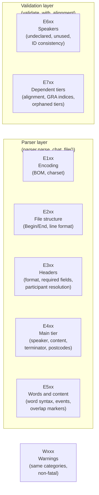
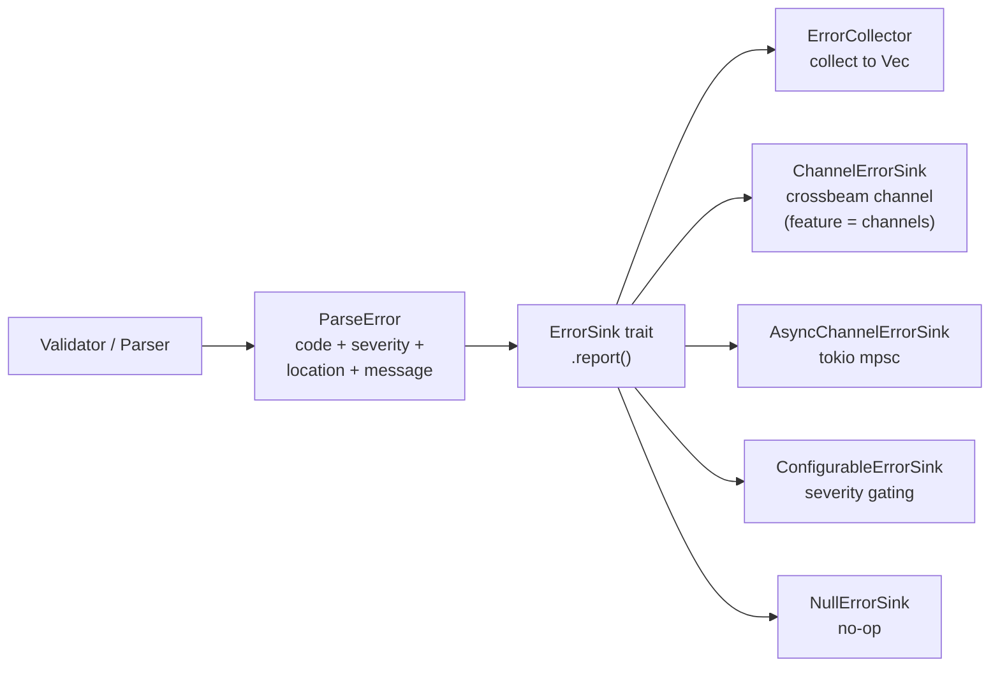

# Errors — talkbank-tools (CHAT core)

**Status:** Current
**Last updated:** 2026-05-01 17:07 EDT

The error infrastructure used across all CHAT-core crates
(`talkbank-model`, `talkbank-parser`, `talkbank-transform`,
`talkbank-clan`, `talkbank-cli`). Defined in the
`errors` module of `talkbank-model`.

For the Batchalign-runtime side (ML / IPC / network / ASR / worker
crashes), see [batchalign-errors](batchalign-errors.md). For the
Python ↔ Rust boundary, see [python-rust-errors](python-rust-errors.md).
For the diagnostic UX standard that applies workspace-wide, see
[error-diagnostics-ux](error-diagnostics-ux.md).

## Core Types

### `ParseError`

Every diagnostic is a `ParseError`:

```rust,ignore
pub struct ParseError {
    pub code: ErrorCode,
    pub severity: Severity,
    pub location: SourceLocation,
    pub context: ErrorContext,
    pub message: String,
}
```

### `ErrorCode`

Error codes follow a structured numbering scheme:

| Range | Category |
|---|---|
| E1xx | Encoding |
| E2xx | File structure |
| E3xx | Headers |
| E4xx | Main tier |
| E5xx | Words and content |
| E6xx | Speakers |
| E7xx | Dependent tiers |
| W1xx–Wxxx | Warnings (same categories) |



The full error code reference is generated in `docs/errors/` at the
repository root.

### `Severity`

- **`Error`** — must be fixed; indicates invalid CHAT.
- **`Warning`** — should be fixed; indicates questionable but
  parseable CHAT.

### `SourceLocation` and `Span`

Byte offsets into the source text:

```rust
pub struct SourceLocation { pub start: usize, pub end: usize }
pub struct Span { pub start: usize, pub end: usize }
```

### `ErrorContext`

Carries the source fragment around the error location:

```rust,ignore
pub struct ErrorContext {
    pub source_fragment: String,
    pub byte_range: Range<usize>,
    pub node_kind: String,
}
```

## `ErrorSink` Trait

The central abstraction for error reporting:



```rust,ignore
pub trait ErrorSink {
    fn report(&self, error: ParseError);
}
```

All parsing and validation functions accept `&impl ErrorSink` rather
than returning errors directly. This allows:

- **Collecting** all errors (for batch processing).
- **Printing** errors in real-time (for interactive use).
- **Filtering** by severity or code.
- **Counting** errors without storing them.

The trait uses `&self` (not `&mut self`) so it can be shared across
threads. Implementations typically use interior mutability
(`Mutex<Vec<ParseError>>`).

`ErrorCollector` is the in-memory collector in
`errors/collectors.rs`. The stored-diagnostics role is explicit in
both code and docs.

Module layout in `talkbank-model`:

- `errors/error_sink.rs` — trait and lightweight forwarding sinks.
- `errors/collectors.rs` — in-memory collectors and counters.
- `errors/async_channel_sink.rs` — Tokio-channel streaming.
- `errors/configurable_sink.rs`, `errors/offset_adjusting_sink.rs`,
  `errors/tee_sink.rs` — adapters.

`ChannelErrorSink` is opt-in behind the `channels` feature so the
default `talkbank-model` dependency does not pull in `crossbeam` just
to own the core error trait and in-memory collectors.

## Two Error Layers

Errors are detected at two layers. This distinction matters for spec
testing.

1. **Parser layer** — structural errors caught during
   `parser.parse_chat_file()`. These prevent the file from being
   fully parsed (missing `@Begin`, invalid syntax). Parser-layer
   specs test that `parser.parse_chat_file()` returns `Err`.

2. **Validation layer** — semantic errors caught by
   `validate_with_alignment()` after a successful parse. The file
   parsed correctly but violates constraints (`%mor` alignment
   mismatch, undeclared speakers). Validation-layer specs test that
   validation reports specific error codes.

## Adding a New Error Code

1. Add the variant to `ErrorCode` in
   `crates/talkbank-model/src/errors/codes/error_code.rs` with a
   `#[code("Exxx")]` attribute.
2. Create a spec file in `spec/errors/Exxx-description.md` following
   the existing template.
3. Construct `ParseError::new(ErrorCode::YourVariant, ...)` at the
   detection site in the parser or validator.
4. Run `make test-gen` to regenerate test fixtures from specs.
5. Run `make verify` to confirm the gate passes.
