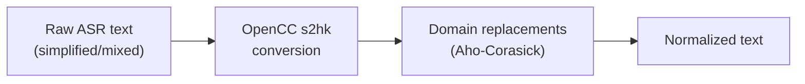
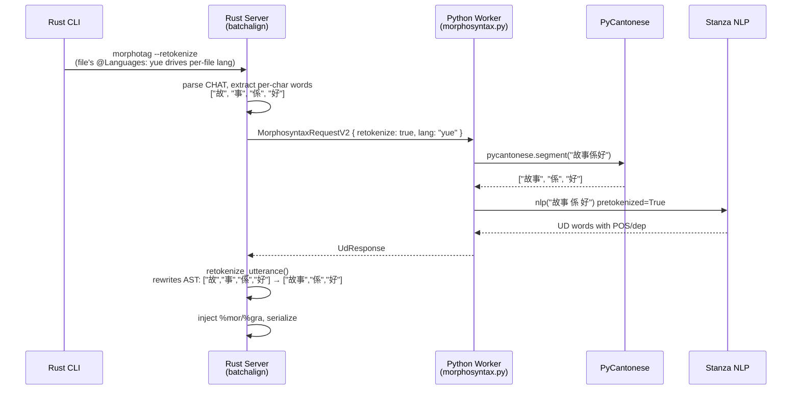
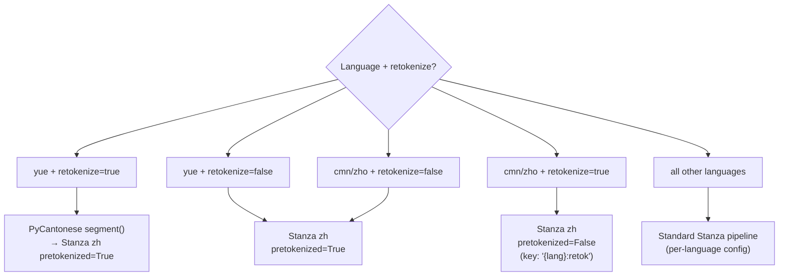

# Cantonese and CJK — Architecture

**Status:** Current
**Last updated:** 2026-05-19 17:38 EDT

Architecture and rationale for batchalign's CJK-language pipelines: ASR
engine dispatch, Rust-side text normalization, and word segmentation
(`--retokenize`). User-facing reference (engine table, credentials, usage
examples) lives in
[`batchalign/reference/languages/cantonese.md`](../../batchalign/reference/languages/cantonese.md).

This page also covers the CJK utterance-segmentation split:

- `yue` uses the PolyU Cantonese utterance model
- `cmn` / `zho` use `talkbank/CHATUtterance-zh_CN`
- all three are separate from the word-segmentation / `--retokenize` path

## Engine Dispatch — Enum, Not Plugins

Cantonese ASR/FA engines are registered directly in worker model loading
and dispatch code. No plugin discovery, no entry points, no dynamic
registration. Engine selection uses `AsrEngine` and `FaEngine` enums in
`worker/_types.py`.

```mermaid
flowchart LR
    cli["CLI\n--engine-overrides\n'{\"asr\": \"tencent\"}'"]
    server["Rust Server"]
    worker["Python Worker"]

    subgraph "Worker Model Loading"
        load["load_worker_task()"]
        select{"AsrEngine?"}
        whisper["load whisper"]
        tencent["load_tencent_asr()"]
        funaudio["load_funaudio_asr()"]
        aliyun["load_aliyun_asr()"]
    end

    cli --> server --> worker --> load --> select
    select -->|whisper| whisper
    select -->|tencent| tencent
    select -->|funaudio| funaudio
    select -->|aliyun| aliyun
```

Engines are `(load, infer)` function pairs in
`batchalign/inference/languages/cantonese/`. Each engine fails at startup
with a clear error if its model/credentials are unavailable — never at
runtime during inference. Compile-time exhaustiveness checking on the
enum guarantees no engine can be silently missed.

### Provider boundary split

Python owns SDK/model loading and the transport call. Rust owns the shared
projection from raw provider output into monologues and timed-word payloads
(`crates/batchalign-pyo3/src/cantonese_asr_bridge.rs`):

- **Tencent** — `ResultDetail` with pre-segmented `Words` array → absolute
  timestamps computed from segment start + word offset.
- **FunASR** — Raw text + per-character timestamps → `cantonese_char_tokens()`
  splits and normalizes; timestamps interpolated.
- **Aliyun** — Sentence-level results with optional per-word timing →
  fallback character tokenization when per-word timing unavailable.

Tencent words with zero or negative duration (`end_ms <= start_ms`) are
filtered in `timed_words()`. FunASR timestamps are sort-normalized into
start-time order before downstream processing.

## Text Normalization — Rust-Only

Cantonese ASR engines (FunASR, Tencent, Aliyun) return text in simplified
Chinese or with Mainland character variants. CHAT corpora require
Traditional Chinese with domain-specific corrections. Normalization runs
automatically for `lang=yue`; no configuration, no opt-out.



Implementation: `crates/talkbank-transform/src/asr_postprocess/cantonese.rs`.

- **`ferrous-opencc`** (pure-Rust crate) embeds OpenCC's `S2hk` conversion
  tables in the build. No C++ dependency, no optional import, no fallback
  path. Compiled into `batchalign_core.so`.
- **31-entry domain replacement table** — Aho-Corasick with
  `LeftmostLongest` matching ensures multi-character patterns
  (e.g., `聯係`→`聯繫`) take priority over single-character ones
  (`系`→`係`). Multi-character entries (13) match before single-character
  entries (18).

Two PyO3 functions are exposed:

```python
import batchalign_core
batchalign_core.normalize_cantonese("你真系好吵呀")  # → "你真係好嘈啊"
batchalign_core.cantonese_char_tokens("真系呀，")  # → ["真", "係", "啊"]
```

Python `_common.py` delegates to these — zero normalization logic remains
in Python.

### Pipeline integration

`process_raw_asr()` runs normalization as stage 4b, after number expansion
and before long-turn splitting:

```text
1.  Compound merging
2.  Timed word extraction (seconds → ms)
3.  Multi-word splitting (timestamp interpolation)
4.  Number expansion (digits → traditional Chinese characters)
4b. Cantonese normalization (simplified → traditional + domain table)
5.  Long-turn splitting (>300 words)
6.  Retokenization (punctuation-based utterance splitting)
```

### UTF-8-safe retokenization

`crates/talkbank-transform/src/asr_postprocess/mod.rs` uses
`char_indices()` for proper UTF-8 handling — byte slicing would panic
on multi-byte CJK characters:

```rust,ignore
let last_char_boundary = text.text.char_indices()
    .next_back()
    .map(|(i, _)| i)
    .unwrap_or(0);
```

## Word Segmentation — `--retokenize`

CJK ASR engines output character-level tokens because Chinese characters
are the atomic unit of speech recognition. Stanza POS/dependency models
expect word-level input — tagging individual characters produces
meaningless results. The `--retokenize` flag on `morphotag` enables word
segmentation before Stanza inference.

### Segmenter selection

| Language | Retokenize segmenter | Why |
|---|---|---|
| `yue` (Cantonese) | PyCantonese `segment()` | Cantonese-specific dictionary; Stanza `zh` is Mandarin-trained and misses Cantonese compounds (`佢哋`, `鍾意`) |
| `cmn`/`zho` (Mandarin) | Stanza `zh` jointly-trained tokenizer | Best available for Mandarin; no comparable open-source dictionary segmenter exists |

Verified empirically in `test_cjk_word_segmentation_claims.py`:
PyCantonese correctly groups `佢哋` (they) and `鍾意` (like). Stanza
correctly groups `商店` (store) for Mandarin. These are real model
inferences, not assumptions.

### Why opt-in, not always-on

`morphotag` never silently changes tokenization. Surprise AST rewrites
would invalidate existing `%wor` bullets or forced-alignment timing. A
diagnostic warning is emitted when Cantonese input appears per-character
without `--retokenize`, guiding users to the flag.

### Lazy pipeline loading

Mandarin retokenize uses Stanza's `tokenize_pretokenized=False`, which
loads a neural tokenizer model (~200 MB). Loading at startup wastes RAM
when retokenize isn't requested. The retokenize pipeline is loaded on
first request and stored under key `"{lang}:retok"` in worker state.

### Wire protocol

`MorphosyntaxRequestV2.retokenize` is an opt-in field with
`#[serde(default)]` in Rust and `retokenize: bool = False` in Python.
Workers that don't yet understand the field default to `False`; old Rust
senders that don't include it get the default behavior.

### Cache key differentiation

The cache key includes `|retok` when retokenize is active. Without this,
a non-retokenize cache entry (per-character `%mor`) would be incorrectly
returned for a retokenize request (word-level `%mor`), or vice versa.

### Data flow — Cantonese with `--retokenize`



### Stanza pipeline selection



## POS-Depparse Inconsistency

The PyCantonese POS override changes `upos` in the UD word dict **after**
Stanza has already computed dependency relations using its own (wrong)
POS. So `%mor` tiers carry PyCantonese POS but `%gra` tiers were computed
with Stanza's Mandarin POS. The dependency tree structure was not
recomputed with the corrected POS.

In practice this is still an improvement: `%mor` POS was wrong before
(50%) and is now better; `%gra` was always computed with wrong POS and
has not gotten worse. The proper fix is a Cantonese-specific Stanza model
that handles POS and depparse jointly.

## Known limitations

- **Word segmentation depends on PyCantonese dictionary.** Words not in
  the dictionary (novel compounds, baby talk, code-mixed
  Cantonese-English) won't be grouped. Common words (`佢哋`, `鍾意`,
  `故事`) are handled correctly.
- **All Cantonese ASR engines produce per-character output.** Verified
  empirically including Tencent (which earlier reports claimed did
  word-level segmentation). `--retokenize` is needed for all Cantonese
  morphotag.
- **POS tagging accuracy is ~50% on Cantonese vocabulary** without the
  PyCantonese override. Stanza's `zh` model is Mandarin-trained and
  misclassifies `佢/佢哋` (he/they → PROPN instead of PRON), `嘢` (thing
  → PUNCT instead of NOUN), `唔` (not → VERB instead of ADV), `係`
  (is/be → VERB instead of AUX). PyCantonese POS override fixes core
  vocabulary but has gaps on compound nouns, some SFPs, and resultative
  verbs.
- **Trained Cantonese Stanza model exists but is not deployed.** Trained
  on UD_Cantonese-HK + tested on held-out UD set: POS 93.5% (vs. 63%
  Mandarin baseline), LAS 65.2% (vs. 24%). On spoken Cantonese test
  sentences PyCantonese POS still wins (96% vs. 86%) on core vocabulary
  due to domain mismatch — the trained model would be most useful as a
  fallback for words PyCantonese doesn't know. Requires packaging the
  model file and updating `_stanza_loading.py`.
- **FunASR CER varies with speech clarity.** FunASR/SenseVoice produces
  the lowest CER for clear adult Cantonese speech, but CER increases with
  overlapping speech, soft/unclear speech, and child speech.

## File Map

### Rust

```text
crates/talkbank-transform/src/asr_postprocess/
├── mod.rs          — Pipeline: process_raw_asr() with Cantonese stage 4b
├── cantonese.rs    — normalize_cantonese(), cantonese_char_tokens()
├── compounds.rs    — Compound word merging
├── num2text.rs     — Number expansion
└── num2chinese.rs  — Chinese/Japanese number converter

crates/talkbank-transform/src/retokenize/         — Language-agnostic AST rewrite
crates/batchalign/src/chat_ops/cache_key.rs       — cache_key() with retokenize differentiation
crates/batchalign/src/morphosyntax/mod.rs         — Per-character warning diagnostic
crates/batchalign-pyo3/src/cantonese_asr_bridge.rs — Provider output projection
crates/batchalign-types/src/worker_v2/requests.rs — MorphosyntaxRequestV2.retokenize wire field
```

### Python

```text
batchalign/inference/languages/cantonese/
├── __init__.py         — Engine registration
├── _common.py          — normalize_cantonese_text() (delegates to Rust),
│                         read_asr_config(), provider_lang_code()
├── _tencent_asr.py     — Tencent Cloud ASR load/infer
├── _tencent_api.py     — TencentRecognizer class
├── _aliyun_asr.py      — Aliyun NLS WebSocket ASR
├── _funaudio_asr.py    — FunASR/SenseVoice load/infer
├── _funaudio_common.py — FunAudioRecognizer class
├── _cantonese_fa.py    — Cantonese forced alignment (jyutping + Wave2Vec)
└── _asr_types.py       — Internal TypedDicts

batchalign/inference/morphosyntax.py — _segment_cantonese(), Mandarin retokenize selection
batchalign/worker/_stanza_loading.py — load_stanza_retokenize_model() (lazy Chinese)
```

### Tests — no `unittest.mock`

The test suite uses test doubles (alternate protocol implementations)
rather than mocks: `PyCantoneseFake` (deterministic jyutping lookup,
7-character dictionary), `_FakeAudioFile` / `_FakeAudioChunk`,
`_fake_infer_wave2vec_fa` (deterministic FA: word i gets timing
`(i*100, (i+1)*100)`), `cantonese_fa_env` fixture patching module-level
state. `monkeypatch.setattr()` replaces `unittest.mock.patch()`
everywhere.

| Test file | Coverage |
|---|---|
| `tests/languages/cantonese/test_common.py` | Normalization, config, timestamps, language codes |
| `tests/languages/cantonese/test_funaudio.py` | Text cleaning, tokenization, timed word sorting |
| `tests/languages/cantonese/test_tencent_api.py` | Model selection, monologues, timed words, normalization |
| `tests/languages/cantonese/test_cantonese_fa.py` | Jyutping conversion, romanization, batch FA inference |
| `tests/languages/cantonese/test_aliyun.py` | Sentence parsing, word extraction, error handling |
| `tests/languages/cantonese/test_helpers.py` | Cross-engine smoke tests |
| `tests/languages/cantonese/test_integration.py` | End-to-end with real models (auto-skips) |
| `tests/pipelines/morphosyntax/test_cjk_word_segmentation_claims.py` | Word segmentation claims (real PyCantonese + batchalign_core) |
