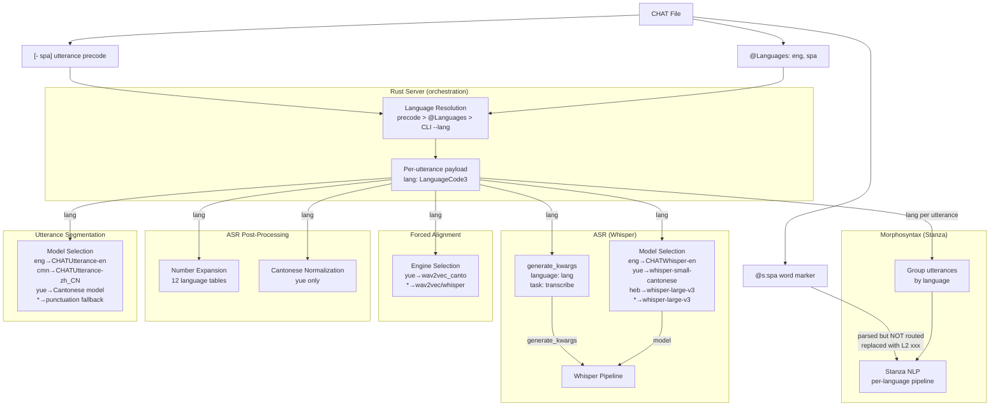
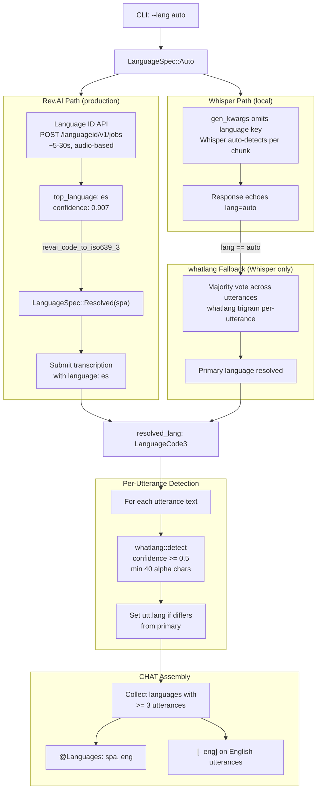

# Language Routing

**Status:** Current
**Last updated:** 2026-05-21 14:55 EDT

How language information flows from CHAT headers through the entire
batchalign3 pipeline. Covers resolution (precode → header → CLI),
auto-detection (`--lang auto`), per-utterance routing, per-word
routing limits, and improvement over batchalign2.

For the Stanza capability surface that drives per-language model
selection, see
[Stanza Capability Registry](../../batchalign/architecture/stanza-capability-registry.md).
For per-language defects in the deployed Stanza pipeline, see
[Stanza Defect Mitigation Map](../../batchalign/architecture/stanza-defect-mitigation-map.md).
For the user-facing language reference, see
[Language Handling](../../batchalign/reference/language-handling.md).

## Three Levels of Language in CHAT

| Level | Syntax | Example | Scope |
|---|---|---|---|
| File | `@Languages: eng, spa` | Primary + secondary languages | All utterances |
| Utterance | `[- spa]` precode | Override language for one utterance | One utterance |
| Word | `@s:spa` marker | Mark a single word's language | One word |

## End-to-End Flow



Language flows to **all** engines: ASR (`generate_kwargs`), Stanza
(per-utterance grouping), FA (engine selection), post-processing
(conditional gates per `lang`), utseg (model selection).

## Resolution Order

Language is determined per utterance in this priority:

1. **`[- lang]` precode** on the utterance (e.g., `[- fra]`),
   highest priority.
2. **`@Languages` header**: first declared language used as fallback.
3. **`--lang` CLI flag**: used when no file-level language is
   declared.

Implementation: `declared_languages()` in
`crates/talkbank-transform/src/morphosyntax/payload.rs`. The job-level
`lang` parameter
serves only as a fallback when a file has no `@Languages` header.

In a bilingual English/French file:

```text
@Languages: eng, fra
*INV: how are you today ? 0_3000
*PAR: [- fra] je suis bien merci . 3000_6000
```

The investigator's utterance is processed with the English Stanza
pipeline. The participant's utterance (marked `[- fra]`) is processed
with the French Stanza pipeline.

## Per-Utterance Routing into Stanza

Stanza pipelines are loaded **on demand**. The worker starts with the
primary language model, then loads additional language models as it
encounters utterances in new languages.

- No upfront cost for monolingual files (only one model loaded).
- First utterance in a new language may take a few seconds (model
  download + load).
- Subsequent utterances in the same language reuse the loaded
  pipeline.

This is a real improvement over batchalign2, which parsed `[- lang]`
precodes but did **not** use them for routing. All utterances were
processed with the primary language's Stanza pipeline regardless of
their language directive. Non-primary utterances either got
wrong-language morphosyntax or were silently dropped.

## Per-Word Routing: Currently Limited

Batchalign parses per-word language markers (`@s:lang`), but current
runtime behavior does **not** do full per-word language routing into
separate NLP pipelines.

Practical current behavior:

- Per-word language-marked forms are recognized structurally.
- The current morphosyntax path does not send full per-word language
  codes through as a routing key for Python NLP inference.
- Code-switched words are handled conservatively rather than analyzed
  as if high-confidence per-word language routing were already
  implemented.

For current `%mor` handling, language-marked code-switched words are
treated as special forms (`L2|xxx`) rather than fully language-routed
lexical items. This is the safe current boundary: preserve that a
word is foreign, do not overclaim morphology from the wrong language
model.

If a transcript contains multiple code-switched words from different
languages inside one utterance, the current runtime does not route
each word to a different language-specific model and then merge the
result back at word granularity. State the boundary clearly rather
than imply richer routing than the release provides.

## Auto-Detection: `--lang auto`

When the user passes `--lang auto`, the pipeline auto-detects the
spoken language(s) from audio content, generates correct CHAT
language headers, and inserts `[- lang]` code-switching precodes on
utterances in secondary languages.



### Two-stage resolution

**Stage 1, primary language (whole-file).** Determines the dominant
language for `@Languages` header and `@ID` lines.

| ASR engine | Primary determination |
|---|---|
| Rev.AI (auto) | **Rev.AI Language Identification API**: audio-based pre-pass (~5-30s). Returns `top_language` with confidence. Far more accurate than text trigrams for code-switched audio. |
| Whisper (auto) | whatlang majority vote across utterances (fallback to `eng` if undetectable). |
| Any (explicit) | User-specified `--lang spa` used directly. |

The Rev.AI Language ID pre-pass also enables the transcription job to
be submitted with a concrete language code instead of `"auto"`, which
improves ASR quality (Rev.AI can optimize for the known language) and
enables language-specific settings like `speakers_count` and
`skip_postprocessing`.

**Stage 2, per-utterance language (code-switching).** Only runs
when `--lang auto`. For each post-processed utterance:

1. Concatenate all word texts into a single string.
2. Run `whatlang::detect()`: returns `(Lang, confidence)` or `None`.
3. If confidence ≥ 0.5 and text has ≥ 40 alpha characters, set
   `utt.lang = Some(iso639_3_code)`.
4. If `utt.lang` differs from the primary language, a `[- lang]`
   precode is emitted.

### Detection algorithms

**Rev.AI Language Identification API.** Audio-based phonetic
classifier. `POST /languageid/v1/jobs` → poll → result. Handles
code-switching correctly because it hears the dominant phonetic
patterns. ~5-30 s, ~$0.01-0.05 per file (negligible vs. transcription
cost). Coverage: all Rev.AI-supported languages (~60+).

Fallback chain: if Language ID fails (network error, unsupported
format), submit transcription with `language: "auto"` and use
whatlang on the transcript text.

**whatlang trigram detection.** Used for per-utterance code-switching
tagging (all backends) and as primary fallback when Rev.AI Language
ID is unavailable. O(n) in text length, no ML model, no network call
, typically < 1 ms per utterance, < 50 ms for 200 utterances.
Reliable for monolingual utterances > 40 characters; unreliable for
code-switched utterances. Coverage: 69 languages with ISO 639-3
mappings.

| Threshold | Value | Rationale |
|---|---|---|
| `MIN_CHARS_FOR_DETECTION` | 40 | Below this, trigrams are too sparse. Raised from 20 to reduce false positives on short bilingual utterances. |
| `UTTERANCE_CONFIDENCE_THRESHOLD` | 0.5 | Moderate bar to avoid false code-switch markers. |
| `MIN_UTTERANCES_FOR_SECONDARY` | 3 | A language must appear in ≥ 3 utterances to be listed in `@Languages`. Prevents false positives from trigram confusion. |

**Known limitation.** whatlang struggles with code-switched
utterances (e.g., "Me dice que trabaja en furniture I mean..."). Such
utterances may be classified as either language depending on which
trigrams dominate. Inherent to character n-gram classifiers, Rev.AI
Language ID (audio-based) is preferred for primary detection.

### CHAT output

For a Spanish-primary bilingual file:

```text
@Languages:	spa, eng
@Participants:	PAR Participant Participant, INV Investigator Investigator
@ID:	spa|corpus_name|PAR|||||Participant|||
@ID:	spa|corpus_name|INV|||||Participant|||
@Media:	herring03, audio
*PAR:	sí porque ella no quería . 12500_14200
*INV:	[- eng] six to eight weeks yeah . 41672_42727
*PAR:	bueno ya le dije que no . 43000_45100
```

In `build_chat.rs`, the `UtteranceDesc.lang` field is checked against
`langs[0]` (primary). If different, `TierContent.language_code` is
set to `LanguageCode::new(utt_lang)`, which the talkbank-model
serializer renders as `[- lang]` before the first word.

The `@Languages` header lists all detected languages ordered by
frequency: primary first, secondaries in descending order, no
minimum threshold for header inclusion. The
`collect_detected_languages()` function tallies per-utterance
detections and produces the ordered list.

## Known Limitations

- **Per-word routing not implemented.** `@s:lang` markers are parsed
  but not routed. Code-switched words become `L2|xxx` special forms
  rather than language-routed lexical items.
- **whatlang on code-switched text is unreliable.** Use Rev.AI
  Language ID for primary detection when the audio is bilingual.
- **First utterance in a new language pays model-load cost.** Subsequent
  utterances in the same language reuse the pipeline.
- **Malayalam (`mal`) digit expansion (E220) is unimplemented.** The
  num2words library has no `ml` backend, so digit expansion in
  Malayalam ASR / morphotag emits E220 rather than expanding numerics
  to their orthographic form. Whisper Hub is used as the deliberate
  ASR engine for `mal` (Rev.AI broken). The fix path is upstream
  num2words coverage, not in this codebase.

## See Also

- [Stanza Capability Registry](../../batchalign/architecture/stanza-capability-registry.md)
 , which Stanza models are loaded for which languages.
- [Stanza Defect Mitigation Map](../../batchalign/architecture/stanza-defect-mitigation-map.md)
 , per-language defects in deployed Stanza models.
- [Cantonese and CJK, Architecture](cantonese-and-cjk.md),
  Cantonese-specific routing detail (POS override, `--retokenize`).
- [Language Handling](../../batchalign/reference/language-handling.md)
 , user-facing language reference.
- [Language Code Resolution](../../batchalign/reference/language-code-resolution.md)
 , user-facing detail on resolution priority and edge cases.
