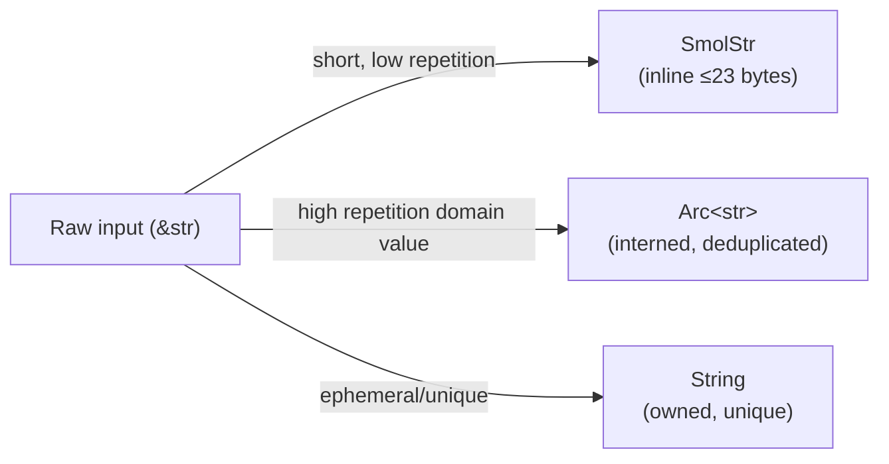

# Memory and Ownership

This chapter documents the memory management and ownership patterns used across the
TalkBank Rust crates. Understanding these decisions helps contributors make
consistent choices when adding new code.

## String Representation Strategy

CHAT corpora contain massive repetition — the same speaker codes, language codes,
POS tags, and high-frequency words appear millions of times across files. The
codebase uses three string types, chosen by expected cardinality and duplication:



| Type | When to use | Examples |
|------|-------------|---------|
| `SmolStr` | Short tokens, low duplication | Postcode text, tier content, event labels |
| <code>Arc&lt;str&gt;</code> (interned) | High-cardinality domain symbols | Speaker codes, language codes, POS tags, stems |
| `String` | Ephemeral or unique values | Error messages, temporary formatting |

### String Interning

**Location:** `talkbank-model/src/model/intern.rs`

Five global process-local interners, each a <code>DashMap&lt;Arc&lt;str&gt;, Arc&lt;str&gt;&gt;</code> behind
`OnceLock<StringInterner>`:

| Interner | Pre-seeded values | Typical savings |
|----------|-------------------|-----------------|
| `speaker_interner()` | 30+ codes (CHI, MOT, FAT, ...) | High — 3-letter codes repeat per utterance |
| `language_interner()` | 45+ ISO 639-3 codes | Moderate — per-file |
| `pos_interner()` | 60+ POS tags + UD relations | Very high — every %mor word |
| `stem_interner()` | 200+ frequent English stems | High — function words dominate |
| `participant_interner()` | 14 roles (Target_Child, ...) | Low — per-file |

**How it works:**
- Fast path: `get()` on DashMap, O(1) `Arc::clone` if found
- Slow path: `insert()` new Arc if miss, deduplicates on future access
- Thread-safe: DashMap uses shard-level locks, no global contention
- After initialization, reads are lock-free

**Memory impact:** 50–200 MB savings on large corpora (5–20% reduction). `Arc::clone`
is O(1) atomic increment vs `String::clone` O(n) copy.

### Newtype Macros

Two macros generate domain-typed string wrappers:

- **`string_newtype!`** — wraps `SmolStr`. Used for generic CHAT text.
- **`interned_newtype!`** — wraps <code>Arc&lt;str&gt;</code> with automatic interning. Used for
  domain symbols.

```rust
// SmolStr-backed: no interning, inline small strings
string_newtype!(PostcodeText);

// Arc<str>-backed: interned via global interner
interned_newtype!(SpeakerCode, speaker_interner);
```

## Ownership Model

### ChatFile Lifecycle

```mermaid
flowchart TD
    src["Source text (&amp;str)"]
    cst["tree-sitter CST\n(Tree, borrowed nodes)"]
    model["ChatFile\n(owned AST)"]
    cache["SQLite cache\n(validation result)"]
    lsp["LSP server\n(per-document state)"]
    json["JSON output\n(serde serialization)"]
    cli["CLI output\n(CHAT text)"]

    src -->|tree-sitter parse| cst
    cst -->|CST-to-model conversion| model
    model -->|validate + hash| cache
    model -->|held in backend| lsp
    model -->|to_json()| json
    model -->|to_chat_string()| cli
```

- **Parsing:** tree-sitter `Tree` owns the CST. `Node<'a>` values borrow from
  `Tree` — zero-copy traversal. The CST-to-model conversion copies data into owned
  `ChatFile` fields (SmolStr, <code>Arc&lt;str&gt;</code>). The `Tree` is dropped after conversion.
- **Validation:** `ChatFile` is borrowed (`&self`) during validation. Errors are
  streamed to an `ErrorSink` — no accumulation required.
- **LSP:** Each open document holds an owned `ChatFile` in the backend. Re-parsed
  on every edit via tree-sitter incremental parsing.
- **CLI batch:** Each file is independently parsed → validated → reported → dropped.
  No cross-file state except the shared cache.

### Arc Usage

`Arc` appears in three distinct roles:

| Role | Type | Why |
|------|------|-----|
| String interning | <code>Arc&lt;str&gt;</code> in model types | O(1) clone for high-repetition domain values |
| Worker pool | `Arc<WorkerGroup>` in batchalign | RAII `CheckedOutWorker::drop()` needs group reference to return worker |
| Cache backend | `Arc<dyn CacheBackend>` in batchalign | Shared across async request handlers |

No `Rc` (single-threaded sharing not needed). No <code>Cow&lt;str&gt;</code> (SmolStr covers the
inline-small-string use case more naturally).

## Interior Mutability

| Pattern | Where | What it protects |
|---------|-------|------------------|
| `RefCell<Option<Parser>>` in `thread_local!` | `talkbank-parser` | Tree-sitter `Parser` needs `&mut self` but isn't `Sync`. One per thread. |
| <code>DashMap&lt;Arc&lt;str&gt;, Arc&lt;str&gt;&gt;</code> | String interners | Concurrent interning during parallel parsing. Shard-level locks. |
| `OnceLock<StringInterner>` | 5 global interners | Lazy init, lock-free after first access |
| `LazyLock<Regex>` | All regex patterns workspace-wide | Compile-once, no per-call overhead |
| `std::sync::Mutex<VecDeque>` | batchalign worker idle queue | Held < 10 μs for push/pop only |
| `tokio::sync::Mutex<HashMap>` | batchalign job store | Short reads/writes, never held across `.await` |
| `Semaphore` | Worker availability (batchalign) | Async signaling without holding locks during dispatch |

**Rule:** `std::sync::Mutex` for data accessed from sync code or held briefly.
`tokio::sync::Mutex` only when the lock must be held across `.await` points (which
we avoid when possible). `DashMap` when many threads read concurrently.

## Collection Choices

| Collection | Where | Why not HashMap/Vec |
|------------|-------|---------------------|
| `BTreeMap` | All test/snapshot JSON output | Deterministic key ordering for reviewable diffs |
| `IndexMap` | Participants, per-speaker results | Preserves encounter order (CHAT spec requires @Participants order) |
| `SmallVec<[T; N]>` | Headers (N=2), tiers (N=3), features (N=4), token mappings (N=4) | Inline storage for common sizes; avoids heap for typical cases |
| `VecDeque` | Worker idle queue (batchalign) | FIFO fair scheduling |
| Dense `Vec` indexed by position | Retokenize word-to-token mapping | O(1) lookup, no hashing overhead, cache-friendly |

No `LinkedList`, `BinaryHeap`, or custom allocators.

## Tree-Sitter Memory Model

Tree-sitter parsing is zero-copy for CST traversal:

```rust
// Node<'a> borrows from Tree — no allocation per node
fn process_node<'a>(node: Node<'a>, source: &str) -> ParseResult<...> {
    for i in 0..node.child_count() {
        let child: Node<'a> = node.child(i).unwrap(); // Stack-only, no heap
        let text: &str = child.utf8_text(source.as_bytes())?; // Borrows source
        // ... convert to owned model types ...
    }
}
```

The direct parser (chumsky) operates differently: it consumes `&str` and returns
owned model types directly, with no intermediate CST.

## SQLite Memory-Mapped I/O

The validation cache uses SQLite with memory-mapped I/O for fast random access:

```rust
SqliteConnectOptions::new()
    .journal_mode(SqliteJournalMode::Wal)       // Concurrent reads during writes
    .pragma("cache_size", "-8000")               // 8 MB page cache
    .pragma("mmap_size", "268435456")            // 256 MB memory-mapped region
    .synchronous(SqliteSynchronous::Normal)      // Balanced durability
```

This configuration handles 95,000+ cached entries efficiently. The cache is never
deleted (use `--force` to refresh specific paths).

## Manual Drop Implementations

Three types have custom `Drop` for resource cleanup:

| Type | Cleanup action | Why |
|------|---------------|-----|
| `AuditReporter` | Joins audit writer thread and flushes output | Audit mode owns file IO in a dedicated writer thread |
| `CheckedOutWorker` | Returns worker to idle queue + releases semaphore permit | RAII pool resource management |
| `WorkerHandle` | Sends SIGTERM/SIGKILL to child process | Process must be terminated when handle drops |

All drops are acyclic — no ordering dependencies between them.

## Allocation Optimization Patterns

Rather than using an arena allocator (bumpalo was evaluated and removed — the
data lifetimes don't fit the "allocate many, free all at once" pattern), the
codebase uses targeted optimizations:

| Pattern | Where | Savings |
|---------|-------|---------|
| Scratch buffer reuse (clear + swap) | DP alignment row costs | ~50% fewer allocations in inner loop |
| Flat table (`vec![...; rows * cols]`) | DP small-problem fallback | 1 allocation vs rows+1 |
| Dense Vec instead of HashMap | Retokenize word mapping | O(1) lookup, no hash overhead |
| SmallVec inline storage | Throughout | Avoids heap for 1–4 element collections |
| `SmolStr` inline strings | All short CHAT tokens | No heap allocation for ≤23 byte strings |

See also: the batchalign3 book's Arena Allocators page
for the full evaluation of where arenas do and don't help.
