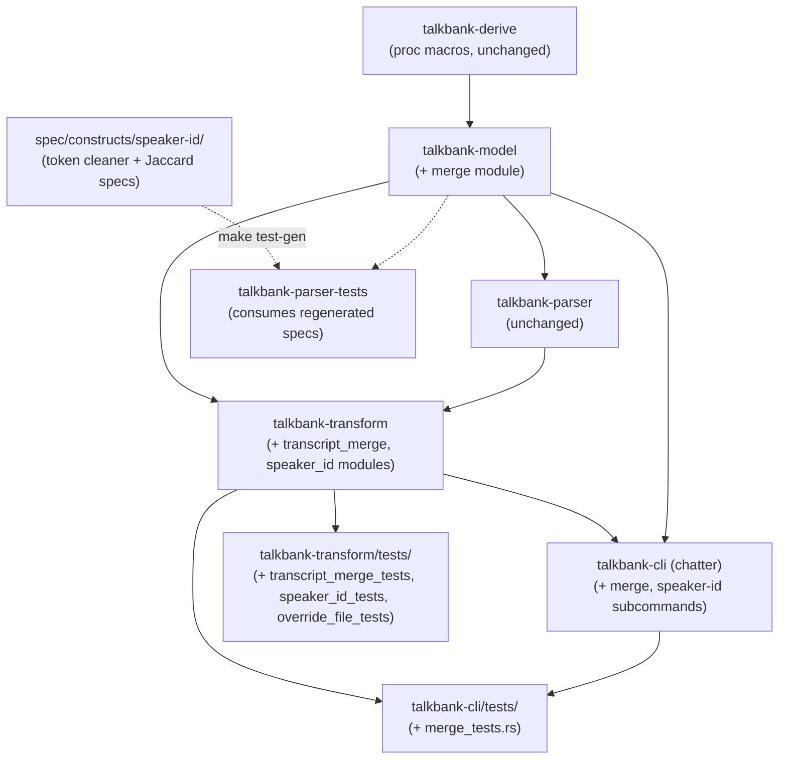
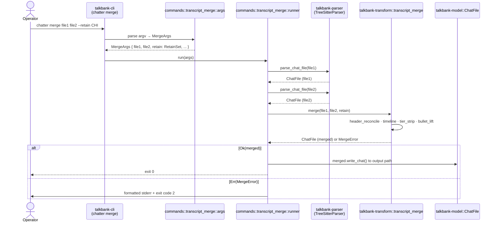
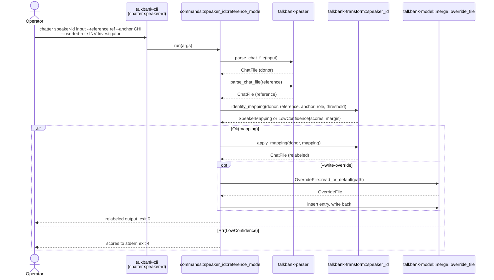
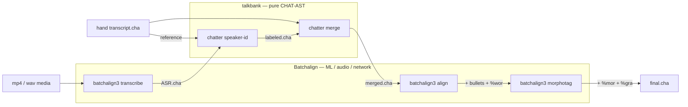

# Merge Pipeline — Crate Architecture

**Status:** Draft
**Last updated:** 2026-05-27 10:47 EDT

This page explains where the new merge-pipeline code lives in the
`talkbank-tools` workspace — which crates gain modules, what
depends on what, and which boundary each piece sits inside. The
goal is succession-readability: a contributor coming to this
work for the first time should be able to map a behavior they
read about in
[`chatter merge`](../chatter/user-guide/merge.md) or
[`chatter speaker-id`](../chatter/user-guide/speaker-id.md) to
the precise crate + module that implements it.

Companion documents:

- [Domain Types](./merge-domain-types.md) — what types live in
  `talkbank-model::merge`.
- [Test Plan](./merge-test-plan.md) — what tests live where.
- [Override File Format](../chatter/integrating/merge-overrides.md) —
  the on-disk format.

## Boundary decisions

Two boundary decisions govern where every new piece of code lives.
Both reference rules already documented in `talkbank-tools/CLAUDE.md`
(workspace-root contributor guide, outside the book).

### Decision 1: talkbank-* crates, not batchalign-* crates

The merge pipeline is **pure CHAT-AST structural manipulation** —
no ML, no audio I/O, no network, no model loading, no fleet
runtime. Per the crate-boundary decision test in the workspace
CLAUDE.md:

> If code fundamentally needs ML models, audio processing, network
> services, or fleet runtime → `batchalign-*` crate. Otherwise →
> `talkbank-*` crate.

`chatter merge` and `chatter speaker-id` answer "no" to each
ML/audio/network/runtime question. They consume parsed
`ChatFile` values, manipulate them, and emit parsed-and-serialized
output. Even the speaker-id text-similarity scoring is a
deterministic function over CHAT content tokens — no ML model,
no embedding, no inference. All new merge code lives in
talkbank-* crates.

The batchalign-* crates remain the home for `batchalign3
transcribe` (ASR), `batchalign3 align` (forced alignment), and
`batchalign3 morphotag` (Stanza-based morphological tagging) —
the ML-bearing stages that surround the merge in the pipeline.

### Decision 2: types in `talkbank-model`, algorithms in `talkbank-transform`, CLI in `talkbank-cli`

The merge pipeline's code splits across exactly the same three
talkbank-* crates that already host the parse/validate/normalize/
JSON pipelines:

- **`talkbank-model`** owns the typed vocabulary (domain types,
  errors). No algorithms.
- **`talkbank-transform`** owns the algorithms (token cleaning,
  Jaccard scoring, mapping application, structural merge). No
  CLI parsing, no clap.
- **`talkbank-cli`** owns the subcommands (`chatter speaker-id`,
  `chatter merge`). Thin shim layer that parses arguments and
  drives the transform layer.

This mirrors how `chatter validate`, `chatter normalize`,
`chatter to-json` are wired today and keeps the crate boundaries
honest: a future caller wanting only the algorithms (e.g., a
library binding, an HTTP service) can depend on
`talkbank-transform` without pulling in `clap`. A future caller
wanting only the types (e.g., an external tool reading override
files) can depend on `talkbank-model` without pulling in the
tree-sitter parser.

## Crate dependency graph

The new code does not introduce any new crate-level
dependencies — every edge below already exists in the workspace
today. The merge work adds modules to existing crates.



Dashed edges (`-.->`) are build-time rather than dependency edges:
`make test-gen` regenerates Rust tests under
`talkbank-parser-tests` from spec markdown, but the spec
directory is not a Cargo crate.

## Module layout per affected crate

### `talkbank-model` — new `merge/` module

Adds a top-level `merge` module under
`crates/talkbank-model/src/`. Layout:

```text
crates/talkbank-model/src/merge/
    mod.rs                 — pub re-exports
    scoring.rs             — JaccardScore, ConfidenceThreshold, Margin
    role.rs                — InsertedRole, MappingAction
    mapping.rs             — SpeakerMapping + parse_mapping_spec
    retain.rs              — RetainSet
    override_file.rs       — DecisionMode, MergeFlag, OperatorId,
                             SessionId, MergeOverride, OverrideFile
    errors.rs              — SpeakerIdError, MergeError, OverrideFileError
```

Per the file-size rule (≤400 lines target, ≤800 hard) each file
stays modest. Re-exports go through `mod.rs`:

```rust,ignore
// crates/talkbank-model/src/merge/mod.rs
pub mod scoring;
pub mod role;
pub mod mapping;
pub mod retain;
pub mod override_file;
pub mod errors;

pub use errors::{MergeError, OverrideFileError, SpeakerIdError};
pub use mapping::{parse_mapping_spec, SpeakerMapping};
pub use override_file::{MergeOverride, OverrideFile, ...};
pub use retain::RetainSet;
pub use role::{InsertedRole, MappingAction};
pub use scoring::{ConfidenceThreshold, JaccardScore, Margin};
```

Exposed at the crate root via the existing
`crates/talkbank-model/src/lib.rs` pattern:

```rust,ignore
pub mod merge;
```

No new external crate dependency: `chrono` and `toml` are already
pinned at workspace level. The merge module pulls them in via
`{ workspace = true }` annotations in
`crates/talkbank-model/Cargo.toml`.

### `talkbank-transform` — new `speaker_id/` and `transcript_merge/` modules

Two sibling top-level modules, mirroring the user-facing
distinction between the two subcommands:

```text
crates/talkbank-transform/src/speaker_id/
    mod.rs                 — identify_mapping, apply_mapping
    text_cleaner.rs        — content-token extraction from ChatFile
    jaccard.rs             — multiset Jaccard over Counter<&str>
    header_rewrite.rs      — @Participants / @ID rewriting per mapping

crates/talkbank-transform/src/transcript_merge/
    mod.rs                 — pub fn merge(...) entry point
    timeline.rs            — utterance ordering by start_ms
    bullet_lift.rs         — derive main-tier bullet from %wor
    tier_strip.rs          — strip downstream-owned dependent tiers
    header_reconcile.rs    — @Languages match, @Participants concat, etc.
    preconditions.rs       — RetainSpeakersMissing, NoTimelineInFile1, etc.
```

Both modules land alongside existing transform modules
(`asr_postprocess/`, `dp_align/`, `morphosyntax/`,
`merge_abbrev.rs`, etc.). The name `transcript_merge` distinguishes
from the existing `merge_abbrev.rs`, which is unrelated
(it merges abbreviation tokens in a single utterance).

Exposed via `crates/talkbank-transform/src/lib.rs`:

```rust,ignore
pub mod speaker_id;
pub mod transcript_merge;
```

### `talkbank-cli` — new `speaker_id/` and `transcript_merge/` command directories

The CLI dispatch pattern in this crate uses one directory per
multi-file command (e.g. `commands/validate/`, `commands/find/`,
`commands/alignment/`) or one file for single-file commands
(`commands/normalize.rs`, `commands/lint.rs`). Both new
subcommands warrant directories because each has multiple
operation modes (speaker-id has reference / explicit / override-file
modes; merge has the main merge path plus probably a future
`merge --check` mode).

```text
crates/talkbank-cli/src/commands/speaker_id/
    mod.rs                 — clap subcommand dispatch
    args.rs                — flag parsing, mode disambiguation
    reference_mode.rs      — drives identify_mapping + apply_mapping
    explicit_mode.rs       — drives parse_mapping_spec + apply_mapping
    override_mode.rs       — drives OverrideFile::read + apply_mapping
    output.rs              — formats per-speaker scores to stderr,
                             writes override file via --write-override

crates/talkbank-cli/src/commands/transcript_merge/
    mod.rs                 — clap subcommand dispatch
    args.rs                — --retain, --strip-tiers parsing
    runner.rs              — drives the merge pipeline
    output.rs              — exit-code mapping, error formatting
```

The CLI argument enums extend
`crates/talkbank-cli/src/cli/args.rs`'s top-level `Commands`
enum:

```rust,ignore
// in crates/talkbank-cli/src/cli/args.rs
pub enum Commands {
    Validate(/* ... */),
    Normalize(/* ... */),
    // ... existing variants ...
    SpeakerId(commands::speaker_id::args::SpeakerIdArgs),  // NEW
    Merge(commands::transcript_merge::args::MergeArgs),     // NEW
}
```

Subcommand dispatch in `crates/talkbank-cli/src/main.rs` already
matches on the `Commands` enum; the new arms wire to the
respective `commands::*::run` entry points.

### Test crates

Per the [Test Plan](./merge-test-plan.md):

```text
crates/talkbank-transform/tests/
    speaker_id_tests.rs       — L2 tests for identify_mapping / apply_mapping
    transcript_merge_tests.rs — L2 tests for merge invariants
    override_file_tests.rs    — L2 tests for round-trip / refusal

crates/talkbank-cli/tests/
    merge_tests.rs            — L3 subprocess tests for both new commands

spec/constructs/speaker-id/
    token-cleaner/            — L1 fragment specs
    jaccard-scoring/          — L1 golden Jaccard specs
    mapping-application/      — L1 header rewrite specs
```

The spec entries flow into Rust tests under
`crates/talkbank-parser-tests/tests/generated/` via the standard
`make test-gen` workflow.

## Data flow for `chatter merge`

The full call graph when an operator runs
`chatter merge file1.cha file2.cha --retain CHI -o out.cha`:



The CLI layer is thin: it parses arguments, calls the
transform layer's `merge` function, and translates the
`Result<ChatFile, MergeError>` into stdout/stderr/exit-code
output. All algorithm logic lives in `talkbank-transform`.

## Data flow for `chatter speaker-id`

The reference-mode call path:



The explicit-mapping and override-file modes use the same
`apply_mapping` and `--write-override` paths but skip
`identify_mapping` — the mapping comes from
`parse_mapping_spec` or `OverrideFile::get` respectively.

## How this composes with the post-merge ML stages

The end-to-end pipeline `batchalign3 transcribe → chatter
speaker-id → chatter merge → batchalign3 align → batchalign3
morphotag` crosses the talkbank-* / batchalign-* boundary
twice:



Each crossing is **CHAT-file-to-CHAT-file** at a stable
serialization boundary: Batchalign emits a CHAT file, talkbank
consumes it; talkbank emits a CHAT file, Batchalign consumes
it. Neither side has a runtime dependency on the other — they
exchange data through the file system (or piped stdin/stdout)
exactly as the user-facing CLI commands do. This keeps the
boundary honest: a contributor working on the merge pipeline
never needs to load a Stanza model, and a contributor working
on `batchalign3 align` never needs to parse a speaker-id
override file.

## Public surface impact

Cumulative public API additions (the surface a downstream
library consumer would see):

| Crate | New `pub` items | Stability |
|---|---|---|
| `talkbank-model` | `merge::{SpeakerCode, ParticipantRole, ...}` — re-exports for ergonomics, the underlying types already exist; PLUS the new types in `merge::scoring/role/mapping/retain/override_file/errors` | Stable — versioned via the workspace's existing release process |
| `talkbank-transform` | `speaker_id::{identify_mapping, apply_mapping, LowConfidenceError}`; `transcript_merge::{merge}` | Stable — algorithms behind these are pinned by the test plan's L2 tests |
| `talkbank-cli` | Two new `Commands` enum variants and their argument structs | Internal to the binary — not a library surface |

No existing public surface is modified or removed; this is a
purely-additive change. Existing consumers (such as `batchalign`)
continue to depend on the existing surface and can ignore the
additions until a workflow uses them.

## Where to look for things (newcomer guide)

| Question | File |
|---|---|
| "What does `chatter merge` do?" | [`book/src/chatter/user-guide/merge.md`](../chatter/user-guide/merge.md) |
| "What does `chatter speaker-id` do?" | [`book/src/chatter/user-guide/speaker-id.md`](../chatter/user-guide/speaker-id.md) |
| "What's in an override file?" | [`book/src/chatter/integrating/merge-overrides.md`](../chatter/integrating/merge-overrides.md) |
| "What types are in `talkbank-model::merge`?" | [`book/src/architecture/merge-domain-types.md`](./merge-domain-types.md) |
| "Where are the tests?" | [`book/src/architecture/merge-test-plan.md`](./merge-test-plan.md) |
| "Which crate is this code in and why?" | This page |
| "Where does the merge code live in source?" | `crates/talkbank-transform/src/speaker_id/` + `crates/talkbank-transform/src/transcript_merge/` + `crates/talkbank-cli/src/commands/speaker_id/` + `crates/talkbank-cli/src/commands/transcript_merge/` |
| "What's in an utterance / `ChatFile` / `%mor` tier?" | `talkbank-model` crate rustdoc; [`book/src/architecture/chat-model/chat-model.md`](./chat-model/chat-model.md) |
| "What's the parser do?" | [`book/src/architecture/parsing.md`](./parsing.md); [`book/src/architecture/parser-model-contracts.md`](./parser-model-contracts.md) |
