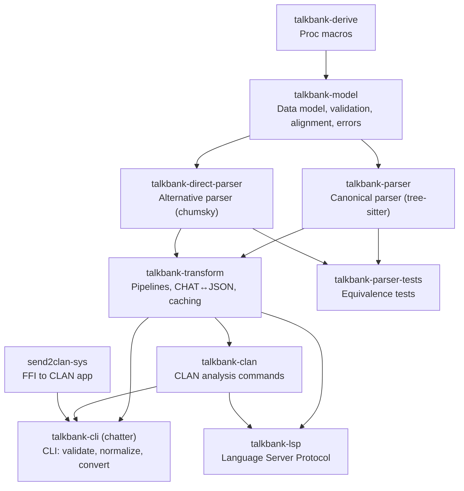

# Architecture Overview

## Data Flow

Data flows through the system in a single direction, from specification to applications:

```
spec/           Source of truth (CHAT specification)
    ↓
grammar.js      Tree-sitter grammar (in grammar/)
    ↓
parser.c        Generated C parser (never hand-edited)
    ↓
Rust crates     Parsers → Model → Validation → Transform
    ↓
Applications    CLI (chatter), LSP, VS Code, CLAN, batchalign
```

## Crate Dependency Graph



Supporting crate: `talkbank-derive` (proc macros). Downstream consumer: `batchalign3` (path deps to this workspace's crates).

## Repository Layout

Everything lives in a single repository (`talkbank-tools`):

```
talkbank-tools/
├── grammar/                Tree-sitter grammar
├── spec/                   CHAT specification (source of truth)
│   ├── constructs/         Valid CHAT examples + expected parse trees
│   ├── errors/             Invalid CHAT examples + expected error codes
│   ├── symbols/            Shared symbol registry (JSON)
│   ├── tools/              Core spec generators
│   └── runtime-tools/      Runtime-aware spec bootstrap/validation tools
├── crates/                 All Rust crates (parsing, model, CLI, LSP, CLAN, etc.)
├── corpus/                 Reference corpus (74 files)
├── schema/                 JSON Schema (auto-generated)
├── vscode/                 VS Code extension
├── book/                   This documentation
└── fuzz/                   Fuzz testing targets (separate Cargo workspace)
```

## Two-Parser Strategy

Two independent parsers consume the same grammar specification:

1. **Tree-sitter parser** (canonical) — GLR-based, error-recovering, produces a concrete syntax tree. Used by the LSP and CLI for interactive editing and validation of potentially malformed input.

2. **Direct parser** — chumsky parser combinators with explicit fragment parsing
   plus selective recovery in some file/tier paths. It is no longer accurate to
   describe it as purely fail-fast or as only a bootstrap experiment.

Both parsers must produce identical `ChatFile` ASTs for the 74-file reference corpus. This is enforced by `talkbank-parser-tests` for full-file behavior. Fragment and recovery semantics need stronger direct-parser-specific tests.

## Two Cargo Workspaces

The `talkbank-tools` repository contains two separate Cargo workspaces:

1. **Root workspace** (`Cargo.toml`) — all Rust crates for parsing, model, and transform
2. **Spec workspace** (`spec/Cargo.toml`) — `spec/tools` for core generation and `spec/runtime-tools` for runtime-aware spec tooling

Run spec-workspace commands with the relevant manifest path:
- `spec/tools/Cargo.toml` for core generators
- `spec/runtime-tools/Cargo.toml` for bootstrap/mining/runtime validation
