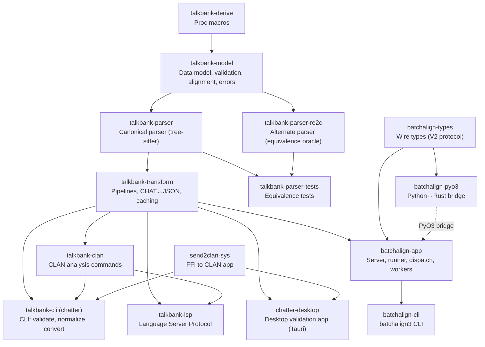

# Architecture Overview

**Status:** Current
**Last updated:** 2026-05-01 15:57 EDT

The `talkbank-tools` repository holds the entire TalkBank toolchain: the
CHAT specification, tree-sitter grammar, parsing/model/validation/transform
crates, the `chatter` CLI, the LSP server, the VS Code extension, the
desktop app, and the Batchalign runtime/application layer. Everything lives
in one repository under one root Cargo workspace.

## Data Flow

Specification is the source of truth. Code is generated downstream from it.

```
spec/           Source of truth (CHAT specification)
    ↓
grammar.js      Tree-sitter grammar (in grammar/)
    ↓
parser.c        Generated C parser (never hand-edited)
    ↓
Rust crates     Parser → Model → Validation → Transform
    ↓
Applications    chatter CLI, LSP server, VS Code, desktop app, batchalign
```

## Two layers

The repository contains two architectural layers:

**CHAT core (`talkbank-*` crates).** Parsing, data model, validation,
transform, CLAN analysis, CLI, LSP. Compiles and runs on a fresh machine
with no model downloads, no network, no Python. Everything that "is CHAT"
lives here. See the crate-boundary policy in `talkbank-tools/CLAUDE.md`
for what goes where.

**Batchalign runtime (`batchalign-*` crates + `batchalign/` Python).** ML
applications layered on top of the CHAT core: ASR, forced alignment,
morphosyntax, utterance segmentation, translation, coreference, audio
analysis. Rust owns all CHAT semantics; Python is a stateless ML inference
host. The standalone `batchalign3` repo was decommissioned in 2026-04;
its source folded in here as sibling crates.

## Crate Dependency Graph



## Repository Layout

```
talkbank-tools/
├── grammar/                Tree-sitter grammar
├── spec/                   CHAT specification (source of truth)
│   ├── constructs/         Valid CHAT examples + expected parse trees
│   ├── errors/             Invalid CHAT examples + expected error codes
│   ├── symbols/            Shared symbol registry (JSON)
│   ├── tools/              Core spec generators
│   └── runtime-tools/      Runtime-aware spec bootstrap/validation tools
├── crates/                 All Rust crates (CHAT core + batchalign)
├── corpus/                 Reference corpus
├── schema/                 JSON Schema (auto-generated)
├── vscode/                 VS Code extension
├── apps/chatter-desktop/   Desktop validation app (Tauri v2, React)
├── apps/dashboard-desktop/ Batchalign dashboard Tauri shell (experimental)
├── batchalign/             Python worker code (ML inference only)
├── frontend/               React dashboard (served by batchalign server)
├── book/                   This documentation
└── fuzz/                   Fuzz testing targets (separate Cargo workspace)
```

## Cargo Workspaces

Two separate workspaces:

1. **Root workspace** (`Cargo.toml`) — all Rust crates for parsing, model,
   transform, batchalign runtime, plus `apps/chatter-desktop/src-tauri`.
2. **Spec workspace** (`spec/Cargo.toml`) — `spec/tools` for core
   generation, `spec/runtime-tools` for runtime-aware spec tooling.

Use the relevant manifest path when working in the spec workspace:
`spec/tools/Cargo.toml` for generators, `spec/runtime-tools/Cargo.toml`
for bootstrap/mining/runtime validation.

## Where to read next

For per-topic detail (sections being consolidated; see SUMMARY for the
authoritative current list):

- [Spec System](spec-system.md), [Grammar](grammar.md),
  [Parser Backends](parser-backends.md) — how CHAT becomes typed AST.
- **CHAT model** — the AST itself, content traversal,
  [wide-struct rule](chat-model/wide-structs.md).
- [Alignment](alignment.md) — tier alignment, DP, forced alignment.
- **Runtime** — server, dispatch, concurrency, model loading,
  per-command data flow, caching.
- **Python–Rust boundary** — how Python workers fit in (batchalign only;
  the CHAT core has no Python).
- **Language and multilingual** —
  [Cantonese / CJK](language-and-multilingual/cantonese-and-cjk.md),
  language routing, Stanza.
- **Errors and validation** — per-app error systems, validation gates
  G0–G10.
- [Memory and Ownership](memory-and-ownership.md), Type-Driven Design
  (lands during M11 errors-and-validation work).
- [XML Emitter](xml-emitter.md) — projection.

For per-crate summaries see [Crate Reference](crate-reference.md).
