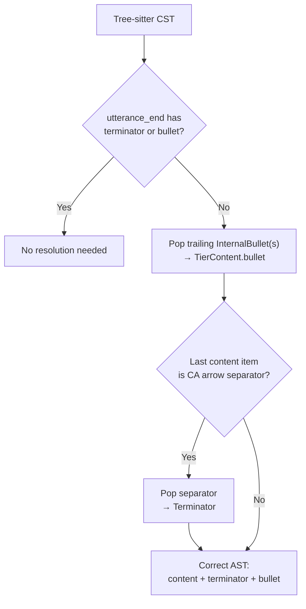

# CA Terminator Resolution

**Status:** Current
**Last updated:** 2026-05-01 17:07 EDT

How CA intonation arrows (`→ ↗ ⇗ ↘ ⇘`) are routed between
mid-utterance prosodic markers and utterance-final terminators.

## The two roles

The same Unicode arrow has two different roles in CHAT:

1. **Utterance-final terminator** — marks the prosodic end of an
   utterance, replacing standard terminators (`.` `?` `!`) in CA
   mode.
2. **Mid-content prosodic marker** — annotates the intonation
   contour of a phrase within an utterance.

```
*KE: I like LA the best → ⌈15⌉1000_5000⌈15⌉    ← → is TERMINATOR
*NUR: would you like toast↗ (0.6) ⌈15⌉1721_2980⌈15⌉  ← ↗ is PROSODIC MARKER
```

## Why the grammar can't decide alone

Tree-sitter's grammar uses a greedy `repeat1` for the `contents`
rule:

```javascript
contents: $ => repeat1(choice(
  $.whitespaces,
  $.content_item,   // includes media_url → InternalBullet
  $.separator,       // includes CA arrows
  $.overlap_point,
))
```

When the parser sees `→`, LR(1) conflict resolution prefers shift
(continue matching). So `contents` always consumes the arrow as a
separator and any subsequent bullet (`⌈15⌉..⌈15⌉`) as an
`InternalBullet` content item; `utterance_end` receives nothing.

The grammar correctly lists arrows in both `separator` and
`terminator`, but the parser's conflict resolution always prefers
the `separator` path. This is an inherent property of LR(1)
parsing with greedy repetition, not a grammar bug. Removing arrows
from `separator` would break the 24,764 mid-utterance arrow uses
in the corpus; removing `media_url` from `content_item` would
break 1.5M+ legitimate LENA/HomeBank sub-utterance bullets on
continuation lines (86.4% of `InternalBullet` items in the
corpus, across 1,885 files).

## The CST → AST resolution pass

The Rust parser resolves the ambiguity in the CST→AST conversion
phase. After tree-sitter produces the CST,
`resolve_ca_terminator()` in
`crates/talkbank-parser/src/parser/tree_parsing/main_tier/structure/convert/mod.rs`
checks whether `utterance_end` has neither terminator nor bullet.
If so, it promotes trailing content items:

1. Trailing `InternalBullet`(s) → `TierContent.bullet` (last one
   wins).
2. Trailing CA arrow `Separator` → `Terminator`.



## Cases the resolution does NOT touch

- **Mid-content arrows** (followed by more words / pauses):
  `utterance_end` already has a terminator from the grammar (or
  has content after the arrow), so the resolution doesn't trigger.
- **LENA / HomeBank InternalBullets**: appear on continuation lines
  where the terminator is on a later line; `utterance_end.terminator`
  is `Some`, so the resolution doesn't trigger.
- **Standard terminators** (`.` `?` `!`): correctly routed by the
  grammar — `utterance_end.terminator` is `Some`.
- **Batchalign-runtime callers**: the shared `Terminator` enum
  already has all 5 CA variants; the Batchalign crates see correct
  `Terminator::CaLevel` etc. without any conversion code.

## Data Model

The `Terminator` enum (`talkbank-model`) carries all 5 CA intonation
variants:

| Variant | Unicode | CHAT token |
|---|---|---|
| `CaRisingToHigh` | U+21D7 | ⇗ |
| `CaRisingToMid` | U+2197 | ↗ |
| `CaLevel` | U+2192 | → |
| `CaFallingToMid` | U+2198 | ↘ |
| `CaFallingToLow` | U+21D8 | ⇘ |

The `Separator` enum has corresponding variants for mid-content
use, plus `is_ca_intonation_arrow()` and `to_ca_terminator()`
conversion helpers.

## Corpus Coverage

The resolution is tested across all 995 CA files in the TalkBank
corpus plus all 87 reference corpus files. Two pre-existing parse
errors remain in `ca-data/CallFriend/eng-n/4889.cha` and
`ca-data/Jefferson/LinguaFranca/bs4.cha` (both on `+≈` lines with
unusual content — data quality issues, not grammar bugs).
