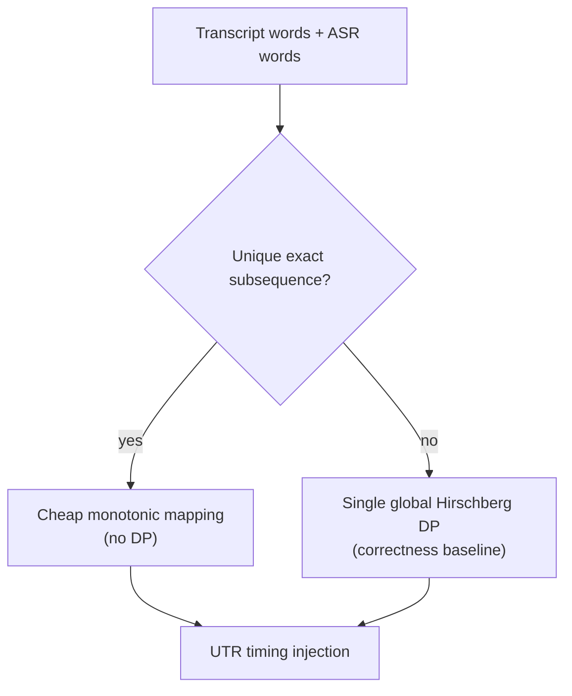
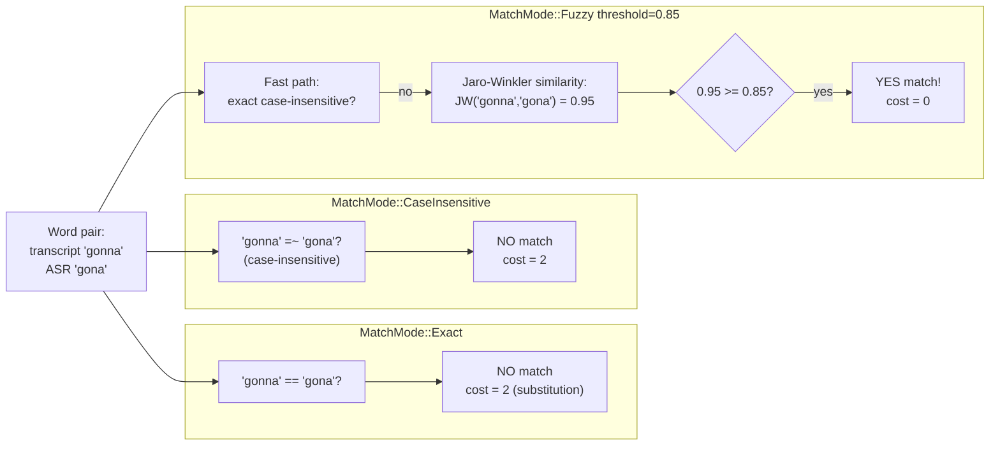
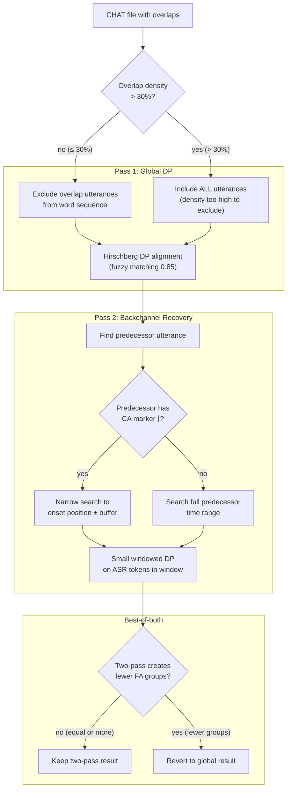
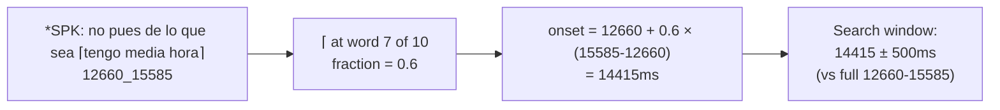

# Dynamic Programming

**Status:** Current
**Last updated:** 2026-05-19 16:54 EDT

Where dynamic programming is used at runtime across the workspace,
which uses are intrinsically necessary, and which are
correctness-critical even when avoidable. A policy test enforces
that no new runtime DP appears outside the allowlisted call sites.

## Inventory

| Area | Call site | DP algorithm | Notes |
|---|---|---|---|
| Whisper ASR timestamp extraction | `batchalign/inference/audio.py` | DTW (`_dynamic_time_warping`) | Maps decoder tokens to audio frames from cross-attention matrices |
| Whisper FA token timing | `batchalign/inference/fa.py` | DTW | Token jump times extracted in Python, mapped in Rust |
| Wave2Vec forced alignment | `batchalign/inference/fa.py` | CTC forced alignment (Viterbi-style DP) | `torchaudio.functional.forced_align` on emission matrix vs transcript |
| FA word-level remapping | `crates/batchalign/src/chat_ops/fa/alignment.rs::apply_indexed_timings` | **None** | Indexed callback protocol maps timings 1:1 by index |
| FA token-level remapping | `crates/batchalign/src/chat_ops/fa/alignment.rs::align_token_timings` | **None** | Deterministic token→word stitching only; unmatched words remain untimed |
| UTR timing recovery | `crates/batchalign/src/chat_ops/fa/utr.rs::inject_utr_timing` | Hirschberg edit-distance DP | Global alignment of all document words against all ASR tokens |
| Morphosyntax retokenize mapping | `crates/talkbank-transform/src/retokenize.rs::build_word_token_mapping` | **None** | Deterministic span-join + length-aware monotonic fallback |
| WER evaluation | `crates/talkbank-transform/src/benchmark.rs` (uses `dp_align::align`) | Hirschberg edit-distance DP | Canonical use of DP for transcript comparison |
| Compare command | `crates/talkbank-transform/src/compare/engine.rs` (uses `dp_align::align`) | Hirschberg edit-distance DP | Aligns main vs gold transcript words to compute WER and inject `%xsrep` / `%xsmor` tiers |

## Classification

### Intrinsic: DP is the algorithm

- **WER evaluation / compare command.** Comparing two independent
  word sequences is exactly edit-distance territory.
- **CTC forced alignment** (`forced_align`). DP is intrinsic to the
  model family.
- **Whisper DTW path.** If cross-attention DTW is the chosen
  alignment method, DP is part of the method.

### Architecturally avoidable: removed from runtime

- **FA word/token remapping.** Removed; indexed or deterministic
  stitching only.
- **Retokenize char-level DP.** Removed; deterministic span-join
  with length-aware monotonic fallback.

### Correctness-critical: DP retained on purpose

- **UTR global ASR → transcript DP.** UTR has to align two
  independent full-document word sequences (transcript words and
  ASR tokens). A local/windowed matcher can starve later
  utterances of tokens that earlier utterances consumed, exactly
  what happened in the 407-style hand-edited transcript regression.
  UTR uses a single global Hirschberg alignment for this reason.
  Same category as WER/compare, not the avoidable-runtime-remap
  category.

UTR is a monotonic aligner. Dense overlap and text/audio
reordering can still leave words unmatched in heavily reworked
hand-edited transcripts; that limitation is inherent to monotonic
DP.

## Hirschberg Optimizations

The `dp_align/` implementation in `talkbank-transform` includes
two optimizations beyond the textbook algorithm:

- **Prefix/suffix stripping.** Before entering the O(mn) DP core,
  `align()` strips matching prefixes and suffixes in O(n). For the
  primary use case (WER / transcript comparison, 80-95% accuracy),
  reduces effective DP problem size 10-100×. Only the differing
  middle portion enters Hirschberg recursion.
- **Generic `Alignable` trait.** Both `String` (word-level) and
  `char` (character-level) entry points share one generic
  implementation. Monomorphization eliminates ~200 lines of
  duplicated code with zero runtime overhead.

## Fuzzy Matching

The DP aligner supports three word-comparison modes via `MatchMode`:

Jaro-Winkler compares two strings by counting matching characters
within a distance window, penalizing transpositions, and boosting
for common prefixes. Returns 0.0 (different) to 1.0 (identical).
Better than Levenshtein for short words because it doesn't
penalize length differences as harshly.

Without fuzzy matching, a single ASR substitution ("gonna" vs
"gona") forces the DP to treat it as a gap (cost 2) rather than a
match (cost 0). This can cascade, the mismatched word shifts
subsequent alignments, potentially leaving entire utterances
unmatched. With fuzzy matching, the substitution is recognized as
a match, keeping the alignment anchored.

The default threshold (0.85) is tuned empirically across 6 corpora
and 59 files. Examples at this threshold:

| Pair | JW | Match at 0.85? |
|---|---|---|
| "gonna" / "gona" | 0.95 | Yes |
| "went" / "wen" | 0.94 | Yes |
| "yesterday" / "yestarday" | 0.92 | Yes |
| "mhm" / "mmhm" | 0.83 | No |
| "the" / "da" | 0.00 | No |
| "he" / "she" | 0.61 | No |
| "cat" / "dog" | 0.00 | No |

## UTR Two-Pass Overlap-Aware Alignment

When a file has overlap markers (`+<` linkers or CA `⌊` markers),
UTR uses a two-pass strategy to handle backchannel timing
recovery.

### Configurable parameters

| Flag | Default | Controls |
|---|---|---|
| `--utr-strategy` | `auto` | `auto` (detect overlaps) / `global` / `two-pass` |
| `--utr-ca-markers` | `enabled` | Use ⌈⌉⌊⌋ for onset windowing |
| `--utr-density-threshold` | `0.30` | Max overlap fraction before skipping exclusion |
| `--utr-tight-buffer` | `500` | Pass-2 tight window ±ms |
| `--utr-fuzzy` | `0.85` | Jaro-Winkler similarity threshold |

### CA marker onset estimation

When a predecessor utterance has ⌈ markers, the proportional
position of ⌈ among the utterance's words estimates when overlap
begins:

Narrows the pass-2 search window from the full predecessor range
(~3 seconds in this example) to ~1 second around the estimated
onset, roughly a 3× reduction in search space.

## Known DP Failure Modes

1. **Crossing alignments / rapid overlaps.** Global monotonic
   aligners cannot represent crossing matches; one side is dropped
   or mis-assigned.
2. **Repeated-token ambiguity.** Repeated words create many
   equal-cost paths; deterministic tie-breaks may pick semantically
   wrong matches.
3. **ASR drift and hallucinations.** Large payload/reference
   divergence causes sparse matches and low timing coverage.
4. **Tokenization or normalization mismatch.** Char-level DP may
   align surprising spans when punctuation/case/tokenization
   differ.
5. **Temporal validity vs textual order.** Correct per-utterance
   times can still violate CHAT monotonicity when transcript order
   diverges from audio order.

### Mitigations in code

- **Monotonicity enforcement (E362)**: `enforce_monotonicity()`
  strips timing from regressions after FA.
- **Same-speaker overlap enforcement (E704)**,
  `strip_e704_same_speaker_overlaps()` strips earlier conflicting
  timing.
- **Untimed fallback windows**: proportional boundary estimates
  keep FA from skipping all untimed utterances. See
  [Proportional FA Estimation](../alignment/proportional-fa-estimation.md).
- **Retokenize diagnostics + safe fallback**: invalid token
  mappings keep original words and mark parse taint.

## Allowlist Policy

`batchalign/tests/test_dp_allowlist.py::test_chat_ops_dp_calls_are_allowlisted`
fails CI if new runtime `dp_align::align` / `dp_align::align_chars`
call sites appear outside the allowlist (the test scans both
`crates/batchalign/src/**/*.rs` and `crates/talkbank-transform/src/**/*.rs`):

| Call site | Purpose |
|---|---|
| `crates/talkbank-transform/src/benchmark.rs` | WER evaluation |
| `crates/talkbank-transform/src/compare/engine.rs` | Transcript comparison (window alignment + rotation, 2 calls) |
| `crates/batchalign/src/chat_ops/fa/utr.rs` | UTR global timing recovery |
| `crates/batchalign/src/chat_ops/fa/utr/two_pass.rs` | UTR two-pass overlap-aware pass |

The PyO3 boundary surface no longer hosts a `dp_align` call site
(the pre-slimdown `pyfunctions.rs` bridge was retired). Any new
runtime DP call site must be added to the allowlist in
`test_dp_allowlist.py` with a justification.
