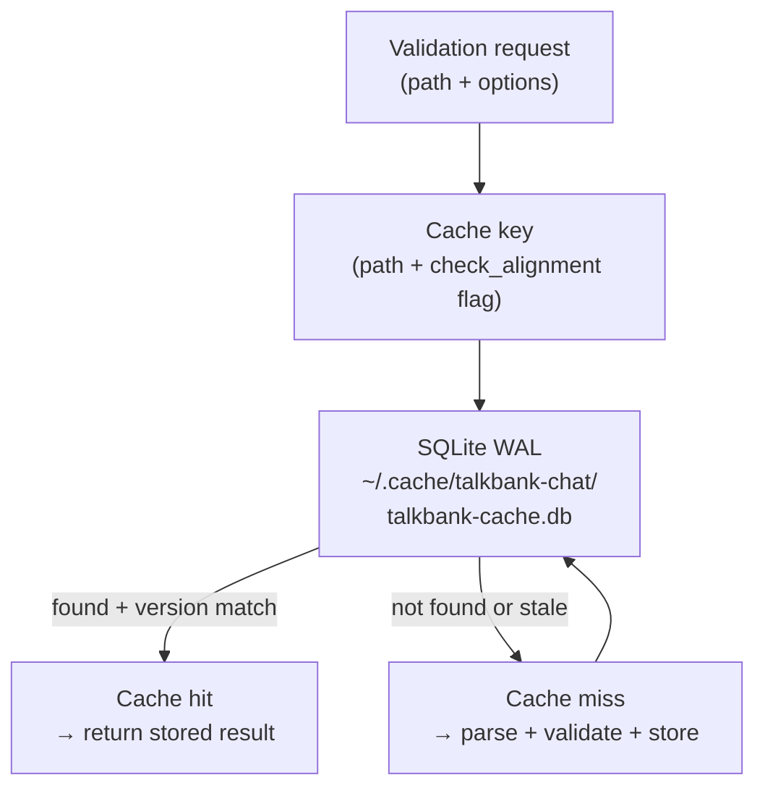

# Validation Cache

**Status:** Current
**Last updated:** 2026-05-01 17:07 EDT

The CHAT-core validation cache, used by `chatter validate` and the
LSP server. Distinct from the
[audio-task cache](../runtime/audio-task-cache.md) used by Batchalign
for FA / UTR ASR / media conversion: this cache stores
**parse + validate** results keyed by file path + options.

`crates/talkbank-transform/src/unified_cache/`.

## Architecture

## Configuration

| Config | Value | Why |
|---|---|---|
| Backend | SQLite via `sqlx` | Concurrent reads (WAL), atomic writes, zero-config |
| Pool size | 16 connections | Matches validation worker count |
| `mmap` | 256 MB | Fast random access for 95k+ entries |
| Invalidation | Version field + 30-day TTL | Schema changes auto-invalidate; stale entries pruned |
| Bridge | Embedded single-threaded tokio runtime | Sync workers call `rt.block_on()` for async SQLite |

## Schema

`file_cache` table:

| Column | Role |
|---|---|
| `file_path` | Primary key — absolute resolved path |
| `check_alignment` | Whether alignment validation was requested |
| `parser_kind` | Parser backend (tree-sitter or re2c) |
| `result` | Serialized validation outcome |
| `cached_at` | Insertion timestamp |
| `version` | Schema/code version — mismatch invalidates the entry |

## Database location

| Platform | Path |
|---|---|
| macOS | `~/Library/Caches/talkbank-chat/talkbank-cache.db` |
| Linux | `~/.cache/talkbank-chat/talkbank-cache.db` |
| Windows | `%LocalAppData%\talkbank-chat\talkbank-cache.db` |

## Invalidation

- **Schema changes** — bump the `version` field; old entries become
  unreachable.
- **Time-based** — entries older than 30 days are pruned.
- **Manual** — pass `--force` to bypass cache lookups for a
  particular validation run.

Per project policy, do not delete the cache directory without
explicit request — see the cache-policy section of
`talkbank-tools/CLAUDE.md`.

## See also

- [Audio-task cache](../runtime/audio-task-cache.md) — Batchalign's
  per-utterance cache for FA / UTR ASR / media conversion.
