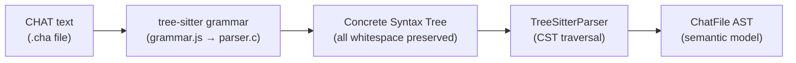
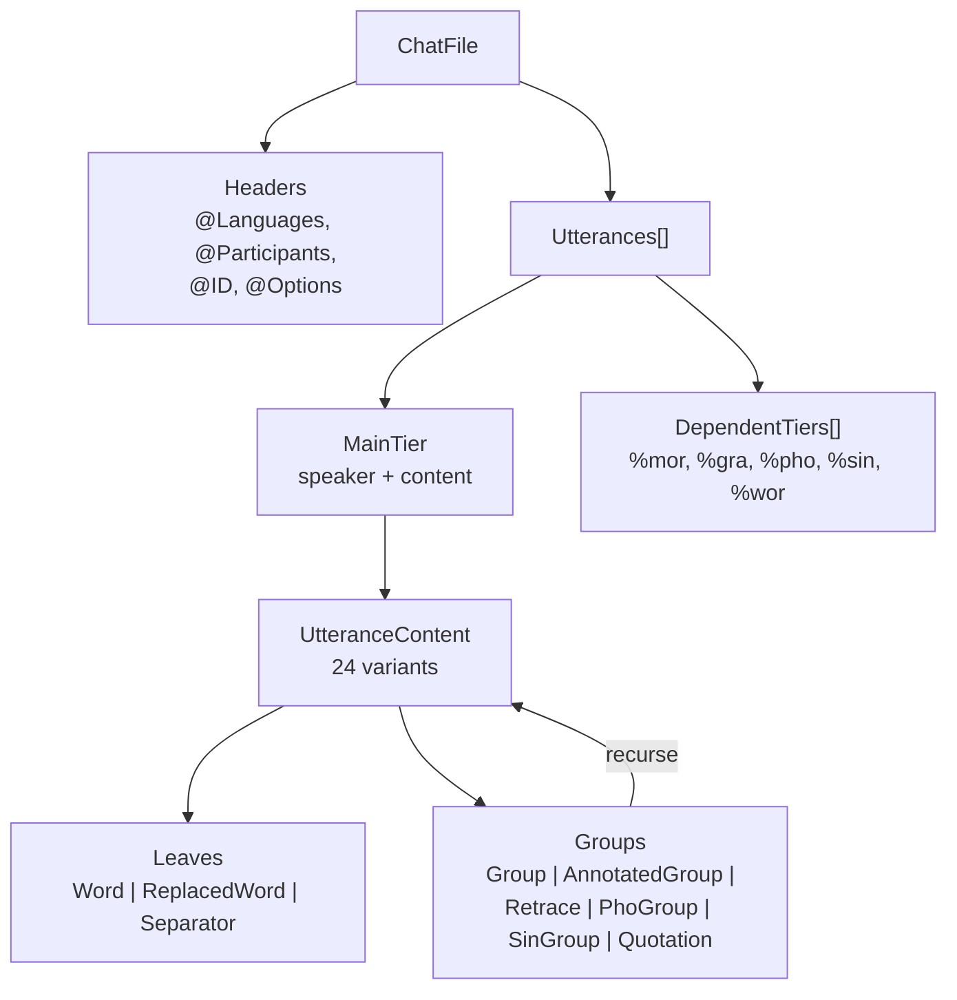

# Parsing

**Status:** Current
**Last updated:** 2026-03-24 01:32 EDT

The parsing pipeline converts CHAT text into a typed `ChatFile` AST using
a tree-sitter grammar. Tree-sitter is the sole parser.

## Tree-Sitter Parser

The `talkbank-parser` crate wraps the tree-sitter C parser and converts its concrete syntax tree (CST) into the `ChatFile` model.

Full-file parsing is the canonical entry point. `TreeSitterParser` also
provides fragment methods (`parse_word_fragment()`, `parse_main_tier_fragment()`,
`parse_chat_file_fragment()`, etc.) for parsing isolated CHAT fragments
directly.

### CST → AST Pipeline



```
Source text
    ↓ tree-sitter parse
Concrete Syntax Tree (CST) — green tree with all tokens
    ↓ tree_parsing (Rust)
ChatFile AST — typed model with validation-ready data
```

The CST preserves every character of the source (whitespace, punctuation, comments). The Rust tree-parsing modules walk the CST and extract semantic information into the typed model.

### Error Recovery

Tree-sitter's GLR algorithm provides automatic error recovery. When the parser encounters unexpected input, it:

1. Inserts ERROR nodes in the CST
2. Continues parsing the rest of the file
3. Reports parse errors via the `ErrorSink` trait

This means the parser always produces a result — even for malformed files, it extracts as much structure as possible.

### ParseOutcome

Individual parse functions return `ParseOutcome<T>`:
- `ParseOutcome::parsed(value)` — successfully parsed
- `ParseOutcome::rejected()` — could not parse this node (error already reported)

This allows the parser to skip individual malformed elements while continuing to parse the rest of the file.

## Parser Equivalence

The 78-file reference corpus is the primary correctness guarantee:

```bash
cargo nextest run -p talkbank-parser-tests -E 'test(parser_equivalence)'
```

Each `.cha` file is its own test — nextest runs them in parallel and reports individual failures.

## TreeSitterParser API

`TreeSitterParser` is the sole API handle for parsing. Callers create one
instance and pass `&TreeSitterParser` to all parsing call sites. There is
no trait abstraction — `TreeSitterParser` is a concrete type in the
`talkbank-parser` crate.

```rust
use talkbank_parser::TreeSitterParser;

let parser = TreeSitterParser::new()?;

// Full-file parsing (methods on TreeSitterParser)
let chat_file = parser.parse_chat_file(&source, &errors)?;
let chat_file = parser.parse_chat_file_streaming(&source, callback)?;

// Fragment parsing (methods on TreeSitterParser)
let word = parser.parse_word_fragment(word_text, &errors);
let main_tier = parser.parse_main_tier_fragment(tier_text, &errors);
```

### AST Structure

The resulting `ChatFile` AST has a recursive content structure:



## Parser String Handling

The tree-sitter parser constructs owned model types (e.g., `MorWord`, `GrammaticalRelation`) directly from CST text. String-heavy types like `PosCategory` and `MorStem` use `Arc<str>` interning to avoid redundant allocations for repeated values. Short strings in model newtypes use `SmolStr` for inline storage up to 23 bytes.
