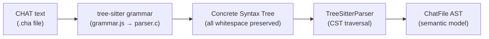
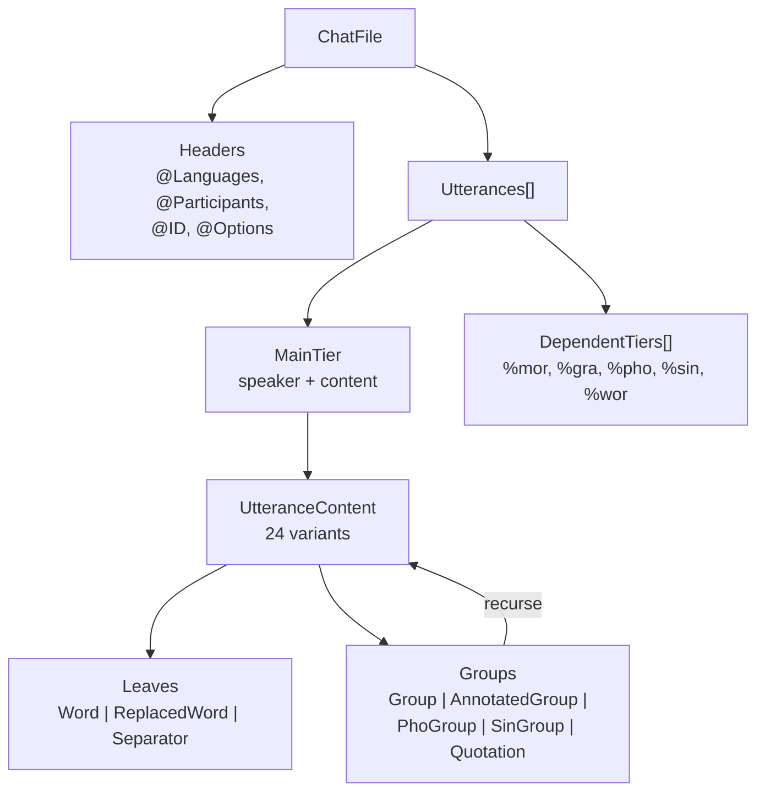

# Parsing

The parsing pipeline converts CHAT text into a typed `ChatFile` AST. Two independent parser implementations ensure correctness.

**Important:** several legacy tree-sitter "fragment parser" entrypoints are not
true fragment parsers. They inject a fragment into boilerplate CHAT text and
then parse the resulting synthetic file. That behavior was useful while the
direct parser was being bootstrapped, but it is now architectural debt and
should be retired rather than normalized. Treat those helpers as audit-only
compatibility surfaces, not as the fragment oracle for batchalign3 or any
other consumer.

## Tree-Sitter Parser (Canonical)

The `talkbank-parser` crate wraps the tree-sitter C parser and converts its concrete syntax tree (CST) into the `ChatFile` model.

**Important:** full-file parsing is real. Some legacy tree-sitter fragment
helpers are synthetic. Those helpers now live under
`talkbank_parser::synthetic_fragments::*` specifically so they are not
mistaken for honest crate-root fragment parsers.

### CST → AST Pipeline



```
Source text
    ↓ tree-sitter parse
Concrete Syntax Tree (CST) — green tree with all tokens
    ↓ tier_parsers (Rust)
ChatFile AST — typed model with validation-ready data
```

The CST preserves every character of the source (whitespace, punctuation, comments). The Rust tier parsers walk the CST and extract semantic information into the typed model.

### Error Recovery

Tree-sitter's GLR algorithm provides automatic error recovery. When the parser encounters unexpected input, it:

1. Inserts ERROR nodes in the CST
2. Continues parsing the rest of the file
3. Reports parse errors via the `ErrorSink` trait

This means the parser always produces a result — even for malformed files, it extracts as much structure as possible.

### ParseOutcome

Individual parse functions return `ParseOutcome<T>`:
- `ParseOutcome::parsed(value)` — successfully parsed
- `ParseOutcome::rejected()` — could not parse this node (error already reported)

This allows the parser to skip individual malformed elements while continuing to parse the rest of the file.

## Direct Parser (Experimental)

The `talkbank-direct-parser` crate uses [chumsky](https://github.com/zesterer/chumsky) parser combinators. It began as a fail-fast fragment parser, but that description is now incomplete: the real code has selective recovery and leniency paths, especially around utterance/dependent-tier parsing and parse-health propagation.

### Design Differences

| Feature | Tree-sitter | Direct |
|---------|-------------|--------|
| Error recovery | Yes (GLR whole-file recovery) | Selective, hand-owned recovery in specific fragment/file paths |
| Incremental | Yes | No |
| CST preservation | Yes | No (direct to AST) |
| Use case | Canonical full-file parsing | Explicit fragment parsing plus selective recovery paths |

**Important:** because the direct parser now owns real lenient/recovery
behavior, it needs its own test oracle. It should not rely on synthetic
tree-sitter fragment helpers as the golden source for fragment semantics.

### Batchalign3 Integration Surface

`batchalign3` depends on the parsing layer in two different ways:

- it needs the canonical full-file `ChatFile` parse for alignment, compare, and
  workflow orchestration
- it needs the direct parser's leniency and recovery contract to be explicit
  enough that malformed words, dependent tiers, and parse-health taint are
  predictable for downstream alignment consumers

That means the right parser split is not "tree-sitter good, direct parser bad";
it is:

- tree-sitter for canonical full-file equivalence and CST recovery
- direct parser for explicit fragment/recovery semantics and recovery tests
- synthetic fragment helpers only as audit/compatibility paths

If a downstream consumer needs to know whether a malformed fragment should be
rejected, recovered, or tainted, that decision belongs in direct-parser-native
tests and docs, not in a tree-sitter wrapper that synthesizes a full CHAT file.

### Parser Equivalence

Both parsers must produce identical `ChatFile` ASTs for the 74-file reference corpus:

```bash
cargo nextest run -p talkbank-parser-tests -E 'test(parser_equivalence)'
```

Each `.cha` file is its own test — nextest runs them in parallel and reports individual failures. This equivalence test is still the primary correctness guarantee for **full-file** behavior.

It should **not** be treated as the primary correctness guarantee for direct-
parser fragment leniency or recovery behavior. Those paths need independent
spec- and invariant-driven tests.

## ChatParser Trait

The `talkbank-model` crate defines the `ChatParser` trait (in `parser_api`) that both parsers implement:

```rust
pub trait ChatParser {
    fn parse_chat_file(
        &self,
        source: &str,
        errors: &impl ErrorSink,
    ) -> Result<ChatFile, ParseError>;
}
```

Application code programs against this trait and can swap parser implementations.

### AST Structure

The resulting `ChatFile` AST has a recursive content structure:



## Parser String Handling

The tree-sitter parser constructs owned model types (e.g., `MorWord`, `GrammaticalRelation`) directly from CST text. String-heavy types like `PosCategory` and `MorStem` use `Arc<str>` interning to avoid redundant allocations for repeated values. Short strings in model newtypes use `SmolStr` for inline storage up to 23 bytes.
