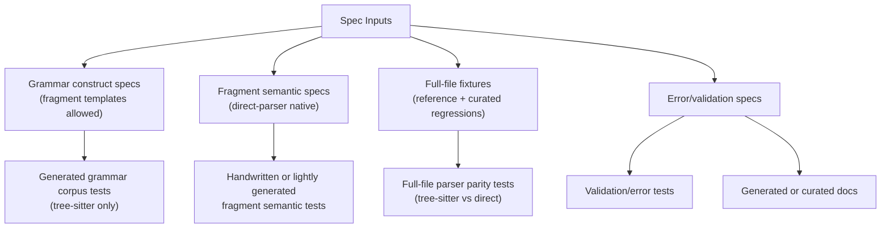

# Post-Bootstrap Parser Testing

**Status:** Historical
**Last updated:** 2026-03-23 23:49 EDT

> **Note:** This document describes the dual-parser testing architecture that
> existed before the Chumsky direct parser was removed in March 2026.
> Tree-sitter is now the sole parser. The testing taxonomy described here was
> partially implemented before the direct parser was eliminated. This document
> is preserved for architectural context.

The parser/testing architecture should no longer assume that `talkbank-tools`
is still bootstrapping the direct parser against tree-sitter. That phase was
useful, but it produced testing and generation machinery that now overreaches:

- tree-sitter fragment wrappers became mistaken for semantic truth
- spec generation tried to serve grammar, parser semantics, validation, docs,
  and bootstrap all at once
- `spec/tools` picked up Rust parser/model dependencies, creating circular and
  awkward workflow dependencies
- the Makefile grew around the bootstrap workflow instead of a stable long-term
  architecture

The right post-bootstrap design is to treat grammar, parser semantics,
validation, and docs as related but distinct concerns with different sources of
truth.

## Core Principle

**Fragments remain first-class. Bootstrapping does not.**

What survives:

- fragment specs
- full-file reference corpus checks
- grammar corpus generation
- error/validation specs
- explicitly-named synthetic tree-sitter fragment helpers only where a legacy
  compatibility or audit path still genuinely needs them

What should not survive as the organizing principle:

- using synthetic tree-sitter fragment helpers as the oracle for direct-parser
  fragment semantics
- advertising synthetic tree-sitter helpers as ordinary crate-root parsing APIs
- forcing one generator pipeline to own every parser-related test artifact
- keeping `spec/tools` coupled to Rust parser crates just because that was
  expedient during bootstrap

## Target Architecture

The key separation is:

- **Grammar specs** prove grammar coverage and grammar regressions.
- **Fragment semantic specs** prove direct-parser behavior for isolated
  constructs.
- **Full-file fixtures** prove end-to-end parser parity and recovered-file
  behavior.
- **Error specs** prove validation and diagnostic contracts.

Those are related, but they should not all be generated from the same assumptions.

## What Should Generate, And What Should Not

### Keep generation for grammar and docs

Generation still makes sense for:

- tree-sitter corpus tests under `grammar/test/corpus/`
- error documentation pages
- shared symbol-set artifacts

Those are stable artifact-generation problems.

### Reduce generation for parser semantics

Parser semantics should not primarily be generated into large Rust suites from
fragment specs. That created too much indirection and too much false confidence
that “spec-generated” meant “architecturally sound.” Synthetic fragment helpers
exist only as compatibility/audit tooling now, not as the semantic source of
truth.

For parser semantics, the preferred long-term shape is:

- hand-written or lightly data-driven direct-parser-native tests
- curated fixtures with explicit names and intent
- property/proptest/fuzz tests for invariants
- parity tests only where parity is actually the contract

### Keep full-file parity, narrow fragment parity

Full-file tree-sitter vs direct equivalence remains valuable.

Fragment parity should be narrowed to one of two roles:

- legacy audit during migration, clearly labeled as such
- explicit compatibility claims for a narrowly defined fragment surface

It should not be the default source of truth for direct-parser fragment semantics.

## Desired Test Taxonomy

### 1. Grammar tests

Purpose:

- prove grammar accepts and structures valid syntax
- catch grammar regressions when grammar changes

Input model:

- construct specs and explicit templates

Authority:

- tree-sitter grammar only

### 2. Direct fragment semantic tests

Purpose:

- define the actual contract of `talkbank-direct-parser`
- capture leniency, recovery, non-fabrication, and parse-health behavior
- keep context-sensitive fragment cases, such as CA omission shorthand, under
  direct-parser-native coverage rather than synthetic tree-sitter wrapper
  parity

Input model:

- direct fragment fixtures or direct semantic specs

Authority:

- direct parser and model semantics

Examples:

- malformed word preserved as raw text inside a main tier
- malformed dependent tier taints only its alignment domain
- later valid sibling tiers survive malformed earlier siblings
- degraded main-tier shell behavior
- isolated `parse_word()` strictness
- utterance-level fragment context acceptance/rejection

### 3. Full-file parity tests

Purpose:

- ensure both parsers still produce semantically equivalent `ChatFile`s for the
  supported full-file corpus

Input model:

- reference corpus
- curated real-world regressions

Authority:

- full-file semantic equivalence only

### 4. Validation/error tests

Purpose:

- verify error codes, validation layers, and post-parse invariants

Input model:

- error specs
- curated fixtures

Authority:

- validation contract, not parser bootstrap convenience

### 5. Property/fuzz/mutation tests

Purpose:

- check invariants instead of snapshots

Good targets:

- roundtrip or idempotence where it is a real invariant
- no silent fabrication of placeholder tiers
- parse-health monotonicity
- offset/span preservation
- serializer/parser stability for recovered structures

## What A Small Grammar Change Should Require

For an isolated grammar extension such as a new dependent tier with simple syntax,
the ideal workflow should be small and local:

1. Add or adjust the grammar rule and one or two grammar corpus examples.
2. Add direct-parser-native tests for the new tier's fragment semantics.
3. Add one full-file integration fixture showing the tier in context.
4. Add validation/error specs only if the change introduces new diagnostics or
   validation behavior.

It should **not** require a giant cross-cutting regeneration ritual unless the
change genuinely affects multiple generated artifact families.

## What Should Be Audit-Only

The following are still useful, but only as legacy checks or migration aids:

- tree-sitter fragment wrappers that synthesize a full CHAT file for parity
- parser snapshot suites whose main purpose is “does the generated artifact
  still match the old baseline”
- bootstrap-era regeneration rituals that exist mainly to keep old generation
  pipelines green

Those paths may remain documented, but they should not be the default answer
for new grammar work.

## Tooling Direction

The current Makefile still reflects the bootstrap-era worldview. Post-bootstrap,
the tooling should converge toward:

- `cargo xtask` (or similarly typed Rust orchestration) for local developer
  workflows
- thin shell wrappers only when they add real value
- `spec/tools` narrowed to true artifact-generation and spec-validation work
- no Rust parser/model dependency inside `spec/tools` unless a tool is
  explicitly about consuming those crates and the dependency is architecturally
  justified

`spec/tools` should stop carrying circular bootstrap logic just to generate or
validate artifacts.

## Recommended Structural Changes

1. Keep grammar-spec generation, but treat fragment template wrapping as an
   explicit grammar-audit mechanism, not as the semantic fragment API.
2. Stop generating or blessing large fragment-semantic Rust suites from the
   bootstrap assumptions.
3. Move direct-parser semantic authority into direct-parser-native tests and
   specs.
4. Keep full-file parity as a first-class release gate.
5. Split `spec/tools` into:
   - pure spec/doc/grammar artifact tooling
   - optional migration/bootstrap tooling, if any remains
6. Replace “run all generation because specs changed” with smaller affected
   workflows driven by what actually changed.

## Acceptance Criteria

The post-bootstrap system is in place when:

- no public or reviewer-facing doc implies that synthetic tree-sitter fragment
  helpers define fragment semantics
- direct-parser fragment behavior has its own explicit test oracle
- full-file parity remains strong
- small grammar changes require small local updates
- `spec/tools` no longer carries bootstrap-era circular dependencies by default
- developer workflows do not require large regeneration rituals unless a change
  truly spans multiple artifact families
