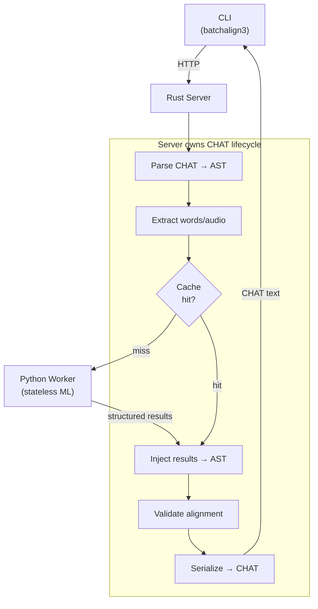
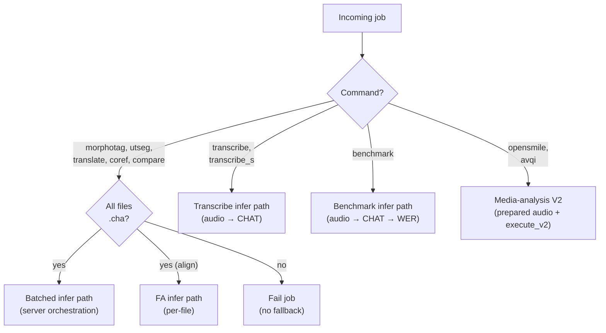
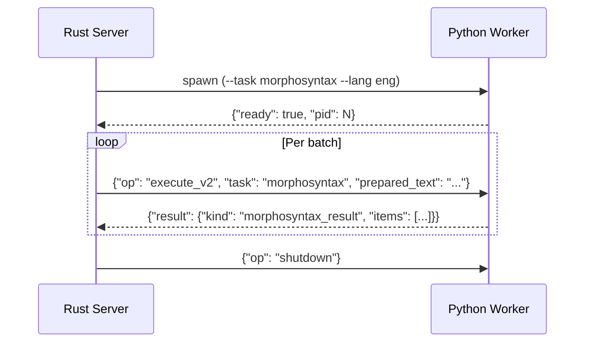

# Python–Rust Boundary

**Status:** Current
**Last updated:** 2026-05-01 16:58 EDT

The talkbank-tools workspace has two architectural layers: the **CHAT
core** (entirely Rust, no Python) and the **Batchalign runtime** (Rust
server + Python ML workers). This page describes the one and only
seam: the CHAT-ownership boundary between the Batchalign Rust server
and its Python workers.

The CHAT core has no Python in it at all. References to Python below
apply only to the Batchalign runtime layer.

## Server Owns the CHAT Lifecycle

```
Server → parses CHAT → extracts payloads → checks cache →
         worker.execute_v2(task, prepared_batch) → Python runs model only →
         Server injects results → validates → serializes → CHAT text
```

Python workers never see CHAT text. They receive structured payloads
(words, audio chunks, prepared text) and return raw model output (UD
annotations, word timings, ASR tokens, parse trees). The Rust server
owns the full CHAT lifecycle.



This architecture eliminates duplicated logic between Python and Rust,
enables unified caching at the server level, and makes workers
interchangeable — any worker with the right model can serve any
request.

## Dispatch Decision

Text-only commands **require** the infer path. If a worker lacks the
required task in its `infer_tasks` capability list, the job fails with
an "upgrade required" error — there is no Python `process` fallback.



Per-command dispatch family detail is on the
[Dispatch and Execution](../runtime/dispatch.md) page (will
move under `architecture/runtime/` during the M6 merge).

## Wire Protocol

Workers communicate via stdio JSON-lines. The bootstrap handshake plus
per-job dispatch:



### Operations

| Op | Handler | Description |
|---|---|---|
| `health` | Python | Worker health status |
| `capabilities` | Python | Available infer tasks + engine versions |
| `execute_v2` | Rust dispatcher → Python model | Typed V2 execution with prepared artifacts |
| `infer` / `batch_infer` | Python | Legacy inference path (still supported) |
| `shutdown` | Protocol | Clean worker shutdown |

`dispatch_protocol_message()` validates the JSON envelope in Rust, then
calls the appropriate Python handler.

### `execute_v2` request

```json
{
  "op": "execute_v2",
  "request": {
    "request_id": "req-mor-0004",
    "task": "morphosyntax",
    "payload": {
      "kind": "morphosyntax",
      "data": { "lang": "eng", "payload_ref_id": "text-ref-0004", "item_count": 2 }
    },
    "attachments": [
      { "kind": "prepared_text", "id": "text-ref-0004", "path": "/tmp/text-ref-0004.json" }
    ]
  }
}
```

Prepared artifacts (text, audio) are owned by Rust and read by the
worker via path references in `attachments` — they do not cross IPC
inline.

### `execute_v2` response

```json
{
  "op": "execute_v2",
  "response": {
    "request_id": "req-mor-0004",
    "outcome": { "kind": "success" },
    "result": {
      "kind": "morphosyntax_result",
      "data": { "items": [ ... ] }
    }
  }
}
```

Prepared-text batch items and response items are positionally matched
(`items[i]` corresponds to batch element `i`).

## Three-Layer Split — Internal Only

The Batchalign worker side is internally split into three layers. The
split exists for maintainability — none of these layers is a public
extension surface for third-party plugins.

### 1. Core primitives (Rust)

The Rust core (`crates/batchalign/`) owns CHAT parsing and
serialization, AST-safe mutation, extraction and injection helpers,
alignment, and validation invariants. This is the only layer that
directly owns low-level CHAT mutation rules.

### 2. Inference providers (Python, internal)

`batchalign/inference/` modules — pure Python task adapters around
third-party ML libraries (Stanza, Whisper, pyannote, FunASR, Tencent,
Aliyun, etc.). They receive typed task payloads from the Rust dispatch
layer and return typed task results. They do not parse `.cha` files
and do not mutate CHAT directly. Long-term intent: push as much of
this layer into Rust as Rust gains coverage of the underlying ML
pieces (Whisper-in-Rust is already gated and shipping).

### 3. Pipeline operations (Rust)

The CHAT-aware orchestration layers in Rust — choose extraction
strategy, batch requests, call providers via worker IPC, read/write
cache, inject results, apply task-specific validation and recovery.
Pipeline operations compose core primitives instead of editing raw
CHAT text themselves.

**Why the split is load-bearing.** If providers were forced to
understand CHAT, simple SDK wrappers would become more complex than
necessary, inference adapters would couple to AST details, and
language-agnostic providers would be harder to support. If CHAT-aware
pipeline work were forced into a provider-only interface, pipelines
could not safely reuse extraction/injection logic, would end up
reimplementing CHAT logic in Python, and caching/validation policy
would drift from the core.

### Boundary rules per layer

- **Provider layer** — typed worker-IPC payloads only. No `.cha`
  parsing, no direct tier editing. Implementations are Python today;
  long-term they migrate into Rust.
- **Pipeline layer** — operates on `ChatFile` in Rust. Uses core
  extraction and injection primitives. May depend on providers, but
  does not expose provider internals.
- **Core layer** — owns structural CHAT invariants. Exposes safe
  primitives upward. Does not depend on provider-specific SDK logic.

## No Public Python API

There is no supported way to plug new providers or new pipeline
operations into Batchalign from outside the source tree. New ASR
backends, FA backends, or pipeline operations are added in-tree. See
[Adding Inference Providers](../../batchalign/developer/adding-engines.md).

The internal Python re-export module `batchalign.providers` exists to
give worker-side inference modules a stable import path for worker-IPC
payload types (`BatchInferRequest`, `BatchInferResponse`, `InferTask`,
…). It is not a public API.

The `batchalign_core` PyO3 extension module is the Rust → Python
bridge for worker processes. Its symbols change with the Rust runtime
and are not part of any compatibility surface.

For the API stability stance see
[API Stability](../../batchalign/developer/api-stability.md).

### What stays Python

| Surface | Why |
|---|---|
| `batchalign/worker/` | Thin worker host for Python-native ML runtimes |
| `batchalign/inference/` | Direct model or SDK invocation (Stanza, Whisper, pyannote, …) |
| `batchalign/inference/languages/cantonese/` | Python-only Cantonese SDK and model boundaries |
| `batchalign/models/` | Training code depending on Python ML libraries |

### What was removed

| Surface | Why removed |
|---|---|
| `ParsedChat` class + callback methods | Rust server uses `ChatFile` directly |
| `batchalign.pipeline_api` | Rust server owns pipeline orchestration |
| `batchalign.compat` | Deprecated BA2 shim, no longer needed |
| `batchalign.inference.benchmark` | WER scoring available via `batchalign3 compare` |
| Standalone `#[pyfunction]` exports (build_chat, WER, extraction, …) | Server calls `batchalign` directly |

Number expansion lives entirely in Rust (see
[Number Expansion](../../batchalign/architecture/number-expansion.md));
the Python `_number_expansion.py` and `_expand_numbers_v2.py` modules
and the `expand_numbers` V2 IPC are not used.

## `batchalign_core` Module Layout

`crates/batchalign-pyo3/src/` (~3,250 lines):

```
lib.rs                  module registration (~80 lines)
worker_protocol.rs      IPC message dispatch
worker_asr_exec.rs      ASR execution (Whisper, Cantonese providers)
worker_fa_exec.rs       forced-alignment execution
worker_media_exec.rs    speaker diarization, OpenSMILE, AVQI
worker_text_results.rs  text task normalization + align_tokens
worker_artifacts.rs     prepared-artifact loading from IPC
cantonese_asr_bridge.rs Cantonese provider projection + normalization
py_json_bridge.rs       Python → JSON conversion utility
```

### Worker V2 executors

Each executor loads Rust-prepared artifacts from the IPC message,
calls the Python ML model, and returns raw results:

| Executor | Task | What Rust prepares | What Python does |
|---|---|---|---|
| `execute_asr_request_v2` | ASR | PCM audio bytes | Run Whisper / Cantonese provider |
| `execute_forced_alignment_request_v2` | FA | PCM audio + word JSON | Run Whisper / Wave2Vec FA |
| `execute_speaker_request_v2` | Speaker | PCM audio bytes | Run pyannote / NeMo |
| `execute_opensmile_request_v2` | OpenSMILE | PCM audio bytes | Extract acoustic features |
| `execute_avqi_request_v2` | AVQI | Paired audio bytes | Calculate voice quality |
| `normalize_text_task_result` | Text tasks | n/a | Reshape `BatchInferResponse` → V2 types |

### Cantonese provider bridges

Python Cantonese ASR engines call back into Rust for output projection
(common `monologues + timed_words` shape):

| Function | Purpose |
|---|---|
| `funaudio_segments_to_asr` | FunASR segments → monologues + timed words |
| `tencent_result_detail_to_asr` | Tencent output → monologues + timed words |
| `aliyun_sentences_to_asr` | Aliyun output → monologues + timed words |
| `normalize_cantonese` | Simplified → traditional + domain replacements |
| `cantonese_char_tokens` | Per-character tokenization for Cantonese FA |

### Rev.AI HTTP client

`crates/batchalign/src/revai/` provides Rev.AI HTTP calls. The Rust
server uses this crate directly for all Rev.AI operations (transcribe,
UTR, pre-submission). No Rev.AI functions are exposed to Python — the
PyO3 wrappers were removed as dead code.

### GIL strategy

All pure-Rust functions use `py.detach()` (PyO3 0.28) to release the
GIL during computation. Worker executors hold the GIL only during
Python model invocation.

## Python Worker Modules

`batchalign/worker/`:

| Module | Purpose |
|---|---|
| `_main.py` | Worker CLI entry point and stdio startup |
| `_model_loading/` | Task-level model-loading package (`bootstrap`, `translation`, `forced_alignment`, `asr`) |
| `_stanza_loading.py` | Stanza configuration and ISO-code mapping |
| `_execute_v2.py` | Typed V2 execute router for prepared-audio and prepared-text tasks |
| `_text_v2.py` | Thin batched text-task V2 host; Rust owns text-task batch-result shaping |
| `_artifact_inputs_v2.py` | Thin Python wrapper over Rust-owned prepared-artifact lookup, descriptor validation, file-slice reads |
| `_asr_v2.py` / `_fa_v2.py` / `_speaker_v2.py` / `_opensmile_v2.py` / `_avqi_v2.py` | Thin Python wrappers over Rust-owned executor control planes |
| `_types_v2.py` | Pydantic models mirroring V2 wire format |
| `_protocol.py` | Stdio JSON-lines serving loop |
| `_protocol_ops.py` | Thin Python wrapper over Rust-owned stdio op dispatch |
| `_handlers.py` | Health, capabilities, preflight handlers |
| `_infer_hosts.py` | Bootstrap-owned batch-infer runtime hosts |
| `_infer.py` | Thin request-time batch inference router |
| `_types.py` | Pydantic models mirroring Rust wire format |

`batchalign/inference/`:

| Module | Input → Output |
|---|---|
| `morphosyntax.py` | words+lang → raw Stanza UD annotations |
| `utseg.py` | words+lang → raw constituency parse tree |
| `translate.py` | text+lang → translated text |
| `coref.py` | sentences → coreference chains |
| `fa.py` | audio+words → raw word-level timings |
| `asr.py` | audio path / prepared waveform → raw ASR payloads |
| `speaker.py` | prepared waveform → raw speaker diarization segments |
| `opensmile.py` | prepared waveform → raw acoustic feature rows |
| `avqi.py` | paired prepared waveforms → raw voice quality metrics |
| `benchmark.py` | Thin convenience wrapper over `batchalign_core.wer_metrics()` |

Each is a pure inference function — no CHAT parsing, no text
processing, no domain logic.

## Capability Discovery

Capabilities are detected **lazily** from the first real worker spawn —
no dedicated probe worker at startup. When the first worker for any
profile starts up, the Rust server queries it and:

1. **Infer tasks** — which inference backends are available
   (`_capabilities()` import probes in
   `batchalign/worker/_handlers.py`).
2. **Engine versions** — non-empty engine identifier per advertised
   infer task, used for cache / version gating.

The Rust server then runs these through
`validate_infer_capability_gate()`, which validates the engine-version
table and derives the released command surface from infer-task
support. Server-owned commands (`transcribe`, `transcribe_s`,
`benchmark`) are synthesized there from ASR availability rather than
advertised by the worker.

### Infer-task probes

Each `InferTask` has a set of Python imports that must succeed for it
to be advertised:

| InferTask | Required imports | Default engine version |
|---|---|---|
| `morphosyntax` | `stanza` | `"stanza"` |
| `utseg` | `stanza` | `"stanza"` |
| `coref` | `stanza` | `"stanza"` |
| `translate` | `googletrans` | `"googletrans-v1"` |
| `fa` | `torch`, `torchaudio` | `"whisper"` |
| `asr` | `whisper` or a configured Rev.AI key | `"whisper"` or `"rev"` |
| `opensmile` | `opensmile` | `"opensmile"` |
| `avqi` | `parselmouth`, `torchaudio` | `"praat"` |
| `speaker` | `pyannote.audio` | `"pyannote"` |

Rev.AI-backed server-mode transcription and Rev-backed UTR are
synthesized on the Rust side. The infer-task table represents "can the
system satisfy this infer task at all?", not only "can Python import a
local model package?".

> **Design note:** Probes use **import probes** (can the dependency be
> imported?), not loaded model state (is a model warmed up?). This is
> critical because the worker that reports capabilities may only load
> models for one command, but Rust still needs enough information to
> derive the released command surface. All dependencies in the table
> are part of the base `batchalign3` package — a standard
> `uv tool install batchalign3` gives you every built-in engine
> family. The import probes exist as a safety net for environments
> where a dependency failed to install or was removed.

`speaker` is a worker infer task, not a standalone CLI command. The
user-facing diarization surface is `transcribe_s` / `--diarize`.

### Sample capabilities response

```json
{
  "commands": [],
  "infer_tasks": ["morphosyntax", "utseg", "translate", "coref", "fa",
                  "asr", "opensmile", "avqi", "speaker"],
  "engine_versions": {
    "morphosyntax": "1.9.2",
    "utseg": "1.9.2",
    "translate": "googletrans-v1",
    "coref": "1.9.2",
    "fa": "whisper-fa-whisper-large-v2",
    "asr": "rev-v1"
  }
}
```

Engine versions drive cache invalidation: when a worker reports a new
engine version, previously cached results for that task are
automatically invalidated by the cache layer. The `commands` field
remains only as compatibility metadata on the older `infer` /
`batch_infer` IPC ops; current callers should treat
`infer_tasks + engine_versions` as the authoritative capability
contract.

### Checking capabilities at runtime

```bash
curl http://localhost:8000/health | python3 -m json.tool
```

The `capabilities` field lists all advertised commands. If a command
you expect is missing, the corresponding infer task likely failed its
import probe or did not report an engine version.

## See also

- [INTERFACE_MAP.md](https://github.com/TalkBank/talkbank-tools/blob/main/INTERFACE_MAP.md)
  — unified reference for all 9+ Python/Rust interface boundaries
  (file locations, schema definitions, responsibility splits).
- Per-command engine surfaces (request/response shapes per task,
  per-command server orchestration steps): on the
  [Dispatch and Execution](../runtime/dispatch.md) page.
- [Cantonese and CJK — Architecture](../language-and-multilingual/cantonese-and-cjk.md)
  for the Cantonese-specific Python ↔ Rust seam.
