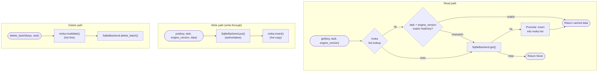
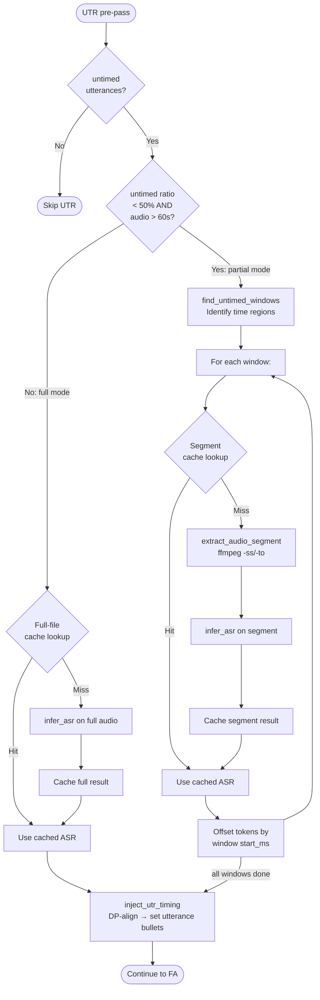

# Audio-Task Cache

**Status:** Current
**Last updated:** 2026-05-01 17:07 EDT

Batchalign caches **audio-task results** (forced alignment, UTR ASR,
media conversion). It does **not** cache text-NLP results
(morphosyntax, utterance segmentation, translation). All caching is
managed by the Rust server — Python workers are cache-unaware.

For the CHAT-core validation cache used by `chatter validate` and
the LSP, see
[validation cache](../parser-and-grammar/validation-cache.md).

## Why no text-NLP cache

A production-scale benchmark during development showed that the
text-NLP cache was net negative:

| Metric | Value |
|---|---|
| Cache hit rate on a 15,748-file corpus rerun | 6–16% |
| SQLite lookup time per 25-file window | 2,500 ms |
| Inference time saved by hits | ~100 ms |
| **Net effect** | **Cache ≈ 25× slower than re-inference** |

With warm Stanza workers, batched text inference runs at ~4 ms /
sentence. Cache lookup against a multi-GB SQLite beat that by more
than an order of magnitude. The arithmetic rules out every hit-rate
scenario — for cache to win you'd need
`lookup < hit_rate × inference_time`, i.e. hit rate > 2,500% at the
observed costs. Not achievable.

Additional reasons:

1. **Most utterances are unique across files.** Only short common
   phrases ("thank you", "okay") repeat. The 6–16% observed hit rate
   reflects this.
2. **Staleness is always a problem.** Model upgrades and pipeline
   changes invalidate entries; stale entries that pass the version
   check but fail injection validation waste time and produce
   confusing warnings.
3. **The cache grew without bounds.** No eviction, no vacuum, no WAL
   checkpointing. After a corpus rerun the SQLite database was
   multi-GB and every query was slow.

Text-NLP caching is absent end-to-end: no CLI flag, no cache key
computation, no cache read, no cache write, no code paths to audit.
Every text-NLP request flows straight through to the Python worker.

### Difference from batchalign2

Batchalign2 still has a morphotag cache (Python-side, per-utterance).
The cache is not present in batchalign3 — the net-negative benchmark
above is why. If you are comparing the two tools, expect batchalign2
to be faster on exact-repeat reruns of identical input and
batchalign3 to be faster in every other scenario because of its
warm-worker batching. The shape of the workloads TalkBank actually
runs (corpus validation, model upgrades, incremental edits) puts
every real scenario in the second bucket.

## Why audio caching helps

1. **Audio inference is expensive.** Whisper ASR takes 30–120 seconds
   per file. FA takes 10–60 seconds. Caching saves minutes, not
   milliseconds.
2. **Audio rarely changes.** The same `.mp3` file produces the same
   transcription every time. The `AudioIdentity` key (path + mtime +
   size) correctly invalidates on re-encoding.
3. **Hit rates are high for repeated alignment.** Re-running `align`
   on a corpus where only a few files changed gives near-100% hit
   rate for unchanged audio.

## Tiered Cache Architecture

`crates/batchalign/src/cache/` stores per-utterance audio results so
that re-processing a corpus skips utterances whose results are
already known.

- **`CacheBackend` trait** — storage contract (get, put, delete; both
  single and batched).
- **`TieredCacheBackend`** — production implementation; in-memory
  [moka](https://github.com/moka-rs/moka) hot layer wrapping a
  persistent `SqliteBackend` cold layer.
- **`SqliteBackend`** — persistent storage via SQLite WAL mode for
  concurrent read/write safety.
- **`UtteranceCache`** — public entry point, wraps
  `Box<dyn CacheBackend>`.

| Layer | Implementation | Capacity | Eviction |
|---|---|---|---|
| **Hot** | `moka::future::Cache` | 10,000 entries (~5–20 MB) | 24h time-to-idle |
| **Cold** | `SqliteBackend` (WAL, 5-connection pool) | Unbounded (disk) | None (manual or `--override-media-cache`) |

The hot layer absorbs repeated lookups and reduces SQLite round-trips
under concurrent workloads (parallel FA or transcribe processing
multiple files via `JoinSet` + `Semaphore`).

- **Read path** — check moka → on hit, verify task + engine_version
  match → on mismatch or miss, fall through to SQLite → promote cold
  hits to moka.
- **Write path** — write to SQLite first (authoritative), then insert
  into moka. Write-through, not write-back — no data loss on crash.
- **Delete path** — invalidate moka first, then delete from SQLite.

The moka key is the bare BLAKE3 hash string. Task and engine_version
are stored inside the hot entry and checked on read, matching the
SQLite schema where `key` is the primary key.

### Database location

| Platform | Path |
|---|---|
| macOS | `~/Library/Caches/batchalign3/cache.db` |
| Linux | `~/.cache/batchalign3/cache.db` |

## Cache Keys

Keys are **BLAKE3** content-addressed hashes (64-character hex
strings), computed by the `CacheKey` newtype in
`crates/batchalign/src/cache_key.rs`. There is no constructor from
arbitrary strings — keys can only be created through the
task-specific `cache_key()` functions, which hash input payloads
internally.

### `AudioIdentity`

The `AudioIdentity` newtype (`crates/batchalign/src/fa/mod.rs`)
identifies an audio file for cache keying. It is computed from
**filesystem metadata only**, not from a content hash of the audio
data.

**Format:** `"{resolved_path}|{mtime_secs}|{file_size}"`

Construction in `compute_audio_identity()`
(`runner/util/media.rs`):

1. `tokio::fs::metadata(audio_path)` to get file metadata.
2. Extract `meta.len()` (file size in bytes).
3. Extract `meta.modified()` (mtime seconds since Unix epoch).
4. Build `AudioIdentity::from_metadata(path, mtime_secs, size)`.

Implications:

- **Renaming or moving a file changes the identity** because the
  resolved path is part of the key.
- **Re-encoding audio changes the identity** because re-encoding
  changes both mtime and file size.
- **Touching a file (updating mtime without changing content)
  changes the identity**, causing a cache miss.
- **Copying a file preserves content but changes mtime**, so the
  copy gets a different identity.
- **No content hashing is performed** — deliberate performance
  tradeoff.

### `CacheTaskName`

Audio tasks that use the cache:

| Variant | Wire string | Orchestrator |
|---|---|---|
| `ForcedAlignment` | `forced_alignment` | `fa/` |
| `UtrAsr` | `utr_asr` | `runner/dispatch/fa_pipeline.rs` (UTR pre-pass) |

The enum also includes `Morphosyntax`, `UtteranceSegmentation`, and
`Translation` variants — they are kept as named constants so
`--override-media-cache-tasks morphosyntax` continues to parse
cleanly, but no code writes or reads entries under those task names.

### Per-task key composition

| Task | Key components |
|---|---|
| Forced alignment | audio identity + time window + words + pauses + timing mode + engine |
| UTR ASR (full-file) | `"utr_asr"` + audio identity + lang |
| UTR ASR (segment) | `"utr_asr_segment"` + audio identity + start_ms + end_ms + lang |

## Invalidation Matrix

Which user actions cause cache misses (force re-inference) per task:

| Action | FA | UTR full | UTR segment |
|---|---|---|---|
| Edit transcript words | Miss | Hit | Hit |
| Change language code | Miss | Miss | Miss |
| Re-record audio | Miss | Miss | Miss |
| Change FA engine | Miss | Hit | Hit |
| Change ASR engine | Hit | Hit\* | Hit\* |
| Upgrade model version | Miss | Miss | Miss |
| Use `--override-media-cache` | Skip | Skip | Skip |

\* UTR cache keys do not include engine name, but engine_version
scoping at the SQLite/moka layer catches model upgrades (the entry's
stored engine_version must match the current one).

**Key insight:** UTR cache keys are audio-only (no transcript text),
so editing the transcript does not invalidate ASR results — correct
because UTR re-derives timing from the same audio. FA cache keys
include transcript text, so only groups whose words changed need to
re-run forced alignment.

## Engine Version Scoping

Each cache entry is scoped to an **engine version** string (e.g.,
Whisper version, `"wave2vec-fa-mms-{torchaudio_version}"`). Upgrading
a model automatically invalidates stale entries because lookups
require an exact version match.

Engine version strings are reported by Python workers at startup via
the `capabilities` IPC response. The Rust server stores them in
`AppState::engine_versions` and looks up the per-task version when
constructing `PipelineServices`.

The FA pipeline uses its own engine_version for both FA cache entries
and UTR ASR cache entries. This means upgrading the FA model
invalidates UTR ASR cache entries too, even though UTR uses the ASR
worker — design choice to keep the FA pipeline's `PipelineServices`
consistent across its sub-stages.

## Cache Workflow in Orchestrators

Every audio orchestrator follows this pattern:

1. **Collect payloads** (FA groups, UTR segments) from the parsed
   CHAT AST.
2. **Compute cache keys** (BLAKE3 hash of payload content).
3. **Batch lookup** — hit entries are injected directly.
4. **Infer misses** — send uncached payloads to Python workers.
5. **Inject results** into the AST.
6. **Batch put** — persist new results for future reuse.

## Self-Correcting Cache Purges

When post-serialization validation fails, the server deletes the
cache entries that produced the invalid output. This prevents stale
or broken results from being served on future runs. Validation
failures also trigger bug reports to `~/.batchalign3/bug-reports/`.

## Override

`--override-media-cache` bypasses audio cache lookups, forcing fresh
inference for every payload. Use this when validating behavior
changes or after model upgrades. For a developer-facing guide on when
`--override-media-cache` is actually needed after code changes, see
the
[Cache Override Guide](../../batchalign/architecture/cache-override-guide.md).

`UtteranceCache::noop()` creates a backend that always misses and
silently discards puts. Available for testing.

## UTR ASR Caching

UTR (Utterance Timing Recovery) ASR results are cached, making
repeat alignment runs on the same audio instant.

- **Full-file mode** — caches the entire `AsrResponse` with key
  `BLAKE3("utr_asr|{audio_identity}|{lang}")`. Default for
  mostly-untimed files or short audio.
- **Partial-window mode** — activates when >50% of utterances are
  timed and the audio exceeds 60 seconds. Each untimed window is
  extracted via ffmpeg and cached independently with key
  `BLAKE3("utr_asr_segment|{audio_identity}|{start_ms}|{end_ms}|{lang}")`.
  Avoids processing already-timed regions on the first run. After
  the first run, the full-file cache makes the distinction moot.

Both modes respect `CachePolicy` — `--override-media-cache` skips
lookups but still stores results for future use.

## What Is NOT Cached

- **Morphosyntax, utterance segmentation, translation** — text-NLP
  tasks, removed from the cache for the benchmark reasons above.
- **Speaker diarization** — depends on full audio context.
- **Coreference** — document-level (not per-utterance); results
  depend on full document context.
- **OpenSMILE features** — fast enough to recompute.
- **AVQI scores** — fast enough to recompute.

## Media Conversion Cache

MP4 video files are converted to WAV for alignment and cached at
`~/.batchalign3/media_cache/` keyed by content fingerprint. MP3 and
WAV files are used directly (no conversion). Media resolution is
handled by `crates/batchalign/src/media.rs`.
