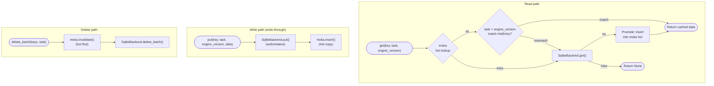
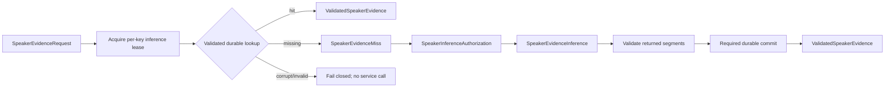
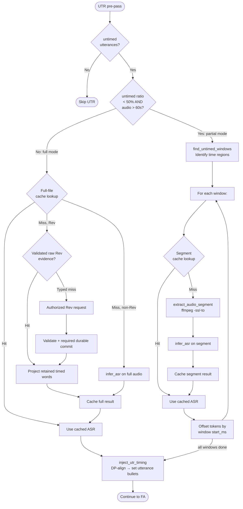

# Audio-Task Cache

**Status:** Current
**Last updated:** 2026-08-28 19:15 EDT

Batchalign caches **audio-task results** (forced alignment, UTR ASR, raw Rev
transcript evidence, dedicated transcribe speaker evidence, and media
conversion). It does **not** cache text-NLP results
(morphosyntax, utterance segmentation, translation). All caching is
managed by the Rust server, Python workers are cache-unaware.

For the CHAT-core validation cache used by `chatter validate`, see
[validation cache](../parser-and-grammar/validation-cache.md).

## Why no text-NLP cache

A production-scale benchmark during development showed that the
text-NLP cache was net negative:

| Metric | Value |
|---|---|
| Cache hit rate on a 15,748-file corpus rerun | 6-16% |
| SQLite lookup time per 25-file window | 2,500 ms |
| Inference time saved by hits | ~100 ms |
| **Net effect** | **Cache ≈ 25× slower than re-inference** |

With warm Stanza workers, batched text inference runs at ~4 ms /
sentence. Cache lookup against a multi-GB SQLite beat that by more
than an order of magnitude. The arithmetic rules out every hit-rate
scenario, for cache to win you'd need
`lookup < hit_rate × inference_time`, i.e. hit rate > 2,500% at the
observed costs. Not achievable.

Additional reasons:

1. **Most utterances are unique across files.** Only short common
   phrases ("thank you", "okay") repeat. The 6-16% observed hit rate
   reflects this.
2. **Staleness is always a problem.** Model upgrades and pipeline
   changes invalidate entries; stale entries that pass the version
   check but fail injection validation waste time and produce
   confusing warnings.
3. **The cache grew without bounds.** No eviction, no vacuum, no WAL
   checkpointing. After a corpus rerun the SQLite database was
   multi-GB and every query was slow.

Text-NLP caching is absent end-to-end: no CLI flag, no cache key
computation, no cache read, no cache write, no code paths to audit.
Every text-NLP request flows straight through to the Python worker.

### Difference from batchalign2

Batchalign2 still has a morphotag cache (Python-side, per-utterance).
The cache is not present in batchalign3, the net-negative benchmark
above is why. If you are comparing the two tools, expect batchalign2
to be faster on exact-repeat reruns of identical input and
batchalign3 to be faster in every other scenario because of its
warm-worker batching. The shape of the workloads TalkBank actually
runs (corpus validation, model upgrades, incremental edits) puts
every real scenario in the second bucket.

## Why audio caching helps

1. **Audio inference is expensive.** Whisper ASR takes 30-120 seconds
   per file. FA takes 10-60 seconds. Caching saves minutes, not
   milliseconds.
2. **Audio rarely changes.** FA and UTR use `AudioIdentity` (path + mtime +
   size). Speaker raw evidence uses a full BLAKE3 byte digest so copies and
   renames share results while changed source bytes invalidate them.
3. **Hit rates are high for repeated alignment.** Re-running `align`
   on a corpus where only a few files changed gives near-100% hit
   rate for unchanged audio.

## Tiered Cache Architecture

`crates/batchalign/src/cache/` stores per-utterance audio results so
that re-processing a corpus skips utterances whose results are
already known.

- **`CacheBackend` trait**: storage contract (get, put, delete; both
  single and batched).
- **`TieredCacheBackend`**: production implementation; in-memory
  [moka](https://github.com/moka-rs/moka) hot layer wrapping a
  persistent `SqliteBackend` cold layer.
- **`SqliteBackend`**: persistent storage via SQLite WAL mode for
  concurrent read/write safety.
- **`UtteranceCache`**: public entry point, wraps
  `Box<dyn CacheBackend>`.

| Layer | Implementation | Capacity | Eviction |
|---|---|---|---|
| **Hot** | `moka::future::Cache` | 10,000 entries (~5-20 MB) | 24h time-to-idle |
| **Cold** | `SqliteBackend` (WAL, 5-connection pool) | Unbounded (disk) | None (manual or `--override-media-cache`) |

The hot layer absorbs repeated lookups and reduces SQLite round-trips
under concurrent workloads (parallel FA or transcribe processing
multiple files via `JoinSet` + `Semaphore`).


```mermaid
flowchart TD
    subgraph "Read path"
        r_start(["get(key, task, engine_version)"])
        r_moka{"moka\nhot lookup"}
        r_verify{"task + engine_version\nmatch HotEntry?"}
        r_cold["SqliteBackend.get()"]
        r_promote["Promote: insert\ninto moka hot"]
        r_hit(["Return cached data"])
        r_miss(["Return None"])

        r_start --> r_moka
        r_moka -->|hit| r_verify
        r_moka -->|miss| r_cold
        r_verify -->|match| r_hit
        r_verify -->|mismatch| r_cold
        r_cold -->|hit| r_promote --> r_hit
        r_cold -->|miss| r_miss
    end

    subgraph "Write path (write-through)"
        w_start(["put(key, task, engine_version, data)"])
        w_sqlite["SqliteBackend.put()\n(authoritative)"]
        w_moka["moka.insert()\n(hot copy)"]
        w_start --> w_sqlite --> w_moka
    end

    subgraph "Delete path"
        d_start(["delete_batch(keys, task)"])
        d_moka["moka.invalidate()\n(hot first)"]
        d_sqlite["SqliteBackend.delete_batch()"]
        d_start --> d_moka --> d_sqlite
    end
```

- **Read path**: check moka → on hit, verify task + engine_version
  match → on mismatch or miss, fall through to SQLite → promote cold
  hits to moka.
- **Write path**: write to SQLite first (authoritative), then insert
  into moka. Write-through, not write-back, no data loss on crash.
- **Delete path**: invalidate moka first, then delete from SQLite.

The moka key is the bare BLAKE3 hash string. Task and engine_version
are stored inside the hot entry and checked on read, matching the
SQLite schema where `key` is the primary key.

### Database location

| Platform | Path |
|---|---|
| macOS | `~/Library/Caches/batchalign3/cache.db` |
| Linux | `~/.cache/batchalign3/cache.db` |

## Cache Keys

Keys are **BLAKE3** content-addressed hashes (64-character hex
strings), computed by the `CacheKey` newtype in
`crates/batchalign/src/chat_ops/cache_key.rs`. There is no constructor from
arbitrary strings, keys can only be created through the
task-specific `cache_key()` functions, which hash input payloads
internally.

### `AudioIdentity` (FA and UTR)

The `AudioIdentity` newtype (`crates/batchalign/src/chat_ops/fa/mod.rs`)
identifies an audio file for cache keying. It is computed from
**filesystem metadata only**, not from a content hash of the audio
data.

**Format:** `"{resolved_path}|{mtime_secs}|{file_size}"`

Construction in `compute_audio_identity()`
(`runner/util/media.rs`):

1. `tokio::fs::metadata(audio_path)` to get file metadata.
2. Extract `meta.len()` (file size in bytes).
3. Extract `meta.modified()` (mtime seconds since Unix epoch).
4. Build `AudioIdentity::from_metadata(path, mtime_secs, size)`.

Implications:

- **Renaming or moving a file changes the identity** because the
  resolved path is part of the key.
- **Re-encoding audio changes the identity** because re-encoding
  changes both mtime and file size.
- **Touching a file (updating mtime without changing content)
  changes the identity**, causing a cache miss.
- **Copying a file preserves content but changes mtime**, so the
  copy gets a different identity.
- **No content hashing is performed**: deliberate performance
  tradeoff.

This identity is not used for raw Rev or paid speaker evidence.

### `SpeakerAudioSourceDigest`

`transcribe --diarization enabled` streams the entire inference media source
through BLAKE3 in 1 MiB chunks. The digest contains no path or mtime. Its key
also contains the canonical preparation-recipe revision
(`mono-16khz-f32le-v1`), because the worker receives mono 16 kHz float32 PCM
rather than the source container bytes directly.

This design makes copies and renames hit without paying the cost of running
ffmpeg before every cache lookup. Different encodings of acoustically
identical media intentionally miss. If preparation semantics change, bump the
recipe revision.

### `RevProviderMediaDigest`

Rev evidence hashes the complete inference-media file that BA3 would upload to
Rev. The semantic key adds requested language, expected speaker count, Rev
request-policy revision, provider/model alias, and evidence schema. No path,
mtime, API credential, temporary upload URL, or Rev job ID participates.

### `CacheTaskName`

Audio tasks that use the cache:

| Variant | Wire string | Orchestrator |
|---|---|---|
| `ForcedAlignment` | `forced_alignment` | `fa/` |
| `UtrAsr` | `utr_asr` | `runner/dispatch/fa_pipeline.rs` (UTR pre-pass) |
| `SpeakerDiarizationRawEvidence` | `speaker_diarization_raw_evidence` | `pipeline/transcribe.rs` |
| `SpeakerDiarizationSegments` | `speaker_diarization_segments` | `pipeline/transcribe.rs` |
| `RevAsrEvidence` | `rev_asr_evidence` | `pipeline/transcribe.rs` + `revai/evidence_cache.rs` |

The enum also includes `Morphosyntax`, `UtteranceSegmentation`, and
`Translation` variants, they are kept as named constants so
`--override-media-cache-tasks morphosyntax` continues to parse
cleanly, but no code writes or reads entries under those task names.

### Per-task key composition

| Task | Key components |
|---|---|
| Forced alignment | audio identity + time window + words + gap-healing policy + engine |
| UTR ASR (full-file) | `"utr_asr"` + audio identity + lang |
| UTR ASR (segment) | `"utr_asr_segment"` + audio identity + start_ms + end_ms + lang |
| Raw dedicated-speaker evidence | schema + source-byte digest + preparation revision + backend + expected speakers + model revision |
| Derived speaker segments | raw-evidence fingerprint + normalization revision |
| Raw Rev ASR evidence | schema + provider-media digest + requested language + expected speakers + request-policy revision + model revision |

### Two-stage dedicated-speaker cache

Dedicated diarization deliberately separates paid/model inference from local
normalization:

```text
semantic request -> raw evidence key -> backend inference (only on raw miss)
raw evidence fingerprint + normalizer revision -> derived segment key
```

`SpeakerInferenceAuthorization` can only be constructed by consuming a proven
raw cache miss. A derived miss cannot authorize inference. It must first look
for raw evidence and, when present, run the Rust normalizer and commit a new
derived envelope. The worker result is a tagged evidence union, so a request
for one backend cannot commit evidence claiming another backend's provenance.

For pyannoteAI, the raw envelope contains the completed provider job ID, full
provider output object, and optional warning. The derived envelope contains
ordered millisecond speaker segments plus the raw fingerprint and
normalization revision. Both envelopes fail closed on corruption; neither
corruption path silently becomes a paid miss.

## Invalidation Matrix

Which user actions cause cache misses (force re-inference) per task:

| Action | FA | UTR full | UTR segment | Speaker evidence |
|---|---|---|---|---|
| Edit transcript words | Miss | Hit | Hit | Hit |
| Change language code | Miss | Miss | Miss | Hit |
| Re-record audio | Miss | Miss | Miss | Miss |
| Rename/copy identical audio | Miss | Miss | Miss | Hit |
| Change FA engine | Miss | Hit | Hit | Hit |
| Change ASR engine | Hit | Hit\* | Hit\* | Hit |
| Change speaker backend/count | Hit | Hit | Hit | Miss |
| Upgrade identified model version | Miss | Miss | Miss | Miss |
| Use `--override-media-cache` | Skip | Skip | Skip | Refresh |

Raw Rev evidence invalidation is independent of those four columns:

| Action | Raw Rev evidence |
|---|---|
| Edit transcript words | Hit |
| Change inference-media bytes | Miss |
| Rename/copy byte-identical inference media | Hit |
| Change requested language or expected speakers | Miss |
| Change Rev request-policy/model revision | Miss |
| Use `--override-media-cache` | Refresh |

\* UTR cache keys do not include engine name, but engine_version
scoping at the SQLite/moka layer catches model upgrades (the entry's
stored engine_version must match the current one).

**Key insight:** UTR cache keys are audio-only (no transcript text),
so editing the transcript does not invalidate ASR results, correct
because UTR re-derives timing from the same audio. FA cache keys
include transcript text, so only groups whose words changed need to
re-run forced alignment.

## Engine Version Scoping

Each cache entry is scoped to an **engine version** string (e.g.,
Whisper version, `"wave2vec-fa-mms-{torchaudio_version}"`). Upgrading
a model automatically invalidates stale entries because lookups
require an exact version match.

Engine version strings are reported by Python workers at startup via
the `capabilities` IPC response. The Rust server stores them in
`AppState::engine_versions` and looks up the per-task version when
constructing `PipelineServices`.

The FA pipeline uses its own engine_version for both FA cache entries
and UTR ASR cache entries. This means upgrading the FA model
invalidates UTR ASR cache entries too, even though UTR uses the ASR
worker, design choice to keep the FA pipeline's `PipelineServices`
consistent across its sub-stages.

Speaker evidence deliberately does not accept that generic ASR/FA engine
version. `SpeakerEvidenceModelRevision` is a distinct newtype with private
construction from `SpeakerBackendV2`; this prevents an ASR version from being
used accidentally. The cloud revision is currently the provider-visible
`pyannote-ai:precision-2` alias. pyannoteAI does not return an immutable
backend build hash, so controlled experiments should use a forced refresh if
the provider may have changed the implementation behind that alias. Local
identifiers include the configured model family and BA3 package version; their
external model references currently float too.

Rev evidence likewise uses `RevAsrModelRevision`, not the Python worker ASR
version. The current provider-visible identity is
`revai:asynchronous-transcript-v1`; Rev does not expose an immutable acoustic
model build hash through this API, so controlled comparisons may require an
explicit refresh.

## Cache Workflow in Orchestrators

FA and UTR orchestrators follow this batch-oriented pattern:

1. **Collect payloads** (FA groups, UTR segments) from the parsed
   CHAT AST.
2. **Compute cache keys** (BLAKE3 hash of payload content).
3. **Batch lookup**: hit entries are injected directly.
4. **Infer misses**: send uncached payloads to Python workers.
5. **Inject results** into the AST.
6. **Batch put**: persist new results for future reuse.

## Paid Evidence Typestate

Rev and speaker evidence use a stricter state machine because a miss can
authorize a paid external call. Both share `InferenceLease`, a keyed
process-local single-flight guard, while retaining task-specific request,
miss, authorization, validation, and evidence types.

The speaker path is:


```mermaid
flowchart LR
    request[SpeakerEvidenceRequest] --> lease[Acquire per-key inference lease]
    lease --> lookup{Validated durable lookup}
    lookup -->|hit| replay[ValidatedSpeakerEvidence]
    lookup -->|missing| miss[SpeakerEvidenceMiss]
    lookup -->|corrupt/invalid| fail[Fail closed; no service call]
    miss --> auth[SpeakerInferenceAuthorization]
    auth --> service[SpeakerEvidenceInference]
    service --> validate[Validate returned segments]
    validate --> commit[Required durable commit]
    commit --> fresh[ValidatedSpeakerEvidence]
```

The fields of `SpeakerEvidenceMiss`, `SpeakerInferenceAuthorization`, and
`SpeakerEvidenceModelRevision` are private. Raw V2 worker inference is private
behind `SpeakerWorkerInference`. Consequently, the production transcribe
pipeline cannot construct permission to call the service without consuming a
real miss (or an explicit forced-refresh miss).

The process-local per-key lease spans lookup, inference, validation, and
commit. Concurrent identical requests cannot both observe a miss: followers
wait, then check the durable cache again. The persistent SQLite entry handles
later jobs and server restarts.

`resolve_speaker_evidence()` is the one production decision path and accepts a
`SpeakerEvidenceInference` implementation. Tests inject a call-counting fake
through this same function, so assertions measure crossings of the billable
boundary rather than merely testing SQLite in isolation.

Stored evidence is a versioned JSON envelope containing the request
fingerprint and normalized `SpeakerSegmentV2` list. Reads validate the schema,
fingerprint, nonempty labels, non-inverted intervals, and nondecreasing starts.
Corruption is an error, never a miss. A successful service response must be
validated and durably committed before the pipeline continues; a write error
fails the file instead of silently losing reusable evidence.

The cache currently preserves the exact normalized turns consumed by speaker
projection, not the provider's full raw JSON response. Retaining immutable raw
provider evidence and richer provenance is a separate future architecture
step.

### Raw Rev transcript evidence

`RevAsrEvidenceRequest` keys the provider-visible media and request semantics.
`RevAsrEvidenceMiss` is the only constructor route to
`RevAsrInferenceAuthorization`; `RevAsrService` requires that authorization
before it can perform language identification, submission, or polling.
`NonRevAsrBackend` is a smaller sum accepted by generic ASR inference, so the
pipeline cannot route `RustRevAi` around the evidence resolver.

The durable envelope stores `CompletedRevAsrEvidence`: resolved ISO-639-3
language plus the provider-shaped `Transcript` monologues and elements. It is
intentionally earlier than `transcript_to_asr_response()`. Changes to BA3 token
projection or ASR post-processing can therefore replay raw Rev evidence
without another provider call. Validation rejects negative speaker indices,
non-finite/negative timings, reversed intervals, and out-of-range confidence.
Corruption and commit failures are fatal, not misses.

Rev-backed `align` UTR uses the same resolver before projecting timed words.
Its older normalized `utr_asr` entry remains a faster derived-result cache, but
it is no longer the only protection against another provider request. A
malformed normalized entry or storage read error fails closed; if that derived
entry is absent after an algorithm change, the raw Rev envelope can be replayed
locally and committed in the new shape.

The old runner-wide Rev pre-submission path is currently disabled for
transcribe, benchmark, and align. It submitted jobs before cache lookup, so it
could not guarantee cost avoidance and its untyped optional job IDs bypassed
the miss authorization. Cold provider calls now fan out through normal
per-file concurrency. A future cache-aware parallel preflight may recover the
old wider submission window only if its plan variants carry validated hits or
typed miss authorizations.

## Self-Correcting Cache Purges

FA/UTR post-serialization validation can delete the cache entries that
produced invalid output. Rev and speaker envelopes instead validate at their
evidence boundaries; their keys are not yet retained through final CHAT
serialization for automatic downstream purge. Validation failures also
trigger bug reports to `~/.batchalign3/bug-reports/`.

## Override

`--override-media-cache` bypasses audio cache lookups, forcing fresh
inference for every payload. Use this when validating behavior
changes or after model upgrades. For a developer-facing guide on when
`--override-media-cache` is actually needed after code changes, see
the
[Cache Override Guide](../../batchalign/architecture/cache-override-guide.md).

`UtteranceCache::noop()` creates a backend that always misses and
silently discards puts. Available for testing.

## UTR ASR Caching

UTR (Utterance Timing Recovery) ASR results are cached, making repeat
alignment runs on the same audio instant. Rev-backed UTR additionally retains
the earlier provider evidence so projection experiments do not depend on the
derived cache shape.


```mermaid
flowchart TD
    start([UTR pre-pass]) --> count{untimed\nutterances?}
    count -->|No| skip([Skip UTR])
    count -->|Yes| ratio{untimed ratio\n< 50% AND\naudio > 60s?}

    ratio -->|Yes: partial mode| windows[find_untimed_windows\nIdentify time regions]
    ratio -->|No: full mode| full_cache{Full-file\ncache lookup}

    windows --> seg_loop["For each window:"]
    seg_loop --> seg_cache{Segment\ncache lookup}
    seg_cache -->|Hit| seg_use[Use cached ASR]
    seg_cache -->|Miss| seg_extract[extract_audio_segment\nffmpeg -ss/-to]
    seg_extract --> seg_asr[infer_asr on segment]
    seg_asr --> seg_store[Cache segment result]
    seg_store --> seg_use
    seg_use --> offset[Offset tokens by\nwindow start_ms]
    offset --> seg_loop

    full_cache -->|Hit| full_use[Use cached ASR]
    full_cache -->|Miss, non-Rev| full_asr[infer_asr on full audio]
    full_cache -->|Miss, Rev| rev_raw{Validated raw Rev\nevidence?}
    rev_raw -->|Hit| rev_project[Project retained timed words]
    rev_raw -->|Typed miss| rev_call[Authorized Rev request]
    rev_call --> rev_commit[Validate + required durable commit]
    rev_commit --> rev_project
    rev_project --> full_store
    full_asr --> full_store[Cache full result]
    full_store --> full_use

    full_use --> inject[inject_utr_timing\nDP-align → set utterance bullets]
    offset -->|all windows done| inject
    inject --> done([Continue to FA])
```

- **Full-file mode**: caches the entire `AsrResponse` with key
  `BLAKE3("utr_asr|{audio_identity}|{lang}")`. Default for
  mostly-untimed files or short audio.
- **Partial-window mode**: activates when >50% of utterances are
  timed and the audio exceeds 60 seconds. Each untimed window is
  extracted via ffmpeg and cached independently with key
  `BLAKE3("utr_asr_segment|{audio_identity}|{start_ms}|{end_ms}|{lang}")`.
  Avoids processing already-timed regions on the first run. After
  the first run, the full-file cache makes the distinction moot.

Both modes respect `CachePolicy`: `--override-media-cache` skips lookups but
still stores results for future use. Concurrent identical forced refreshes in
one process share the first newly committed result instead of issuing
sequential duplicate service calls.

## What Is NOT Cached

- **Morphosyntax, utterance segmentation, translation**: text-NLP
  tasks, removed from the cache for the benchmark reasons above.
- **Standalone `diarize` output**: the first speaker-evidence slice is wired to
  dedicated diarization inside `transcribe`; standalone output is not yet
  replayed from this cache.
- **Non-Rev ordinary `transcribe` ASR**: raw evidence caching currently covers
  the Rust-owned Rev boundary; other ASR engines still infer normally.
- **Coreference**: document-level (not per-utterance); results
  depend on full document context.
- **OpenSMILE features**: fast enough to recompute.
- **AVQI scores**: fast enough to recompute.

## Media Conversion Cache

MP4 video files are converted to WAV for alignment and cached at
`~/.batchalign3/media_cache/` keyed by content fingerprint. MP3 and
WAV files are used directly (no conversion). Media resolution is
handled by `crates/batchalign/src/media.rs`.
