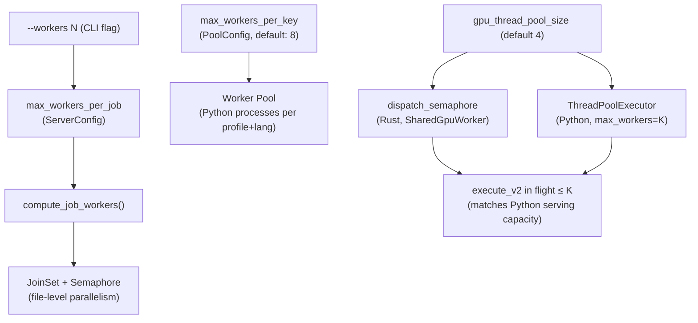
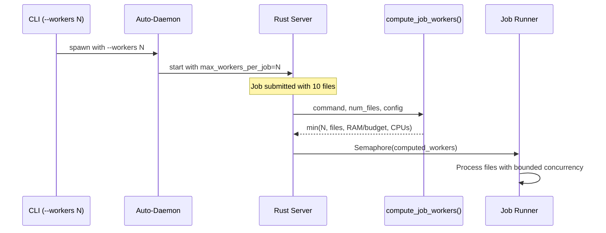
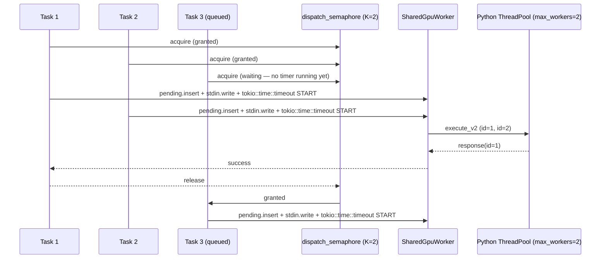
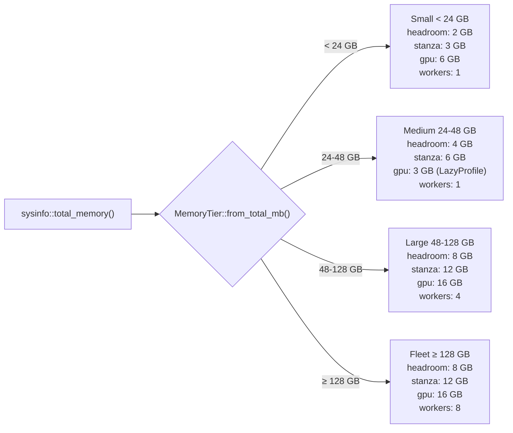
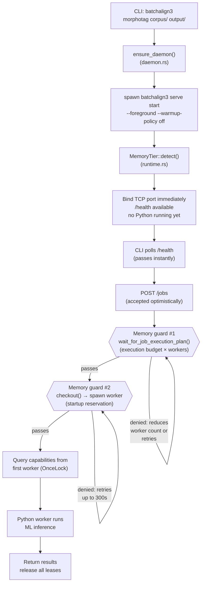
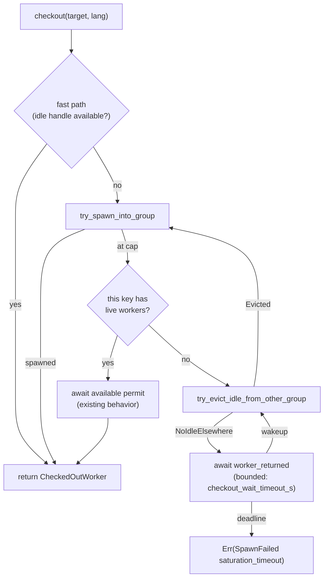
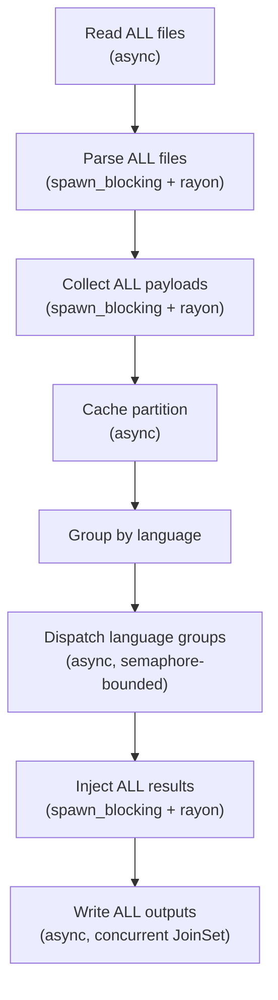

# Batchalign Workers

**Status:** Current
**Last updated:** 2026-05-19 17:38 EDT

Per-app worker concerns specific to the Batchalign runtime: pool
sizing, RAM-tier-aware memory budgets, model loading per worker,
saturation safeguards, and the three-layer parallelism model. For
shared concurrency primitives (Tokio runtime, the
`Semaphore + RAII` pool pattern, channels, lock ordering, mutex
policy), see [Concurrency](concurrency.md).

> **Implementation note.** Tier scaling is wired (b4189037).
> `estimate_per_worker_peak_mb_with_profile` (Phase β, `batchalign-types::memory`)
> clamps the per-job execution envelope to the detected tier's per-profile startup
> budget, so a 16 GB laptop with a clean memory state can admit a
> 1-worker morphotag job (Contract C-16GB is GREEN). The five
> architectural principles that prevent the layer-by-layer
> consolidation bug class from returning are documented in
> `<workspace>/docs/architecture/2026-05-10-tier-aware-memory-consolidation.md`.

## Three Layers of Parallelism

Batchalign has three independent parallelism controls:

Layer 3's twin nodes (`dispatch_semaphore` on the Rust side and
`ThreadPoolExecutor` on the Python side) share **one** ceiling
`K = gpu_thread_pool_size`. The Rust gate ensures a caller waiting
for an executor slot does not hold an active per-request timer; the
timer only ticks once a slot is granted and work is issued. See
`developer/worker-protocol-v2.md` § "The dispatch semaphore contract"
for the architectural rule.

### Layer 1: File parallelism (user-facing)

How many files are processed concurrently within a single job.

- **User control**: `--workers N` CLI flag, or `max_workers_per_job`
  in `server.yaml`.
- **Default**: GPU-heavy commands (`transcribe`, `align`,
  `benchmark`): **1 file** (prevents OOM). CPU-only commands
  (`morphotag`, `utseg`, `translate`): auto-tuned by
  `compute_job_workers()` based on available RAM and CPU cores.
- **Implementation**: `runner/dispatch/` uses a `JoinSet` with a
  `Semaphore(num_workers)` to cap concurrent file-processing tasks.

### Layer 2: Worker pool (operator-facing)

How many Python worker processes exist per `(profile, language,
engine)` key.

- **User control**: `max_workers_per_key` in `server.yaml` (not a
  CLI flag, operator concern).
- **Default**: 8 per key. GPU profile: 1 process (concurrent via
  threads). Stanza profile: auto-tuned. IO profile: 1 process.
- **Implementation**: `worker/pool/mod.rs` manages worker
  lifecycle. Workers are spawned lazily and cached.

### Layer 3: GPU dispatch concurrency (Rust gate + Python pool)

How many `execute_v2` calls are in flight at the same time per
shared GPU worker.

- **User control**: `gpu_thread_pool_size` in `server.yaml`
  (default 4). Single knob sets both Python
  `ThreadPoolExecutor(max_workers=K)` and Rust-side
  `dispatch_semaphore` permit count.
- **Default**: 4. On Apple Silicon (MPS excluded for batchalign3),
  set to 1, there is no compute parallelism to gain, and a higher
  value just means CPU-bound inferences contending for cores.
- **Implementation**
  - Rust: `worker/pool/shared_gpu/stdio.rs` and
    `worker/pool/shared_gpu/tcp.rs` each carry a
    `dispatch_semaphore: Arc<Semaphore>` with `K` permits, acquired
    *before* the per-request timeout starts.
  - Python:
    `batchalign/worker/_protocol.py::_serve_stdio_concurrent` hosts
    a `ThreadPoolExecutor(max_workers=K)`.

Task 3's per-request timer only starts at the moment it acquires the
permit, never during queue-wait. This is the contract asserted by
`tests/gpu_concurrent_dispatch.rs::gpu_concurrent_dispatch_does_not_charge_queue_wait_against_per_request_timeout`.

### Why GPU commands default to 1 worker

Each GPU-heavy inference (Whisper ASR, Whisper FA, Wave2Vec) loads
2-5 GB of model weights into GPU/MPS memory. Multiple concurrent
files all share the same GPU memory pool.

On a 64 GB developer machine with MPS:

- 1 concurrent file: ~5 GB GPU memory, safe.
- 4 concurrent files: ~20 GB GPU pressure, risky.
- 8 concurrent files (old default): ~40 GB GPU pressure, kernel
  OOM crash.

Setting GPU commands to default to 1 file prevents this class of
crash entirely. Operators with dedicated GPU hardware can safely
increase via `--workers N` or `server.yaml`.

## RAM-Tier Adaptive Budgets

All memory budgets are scaled automatically based on total system
RAM. The server detects the tier once at startup and logs it. No
user configuration, works on machines from 16 GB laptops to 256 GB
servers.

Medium-tier GPU uses **LazyProfile** mode: the GPU worker starts
with only process overhead (~3 GB), loading model weights on demand
rather than at spawn. This is what lets a 32 GB workstation admit a
GPU worker at all, eager-loading 16 GB of Whisper weights would
fail the headroom check.

The Large and Fleet tiers reproduce the original fixed constants
from `runtime_constants.toml` exactly, fleet machines see zero
behavior change. The TOML constants remain as the Large/Fleet
baseline; the tier system scales them down for smaller machines.

**Source:** `crates/batchalign/src/types/runtime.rs`,
`MemoryTier::from_total_mb()` (pure, testable) and
`MemoryTier::detect()` (reads sysinfo).

### Why small machines need smaller budgets

The original constants were tuned for 64-256 GB fleet machines where
multiple concurrent workers are the norm. On a 16 GB laptop the
fleet defaults are infeasible:

- **Stanza startup 12 GB** exceeds available memory (~9 GB on macOS)
  → daemon can never start.
- **Host headroom 8 GB** leaves no room for any worker at all.
- **GPU startup 16 GB** exceeds total system RAM.

The Small tier reduces these to match actual model sizes: Stanza
uses ~2-3 GB RSS, Whisper float32 ~4-5 GB. The reduced headroom
(2 GB) still prevents OOM while allowing the single-worker model to
function.

## Memory Check Flow

Every point where memory is checked or reserved, from daemon spawn
through job completion. Each gate that can block is marked.

**Key behavior.** No Python process runs until the first job
arrives. The daemon starts in <1 second and uses zero memory at
idle. Memory guards only fire when actual work is requested, using
tier-scaled budgets (Small tier: 3 GB Stanza, 2 GB headroom →
`9000 − 3000 = 6000 ≥ 2000` passes on 16 GB).

## Worker-Pool Saturation Safeguards

Two safeguards together prevent silent corruption when the worker
pool hits its global cap during a multi-language morphosyntax batch.
Both exist because an earlier architecture could silently emit CHAT
files with missing `%mor`/`%gra` tiers on utterances in languages
the pool had temporarily "locked out."

### The failure mode

A morphotag batch processes utterances grouped by language. Each
language group needs a Stanza worker for its 3-letter language code.
When the batch spans more languages than the pool can hold
concurrently, earlier groups' workers go idle but stay counted in
the global cap, and later language groups find no slot available to
spawn.

Without safeguards the failure surfaces at two layers:

1. **Pool layer**: `WorkerPool::checkout` returns
   `Err(SpawnFailed("... cannot wait (would deadlock)"))` rather
   than freeing a slot from an idle worker of a different key.
2. **Orchestrator layer**: the morphosyntax batch catches the
   pool error, logs a warning, substitutes an empty `UdResponse`
   for every utterance in the affected group, and continues to
   injection. `clear_morphosyntax` already cleared the existing
   tiers; the empty placeholder is stripped by
   `remove_empty_morphosyntax_placeholders`. Net effect: file
   serialized with `rc=0` but affected utterances have lost their
   morphosyntactic annotation. Nothing in the log names the file;
   downstream auditors see a per-file success.

### Safeguard 1: idle-eviction + bounded wait in `checkout`

`crates/batchalign/src/worker/pool/eviction.rs`,
`/dispatch.rs`, `/checkout.rs`.

When `checkout(target, lang, overrides)` finds the pool saturated
and this key has zero live workers, the loop does three things in
order before returning any error:

1. **Try eviction**,
   `WorkerPool::try_evict_idle_from_other_group` snapshots every
   group's idle count, picks the non-skip group with the highest
   idle count via the pure helper `select_eviction_target`,
   non-blockingly acquires its `available` permit, pops one idle
   handle, decrements that group's `total`, and drops the handle on
   a detached task. One global-cap slot is now free; the main loop
   `continue`s back to spawn.
2. **Park on `worker_returned: Arc<Notify>`** with a bounded
   deadline (`checkout_wait_timeout_s`, default 300 s). Every
   `CheckedOutWorker::drop` calls `notify_waiters()` so all
   saturated checkouts across all keys wake on any return and retry
   in parallel. On wakeup, retry eviction (now backed by the freshly
   returned idle worker) and spawn.
3. **On deadline**, return
   `Err(WorkerError::SpawnFailed("no worker available for {target}/{lang} within {secs}s — pool saturated with no idle workers to evict"))`.
   Genuine starvation case (every worker checked out and busy, no
   returns for 5 minutes); propagates to the orchestrator which
   turns it into a per-file error, never a silent empty tier.

Invariants:

- `group.total` never underflows. The decrement in eviction runs
  only after a successful `try_acquire` + `pop_front`.
- No worker is destroyed while it has pending work. Only idle
  workers are evicted (non-blocking `try_acquire` on `available`).
- No new lock-ordering hazard. Same order as
  `global_worker_count` and `try_spawn_into_group`.
- Graceful shutdown. The evicted handle is dropped on a detached
  task so `checkout` never waits on `WorkerHandle::Drop`
  (SIGTERM+SIGKILL).

`select_eviction_target` is a pure function of
`HashMap<K, GroupSnapshot>`. Five unit tests in
`worker/pool/eviction.rs` cover every selector branch.

### Safeguard 2: orchestrator-level failure propagation

`crates/batchalign/src/morphosyntax/{mod.rs, worker.rs}`. Even
with idle-eviction, a language group can still fail dispatch. The
orchestrator must not silently continue with an empty `UdResponse`.

Each per-language-group infer call returns
`Result<Vec<UdResponse>, ServerError>`. The morphosyntax orchestrator
collects these results and, on any `Err`, propagates a typed
`ServerError::Validation` upward with a message naming the failed
languages. The `clear` step has already reset the affected files'
tiers in place, so failure short-circuits before injection, no file
is serialized with stripped tiers.

Files whose language groups all succeeded still get injected normally;
the CLI surfaces the per-file failure list through the standard
job/file-status reporting path.

### End-to-end contract

1. Idle-eviction prevents the saturation-induced "cannot wait
   (would deadlock)" error in the common case where other groups
   hold idle workers.
2. Bounded wait handles the rarer case where every worker is
   genuinely checked out by returning a typed error after 5
   minutes rather than blocking forever.
3. The morphosyntax orchestrator converts every pool-level failure
   into per-file errors that the CLI surfaces as non-zero exit
   codes. No code path writes a file with a stripped tier.

### Configuration knobs

| Key | Default | Purpose |
|---|---|---|
| `max_workers_per_key` | per-profile, RAM-derived (`recommend_max_workers_per_key`); GPU `≈ ram_total_mb / 16 GB`, Stanza `≈ ram_total_mb / 12 GB`, IO `1` | Per-key cap; prevents one language from hogging |
| `max_total_workers` | computed from RAM (clamped 2-32) | Global cap |
| `checkout_wait_timeout_s` | 300 | Bounded wait before saturation error |

Raising `max_total_workers` or `max_workers_per_key` reduces how
often eviction fires but never changes correctness. The
saturation-timeout knob should match the orchestrator's
per-language-group timeout so a checkout stall and a language stall
surface at the same timescale.

## Pipeline Parallelism

The job pipeline today is **batch-all-then-dispatch**: read all
files → parse all → collect payloads → cache partition → group by
language → dispatch language groups → inject all results →
serialize → write all outputs. CPU-bound work is wrapped in
`tokio::task::spawn_blocking` and parallelized per-file with
`rayon::par_iter` so the async runtime stays responsive during
parsing, injection, and serialization.

What this gives:

- Async runtime stays responsive during CPU work, heartbeats,
  progress updates, health checks all work.
- Per-file injection / serialization runs on all CPU cores. 8-core
  machine, 500-file injection: ~4 min → ~30 s.

What this does not solve:

- First file still can't complete until ALL language groups finish.
- Progress is still batch-level, not per-file-streaming.
- Memory: all 500 parsed ASTs in memory simultaneously.
- A crash after injection but before write loses all work.

A streaming redesign (per-file flow through stages with windowed
language accumulators) is a future direction; the trade-offs
(batching efficiency, cross-file language grouping, error
propagation, testing complexity) are documented in the
forward-looking proposal under
`<workspace>/docs/talkbank-tools-proposals/pipeline-parallelism-future-directions.md`.

## Source File Map

| File | Role |
|---|---|
| `runner/dispatch/infer_batched.rs` | Batch dispatcher: read → delegate → write |
| `morphosyntax/batch.rs` | Morphotag L2 dispatch for `@s` words |
| `morphosyntax/worker.rs` | Per-language-group worker dispatch with chunking |
| `morphosyntax/mod.rs` | Top-level morphotag orchestrator; aggregates per-language `Result<Vec<UdResponse>, ServerError>` and propagates failures upward |
| `fa/mod.rs` | FA per-file processing |
| `runner/dispatch/fa_pipeline.rs` | FA orchestrator with `JoinSet` concurrency |
| `runner/dispatch/transcribe_pipeline.rs` | Transcribe per-file with optional morphotag |
| `utseg.rs`, `translate.rs`, `coref.rs` | Other batched text commands |
| `worker/pool/mod.rs` | Worker lifecycle and group management |
| `worker/pool/eviction.rs` | Idle eviction (`try_evict_idle_from_other_group`, `select_eviction_target`) |
| `worker/pool/checkout.rs` / `dispatch.rs` | Checkout state machine (saturation timeout, `worker_returned` notify) |
| `runner/util/auto_tune.rs` | `compute_job_workers()` planning |
| `types/runtime.rs` | Re-exports `MemoryTier::from_total_mb` and `estimate_per_worker_peak_mb_with_profile` from `batchalign-types::memory` (Phase β); `command_execution_budget_mb` for legacy callers. `MemoryTier` is the sole canonical source of per-tier per-profile envelopes (Principle 1); `estimate_per_worker_peak_mb_with_profile` is the tier-aware per-command estimator (Principle 2). |
| `batchalign/runtime_constants.toml` | Per-command base RAM (process and threaded variants), worker caps, command-to-task map. Generated from `batchalign-types/src/command_spec.rs` via `xtask gen-runtime-toml` (Phase β); do not edit directly. No longer holds per-profile worker startup envelopes, those live on `MemoryTier`. |
