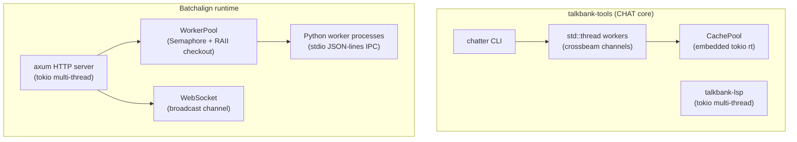
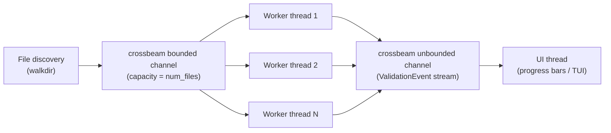
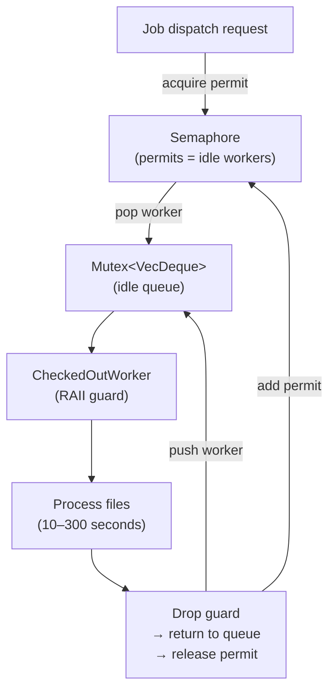
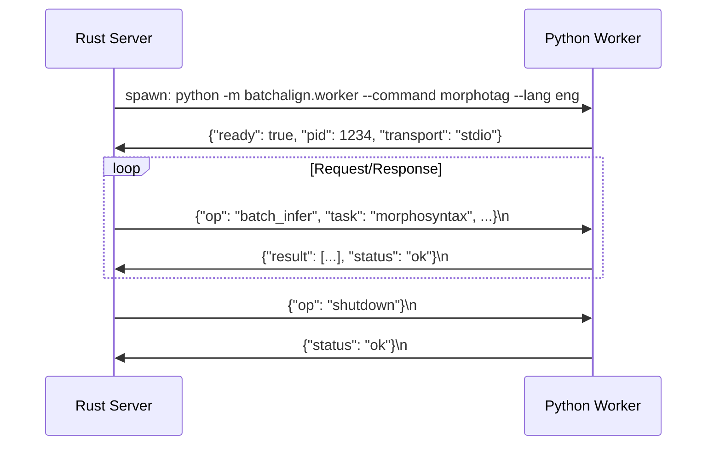

# Concurrency

**Status:** Current
**Last updated:** 2026-05-01 17:07 EDT

Shared concurrency infrastructure across the workspace: Tokio runtime
configuration, the `Semaphore + RAII` pool pattern, channel patterns,
lock ordering, and the workspace-wide mutex policy. For
batchalign-specific worker-pool sizing, memory budgets, and model
loading, see [Batchalign Workers](batchalign-workers.md).

## Two Threading Worlds

The workspace splits cleanly into two concurrency styles:



- **CHAT core** — CPU-bound validation with `std::thread` + crossbeam
  channels.
- **Batchalign runtime** — I/O-bound server with the tokio async
  runtime.

## Tokio Runtime Configuration

| Component | Runtime | Why |
|---|---|---|
| `batchalign` server | Multi-thread (default) | Concurrent HTTP + WebSocket + job tasks |
| `talkbank-lsp` | Multi-thread | Concurrent LSP requests from editor |
| Validation `CachePool` | `current_thread` (embedded) | Bridge for sync workers; minimal overhead |

## Validation Parallelism (CHAT core)

`talkbank-cli/src/commands/validate_parallel/{runtime.rs,audit.rs}`.



- **N worker threads** via `std::thread::spawn()` (default
  `num_cpus::get()`).
- Workers pull paths from a bounded channel, parse + validate, emit
  events.
- UI thread receives events for progress display.
- **No Rayon** — crossbeam channels give fine-grained cancellation
  control.

Audit mode follows the same worker model, but its output path is
intentionally separate from the renderer/event loop used by standard
validation. Workers send completed file results to a dedicated audit
writer thread via a bounded channel; the writer thread owns both
JSONL file IO and summary statistics, so workers do not contend on a
shared `Mutex<BufWriter<File>>`.

### Cancellation

```
First Ctrl+C  → send to cancel channel → workers check every 1-10 files
Second Ctrl+C → std::process::exit(130) (immediate, no cleanup)
```

Workers poll `cancel_rx.try_recv()` between files. Atomic counter
tracks Ctrl+C presses.

### Cache Bridge — sync workers, async SQLite

Validation workers are `std::thread`, but the validation cache uses
async sqlx. `CachePool` embeds a single-threaded tokio runtime to
bridge:

```rust
pub struct CachePool {
    pool: SqlitePool,              // Async pool
    rt: tokio::runtime::Runtime,   // Single-threaded, embedded
}

impl CachePool {
    fn get(&self, path: &str) -> Option<CacheEntry> {
        self.rt.block_on(async { /* sqlx query */ })
    }
}
```

Each sync worker calls `rt.block_on()`. The embedded runtime is
lightweight (single-threaded, no background tasks).

## The `Semaphore + RAII` Pool Pattern

The canonical pool primitive used by the Batchalign worker pool.
Pattern:



**Key design point:** No lock is held during the 10–300 second
dispatch. The semaphore signals worker availability; the mutex
protects only the fast push/pop (< 10 μs).

Checkout flow:

1. Try non-blocking semaphore acquire.
2. If none available → try spawning new worker (CAS on
   `AtomicUsize` total).
3. If at capacity → async wait for permit.
4. Pop from idle queue, wrap in `CheckedOutWorker`.

Return flow (Drop impl):

- Push worker back to idle queue.
- Add semaphore permit (wakes next waiter).
- If worker died (`take()`), decrement total instead.

## Channels

| Channel | Type | Purpose | Capacity |
|---|---|---|---|
| Job events → WebSocket clients | `tokio::sync::broadcast` | Fan-out to all connected browsers | 4096 |
| Error streaming | `mpsc` | Async error sink for validation | Unbounded |
| Queue work signal | `Notify` | Wake dispatcher when work arrives | n/a |

**Broadcast pattern.** Lagged clients receive
`RecvError::Lagged(n)` and skip messages — no backpressure on the
server. Clients that disconnect break the receive loop cleanly.

## `CancellationToken` (`tokio_util::sync`)

Used at three levels:

- **Per-job** — checked before/after semaphore acquire and between
  files.
- **Worker pool** — cancels background health-check tasks.
- **Server** — wired to SIGINT/SIGTERM for graceful shutdown.

```rust
if job.cancel_token.is_cancelled() {
    return Ok(());
}
```

## `select!` Patterns

| Location | Branches | Purpose |
|---|---|---|
| Server shutdown | `ctrl_c` / `SIGTERM` | Whichever signal fires first triggers shutdown |
| WebSocket handler | `broadcast.recv()` / `socket.recv()` | Forward events OR handle client messages |
| Health check loop | `cancel.cancelled()` / `interval.tick()` | Stop OR check worker health |
| Queue dispatcher | `notify.notified()` / `sleep` | Work arrived OR timeout |

## IPC — stdio JSON-lines

Protocol between the Rust server and Python workers:



- One JSON object per line (newline-delimited).
- No framing bytes — newline = message boundary.
- Worker startup loads models, prints `ready` message.
- Operations: `process`, `infer`, `batch_infer`, `health`,
  `capabilities`, `shutdown`.

For the wire-protocol contract details, see
[Python–Rust Boundary](../python-rust-boundary/python-rust-boundary.md).

## Database Concurrency

SQLite WAL configuration:

| Setting | Value | Why |
|---|---|---|
| Journal mode | WAL | Readers don't block writers |
| Synchronous | Normal | Balanced durability vs speed |
| Busy timeout | 5000 ms | Auto-retry on `SQLITE_BUSY` |
| Max connections | 16 | Matches worker thread count |
| `mmap` size | 256 MB | Fast random access for 95k+ entries |

## Lock Ordering

No formal documented hierarchy, but the observed invariants are:

1. **Worker pool** — semaphore acquired first (async) → then idle
   queue mutex (sync, < 10 μs). Never reversed.
2. **Job store** — HashMap lock acquired for short reads/writes
   only. Never nested with worker pool locks.
3. **DashMap** (string interner, media cache) — single-level, no
   nested locks.
4. All `tokio::sync::Mutex` guards are dropped before `.await`
   points.

**Deadlock prevention:** No cyclic lock dependencies. Longest lock
hold is the job semaphore (intentional backpressure, not a mutex).

## Signal Handling

### Server (Batchalign)

```rust
tokio::select! {
    () = signal::ctrl_c() => info!("SIGINT, shutting down"),
    () = sigterm_future   => info!("SIGTERM, shutting down"),
}
```

### CLI (CHAT-core)

Double Ctrl+C pattern — first press: graceful cancel via crossbeam
channel; second press: `std::process::exit(130)` (immediate).

## Desktop App (Tauri)

`apps/chatter-desktop/src-tauri/src/commands.rs` uses
`ArcSwapOption` (from `arc-swap`) for lock-free storage of the
cancel sender:

```rust
pub struct ValidationState {
    cancel_tx: ArcSwapOption<Sender<()>>,
}
```

- `validate()` atomically stores the cancel sender via
  `.store(Some(...))`.
- `cancel_validation()` atomically takes it via `.swap(None)`.
- Zero contention: no mutex, no lock, no blocking.

Event forwarding uses the same crossbeam channel pattern as the TUI:
`validate_directory_streaming()` returns a `Receiver<ValidationEvent>`,
and a dedicated thread forwards events to the Tauri frontend via
`app.emit()`.

## Mutex Policy

**Avoid `Mutex` wherever possible.** Use lock-free alternatives:

| Need | Use | Not |
|---|---|---|
| Atomic swap of optional value | `ArcSwapOption` | `Mutex<Option<T>>` |
| Concurrent map | `DashMap` | `Mutex<HashMap>` |
| Lock-free counter | `AtomicUsize` / `AtomicBool` | `Mutex<usize>` |
| Lazy initialization | `OnceLock` / `LazyLock` | `Mutex<Option<T>>` |
| Work distribution | `crossbeam_channel` | `Mutex<VecDeque>` |
| Async event fan-out | `tokio::sync::broadcast` | shared vec behind mutex |
| Async availability gate | `tokio::sync::Semaphore` | mutex-guarded counter |
| One-shot signal | `crossbeam_channel` / `tokio::sync::oneshot` | mutex-guarded bool |

**When `Mutex` is acceptable:** sub-microsecond critical sections
(push/pop on a `VecDeque`, single HashMap lookup) that never cross
an `.await` point. Document the justification in a code comment.

### Current `Mutex` inventory

| Location | Type | Field | Justification |
|---|---|---|---|
| `talkbank-model::ErrorCollector` | `parking_lot::Mutex` | `errors: Mutex<Option<Vec<ParseError>>>` | Parser error collection; held for `push()` only (~1 μs) |
| `batchalign::WorkerGroup` | `std::sync::Mutex` | `idle: VecDeque<WorkerHandle>` | push/pop (~1 μs), never across `.await` |
| `batchalign::WorkerPool` | `std::sync::Mutex` | `groups: HashMap<WorkerKey, Arc<WorkerGroup>>` | lookup (~1 μs), never across `.await` |
| `batchalign::WorkerGroup` | `tokio::sync::Mutex` | `bootstrap: Mutex<()>` | Serializes worker spawning (held across `.await`; `tokio::sync` required) |
| `batchalign::JobRegistry` | `tokio::sync::Mutex` | `jobs: HashMap<JobId, Job>` | State transitions held across `.await` |

No `RwLock` usage anywhere. No `std::sync::Mutex` held across
`.await` points.

## Design Rationale

| Decision | Why |
|---|---|
| crossbeam channels, not Rayon | Fine-grained cancellation polling; simpler progress UI integration |
| Embedded single-threaded tokio in CachePool | Sync workers can't be tokio tasks; lightweight bridge |
| RAII `CheckedOutWorker` + Semaphore | Eliminates 10–300 s mutex holds; permits track availability, not workers |
| broadcast for WebSocket | Fan-out; lagged clients skip gracefully |
| DashMap for string interning | Shard-level locks; concurrent safe interning without global contention |
| WAL + 5 s busy timeout | Multiple concurrent readers + writers; auto-retry prevents failures |
| `std::sync::Mutex` for worker queue | Held < 10 μs; no need for async-aware lock |
| `ArcSwapOption` for desktop cancel sender | Lock-free atomic swap; no contention |
