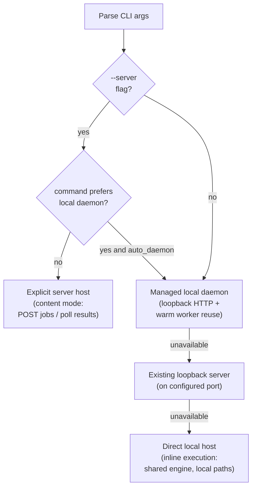
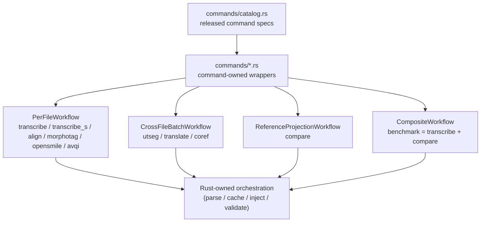
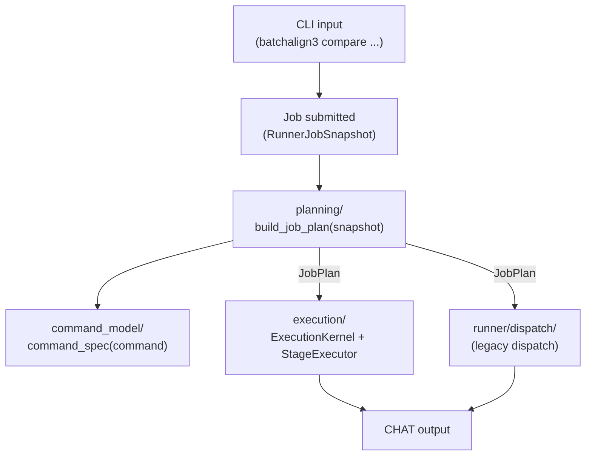

# Dispatch and Execution

**Status:** Current
**Last updated:** 2026-05-01 17:07 EDT

How a job moves from the CLI to a running command: the four CLI
dispatch targets, the workflow families that organize commands, the
per-command lifecycle, and the recipe-driven execution kernel that's
gradually replacing per-command dispatch functions.

## CLI Dispatch — Four Targets

The CLI never owns the ML runtime directly. It routes processing
commands to one of four targets: explicit remote server, managed local
daemon, already-running loopback server, or the in-process direct
host. Source: `crates/batchalign/src/cli/dispatch/mod.rs`.



### 1. Explicit server (`--server URL`)

`--server` or `BATCHALIGN_SERVER` selects single-server HTTP dispatch.
CHAT commands use content mode (file text submitted over `POST /jobs`).
Media-only commands can submit media names when the remote server can
resolve them from `media_roots` or `media_mappings`. Multi-server
fan-out is not part of the documented release surface.

### 2. Managed local daemon

If `auto_daemon` is enabled, the CLI first tries to reuse or start a
managed loopback daemon. This keeps warm workers alive across
commands. HTTP over loopback only — no remote network. The important
performance path for repeated Apple CPU-only `align` / `transcribe` /
`benchmark` runs because it preserves loaded worker processes and
shared models.

### 3. Loopback server reuse

If daemon startup is unavailable but a loopback server is already
listening on the configured port, the CLI reuses it before falling
back to direct inline execution.

### 4. Direct local host

If no usable remote or loopback server exists, the CLI prepares a
local paths-mode submission and runs it inline through `DirectHost`.
The CLI and direct host stay in one process: no HTTP hop, no queue,
no registry discovery, no persistent daemon. The same shared
execution engine still runs the command recipe and worker
orchestration.

### Local-daemon-preferring commands

`transcribe`, `transcribe_s`, `benchmark`, and `avqi` need
client-local media discovery or local audio access. If `auto_daemon`
is enabled and `--server` is also passed for one of these commands,
the CLI tries the local daemon first and warns only when that reroute
succeeds. If the local daemon path is unavailable, the explicit remote
URL remains the fallback. `benchmark` follows the same rules even
though it's a composite Rust-owned workflow.

### Worker transport

CLI ↔ server is HTTP. Server ↔ worker is stdio JSON-lines IPC. The
Python worker entry point in `batchalign/worker/_main.py` owns the
process lifetime and read/write loop, but Rust owns the generic stdio
op validation and dispatch envelope through the `batchalign_core` PyO3
bridge. HTTP is not used between the Rust server and Python workers.

## Workflow Families

Commands are organized by workflow family. Each family shares an
internal stage sequence, but the families share the same end state —
typed materialization plus validation.



### Command classification

| Class | Commands | Shape |
|---|---|---|
| Generation | `transcribe`, `transcribe_s` | Builds `ChatFile` from ASR output via `build_chat()` |
| Per-file processing | `align`, `morphotag` | Parse, mutate, serialize |
| Cross-file batch | `utseg`, `translate`, `coref` | Pool utterances across files in one GPU batch |
| Reference projection | `compare` | Main transcript + gold companion → projected views from typed compare bundle |
| Composite | `benchmark` (= `transcribe` + `compare`) | Chains existing workflows without reimplementing |
| Analysis | `opensmile`, `avqi` | Produces metrics / non-CHAT output |

The low-level `speaker` infer task still exists for typed worker
execution but is not a standalone CLI command; diarization remains
part of `transcribe_s`, matching batchalign2.

## Where to add new command semantics

Start in `crates/batchalign/src/commands/` and
`crates/batchalign/src/commands/catalog.rs`. Jump to
`command_family.rs` when you need released-command family metadata,
and to `text_batch.rs` when you need shared text-family helpers reused
by the runner kernel.

The command module owns the public entrypoint, metadata, and
materialization choice. `runner/` stays focused on job lifecycle,
queueing, and shared dispatch machinery.

## Processing Lifecycle

Every CHAT-mutating command follows this pattern:

1. **Parse** — `parse_lenient()` produces a `ChatFile` AST.
2. **Pre-validate** — check input quality against a command-specific
   `ValidityLevel` (e.g., `MainTierValid` for `morphotag`).
3. **Collect payloads** — extract per-utterance data from the AST
   (word lists, text, language metadata).
4. **Cache check** — hash payloads with BLAKE3, partition into hits
   and misses.
5. **Infer** — send misses to Python workers via typed worker IPC
   (`execute_v2` on the live infer surfaces). Workers return raw ML
   output.
6. **Inject** — insert results (cache hits + infer results) into the
   AST.
7. **Cache put** — persist new results for future reuse.
8. **Post-validate** — alignment checks + semantic validation.
9. **Serialize** — `to_chat_string()` produces final CHAT output.

Generation commands (`transcribe`) replace step 1 with ASR inference
followed by `build_chat()` to construct the initial AST.

`ReferenceProjection` (`compare`) intentionally diverges from this
generic loop:

1. Pair each primary transcript with `FILE.gold.cha`.
2. Morphotag the main transcript only.
3. Parse the morphotagged main and raw gold into `ChatFile` ASTs.
4. Build a `ComparisonBundle` with main/gold compare views, structural
   word matches, and metrics.
5. Materialize the released main output or an internal AST-first gold
   projection.

For per-command request/response JSON shapes and per-command server
orchestration steps, see
[Command Lifecycles](../../batchalign/architecture/command-lifecycles.md).
For the boundary contract itself, see
[Python–Rust Boundary](../python-rust-boundary/python-rust-boundary.md).

### Pre-serialization validation

The server runs three validation gates before writing CHAT output:

1. **Pre-validation** — rejects malformed input early based on the
   command's required `ValidityLevel`.
2. **Alignment validation** — checks tier word counts (`%mor`/`%gra`/`%wor`
   must match the main tier). ParseHealth-aware: utterances flagged
   as unparseable are excluded.
3. **Semantic validation** — full CHAT validation (E362 monotonicity,
   E701/E704 temporal, header correctness). Only blocks on errors,
   not warnings.

Validation failures trigger bug reports to
`~/.batchalign3/bug-reports/` and self-correcting cache purges
(deleting entries that produced invalid output).

## Batched Inference

Text-only commands (`morphotag`, `utseg`, `translate`, `coref`) use
`dispatch_batched_infer()` to pool utterances across multiple files
into a single worker `execute_v2` request backed by one prepared-text
artifact. Improves throughput and model reuse compared to per-file
dispatch without re-expanding the Python control plane. `compare` is
separate now because it needs both a main transcript and a gold
companion per file.

The morphosyntax orchestrator uses three phases for cache interaction:

1. `collect_payloads()` — extract per-utterance payloads with positions.
2. `inject_from_cache()` — inject cached `%mor`/`%gra` strings.
3. `inject_results()` — inject freshly inferred results.

All cache logic is in Rust. Python workers receive only structured NLP
payloads and return raw model output.

## Multi-Step Pipelines

`transcribe` chains multiple steps:

```
ASR inference → post-processing → CHAT assembly → utseg → morphosyntax
```

Each step is a separate workflow call (`process_transcribe` →
`process_utseg` → `process_morphosyntax`). Between steps, CHAT text
is serialized and re-parsed — each step operates on a different
version of the file. `benchmark` follows the same composition style
at the workflow level by chaining `transcribe` then `compare`, while
`compare` itself remains a reference-projection workflow with gold-
and main-shaped materializers.

## Command Model + Planning + Execution Kernel

Three modules centralize how commands are defined, planned, and
executed. They replace the old pattern where each command wired its
own dispatch function in `runner/dispatch/` with per-command
constants scattered across macro-generated files.



### `command_model/` — authoritative command registry

`crates/batchalign/src/command_model/`. Single source of truth for
released command metadata. Replaces per-command macro files
(`commands/opensmile.rs`, etc.) that declared duplicate constants.

| API | Purpose |
|---|---|
| `command_spec(ReleasedCommand) -> &CommandSpec` | Authoritative spec for any released command |
| `command_specs() -> Vec<&CommandSpec>` | All specs, in release order |
| `legacy_command_definition(command)` | Derive a `CommandDefinition` for backward compatibility |
| `legacy_command_descriptor(command)` | Derive a `CommandWorkflowDescriptor` for backward compatibility |

```rust
pub struct CommandSpec {
    pub command: ReleasedCommand,
    pub family: CommandFamily,        // TextInfer, Audio, MediaAnalysis, Composite
    pub capabilities: CapabilitySpec, // infer_tasks, requires_audio, ...
    // ... execution shape, I/O profile derived from family
}
```

Derived helpers in `catalog.rs`:

| Helper | Replaces |
|---|---|
| `io_profile_for(command)` | Per-command `CommandIoProfile` constants |
| `execution_shape_for(family)` | Per-family dispatch routing |
| `runner_dispatch_kind_for(command)` | Runner dispatch shape selection |

### `planning/` — immutable job plans

`crates/batchalign/src/planning/`. Builds typed, immutable execution
plans from runner snapshots. Centralizes work-unit planning, artifact
planning, and I/O mode resolution.

| Type | Purpose |
|---|---|
| `JobPlan` | `CommandSpec` + `Vec<PlannedWorkUnit>` + `Vec<PlannedArtifactSet>` + `IoMode` |
| `IoMode` | `Paths` (shared filesystem) or `Content` (staged under job directory) |
| `PlannedWorkUnit` | One input file with its resolved paths |
| `PlannedArtifactSet` | Output artifacts for one source file |

```rust
pub fn build_job_plan(snapshot: RunnerJobSnapshot) -> Result<JobPlan, PlanError>
```

Calls `command_model::command_spec()` internally and delegates
work-unit enumeration to `recipe_runner::planner`.

### `execution/` — recipe-driven execution kernel

`crates/batchalign/src/execution/`. Replaces per-command dispatch
functions with a pluggable stage executor that walks recipe stages in
order.

```rust
pub struct ExecutionKernel<E: StageExecutor> { ... }

pub trait StageExecutor {
    async fn run_stage(
        &self,
        stage: RecipeStageId,
        state: &mut ExecutionState,
        plan: &JobPlan,
        ctx: &ExecutionContext,
    ) -> Result<(), ExecutionError>;
}

pub trait WorkerGateway {
    async fn morphotag(...) -> Result<...>;
    async fn utseg(...) -> Result<...>;
    async fn translate(...) -> Result<...>;
    // ... one method per NLP task
}
```

Module map:

| File | Purpose |
|---|---|
| `kernel.rs` | `ExecutionKernel` — runs stages, manages state transitions |
| `morphotag/` | Morphotag execution: input prep, window policy, progress, writeback |
| `coref.rs` | Coreference execution stage |
| `translate.rs` | Translation execution stage |
| `utseg.rs` | Utterance segmentation execution stage |
| `simple_batched_text.rs` | Shared batched-text execution for utseg/translate/coref |
| `text_io.rs` | CHAT file read/write for text-based commands |
| `worker_gateway.rs` | `WorkerGateway` trait + live implementation over the worker pool |

### Compare — first migrated command

```rust
pub fn dispatch_compare_job(job, plan: JobPlan) -> Result<...> {
    let kernel = ExecutionKernel::new(CompareStageExecutor::new(...));
    kernel.run(plan).await
}
```

`CompareStageExecutor` recipe stages: `PlanWorkUnits` →
`ReadChatInputs` → `ReadReferenceInputs` (resolve and parse
`*.gold.cha` companions) → `Morphosyntax` (morphotag the main
transcripts) → `CompareAlign` (gold-anchored comparison) →
`MaterializeOutputs` (write output CHAT + CSV).

### Migration status

| Command | Dispatch model | Notes |
|---|---|---|
| `compare` | **`execution/`** kernel | First migration, fully recipe-driven |
| All others | Legacy `runner/dispatch/` | Migrate incrementally |

New commands with multi-stage workflows (stages that depend on prior
stage output) should use the execution kernel. Simple single-dispatch
commands can continue using legacy dispatch until migration is
complete.

## Worker Concurrency

Worker parallelism is capped based on available memory, not scaled
linearly. Each worker loads ~4–12 GB of ML models. The server
combines:

- `HostExecutionPolicy` for tier-aware bootstrap mode and
  file-parallel clamps.
- Host-memory admission planning for granted worker counts.
- Target-aware worker reuse keyed by actual `WorkerTarget`.

On large hosts this favors profile reuse; on small hosts it favors
task bootstrap so a laptop does not speculatively preload a whole
profile. See
[Batchalign Workers](batchalign-workers.md)
for pool structure, warmup behavior, and host-policy details.

## Key Patterns

- **Times** throughout the pipeline are in **milliseconds**.
- **Language codes** use 3-letter ISO 639-3 (`"eng"`, `"spa"`, `"jpn"`).
- **Files are sorted largest-first** before dispatch to avoid
  stragglers.
- **Heavy imports** (`stanza`, `torch`) are lazy — CLI startup must
  stay fast.
