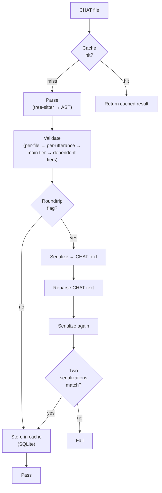

# Transform Pipeline

**Status:** Current
**Last updated:** 2026-05-19 19:23 EDT

The `talkbank-transform` crate provides high-level pipelines that compose parsing, validation, and serialization into reusable workflows.

## Core Pipelines

### Parse + Validate

The most common pipeline: parse a CHAT file and validate it.

```rust,ignore
use talkbank_transform::parse_and_validate;

let result = parse_and_validate(source, &parser, &error_collector);
```

This:
1. Parses the source text into a `ChatFile` AST
2. Runs validation (alignment checks, header consistency, etc.)
3. Collects all errors and warnings into the `ErrorSink`

### CHAT → JSON

Convert a CHAT file to its JSON representation:

```rust,ignore
use talkbank_transform::chat_to_json;

let json = chat_to_json(source, &parser)?;
```

The JSON follows the schema at `schema/chat-file.schema.json`.

### JSON → CHAT

Convert JSON back to a `ChatFile` AST via the bridge helper:

```rust,ignore
use talkbank_transform::build_chat::build_chat_from_json;

let chat_file = build_chat_from_json(json_str)?;
```

`build_chat_from_json` (in
`crates/talkbank-transform/src/build_chat/bridge.rs`) deserializes
the JSON shape produced by `chat_to_json` back into a `ChatFile`.
Serializing the result through `WriteChat` re-produces CHAT text.

### CHAT → CHAT (Normalize)

Parse and reserialize to normalize formatting:

```rust,ignore
use talkbank_transform::normalize_chat;

let normalized = normalize_chat(source, &parser)?;
```

`normalize_chat` lives in
`crates/talkbank-transform/src/pipeline/convert.rs`.

## Validation + Roundtrip Cache Lifecycle

The following diagram shows the full validation and roundtrip pipeline, including the cache layer:



## Streaming Parse

For large files or interactive use, the transform crate supports streaming parse where utterances are processed incrementally rather than loading the entire AST into memory.

## Caching

The transform layer integrates with a file-system cache. Validation results are keyed by content hash, so unchanged files skip re-validation. Cache location is platform-specific: `~/Library/Caches/talkbank-chat/` (macOS), `~/.cache/talkbank-chat/` (Linux), `%LocalAppData%\talkbank-chat\` (Windows).

Use `--force` to bypass the cache for specific paths.

## Error Collection

Pipelines use the `ErrorSink` trait for error reporting. Callers can provide:
- A collecting sink (gathers all diagnostics for batch output)
- A printing sink (writes diagnostics to stderr in real-time)
- A custom sink (for LSP diagnostics, JSON output, etc.)
