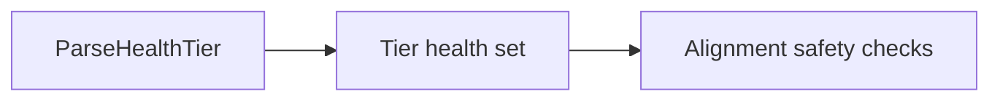

# Wide Struct Audit

This page records the struct-shape rule used in `talkbank-tools`.

A struct with many fields is not automatically wrong. The smell is:

- many unrelated concerns packed into one value
- several booleans that act like implicit policy enums
- repeated prefixes that point to missing sub-structs
- runtime code reaching into many unrelated fields of the same value

The repo therefore treats **10 or more named fields** as an audit threshold,
not as an automatic ban.

## Acceptable Wide Structs

Some wide structs are still acceptable.

### Metric records

These can be large because the output itself is a large table of metrics.

Examples:

- `SpeakerEval`
- `SpeakerKideval`
- `SpeakerComplexity`
- `SpeakerFluency`

These are not the first refactor target because they mostly act as report
records, not runtime coordination objects.

### Transport or schema records

Examples:

- `WordJsonSchema`
- `DbMetadata`
- `CoverageReport`

These mirror a boundary shape and are less risky than flat runtime state.

## Current Refactor Targets

### Validation options were the CLI example

`ValidateDirectoryOptions` used to be a flat bag of format, cache, traversal,
roundtrip, parser, audit, and TUI flags. It now groups those concerns as:

- `ValidationRules`
- `ValidationExecution`
- `ValidationTraversalMode`
- `ValidationPresentation`

That is the shape this audit wants for policy-rich CLI boundaries: one small
top-level struct with explicit sub-objects and enums rather than a dozen flat
fields.

### `ParseHealth` was the model-layer example

`ParseHealth` used to be a ten-boolean state vector. It now stores taint as a
compact tier bitset keyed by `ParseHealthTier`, which is the shape this audit
expects for fixed domain sets.

### Dashboard and TUI state bags

These are real state owners, but they still want grouping by concern.

Current examples:

- `src/test_dashboard/app.rs` `AppState`
- `crates/talkbank-cli/src/ui/validation_tui/state.rs` `TuiState`

The common problem is still mixing:

- selection and widget state
- progress totals
- render flags
- status text and timing

### `Backend`

`crates/talkbank-lsp/src/backend/state.rs` is a service-root aggregate. That is
defensible, but it still wants grouping such as:

- document caches
- parse caches
- validation state
- language services

### Metric structs can still benefit from grouping

`SpeakerEval` and `SpeakerKideval` are acceptable for now, but if the output
renderers keep needing subsets such as lexical metrics, morphosyntax metrics,
error counts, and derived scores, those records should eventually nest along
those lines.

## Design Rules

1. Treat 10 or more named fields as an audit trigger.
2. Treat 3 or more related boolean fields as a smell even below that threshold.
3. Boundary and report records may stay wide when they mirror a real external
   shape.
4. Runtime coordination structs should prefer named sub-structs over flat bags.
5. If a wide struct remains, record it explicitly in the audit test and cap its
   field growth.

## Audit Guardrail

The Rust audit test at `crates/talkbank-cli/tests/wide_struct_audit.rs`
classifies the current wide structs and fails when a new one appears without an
explicit review entry.
