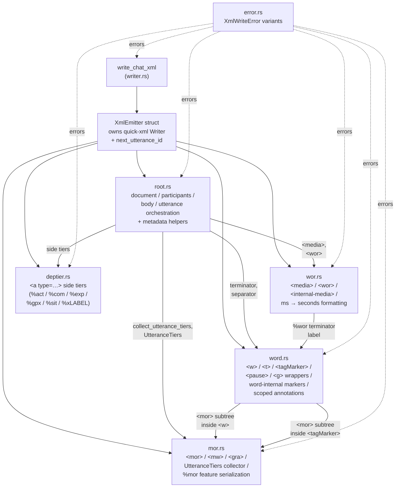
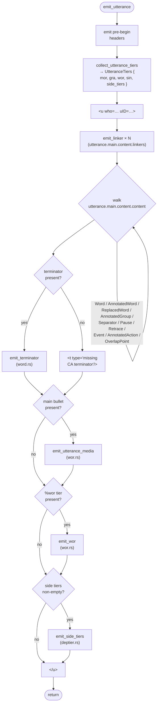
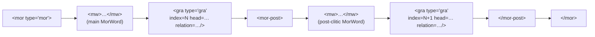

# XML Emitter

**Status:** Current
**Last updated:** 2026-04-22 18:58 EDT

## Purpose

`crates/talkbank-transform/src/xml/` serialises a `ChatFile<S>` into
TalkBank-XML matching the output of the legacy Java Chatter tool.
It is the Rust-side replacement for Java's CHAT → XML projection.

**Scope:**

- **Legacy / rare-use facility.** The TalkBank project no longer
  publishes XML for download; CHAT is the canonical distribution
  format. The XML emitter exists to support rare legacy consumers
  that still need the XML projection — it is not a primary
  interchange path. New integrations should consume CHAT directly.
- **Emission only.** XML ingest (XML → CHAT) is explicitly out of
  scope. The only historical consumer that ever needed XML → CHAT
  was Phon (via its PhonTalk plug-in, which invoked Java Chatter
  for the round-trip); Phon has since pivoted to reading CHAT
  directly. The other XML readers are all either dormant or
  migrated:
  - NLTK's `CHILDESCorpusReader` is unmaintained and was
    always read-only.
  - `langcog/childes-db` has had no commits since September 2022.
  - TalkBankDB and the current TalkBank analysis stack read CHAT
    directly, not XML.
- **Phonetic tiers are permanently unsupported.** `%pho`, `%mod`,
  `%phosyl`, `%modsyl`, `%phoaln` report
  [`XmlWriteError::PhoneticTierUnsupported`]. Phon has pivoted to
  CHAT-only interchange; no downstream consumer reads the rich
  `<pg>/<pw>/<ph>/<cmph>/<ss>` XML. Files carrying these tiers
  still parse, validate, and round-trip through CHAT unchanged —
  only the XML projection is declined.
- **Parity oracle.** The goldens in `corpus/reference-xml/`
  (produced by Java Chatter against the reference CHAT corpus)
  are the parity target. As of 2026-04-22, **94/94 paired goldens
  pass structurally** — full parity across every reference `.cha`
  file Java Chatter can emit. Five reference fixtures have no
  golden because Java can't emit them at all: two use UD POS tags
  (`propn`) Java's tree walker doesn't recognize, and three
  declare `@Media` with a linkage type that the fresh E544
  validator now catches before emission has a chance to run.
  Intentional divergences, not Rust gaps.

## Module layout

The emitter is split across six submodules under `xml/`. Each
file contributes an `impl XmlEmitter { … }` block plus any
free helpers it owns; state lives on the single `XmlEmitter`
struct defined in `writer.rs`.



| File | Role |
|------|------|
| `writer.rs` | `XmlEmitter` struct, namespace/version constants, `write_chat_xml` entry point, minimal-document unit test, `escape_text` helper |
| `root.rs` | Document / participants / body / utterance orchestration; root-element metadata helpers (corpus lookup, date/age/sex formatting, `@Options` flags, `@Types` projection, per-speaker extras) |
| `word.rs` | All word-level element shapes; word-internal marker walking; scoped-annotation dispatch; event / action emission |
| `mor.rs` | `%mor` / `%gra` emission including post-clitic `<mor-post>`; `UtteranceTiers` aggregator |
| `wor.rs` | `%wor` tier emission plus utterance-level `<media>`; `format_seconds` ms → seconds |
| `deptier.rs` | Text-content "side tiers" that render as `<a type=…>text</a>` (`%act`, `%com`, `%exp`, `%gpx`, `%sit`, `%xLABEL`) |
| `error.rs` | `XmlWriteError` `thiserror` enum |

## Top-level data flow

```mermaid
sequenceDiagram
    participant Caller
    participant write_chat_xml as write_chat_xml<br/>(writer.rs)
    participant XmlEmitter as XmlEmitter
    participant emit_document as emit_document<br/>(root.rs)
    participant emit_body as emit_body<br/>(root.rs)
    participant emit_utterance as emit_utterance<br/>(root.rs)

    Caller->>write_chat_xml: ChatFile&lt;S&gt;
    write_chat_xml->>XmlEmitter: new()
    write_chat_xml->>emit_document: emit_document(file)
    emit_document->>emit_document: emit &lt;?xml?&gt; + &lt;CHAT&gt; attrs
    emit_document->>emit_document: emit_participants(file)
    emit_document->>emit_body: emit_body(file)
    loop each Line
        alt Line::Header
            emit_body->>emit_body: emit_header_if_body(header)
        else Line::Utterance
            emit_body->>emit_utterance: emit_utterance(utterance)
        end
    end
    write_chat_xml->>XmlEmitter: finish() → String
    XmlEmitter-->>Caller: Ok(String)
```

## Utterance emission in detail

`emit_utterance` is the most complex orchestrator: it walks the
main tier in parallel with two cursors into the dependent tiers.



### The TierCursors invariant

Walking the main tier requires tracking **three independent cursors**
into the `%mor` / `%gra` / `%sin` tiers. This separation is the
single most important correctness invariant in the emitter; a
merged cursor silently drifts on any utterance containing a clitic
chain, an untranscribed placeholder, or a sign-language item.

A `TierCursors` helper in `mor.rs` owns the three cursors and
provides `mor_index() / gra_chunk() / sin_index()` accessors plus
`consume_mor(post_clitics_len) / consume_sin() / advance_bulk(mor,
gra)` advance methods. Every content-arm in `emit_utterance` runs
a fixed template: look up partners at the current cursor positions,
emit, call `consume_*`. The advance math has exactly one home.

| Cursor | Indexes into | Advances by |
|--------|--------------|-------------|
| `mor` | `mor_tier.items` (one `Mor` per main-tier word) | **1** per alignable word |
| `gra` | `gra.relations` (1-based `<gra index=…/>`) | **`1 + post_clitics.len()`** per `Mor` |
| `sin` | `sin_tier.items` (one `SinItem` per sin-countable word) | **1** per sin-countable word |

A `Mor` item like `pron|what-Int-S1~aux|be-Fin-Ind-Pres-S3` is **one**
entry in `mor_tier.items` but contributes **two** `%gra` edges —
one for the main `<mw>`, one for each `<mor-post><mw/></mor-post>`.
So mor and gra cursors advance at different rates.

`%sin` uses a **separate** counting predicate than `%mor`. The
model's `counts_for_tier(word, TierDomain)` function encodes the
differences:

- `TierDomain::Mor` excludes nonwords (`&~`), fillers (`&-`),
  phonological fragments (`&+`), and untranscribed placeholders
  (`xxx`, `yyy`, `www`).
- `TierDomain::Sin` includes everything that was phonologically
  or gesturally produced — fragments and untranscribed *do*
  participate. A gesture can accompany an unintelligible vocalisation.

Because the predicates diverge, the `sin` cursor advances on its
own schedule. For `*CHI: mommy xxx . %sin: g:point 0 .` the `xxx`
word consumes a `%sin` item but not a `%mor` item.

Four main-tier content variants delegate cursor arithmetic through
their emitters: `emit_replaced_word` and `emit_annotated_group`
return `(mor_used, gra_used)` tuples consumed via
`cursors.advance_bulk(mor_used, gra_used)`; `emit_word` and
`emit_annotated_word` call `cursors.consume_mor(post_count)` inline.

### Why cursor-based, not `AlignmentSet`-based?

`talkbank-model`'s `AlignmentSet` (`Utterance.alignments`) holds
pre-computed `MorAlignmentPair` / `SinAlignmentPair` / etc. — the
same main-word-index ↔ target-tier-index mapping the emitter
computes on-the-fly. Why not use it directly?

The XML emitter accepts `ChatFile<S: ValidationState>` for any
`S`. When called on a `ChatFile<NotValidated>`, `compute_alignments`
has never run and `Utterance.alignments` is `None`. Rather than
force callers to validate first, or risk panics on unvalidated
input, the emitter recomputes what it needs via the cursor walk.

The cursor walk is equivalent to the model's alignment output for
every reference-corpus input; it only diverges on malformed files
that the model's alignment would also flag. The cursors stay as
local emitter state, and the alignment module stays a separate,
optional layer.

### `%sin` → `<sg><w><sw/></w></sg>` emission

When a `%sin` tier is present and the current word counts for
`TierDomain::Sin`, the emitter wraps the `<w>` element (and its
nested `<mor>` subtree if any) in a `<sg>` (sign group) with a
`<sw>` (sign word) sibling:

```xml
<sg><w>what<mor>...</mor></w><sw>0</sw></sg>
```

`SinItem::Token(text)` renders as `<sw>text</sw>`; `SinItem::SinGroup(…)`
joins its gesture tokens with spaces. The emission is the entirety
of `XmlEmitter::emit_sin_word`; everything else is just the
`<sg>…</sg>` wrap in `emit_utterance`'s `Word` arm.

### `@Media` linkage and timing evidence (E544)

As of 2026-04-22, validation fires E544 before XML emission when
an unqualified `@Media` header (status-less) claims linkage but
the transcript carries no timing evidence (no main-tier bullets,
no positional `%wor` sidecar). This is a validator-level rule
(lives in `crates/talkbank-model/src/model/file/chat_file/validate.rs`
`check_media_linkage_has_timing`), not an emitter rule — it runs
during `ChatFile::validate` and blocks downstream emission on
validation-gated entry points. See `spec/errors/E544_media_linkage_without_timing.md`.

The emitter itself doesn't care about bullet presence; it was the
former Java-Chatter emitter that imposed this check (as a parser-
level semantic failure) and Rust now implements it in the
validator, per the project lead's 2026-04-21 approval.

### Post-clitic emission



Each post-clitic gets its own `<mor-post>` wrapper containing one
`<mw>` plus the next `<gra>` index. Multiple post-clitics emit
sequentially.

## Emitter / parser / model boundary

The emitter generally defers to the Rust model's canonical
predicates rather than inventing output-side rules. Four cases
are exceptions where the emitter bridges a parser-vs-Java
semantic disagreement at the output boundary. All four are
**legitimate divergences**, not regressions: the Rust model is
correct, Java Chatter is frozen at a pre-evolution CHAT
snapshot, and the emitter's bridges are the right place to
reconcile the output shape.

### CA intonation contour terminators

Rust parses `⇗`, `↗`, `→`, `↘`, `⇘` at the end of an utterance as
`Terminator::CaRisingToHigh` etc. Java Chatter classifies them as
**separators** followed by an implicit "missing CA terminator". The
emitter splits a pitch-contour terminator into two sibling
elements:

```xml
<s type="rising to high"/>
<t type="missing CA terminator"/>
```

See `ca_terminator_separator_label` in `word.rs`. If the Rust
parser ever migrates to classify these as separators, the
emitter's bridge becomes dead and should be removed.

### CAOmission as whole-word shortening

`(parens)` (a fully-parenthesised word) parses to
`WordCategory::CAOmission`. Java emits
`<w><shortening>parens</shortening></w>` — a `<shortening>`
wrapper around the word body with no `type="omission"` attribute.
The `0word` syntax (true omission) gets `<w type="omission">word</w>`
with no shortening wrapper.

The emitter branches on `CAOmission` and opens a `<shortening>`
wrapper around `emit_word_contents`. `word_category_attr` returns
`None` for `CAOmission` so no `type="omission"` attribute is
emitted.

### Leading overlap-point hoisting

Rust parses `⌈°overlapping+soft⌉°` as a single word whose
`WordContent` vector starts with a `TopOverlapBegin` marker. Java
Chatter keeps the **leading** `⌈` as a top-level sibling of `<w>`
but keeps the **trailing** `⌉` inside. The emitter hoists the
prefix of leading `WordContent::OverlapPoint` items out before
opening `<w>`, and `emit_word_contents` skips them during the
content walk.

### `xxx` / `yyy` / `www` case-sensitivity

The model's `word.untranscribed()` helper is case-insensitive — it
treats `XXX` and `xxx` identically as "unintelligible" to protect
downstream Stanza/MOR pipelines from spurious uppercase entries.
The XML schema's `untranscribed` attribute, however, attaches only
to the strictly lowercase placeholders. The emitter uses a local
`untranscribed_attribute_for_xml` helper that does the
case-sensitive check at the output boundary.

Both behaviours are deliberate and stay: the model's
case-insensitive helper is a Stanza/MOR correctness fix, and the
emitter's case-sensitive gate matches the XML schema contract.

## Reserving element boundaries: single state holder

`XmlEmitter` owns a `quick_xml::Writer<Vec<u8>>` and a running
`next_utterance_id: u32` counter. Every emission helper writes
through that single writer so indentation, escaping, and the
document-order contract are centrally enforced.

Every `BytesText` emission routes through `escape_text` (in
`writer.rs`) which uses `quick_xml::escape::partial_escape` to
escape only `<`, `>`, `&`. Apostrophes and double quotes pass
through literally, matching Java Chatter's output and avoiding
entity-decode issues that would otherwise split text at `&apos;`
boundaries during structural comparison.

## Testing

Two complementary test surfaces:

1. **Unit tests** in `xml/writer.rs` (minimal document smoke) and
   `xml/wor.rs` (`format_seconds` fractional padding) exercise
   internal helpers directly.

2. **Golden-XML parity harness** at
   `crates/talkbank-parser-tests/tests/xml_golden.rs`. Runs one
   parametrised test per file in `corpus/reference-xml/**/*.xml`,
   parses both emitted and golden XML via `quick-xml`, and diffs
   event streams with whitespace and attribute-order normalisation.
   Comparator lives in
   `crates/talkbank-parser-tests/tests/xml_support/mod.rs`.

The harness diagnostic surfaces the **first divergence** as
`actual: …` vs `expected: …`. To debug further, temporary dump
helpers (write the emitted XML to `/tmp/emitted.xml` and
side-by-side diff against the golden) are the quickest path;
add them as `#[ignore]`d tests in
`crates/talkbank-parser-tests/tests/xml_dump.rs` when needed and
delete after the divergence is resolved.

## Related documents

- `docs/reference-xml-coverage-gaps.md` — why some reference `.cha`
  files have no paired XML golden. Note (2026-04-22): earlier
  reports of "65 missing goldens" reflected a time when Java
  Chatter and chatter shared a Chat.flex without the comma /
  em-dash / CA-marker / SECONDS lexer fixes that landed this
  session. The current gap is much smaller; the five permanent
  exclusions are UD-POS files Java can't walk + `@Media`-without-
  timing files E544 now blocks at validation.
- `docs/rust-vs-java-chatter-regressions.md` — audit of the
  Rust-vs-Java parser-level differences that the emitter bridges.
- `docs/talkbank-xml-consumers-2026-04.md` — downstream XML
  consumers and the Phon-pivot context.
- `spec/errors/E544_media_linkage_without_timing.md` — the
  `@Media` bullet-existence validator that runs before emission.
- `docs/investigations/2026-04-22-rust-validator-strictness.md`
  — reference-corpus CHECK audit and the `chatter becomes the
  authority over time` policy decision.

## Staged features

The emitter reports `XmlWriteError::FeatureNotImplemented` for
CHAT constructs that have a known XML shape but haven't been
wired in yet. With all paired reference-XML goldens now passing
(94/94 as of 2026-04-22), any new staged feature that lands will
be triggered by a file added to the reference corpus that
exercises it. When that happens:

1. Run `cargo nextest run -p talkbank-parser-tests --test xml_golden`
   and read the failure message.
2. Find the Java Chatter output for the construct in the paired
   golden.
3. Add a match arm in the appropriate submodule
   (`word.rs::emit_scoped_annotation`,
   `deptier.rs::emit_side_tier`,
   `word.rs::ca_delimiter_label`, etc.) with a short comment
   explaining the mapping.
4. If the construct changes `%mor` / `%gra` cursor accounting,
   update `emit_utterance` in `root.rs`, not individual callers.

Permanently-unsupported tiers (`%pho`, `%mod`, `%phosyl`,
`%modsyl`, `%phoaln`) use
`XmlWriteError::PhoneticTierUnsupported` and are **not** staged
for future work — Phon's pivot to CHAT-only interchange removed
the downstream need.
