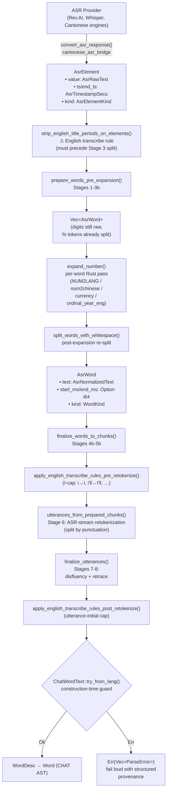
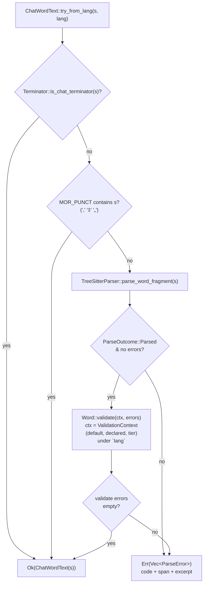
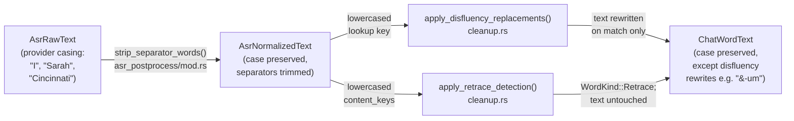
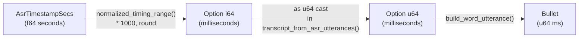
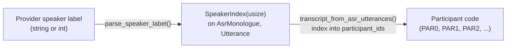
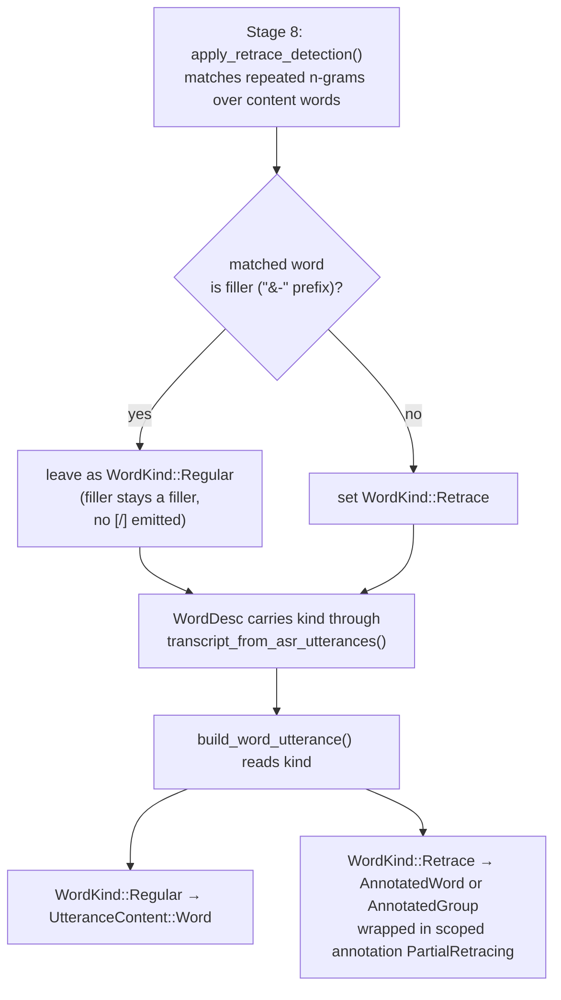

# ASR Token Pipeline

**Status:** Current
**Last updated:** 2026-05-01 09:47 EDT

This page documents the complete lifecycle of text tokens as they flow from
ASR providers through post-processing into the CHAT AST. Each stage has a
dedicated newtype that encodes what transformations the text has undergone.

> **Note on "Stage 6: retokenization" naming.** Stage 6 below is
> *ASR-stream retokenization* — splitting a raw provider token stream
> into utterances by punctuation. It is unrelated to the *morphosyntax
> retokenization* that runs at morphotag time to reshape CHAT words
> against Stanza's tokenization. For the distinction, route map, and
> per-language gap analysis, see
> [Retokenization — Overview](../reference/retokenization-overview.md).

## Type Progression



The three yellow-tinged English transcribe-rule hooks
(`strip_english_title_periods_on_elements`,
`apply_english_transcribe_rules_pre_retokenize`,
`apply_english_transcribe_rules_post_retokenize`) each fire at a
specific stage because of pipeline-interaction concerns:

- **Title-period strip BEFORE stage 3.** Stage 3's
  `normalized_split_separator` treats `.` as a word separator and
  would fragment `Dr.` into `Dr` + `.` before the allowlist could
  match. Stripping early keeps `Dr` as a single element.
- **I-cap in `finalize_words_to_chunks`.** Per-word rewrite; no
  stage-interaction concern.
- **Utterance-initial cap AFTER stage 7 retrace detection.** The
  rule needs to skip retrace-marked copies to land on the "real"
  utterance-initial word at the end of a retrace chain.

All three are English-gated. See
[English Transcribe Corrections](../reference/english-transcribe-corrections.md)
for the rule contracts and probe-verdict citations.

The `TryFrom` gate at the end is the boundary where the pipeline's
`AsrNormalizedText` becomes the CHAT domain's `ChatWordText`.
Construction runs the word-fragment parser (plus the language-aware
`Word::validate`) and returns structured `ParseError`s on failure — the
pipeline surfaces them verbatim to the user instead of producing an
invalid CHAT file. See [Construction-Time Validation](#construction-time-validation)
below.

## Pipeline Stages

The transcribe pipeline runs entirely in Rust. Stages 1-3 produce raw
`AsrWord`s, the per-word expansion pass (`expand_number`) handles
every numeric token via the per-language registry, English ordinal/
decade composer, CJK converter, currency table, and dash splitter.
Stages 4b-8 run after expansion. The Python `num2words` IPC was
removed (see [Number Expansion](../reference/number-expansion.md)).

The functions involved are:
`prepare_words_pre_expansion()` (stages 1-3), `expand_number()` plus
`split_words_with_whitespace()` (stage 4 + 4.5), and
`finalize_words_to_chunks()` (stages 4b-5b). The monolithic
`process_raw_asr()` is a sync fallback that follows the same shape.

| # | Stage | Function | What changes |
|---|-------|----------|-------------|
| 1 | Compound merging | `prepare_words_pre_expansion()` | Adjacent compound pairs joined ("air"+"plane" → "airplane") |
| 2 | Timed word extraction + separator strip | `prepare_words_pre_expansion()` | Seconds → ms, pause markers filtered, MOR_PUNCT (`,` `„` `‡`) and RTL separators trimmed from word boundaries. **Case is preserved** — see "Casing" below. |
| 3 | Multi-word splitting | `prepare_words_pre_expansion()` | Space-containing tokens split, timestamps interpolated, hyphens joined |
| 3b | **Percent-suffix split** | `split_percent_suffix_words()` | `"80%"` → `"80"` + per-language percent word ("percent" for eng, 11 languages covered) with proportional timing. `%` is the CHAT dep-tier sigil and structurally illegal on the main tier in any language. Dormant for en/es (see below); fires for languages where Rev.AI applies ITN. |
| 4 | **Number expansion** | `expand_number()` per word | Single Rust pass: cardinals via per-language `NUM2LANG` (47 langs); CJK via `num2chinese`; English ordinals/decades via `ordinal_year_eng`; currency via `try_expand_currency`; percent via per-lang table; dash-ranges split and recurse; digit-leading hyphen compounds (`"17-year-old"` → `"seventeen-year-old"` in digit-rejecting languages) via `try_expand_digit_leading_hyphen`. |
| 4.5 | **Post-expansion re-split** | `split_words_with_whitespace()` | Expansion can produce multi-word text (`"100"` → `"one hundred"`, `"$80"` → `"eighty dollars"`). A `ChatWordText` holds one main-tier token, so whitespace-bearing entries are split into separate `AsrWord`s with proportionally distributed timing. |

### Rev.AI and the stage-3b/4/4.5 defense-in-depth

For Rev.AI in English and Spanish, BA3 sends
`skip_postprocessing=true` (see
`batchalign/src/revai/preflight.rs::skip_postprocessing_hint`).
Per Rev.AI's docs this tells the service to skip Inverse Text
Normalization (ITN): the response comes back in **spoken form** —
`"eighty"`, `"percent"`, `"seventeen"`, `"year"`, `"old"` — rather
than written form with digits and `%`. Stage 3b and the digit-leading
hyphen branch of stage 4 therefore see no input to normalize on the
en/es production path; the raw tokens they were built to handle don't
appear.

These stages remain in the pipeline for two reasons:

1. **Other languages.** Per the Rev.AI API docs,
   `skip_postprocessing` is available only for English and Spanish.
   For every other language Rev.AI applies ITN by default and the
   request body omits the flag (the helper returns `None`). The
   normalizer stages still fire for those responses.
2. **Defense in depth.** A future Rev.AI behavior change, a swap to
   an ASR provider that also applies ITN, or a regression in the
   flag-setting policy would reintroduce the input class these stages
   handle. They cost nothing to keep and prevent silent regressions.

The final enforcement is the `ChatWordText::try_from_lang` gate at
the end of the pipeline (see below) — language-agnostic,
engine-agnostic, and failure-loud. If any upstream stage ever emits
a token the CHAT grammar rejects, this gate stops the build and names
the exact utterance / speaker / language / token text.
| 4b | Cantonese normalization | `finalize_words_to_chunks()` | Simplified → traditional + domain replacements (lang=yue only) |
| 5 | Long turn splitting | `finalize_words_to_chunks()` | Chunks > 300 words split |
| 5b | Pause-based splitting | `finalize_words_to_chunks()` | Long pauses in unpunctuated runs create boundaries |
| 6 | Retokenization | `utterances_from_prepared_chunks()` | Split into utterances by punctuation boundaries |
| 7 | Disfluency replacement | `finalize_utterances()` | Filled pauses marked ("um" → "&-um"), orthographic replacements |
| 8 | N-gram retrace detection | `finalize_utterances()` | Repeated n-grams marked with `WordKind::Retrace`. **Fillers (`&-` prefix) participate in matching but are never marked Retrace** — see [Retrace Detection](../reference/retrace-detection.md#fillers-do-not-produce-retrace-markers). |

## Text Newtypes at Each Stage

| Type | On struct | Contains | Constructor |
|------|-----------|----------|-------------|
| `AsrRawText` | `AsrElement.value` | Raw provider output: digits, spaces, provider markers | `AsrRawText::new(s)` — infallible |
| `AsrNormalizedText` | `AsrWord.text` | Compound-merged, number-expanded, disfluency-marked text | `AsrNormalizedText::new(s)` — infallible |
| `ChatWordText` | `WordDesc.text` | **A runtime-checked proof** that `s` is either a closed-set CHAT terminator / `MOR_PUNCT` separator (`.`, `?`, `!`, `+...`, `,`, `‡`, `„`), or text the tree-sitter word-fragment parser accepts as a legal main-tier word, and (for the `_lang` variants) satisfies every word-level rule `talkbank_model::Validate for Word` applies under the declared language including E220 digit policy. | **Fallible only:** `ChatWordText::try_from`, `try_from_with_parser`, `try_from_lang`, `try_from_lang_with_parser`. No infallible `new`. |

The progression is **asymmetric on purpose**: `AsrRawText` and
`AsrNormalizedText` are pipeline-internal and carry whatever the
provider returned; `ChatWordText` is the handoff boundary into CHAT
assembly, and its constructor is the enforcement point for the
invariant that every word in a `ChatFile` is CHAT-legal. Attempting
to construct a `ChatWordText` from text the CHAT grammar rejects
fails loudly at the boundary with a typed error naming the offending
utterance, speaker, language, and token — rather than producing a
`ChatFile` that fails silently at a downstream parse gate.

All three types use `#[serde(transparent)]`, `as_str()`, `Display`,
`AsRef<str>`. `AsrNormalizedText` additionally provides `map()` for
pipeline stage transformations and `push_str()` for hyphen-joining.

## Construction-Time Validation



The two short-circuits (terminator, MOR_PUNCT) exist because the ASR
pipeline emits each utterance's terminator as a regular `AsrWord` entry,
and separator tokens (`,`, `‡`, `„`) appear as standalone `AsrWord`s
after stage 2b boundary stripping. These are main-tier-legal but not
words — `parse_word_fragment` correctly rejects them; the short-circuit
lets them through.

The `try_from_with_parser` variant skips the language-validation branch
and is for callers that don't know the language. The `_with_parser`
variants take a caller-supplied `TreeSitterParser` handle; the bare
`try_from` and `try_from_lang` use a thread-local parser (the underlying
`TreeSitterParser` is `!Send + !Sync`).

Fallible construction in isolation isn't enough — the pipeline's
upstream normalizer stages must actually *produce* CHAT-legal text.
That responsibility is shared with stage 3b (percent split), stage 4
(number expansion + digit-hyphen rewrite), and stage 4.5
(post-expansion re-split). The policy is "fail loud on unknown
shapes": each new class of ASR token that trips the `TryFrom` gate
gets a normalizer rule added upstream so legitimate inputs don't
reach the gate only to fail.

## Casing

The pipeline preserves the case that the ASR provider returned. The English
pronoun `"I"`, its contractions (`"I'm"`, `"I'd"`, `"I'll"`, `"I've"`), and
proper nouns (`"Mike"`, `"Cincinnati"`, `"Sarah"`) all flow unchanged from
`AsrRawText` through every stage into the final `ChatWordText` on the main
tier. Stage 2 strips separator punctuation from word boundaries but does
not change letter case.

Two downstream stages need to compare words without regard to case. They
lowercase *only their comparison key*; the stored word text is never
rewritten to lowercase:

- Disfluency replacement (`apply_disfluency_replacements`,
  `asr_postprocess/cleanup.rs`) uses a lowercased lookup key to find
  entries like `"um"` / `"Um"` / `"UM"` in the per-language filled-pause
  table. A hit *replaces* the text with the CHAT form (`&-um`); a miss
  leaves the original text alone.
- Retrace detection (`apply_retrace_detection`,
  `asr_postprocess/cleanup.rs`) builds a lowercased `content_keys` vector
  and uses it for n-gram equality; the stored word text is left in its
  original case so CHAT output still shows `"I [/] I"` rather than
  `"i [/] i"`.



Verified against source: `strip_separator_words` in
`crates/batchalign/src/asr_postprocess/mod.rs`;
`apply_disfluency_replacements` and `apply_retrace_detection` in
`crates/batchalign/src/asr_postprocess/cleanup.rs`.

## Timing Flow



`AsrTimestampSecs` wraps the raw `f64` seconds from ASR providers on `AsrElement`.
The internal `AsrWord` timing (`Option i64`) is deliberately NOT wrapped — these
are pipeline-internal values that never cross a module boundary.

## Speaker Flow



`SpeakerIndex` is a zero-based index into the recording's speaker list.
It lives on both `AsrMonologue` (raw) and `Utterance` (post-processed).
Conversion to CHAT participant codes happens in `build_chat.rs`.

## WordKind Lifecycle

`WordKind` is set during stage 8 (retrace detection) and consumed during
CHAT assembly:



The filler gate mirrors BA2's `if j.type != TokenType.FP` check in
`NgramRetraceEngine.process()`. Fillers are included in the n-gram
match window (so `&-um I &-um I went` still detects the bigram repeat
and marks the first `I` as Retrace), but filler tokens themselves
never carry `[/]`.

Both single-word (`word [/]`) and multi-word (`<word word> [/]`) retraces
produce `UtteranceContent::Retrace`. The `Retrace` type carries the retrace
kind (`Partial`, `Full`, `Multiple`, `Reformulation`, `Uncertain`) and a
flag for whether the original was a group.

## AsrElementKind Enum

```rust
#[derive(Debug, Clone, Copy, PartialEq, Eq, Serialize, Deserialize, Default)]
#[serde(rename_all = "lowercase")]
pub enum AsrElementKind {
    #[default]
    Text,
    Punctuation,
}
```

Replaces the former `r#type: String` field. Serializes as `"text"` / `"punctuation"`
for JSON compatibility. The field is currently not read by the pipeline
(`extract_timed_words` uses content heuristics), but it preserves provider metadata
for debugging and potential future use.

## Reverse Direction: CHAT to NLP

The reverse flow (extracting words from CHAT for NLP processing) uses separate
provenance types defined in `text_types.rs`:

| Type | Source | Used for |
|------|--------|----------|
| `ChatRawText` | `Word::raw_text()` | AST preservation, display |
| `ChatCleanedText` | `Word::cleaned_text()` | NLP models, alignment, cache keys |
| `SpeakerCode` | `Utterance.speaker` | Per-speaker analysis keying |

These types are documented in
[Type-Driven Design](type-driven-design.md#2-provenance-newtypes).

## Code References

| Component | File |
|-----------|------|
| ASR types and newtypes | `asr_postprocess/asr_types.rs` |
| Pipeline orchestrator | `asr_postprocess/mod.rs` |
| Compound merging | `asr_postprocess/compounds.rs` |
| Disfluency and retrace | `asr_postprocess/cleanup.rs` |
| Number expansion | `asr_postprocess/num2text.rs` |
| Cantonese normalization | `asr_postprocess/cantonese.rs` |
| CHAT assembly | `build_chat.rs` |
| CHAT-direction newtypes | `text_types.rs` |
