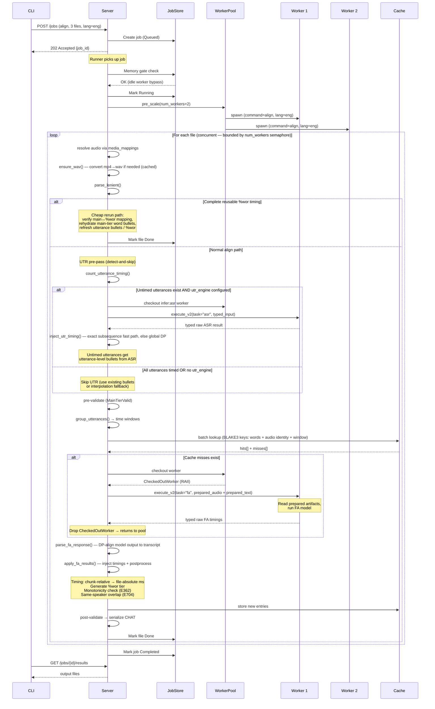
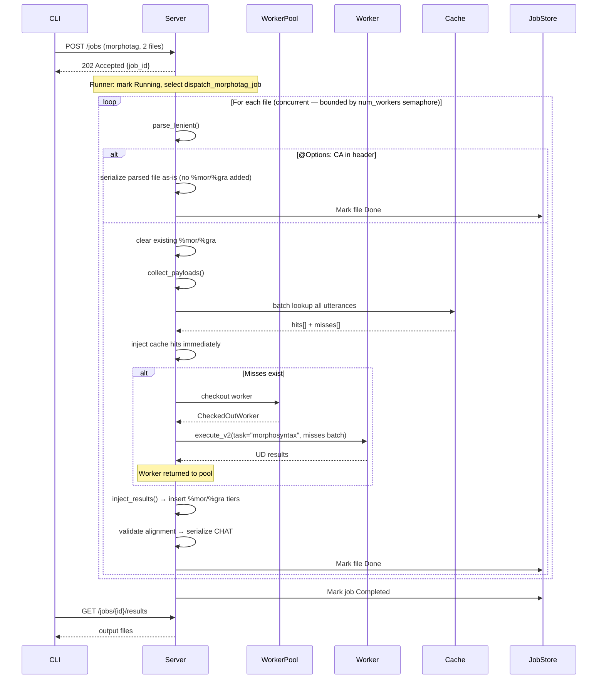

# Command Lifecycles

**Status:** Current
**Last modified:** 2026-05-03 08:50 EDT

End-to-end sequence diagrams showing how jobs flow through the system,
from CLI invocation to output files. Every batchalign command now fits one
of the explicit **workflow families** surfaced in the new contributor-facing
architecture: per-file transform, cross-file batch transform, reference
projection, composite workflow, or media analysis. For per-command
option-driven flowcharts, see [Command Flowcharts](command-flowcharts.md).

Contributor rule of thumb: if you are adding new command semantics, start in
`crates/batchalign/src/commands/` and then jump to the owning module
(`compare.rs`, `benchmark.rs`, `transcribe/`, `fa/`, `morphosyntax/`, etc.).
`runner/` owns lifecycle and queueing; `dispatch/` should remain thin.

## Workflow Families Overview

| Workflow Family | Commands | Parallelism | Key shape |
|------------------|----------|-------------|-----------|
| **Per-file transform** | `align`, `transcribe`, `transcribe_s`, `morphotag` | Concurrent files (semaphore-bounded by `num_workers`) | One file in, one primary output out |
| **Cross-file batch transform** | `utseg`, `translate`, `coref` | Cross-file batching: pool utterances, group by language, dispatch languages concurrently, chunk large language groups across multiple workers | Two-level parallelism: cross-language × intra-language chunking (up to `max_workers_per_key` per language) |
| **Reference projection** | `compare` | Concurrent files, but with two primary CHAT inputs per file | Main+gold comparison bundle plus AST-first materializers |
| **Composite workflow** | `benchmark` | Concurrent files (semaphore-bounded by `num_workers`) | Transcribe first, then compare via typed command composition |
| **Media analysis V2** | `opensmile`, `avqi` | Concurrent files (semaphore-bounded by `num_workers`) | Rust prepares audio, sends typed `execute_v2` requests, Python returns raw analysis payloads |

All workflow families are server-side orchestrated or Rust-owned at the
request boundary.

## Parallelism Model

All per-file dispatch shapes (`align`, `transcribe`, `benchmark`,
`morphotag`, `opensmile`, `avqi`) process files **concurrently** using
supervised `tokio::spawn` tasks bounded by a
`tokio::sync::Semaphore(num_workers)`. The number of workers is auto-tuned
based on available memory and CPU cores, or set explicitly with `--workers N`.
Each file opens its first durable attempt before setup work such as input
reads, media resolution, or conversion so early failures are visible in the
attempt history rather than only in terminal file state. Job-level media
prevalidation now uses an explicit `file_setup` attempt for the same reason.
Per-file dispatch code now routes the common processing/retry/completion
sequence through a shared `FileRunTracker` helper instead of open-coding those
store mutations in every pipeline. Supervised file tasks also report explicit
`FileTaskOutcome` values back to the runner so the runner does not need to
infer task success by rereading shared file state after the task exits. Media
preflight failures now use that same lifecycle boundary via an explicit setup
failure path instead of a one-off runner helper. The runner-owned lifecycle
labels are now also typed through `FileStage` rather than repeated as ad hoc
strings in each dispatch module. The same typed label vocabulary now flows
through the shared internal progress channel used by FA and transcribe
pipelines. The API now exposes that state in two parallel fields:
`progress_stage` for stable client logic and `progress_label` as the derived
operator-facing display string.

Batched text commands (`utseg`, `translate`, `coref`) take a
different approach: they **pool all utterances from all files**, group them by
per-item language, and dispatch with **two levels of bounded parallelism**. At
the outer level, language groups run concurrently but bounded by a semaphore
(`max_total_workers / max_workers_per_key` concurrent groups) to prevent
exceeding the global worker cap (`morphosyntax/batch.rs`). At the inner level,
each language group's `infer_batch` call (`morphosyntax/worker.rs`) splits
large batches into chunks across up to `max_workers_per_key` workers of the
same language. When a language group finishes and its workers return to the
pool, the next queued group starts. `compare`
does not use this pooled-text shape any more; it is its own reference
projection workflow because it needs both a main transcript and a gold
companion per file. `benchmark` is a composite workflow that composes
transcribe and compare rather than inventing its own third orchestration style.

| Shape | File-level parallelism | Within-file parallelism |
|-------|------------------------|-------------------------|
| Per-file transform | Supervised tasks + `Semaphore(N)` | Single worker call or Rust composition per file |
| Reference projection | Supervised tasks + `Semaphore(N)` | Main+gold comparison bundle plus materializers per file |
| Composite workflow | Supervised tasks + `Semaphore(N)` | Transcribe then compare per file |
| Cross-file batch transform | N/A (single batch) | One GPU batch call covers all files |
| Media analysis V2 | Supervised tasks + `Semaphore(N)` | Single worker call per file |

---

## Scenario 1: align — 3 files, 2 workers

Forced alignment is the most complex dispatch shape. Each file has its
own audio, so files are processed sequentially. Within each file,
utterances are grouped into time windows and batched to the worker.



### Walkthrough

1. **CLI** discovers `.cha` files in the input directory (sorted largest-first),
   submits them as a single job via `POST /jobs`.
2. **Server** creates the job in `Queued` state and returns immediately.
3. The **runner** checks the memory gate — if an idle worker already exists
   for `(align, eng)`, the memory check is bypassed entirely.
4. **Pre-scaling** spawns 2 worker processes to avoid sequential spawn overhead.
   Workers load the FA model (Whisper or Wave2Vec) at startup.
5. Files are processed **concurrently**, bounded by `num_workers` via a
   `tokio::sync::Semaphore`. For each file, the server **resolves** the
   audio file by walking the parent directory or using media mappings for
   matching `.wav`/`.mp3`/`.mp4` files. If the resolved file is MP4 (or
   another container format), **`ensure_wav`** converts it to WAV via ffmpeg
   and caches the result at `~/.batchalign3/media_cache/` (see
   [Media Conversion](../reference/media-conversion.md)).
5b. **Cheap rerun path:** After parsing, the server first checks whether the
   file already has complete reusable `%wor` timing. If main↔`%wor` alignment
   is clean and every mapped `%wor` word is timed, the server copies that
   timing back to main-tier words, refreshes utterance bullets, optionally
   regenerates `%wor`, and skips FA for the file entirely.
5c. **UTR pre-pass** (detect-and-skip): If the file is not already fully
   reusable, the server calls `count_utterance_timing()`. If untimed utterances
   exist and a UTR engine is configured (`--utr`, the default), it runs a
   Rust-owned UTR backend on the full audio, then `inject_utr_timing()`
   first tries a cheap exact-subsequence match and falls back to one global
   Hirschberg DP when the transcript/ASR match is missing or ambiguous. For
   `--utr-engine rev`, the server uses the shared Rust Rev.AI client directly
   and can reuse preflight-submitted job IDs. For worker-backed engines such as
   Whisper, the server still uses the worker ASR task. If all utterances are
   already timed, UTR is skipped entirely. If no UTR engine is configured
   (`--no-utr`), untimed utterances fall back to proportional interpolation.
   The updated CHAT text (with recovered bullets) is then used for FA grouping.
5c. The server **groups** utterances into time windows (max 20s for Whisper,
   15s for Wave2Vec).
6. **Cache lookup** uses BLAKE3 hashes of (words + audio identity + time window
   + timing mode + engine version). Cache hits skip worker IPC entirely.
7. **Cache misses** are sent to a checked-out worker via typed `execute_v2`
   requests. The `CheckedOutWorker` RAII guard returns the worker to the pool on
   drop.
8. The Rust server **DP-aligns** model timestamps to transcript words
   (Hirschberg algorithm), converts chunk-relative times to file-absolute
   milliseconds, generates `%wor` tiers, and runs monotonicity/overlap checks.
9. New results are **cached** for future reuse.
10. The CLI **polls** for results and writes output files.

---

## Scenario 2: morphotag — 2 multilingual files, per-file dispatch

Morphotag processes files **concurrently**, bounded by `num_workers`.
Within each file, utterances are analyzed independently (with optional
cache hits) and results are injected back into the AST.



### Walkthrough

1. **CLI** submits CHAT files for morphosyntactic enrichment.
2. The **runner** selects the per-file dispatch path (`dispatch_morphotag_job`).
3. Files are processed **concurrently**, bounded by `num_workers`. This
   prevents the BA2 over-parallelism crash mode while maximizing throughput
   on multi-core hosts.
4. For each file, the server **parses** the transcript. If the parsed
   header declares `@Options: CA`, the file is serialized back as-is —
   no `%mor` / `%gra` tiers are added or removed, and no provenance
   comment is injected (mirroring `align`'s `@Options: NoAlign`
   pass-through). Otherwise the server clears any stale morphology and
   **collects payloads** (word lists + language metadata).
5. **Cache lookup** checks all utterances in the file at once. BLAKE3 keys
   include (words + language + terminator + special forms + engine version).
6. **Cache misses** are sent to a checked-out worker in a single batch. The
   worker runs the Stanza NLP pipeline for the appropriate language(s).
7. Results (both from cache and worker) are **injected** back into the file's
   AST, inserting new `%mor` and `%gra` tiers.
8. The file is **validated** (ensuring morphology matches the main tier) and
   **serialized** back to CHAT.
9. Each file's result is written to disk **immediately** as it finishes, allowing
   for incremental progress visibility on large corpora.
10. This per-file shape replaces the previous complex cross-file windowing
    logic, providing better reliability and simpler progress reporting.

---

## Scenario 2b: compare — 1 main file + 1 gold companion

Compare is the reference-projection shape. It pairs each primary transcript with
a `FILE.gold.cha` companion, morphotags only the main side, and materializes one
or more outputs from a typed comparison bundle.

```mermaid
sequenceDiagram
    participant CLI
    participant Server
    participant Pool as WorkerPool
    participant W as Worker
    participant Cmp as compare()

    CLI->>Server: POST /jobs (compare, 1 main file)
    Server-->>CLI: 202 Accepted {job_id}
    Server->>Server: Resolve FILE.gold.cha companion

    alt Missing gold companion
        Server->>Server: Mark file Error
    else Gold companion present
        Server->>Pool: checkout worker
        Pool-->>Server: CheckedOutWorker
        Server->>W: execute_v2(task="morphosyntax", main transcript only)
        W-->>Server: typed morphosyntax result
        Note over Server: Worker returned to pool

        Server->>Server: parse_lenient(morphotagged main) -> AST_main
        Server->>Server: parse_lenient(raw gold) -> AST_gold
        Server->>Cmp: compare(AST_main, AST_gold)
        Note over Cmp: conform -> per-gold window search -> local DP<br/>main view + gold view + structural word matches + metrics
        Cmp-->>Server: ComparisonBundle

        Server->>Server: project_gold_structurally() on gold AST
        Note over Server: Exact matches copy %mor / %gra / %wor;<br/>unsafe partial projection stays conservative
        Server->>Server: build typed %xsrep / %xsmor models\nlower once to gold AST tiers
        opt Internal benchmark/main path
            Server->>Server: MainAnnotatedCompareMaterializer<br/>reuse typed tier models on main AST
        end

        Server->>Server: CompareMetricsCsvTable -> csv crate -> .compare.csv
        Server->>Server: validate -> serialize
        Server-->>CLI: output .cha + .compare.csv
    end
```

### Walkthrough

1. The CLI submits only primary `.cha` inputs; the gold companion is resolved by
   the compare planner/dispatch layer.
2. BA3 runs morphosyntax on the main transcript only. The gold transcript stays
   raw during artifact construction so deletions retain reference-side shape
   instead of picking up invented tags.
3. `compare()` performs BA2-style per-gold-utterance window selection and local
   DP, then returns a `ComparisonBundle` containing main-anchored tokens,
   gold-anchored tokens, structural gold↔main word matches, and aggregate
   metrics.
4. The released materializer projects onto the gold/reference AST and injects
   `%xsrep` / `%xsmor` there. The main-annotated materializer still exists for
   internal benchmark-style flows, but it is no longer the compare command
   surface.
5. `%xsrep` / `%xsmor` are emitted from typed compare-tier models, not from raw
   string hacking, and `.compare.csv` is rendered from the same bundle through a
   structured table model. That keeps transcript annotations and metric output
   in lockstep.

---

## Scenario 3: transcribe — 1 file, audio to CHAT

Transcription creates CHAT from scratch rather than modifying existing
files. It has the longest pipeline: ASR → post-processing → CHAT assembly
→ optional follow-up commands.

**Speaker label handling:** `convert_asr_response()` **always** uses speaker
labels from the ASR engine when present (matching BA2's `process_generation()`
which unconditionally reads `utterance["speaker"]`). The `--diarization` flag
only controls whether a dedicated Pyannote/NeMo stage runs — it does not
suppress ASR-provided labels. This means `batchalign3 transcribe` (without
`--diarization`) still produces multi-speaker output when Rev.AI returns
speaker-labeled monologues. When `--diarization enabled` is explicitly
requested, BA3 now follows BA2 and still runs the dedicated speaker stage as a
post-ASR relabeling pass, even on top of Rev-labeled output.

**Rev.AI `skip_postprocessing`:** For English only,
`skip_postprocessing=true` is sent to Rev.AI (matching BA2), so BA3's own
pre-CHAT utterance model handles segmentation from raw output. In `--lang auto`
mode, the Rust server first runs Rev.AI language ID. If that resolves to a
supported language such as English before submission, the request path becomes
the same as explicit `--lang eng`. If language ID fails or returns an unmapped
code, BA3 keeps a true Rev auto request instead; downstream processing may
still later resolve the output to English, but the provider request was not the
same as `--lang eng`.

```mermaid
sequenceDiagram
    participant CLI
    participant Server
    participant Pool as WorkerPool
    participant W as Worker

    CLI->>Server: POST /jobs (transcribe, 1 audio file)
    Server-->>CLI: 202 Accepted {job_id}

    Note over Server: Runner: mark Running

    opt Rev.AI engine selected
        alt --lang is explicit
            Server->>Server: parallel Rev.AI preflight uploads
            Note over Server: Use explicit language request settings
        else --lang auto
            Server->>Server: Rev.AI language ID
            alt Language ID maps to supported ISO-639-3
                Note over Server: Collapse to resolved language before submission<br/>If resolved=eng, request path matches explicit --lang eng
                Server->>Server: parallel Rev.AI preflight uploads
            else Language ID fails or code is unmapped
                Note over Server: Keep true Rev auto request<br/>speakers_count and skip_postprocessing differ from explicit eng
                Server->>Server: parallel Rev.AI preflight uploads
            end
        end
    end

    Server->>Server: resolve audio path
    Server->>Server: ensure_wav() — convert mp4→wav if needed (cached)
    Server->>Pool: checkout worker
    Pool-->>Server: CheckedOutWorker

    Server->>W: execute_v2(task="asr", typed_input)
    Note over W: Run ASR model or provider SDK<br/>(Whisper local or Cantonese engine)
    W-->>Server: typed raw ASR result (monologue_asr_result or whisper_chunk_result)
    Note over Server: Worker returned to pool

    Note over Server: convert_asr_response() — ALWAYS groups<br/>tokens by speaker label (no flag gating)

    opt --diarization enabled
        Server->>Pool: checkout worker
        Pool-->>Server: CheckedOutWorker
        Server->>W: execute_v2(task="speaker", prepared_audio)
        Note over W: Run diarization model<br/>(Pyannote default, NeMo optional)
        W-->>Server: typed raw speaker result (speaker_result)
        Note over Server: Worker returned to pool
    end

    Note over Server: Rust ASR normalization over typed monologues

    Server->>Server: 1. Compound merging (adjacent subword tokens)
    Server->>Server: 2. Timed word extraction (seconds to ms)
    Server->>Server: 3. Multi-word splitting (timestamp interpolation)
    Server->>Server: 4. Number expansion (digits to words)
    Server->>Server: 4b. Cantonese normalization (lang=yue only)
    Server->>Server: 5. Long-turn splitting (chunk at >300 words)
    Server->>Server: 5b. Long-pause fallback splitting
    opt language has BA2 utterance model (eng/zho/yue)
        Server->>W: execute_v2(task="utseg", prepared word batch)
        Note over W: BA2-style model returns typed boundary assignments
        W-->>Server: typed assignments
        Note over Server: Apply assignments before CHAT build
    end
    Server->>Server: 6. Retokenization (punctuation fallback / cleanup)
    Server->>Server: 7. Disfluency cleanup + retrace detection

    Server->>Server: build_chat() — ChatFile AST
    Note over Server: Generate headers: @Languages, @Participants,<br/>@ID (PAR/INV/CHI/MOT...), @Media<br/>Build utterances with %wor tiers<br/>Speaker codes from ASR labels used directly
    opt dedicated speaker segments present
        Server->>Server: reassign_speakers() — rewrite utterance speakers,<br/>@Participants, and @ID from raw diarization segments
    end

    opt with_utseg=true (default)
        Server->>Server: process_utseg() — re-segment utterance boundaries
    end
    opt with_morphosyntax=true (default: false)
        Server->>Server: process_morphosyntax() — add %mor/%gra tiers
    end

    Server->>Server: validate — serialize — .cha output
    Server-->>CLI: output .cha file
```



### Walkthrough

1. **Rev.AI preflight** (optional): For Rev.AI-backed transcription, the server
   pre-submits all audio files in parallel before the per-file loop. This lets
   Rev.AI start processing immediately, reducing wall-clock time 2-5x for large
   batches. The `rev_job_id` is stored in the job's runtime state and passed to
   the worker later. For English, `skip_postprocessing=true` is sent so BA3's
   own pre-CHAT utterance model handles segmentation.
   In `--lang auto` mode there are two real branches:
   - **Language ID succeeds and maps cleanly** — BA3 collapses to a resolved
     language before submission. If it resolves to `eng`, the Rev request path
     is the same as explicit `--lang eng`.
   - **Language ID fails or returns an unmapped code** — BA3 submits a true Rev
     auto request. Downstream code may still later resolve the transcript to
     English for segmentation and CHAT headers, but provider-side options such
     as `speakers_count` and `skip_postprocessing` were not the explicit-English
     ones.
2. The worker or Rust-owned Rev path returns a typed ASR response. BA3
   preserves both a flattened token view and provider-shaped monologues so
   later stages can keep punctuation and speaker boundaries instead of trying to
   re-infer them from plain text. The inference boundary has zero CHAT
   awareness.
2b. **Speaker label handling:** `convert_asr_response()` **always** groups tokens
   by their speaker labels when present. There is no `use_speaker_labels`
   parameter — this matches BA2's unconditional speaker reading. The
   `--diarization` flag only gates the dedicated Pyannote/NeMo stage (step 2c),
   not the use of ASR-provided labels.
2c. **Dedicated diarization** (optional): If `--diarization enabled` is set, the
   server dispatches `execute_v2(task="speaker")` to run Pyannote (default) or
   NeMo as a post-ASR speaker relabeling stage. This now matches Jan 9 BA2's
   `transcribe_s = asr,speaker` behavior: ASR-provided labels are still
   read first, but an explicit diarization request can overwrite them with the
   dedicated speaker result.
3. **All post-processing happens in Rust** (`batchalign`), not Python.
   The normalization stages in `prepare_asr_chunks()` are:
   1. *Compound merging* — joins adjacent subword tokens
   2. *Timed word extraction* — seconds to milliseconds, filter pauses
   3. *Multi-word splitting* — split space-separated tokens, interpolate timestamps
   4. *Number expansion* — digits to spelled-out words (language-aware)
   4b. *Cantonese normalization* (lang=yue only) — simplified to traditional
       via `ferrous-opencc` + domain replacements (pure Rust)
   5. *Long-turn splitting* — chunk monologues at >300 words
   5b. *Long-pause fallback splitting* — split strongly separated runs when
       provider punctuation is missing
4. **Pre-CHAT utterance segmentation:** For supported languages (`eng`, `zho`,
   `yue`), BA3 now calls the BA2 utterance model at this seam through the V2
   `utseg` worker task. Python returns typed word-group assignments, Rust
   applies them to the prepared ASR chunks, and only then does punctuation
   retokenization run as fallback/cleanup. This seam runs on the effective
   resolved language seen by post-processing, so both Rev `auto -> resolved eng`
   and Rev `auto -> true auto request -> later resolved eng` can eventually
   reach the English utterance model. Only the first branch is provider-request
   equivalent to explicit `--lang eng`.
5. **CHAT assembly** (`build_chat`) creates a complete `ChatFile` AST with
   proper headers (participant codes derived from speaker indices: PAR, INV,
   CHI, MOT, etc.) and utterances with `%wor` timing tiers. If dedicated
   speaker diarization produced segments, Rust then rewrites utterance speaker
   codes plus `@Participants` / `@ID` headers via `reassign_speakers()`.
6. Optional **follow-up commands** (utseg defaults on, morphotag defaults off)
   are chained automatically, reusing the same worker pool.

---

## Scenario 4: Server Startup & Lazy Capability Detection

At startup the server recovers persisted state and begins accepting jobs.
Capability detection is **lazy** — there is no probe worker at startup.
Instead, capabilities are detected from the first real worker spawn for each
profile.

```mermaid
sequenceDiagram
    participant Server
    participant Pool as WorkerPool
    participant W as First Worker
    participant DB as SQLite

    Server->>DB: Mark queued/running jobs interrupted
    Server->>DB: Prune expired entries
    Server->>DB: Load jobs and reconcile runtime state
    Note over Server,DB: Requeue resumable work; promote all-terminal jobs to final state; persist canonical status and cleared leases

    Server->>DB: Load persisted jobs, init utterance cache
    Note over Server: Server ready — accepting requests<br/>(capabilities not yet known)

    Note over Server: First job arrives (e.g., morphotag)

    Server->>Pool: checkout worker (morphotag, eng)
    Pool->>W: python -m batchalign.worker --task morphosyntax --lang eng
    W-->>Pool: {"ready": true, "pid": N}

    Server->>W: capabilities()
    Note over W: Import-probe each InferTask:<br/>stanza → Morphosyntax, Utseg, Coref ✓<br/>googletrans → Translate ✓<br/>torch+torchaudio → FA ✓<br/>whisper or Rev key → ASR ✓<br/>parselmouth+torchaudio → AVQI ✓<br/>(no opensmile) → OpenSMILE ✗

    W-->>Server: CapabilitiesResponse {infer_tasks, engine_versions, commands=[]}

    Server->>Server: validate_infer_capability_gate()
    Note over Server: Rust derives commands from infer tasks:<br/>morphotag needs Morphosyntax ✓<br/>utseg needs Utseg ✓<br/>translate needs Translate ✓<br/>coref needs Coref ✓<br/>align needs FA ✓<br/>opensmile needs OpenSMILE ✗ → excluded

    Server->>Server: Build final capabilities list
    Note over Server: /health now advertises:<br/>commands: [morphotag, utseg, translate, coref, align, transcribe, ...]<br/>infer_tasks: [Morphosyntax, Utseg, Translate, Coref, FA, ASR, ...]

    Note over Server: Worker stays in pool for actual job work
```

### Walkthrough

1. **DB recovery**: Any jobs left in `Queued` or `Running` state from a
   previous crash are first marked `Interrupted`, and expired entries are
   pruned.
2. **Runtime reconciliation**: `JobStore::load_from_db()` rebuilds each job and
   then uses the `Job` recovery transition to choose a canonical state:
   resumable files are re-queued, while all-terminal jobs are promoted to
   `Completed` or `Failed`. The reconciled status and cleared lease metadata are
   written back to SQLite so memory and persistence agree.
3. The server begins accepting requests immediately. Capabilities are not yet
   known — they are populated lazily.
4. When the **first job** arrives, the server spawns a real worker for the
   requested command. During this first worker's startup, the server calls
   `capabilities()` which **import-probes** each `InferTask`: for each task,
   the worker tries to import the required Python packages (e.g., `stanza` for
   Morphosyntax, `torch`+`torchaudio` for FA). If imports succeed, the task is
   reported as available along with its engine version.
5. The worker **stays in the pool** for actual job work — it is not shut down
   after capability detection.
6. **`validate_infer_capability_gate()`** derives the released command surface
   from those infer tasks. For every server-orchestrated command, the
   corresponding `InferTask` must be available with a non-empty engine version.
   Commands that fail the check are excluded with a warning.
7. The `/health` endpoint advertises the validated capability set once it is
   known. The CLI checks this before submitting jobs — if a required command is
   missing, it errors immediately rather than queueing a job that will fail.

---

## Cross-Cutting Concerns

### CHAT Ownership Boundary

In all scenarios above, the **Rust server owns the full CHAT lifecycle**:
parsing, AST manipulation, validation, caching, and serialization. Python
workers receive extracted data (word lists, audio paths) and return raw
ML output. No CHAT text crosses the IPC boundary.

### Cache Behavior

Cache checks happen **before** any worker IPC. A fully-cached file
(e.g., re-running morphotag on unchanged input) completes without
touching a Python worker at all. Cache keys include the engine version,
so model upgrades automatically invalidate stale entries.

### Error Boundaries

- **Worker crash**: Pool detects exit, decrements worker count, spawns
  replacement on next checkout.
- **Retryable errors** (FA timeout, Rev.AI throttle): Exponential backoff
  with configurable `max_attempts`.
- **Terminal errors** (parse failure, validation rejection): File marked
  `Error`, job continues processing remaining files.
- **Memory pressure**: Job re-queued with backoff rather than OOM-killed.

### Worker Pool Mechanics

Workers are keyed by `(CommandName, LanguageCode3)`. The pool uses
`Mutex<VecDeque>` for the idle queue and `tokio::sync::Semaphore` for
availability. `CheckedOutWorker` is an RAII guard that returns the worker
to the pool on drop — no manual checkin needed.
