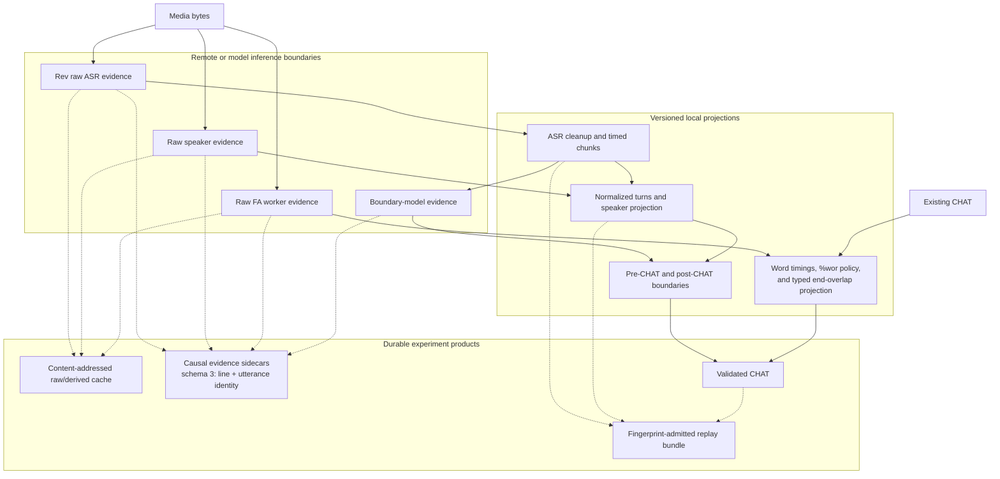
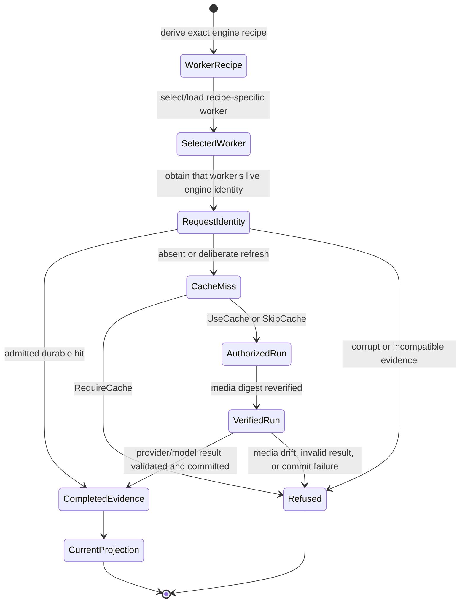
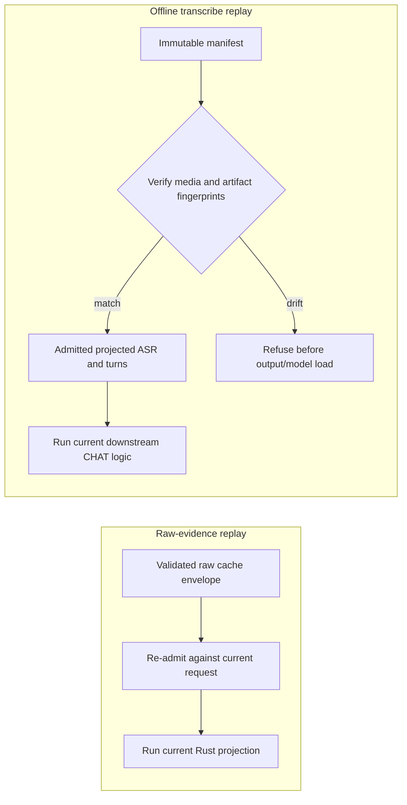
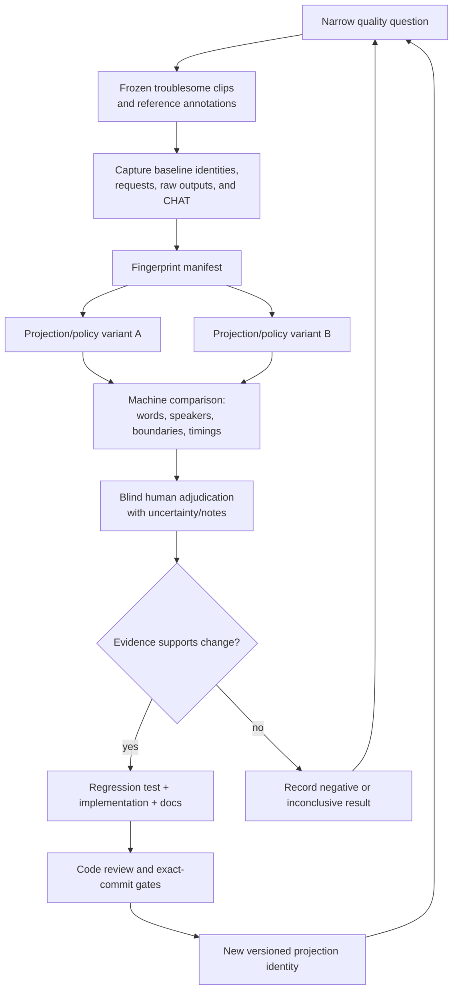
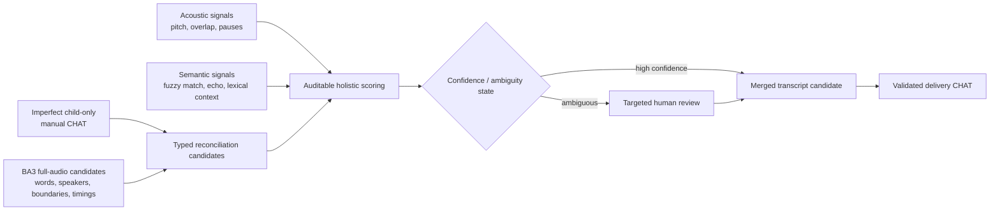

# Evidence, Replay, and Experiment Topology

**Status:** Current
**Last updated:** 2026-08-31 03:11 EDT

This chapter is the visual map for BA3's evidence architecture. Version 0.3.0
has raw-evidence caching and FA evidence schema 2. Version 0.4.0 additionally
has the experimental
`rebuild-from-evidence` and `preserve-cross-speaker` projections plus schema 3
stable utterance ordinals; those additions are not claims about the deployed
v0.3 service. Detailed
contracts remain in [Audio-Task Cache](../../architecture/runtime/audio-task-cache.md),
[Observability](observability.md), and the developer references for
[transcribe](../developer/commands/transcribe.md) and
[align](../developer/commands/align.md).

The central design rule is that acquiring model evidence, projecting that
evidence through local algorithms, and judging transcript quality are separate
operations. BA3 now constrains the first two. Human or corpus-specific
adjudication remains an experiment-layer responsibility.

For forced-alignment reruns, `--existing-wor-boundaries` is one such local
projection dimension. It is intentionally downstream of raw evidence and
absent from the cache key. `preserve` is the compatibility default;
`rebuild-from-evidence` keeps fresh word extents and reconstructs main-tier
coverage from their hull. A valid or structurally self-contained result still
requires acoustic adjudication, especially when adjacent utterances overlap
and the later monotonicity pass intervenes.

`--end-overlap-policy` is an independent local projection dimension. Its
compatibility default clamps all adjacent end overlap. The experimental
`preserve-cross-speaker` arm keeps overlap only when adjacent speaker codes
differ; same-speaker clamps and start-regression stripping remain unchanged.
Both policies travel inside one `FaProjectionPolicy`, so full, incremental,
all-reusable, and empty-group paths cannot silently apply different
combinations. A second phase type, `FaFinalized`, requires optional bullet
repair to run before that policy's monotonicity projection on every path.

A cache-only ten-file development experiment held every other typed option
fixed and changed only this policy. All 547 FA groups replayed
from cache. Nine normalized outputs were identical; the tenth retained exactly
one cross-speaker overlap that the compatibility arm had clamped. The ten
same-speaker clamps and seven start-regression removals were unchanged. This
proves causal isolation of the local projection, not that either boundary is
acoustically preferable; a sealed listening experiment remains the promotion
gate.

## Implemented evidence lanes

Solid arrows are semantic processing. Dashed arrows are retained evidence or
replay products. Sidecars are files, not CHAT dependent tiers: current BA3 does
not generate `%xalign` or `%xrev`.

## Inference authorization is a state transition

A cache miss is not permission to call a provider. The resolver must consume
the miss into a single-use authorization, and successful evidence must be
validated and committed durably before projection succeeds.

This is a typestate boundary. Provider adapters cannot manufacture
`AuthorizedRun`, and offline replay cannot accidentally acquire provider-call
capability. A per-job cache key uses the capability of the exact worker selected
for that request. A process-wide availability snapshot is not evidence of which
engine handled a job and cannot enter cache identity. Lazy workers are keyed by
their engine recipe, so requests for different ASR or forced-alignment engines
cannot reuse one process and silently inherit whichever model loaded first.

## Replay has two deliberately different meanings

Raw-evidence replay can test a changed local normalizer or aligner projection.
The current offline transcribe bundle begins from retained projected ASR and
turn artifacts, so it tests downstream speaker projection, segmentation, CHAT
construction, and postprocessing without claiming that those artifacts are raw
Rev or raw pyannote evidence.

FA schema 3 keeps the input-AST line index for debugging and adds an ordinal
among utterances only for every structured monotonicity effect and its
neighbour. Command provenance can insert an `@Comment` before final
serialization, so a line index alone is not a stable final-output address.
Experiment admission cross-checks the recorded ordinal against the exact input
CHAT and then resolves the same speaker/token identity in output CHAT; a
header-only rewrite succeeds, while an utterance insertion, deletion, reorder,
or lexical drift refuses.

## Reproducible comparative experiment loop

This loop is the basis for precise comparisons with the upstream BA3 fork and for
segmentation, diarization, Rev-media, and `%wor` studies. A system-level claim
requires the whole chain; a few plausible transcripts do not establish
universal superiority.

## Boundary with IISRP and MichiganChild merge work

The following is the intended downstream research topology, not a feature the
BA3 v0.3 CLI currently performs:

The manual child transcript is evidence, not an oracle: it may contain `xxx`,
miss adult interruptions, or choose different but defensible utterance
boundaries. The merge layer should therefore preserve competing candidates and
ambiguity until a typed decision is made. BA3 supplies replayable full-audio
evidence; project tooling performs the corpus-specific reconciliation.

## Diagram maintenance rule

When a new cache state, evidence artifact, inference capability, or projection
revision is added, update the smallest detailed diagram and this overview in
the same change. A diagram is part of the contract: if it cannot distinguish
raw evidence from a derived artifact or implemented behavior from planned
research, it is misleading and must not be marked current.
