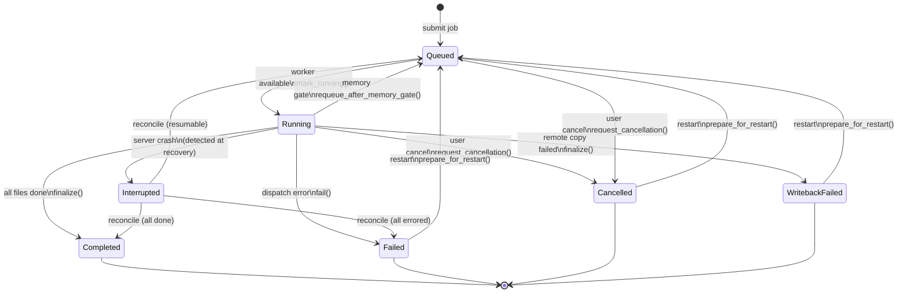

# Job State Machine

**Status:** Current
**Last modified:** 2026-04-08 17:57 EDT

## Overview

This page documents the job lifecycle state machine — the allowed states,
transitions, and validation rules for jobs managed by the batchalign3 server.

## Current Implementation

Job state transitions are currently implemented as ad-hoc method calls on
`Job` in `store/job/lifecycle.rs`. There is no single dispatch point or
explicit validation of transition legality. This design was identified in
the release review (Chapter 8) as needing explicit event-driven treatment.

## State Diagram



## States

| State | Terminal? | Restartable? | Description |
|-------|:---------:|:------------:|-------------|
| `Queued` | No | — | Waiting for worker availability |
| `Running` | No | — | Actively processing files |
| `Completed` | Yes | No | All files succeeded |
| `Failed` | Yes | Yes | One or more files errored |
| `Cancelled` | Yes | Yes | User-initiated cancellation |
| `Interrupted` | Yes | No | Server crash detected (transient — reconciled at startup) |
| `WritebackFailed` | Yes | Yes | Remote results lost during copy-back |

## Proposed: Event-Driven Transitions (T096)

### Design

Replace ad-hoc method calls with a single `apply_event()` dispatch point:

```rust
/// All possible job lifecycle events.
#[derive(Debug, Clone)]
enum JobEvent {
    Submitted,
    WorkerAvailable,
    MemoryGateRejected { retry_at: UnixTimestamp },
    DispatchStarted { num_workers: u32 },
    DispatchFailed { error: String },
    AllFilesDone,
    CancellationRequested,
    FileTerminalError,
    WritebackFailed { error: String },
    ServerCrashDetected,
    RecoveryRequeued,
    RecoveryFailed,
    RecoveryCompleted,
}

impl Job {
    /// Apply a lifecycle event. Returns `Err` if the transition is invalid
    /// from the current state.
    fn apply_event(
        &mut self,
        event: JobEvent,
        now: UnixTimestamp,
    ) -> Result<(), InvalidTransition> {
        // Single match on (current_status, event) → validate → update
    }
}
```

### Benefits

- **Single validation point** for all transitions
- **Explicit state machine** documented in code (match arms = transition table)
- **Testable** — construct events, assert state changes, test invalid transitions
- **Auditable** — `tracing::info!` on every `apply_event()` call

### Implementation Plan

1. Define `JobEvent` enum in `store/job/types.rs`
2. Implement `apply_event()` on `Job` in `store/job/lifecycle.rs`
3. Refactor all callers to construct events:
   - `runner/execution.rs` → `WorkerAvailable`, `DispatchFailed`, `AllFilesDone`
   - `routes/jobs.rs` → `CancellationRequested`
   - Recovery code → `RecoveryRequeued` / `RecoveryFailed` / `RecoveryCompleted`
4. Write transition tests (valid and invalid)
5. Add `tracing::info!` for observability

### Scope

This is a 2-week focused refactor. It does NOT require full event sourcing
(no event log table, no replay). Events are applied in-place on the mutable
`Job` struct, same as today — the improvement is validation and single dispatch.

## Runner Lifecycle

Every job in `Queued` state must have exactly one active `job_task` runner.
This invariant is maintained by two mechanisms:

### 1. Submit path

`submit_job()` in `server_backend.rs` spawns `job_task` immediately after
inserting the job:

```rust
runtime.spawn_detached(job_task(job_id, host.clone()));
```

### 2. Memory-gate requeue path

When the host-memory coordinator rejects a job, `run_hosted_job` returns
`Ok(HostedJobRunOutcome::Requeued { retry_at })`. The `job_task` match arm
catches this outcome and spawns a delayed replacement runner:

```rust
Ok(HostedJobRunOutcome::Requeued { retry_at }) => {
    let delay_secs = (retry_at.0 - unix_now().0).max(0.0);
    tokio::spawn(async move {
        tokio::time::sleep(Duration::from_secs_f64(delay_secs)).await;
        job_task(job_id_retry, host_retry).await;
    });
}
```

The current `job_task` instance then exits normally: `lease_task.abort()` and
`release_runner_claim()` run unconditionally at the bottom. The replacement
task acquires the semaphore and memory gate fresh after the backoff.

**Why this matters:** if `Requeued` were silently discarded (e.g., swallowed by
`if let Err(e) = ...`), the job would remain `Queued` forever with
`next_eligible_at` set but no runner. Every subsequent submission of the same
files would receive a 409 conflict with no way to resolve it short of a manual
cancel.

### 3. Bootstrap path

When the daemon starts, `bootstrap_test_server_backend` calls
`store.queued_job_ids()` after `load_from_db()` and spawns `job_task` for each
recovered `Queued` job:

```rust
for job_id in queued_job_ids {
    runtime.spawn_detached(job_task(job_id, host.clone()));
}
```

This handles jobs that were `Queued` when the daemon was last stopped — either
because they survived a crash, or because a requeue runner was lost when the
process exited before the backoff timer fired.

`recover_interrupted()` (also called at startup) handles the complementary
case: jobs that were `Running` at crash time are marked `Interrupted`, then
reconciled to `Queued`/`Failed`/`Completed`. The bootstrap spawn above then
picks them up if they land in `Queued`.

**Invariant:** after bootstrap completes, every `Queued` job in the DB has
exactly one active `job_task` runner.

### Why `job_task` is not an `async fn`

`job_task` is declared as a plain function returning
`Pin<Box<dyn Future<Output=()> + Send + 'static>>` rather than `async fn`.
This is required by the requeue self-spawn:

```rust
tokio::spawn(async move {
    sleep(delay).await;
    job_task(job_id_retry, host_retry).await;  // recursive call
});
```

With `async fn`, Rust's `Send` inference on the opaque `impl Future` return
type becomes self-referential. The compiler can prove `Send` from the outside
(non-recursive call site) but not from inside the body when the future awaits
itself inside `tokio::spawn`. The explicit boxed return type breaks the cycle:
`job_task(...)` now returns a concrete `Pin<Box<dyn Future + Send>>` whose
`Send`-ness the compiler can verify unconditionally.

## File Locations

| File | Role |
|------|------|
| `store/job/types.rs` | `JobStatus` enum, `Job` struct |
| `store/job/lifecycle.rs` | Transition methods (→ `apply_event()`) |
| `runner/execution.rs` | Job dispatch (emits events) |
| `routes/jobs.rs` | Cancel/restart (emits events) |
| `store/queries/recovery.rs` | Crash recovery (emits events) |
