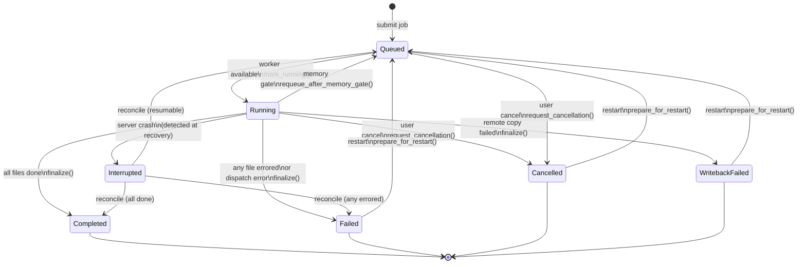

# Job State Machine

**Status:** Current
**Last updated:** 2026-06-30 13:55 EDT

## Overview

This page documents the job lifecycle state machine, the allowed states,
transitions, and validation rules for jobs managed by the batchalign3 server.

## Current Implementation

Job state transitions are currently implemented as ad-hoc method calls on
`Job` in `store/job/lifecycle.rs`. There is no single dispatch point or
explicit validation of transition legality. This design was identified in
the release review (Chapter 8) as needing explicit event-driven treatment.

## State Diagram


```mermaid
stateDiagram-v2
    [*] --> Queued: submit job

    Queued --> Running: worker available\nmark_running()
    Running --> Completed: all files done\nfinalize()
    Running --> Failed: any file errored\nor dispatch error\nfinalize()
    Running --> Cancelled: user cancel\nrequest_cancellation()
    Running --> Queued: memory gate\nrequeue_after_memory_gate()

    Queued --> Cancelled: user cancel\nrequest_cancellation()

    Failed --> Queued: restart\nprepare_for_restart()
    Cancelled --> Queued: restart\nprepare_for_restart()
    WritebackFailed --> Queued: restart\nprepare_for_restart()

    Running --> WritebackFailed: remote copy failed\nfinalize()
    Running --> Interrupted: server crash\n(detected at recovery)

    Interrupted --> Queued: reconcile (resumable)
    Interrupted --> Failed: reconcile (any errored)
    Interrupted --> Completed: reconcile (all done)

    Completed --> [*]
    Failed --> [*]
    Cancelled --> [*]
    WritebackFailed --> [*]
```

## States

| State | Terminal? | Restartable? | Description |
|-------|:---------:|:------------:|-------------|
| `Queued` | No |: | Waiting for worker availability |
| `Running` | No |: | Actively processing files |
| `Completed` | Yes | No | All files succeeded |
| `Failed` | Yes | Yes | One or more files errored |
| `Cancelled` | Yes | Yes | User-initiated cancellation |
| `Interrupted` | Yes | No | Server crash detected (transient, reconciled at startup) |
| `WritebackFailed` | Yes | Yes | Remote results lost during copy-back |

## Proposed: Event-Driven Transitions (T096)

### Design

Replace ad-hoc method calls with a single `apply_event()` dispatch point:

```rust
/// All possible job lifecycle events.
#[derive(Debug, Clone)]
enum JobEvent {
    Submitted,
    WorkerAvailable,
    MemoryGateRejected { retry_at: UnixTimestamp },
    DispatchStarted { num_workers: u32 },
    DispatchFailed { error: String },
    AllFilesDone,
    CancellationRequested,
    FileTerminalError,
    WritebackFailed { error: String },
    ServerCrashDetected,
    RecoveryRequeued,
    RecoveryFailed,
    RecoveryCompleted,
}

impl Job {
    /// Apply a lifecycle event. Returns `Err` if the transition is invalid
    /// from the current state.
    fn apply_event(
        &mut self,
        event: JobEvent,
        now: UnixTimestamp,
    ) -> Result<(), InvalidTransition> {
        // Single match on (current_status, event) → validate → update
    }
}
```

### Benefits

- **Single validation point** for all transitions
- **Explicit state machine** documented in code (match arms = transition table)
- **Testable**: construct events, assert state changes, test invalid transitions
- **Auditable**: `tracing::info!` on every `apply_event()` call

### Implementation Plan

1. Define `JobEvent` enum in `store/job/types.rs`
2. Implement `apply_event()` on `Job` in `store/job/lifecycle.rs`
3. Refactor all callers to construct events:
   - `runner/execution.rs` → `WorkerAvailable`, `DispatchFailed`, `AllFilesDone`
   - `routes/jobs.rs` → `CancellationRequested`
   - Recovery code → `RecoveryRequeued` / `RecoveryFailed` / `RecoveryCompleted`
4. Write transition tests (valid and invalid)
5. Add `tracing::info!` for observability

### Scope

This is a 2-week focused refactor. It does NOT require full event sourcing
(no event log table, no replay). Events are applied in-place on the mutable
`Job` struct, same as today, the improvement is validation and single dispatch.

## Runner Lifecycle

Every job in `Queued` state must have exactly one active `job_task` runner.
This invariant is maintained by two mechanisms:

### 1. Submit path

`submit_job()` in `server_backend.rs` spawns `job_task` immediately after
inserting the job:

```rust
runtime.spawn_detached(job_task(job_id, host.clone()));
```

### 2. Memory-gate requeue path

When the host-memory coordinator rejects a job, `run_hosted_job` returns
`Ok(HostedJobRunOutcome::Requeued { retry_at })`. The `job_task` match arm
catches this outcome and spawns a delayed replacement runner:

```rust
Ok(HostedJobRunOutcome::Requeued { retry_at }) => {
    let delay_secs = (retry_at.0 - unix_now().0).max(0.0);
    tokio::spawn(async move {
        tokio::time::sleep(Duration::from_secs_f64(delay_secs)).await;
        job_task(job_id_retry, host_retry).await;
    });
}
```

The current `job_task` instance then exits normally: `lease_task.abort()` and
`release_runner_claim()` run unconditionally at the bottom. The replacement
task acquires the semaphore and memory gate fresh after the backoff.

**Why this matters:** if `Requeued` were silently discarded (e.g., swallowed by
`if let Err(e) = ...`), the job would remain `Queued` forever with
`next_eligible_at` set but no runner. Every subsequent submission of the same
files would receive a 409 conflict with no way to resolve it short of a manual
cancel.

### 3. Bootstrap path

When the daemon starts, `bootstrap_local_server_backend` calls
`store.queued_job_ids()` after `load_from_db()` and spawns `job_task` for each
recovered `Queued` job:

```rust
for job_id in queued_job_ids {
    runtime.spawn_detached(job_task(job_id, host.clone()));
}
```

This handles jobs that were `Queued` when the daemon was last stopped, either
because they survived a crash, or because a requeue runner was lost when the
process exited before the backoff timer fired.

`recover_interrupted()` (also called at startup) handles the complementary
case: jobs that were `Running` at crash time are marked `Interrupted`, then
reconciled to `Queued`/`Failed`/`Completed`. The bootstrap spawn above then
picks them up if they land in `Queued`.

**Invariant:** after bootstrap completes, every `Queued` job in the DB has
exactly one active `job_task` runner.

### Why `job_task` is not an `async fn`

`job_task` is declared as a plain function returning
`Pin<Box<dyn Future<Output=()> + Send + 'static>>` rather than `async fn`.
This is required by the requeue self-spawn:

```rust
tokio::spawn(async move {
    sleep(delay).await;
    job_task(job_id_retry, host_retry).await;  // recursive call
});
```

With `async fn`, Rust's `Send` inference on the opaque `impl Future` return
type becomes self-referential. The compiler can prove `Send` from the outside
(non-recursive call site) but not from inside the body when the future awaits
itself inside `tokio::spawn`. The explicit boxed return type breaks the cycle:
`job_task(...)` now returns a concrete `Pin<Box<dyn Future + Send>>` whose
`Send`-ness the compiler can verify unconditionally.

## File Locations

| File | Role |
|------|------|
| `store/job/types.rs` | `JobStatus` enum, `Job` struct |
| `store/job/lifecycle.rs` | Transition methods (→ `apply_event()`) |
| `runner/execution.rs` | Job dispatch (emits events) |
| `routes/jobs.rs` | Cancel/restart (emits events) |
| `store/queries/recovery.rs` | Crash recovery (emits events) |

## Runner ownership, restart safety, and requeue (canonical invariants)

Every submitted job gets a `job_task` runner: a self-contained async task
that owns the full lifecycle from semaphore acquire through finalization.

**Exclusive-runner invariant (2026-07-10).** Before executing, every runner
claims exclusive ownership via `store.begin_runner()`; a second runner for
the same job (typically a restart racing the cancelled runner's teardown)
WAITS on that claim instead of running concurrently. The claim also
establishes the queue lease, so the per-job heartbeat loop genuinely renews
it (and doubles as a stall alarm: ERROR log when a live runner shows no
file activity for 30 minutes). Every restart bumps the job's
`RunGeneration`; `finalize_job` and the force-terminal sweep refuse to act
from a stale generation, so a mid-teardown runner cannot clobber a
restarted job (the failure mode was: restart re-queues files, the stale
runner force-fails them as "did not reach terminal status" and finalizes
the job `failed` over the healthy new run). Contract test:
`tests/restart_handoff.rs`.

`job_task` is a **non-recursive function returning `Pin<Box<dyn Future>>`**
(not `async fn`). This is deliberate: the `Requeued` branch spawns a fresh
`job_task` inside `tokio::spawn`. With `async fn`, Rust's Send inference
becomes circular on the self-referential opaque return type. The explicit
boxed future gives the inner call a concrete, provably-Send type.

**Requeue invariant**: when the memory gate rejects a job:

1. `run_hosted_job` returns `Ok(HostedJobRunOutcome::Requeued { retry_at })`
2. `job_task` catches this in the `match` arm (not `if let Err(...)`)
3. It spawns a new delayed `job_task` via `tokio::spawn(sleep + job_task(...))`
4. The current `job_task` instance finishes: `lease_task.abort()` +
   `release_runner_claim()` run unconditionally at the bottom
5. The new task re-acquires the semaphore and memory gate after the backoff

Without step 3, a requeued job stays `Queued` forever with no runner and
blocks all future submissions of the same files (409 conflict).

**Bootstrap invariant**: queued jobs loaded from the DB at startup:

`bootstrap_local_server_backend` calls `store.queued_job_ids()` immediately
after `load_from_db()` and spawns `job_task` for each recovered `Queued` job
via `runtime.spawn_detached(job_task(job_id, host.clone()))`. This fulfills
the recovery path when the daemon is restarted after a crash or a memory-gate
rejection that lost its runner.

**Recovery is a two-step sequence that only fires at startup:**

1. `db.recover_interrupted()` (`db/recovery.rs`) is a SQL migration that
   flips rows in `('queued', 'running')` to `interrupted`. It does NOT
   touch existing `interrupted` rows and does NOT requeue.
2. `store.load_from_db()` (`store/queries/recovery.rs`) reads each row
   back into memory. For any job with `status ∈ {Interrupted, Running}`,
   it calls `Job::reconcile_recovered_runtime_state()`: which transitions
   the in-memory job (and writes back to the DB) to `Queued` if any file
   is resumable, or to a terminal state otherwise.

If the daemon stays alive across CLI sessions, neither step runs: the
bootstrap spawn after `load_from_db()` is the only mechanism that rescues
orphaned `Queued` jobs.

### Cancelled vs Interrupted at shutdown

`JobStatus::Cancelled` is reserved for user gestures (TUI cancel, HTTP
DELETE/cancel). It is permanent: a Cancelled job is never auto-resumed.

`JobStatus::Interrupted` is the system-initiated counterpart. The graceful
shutdown path writes `Interrupted` (not `Cancelled`) for in-flight jobs, with
an audit row in the `cancellations` table tagged `source=signal,
reason=server-cancel-all`. On the next server start, the recovery sequence
above transitions any Interrupted job whose file work is not yet complete back
to `Queued`.

This matters because a server bounce mid-job (deploy, OS restart, crash)
would otherwise be indistinguishable from a user cancel in the local DB, and
the user's dashboard would show the job as "cancelled" even though no user
pressed cancel.
