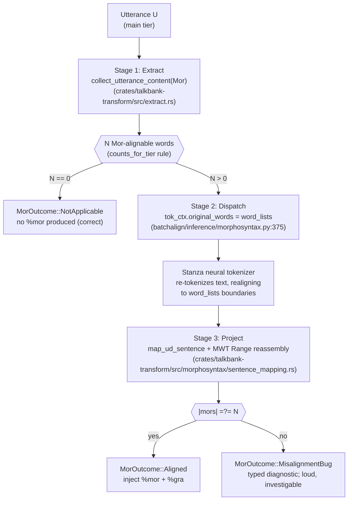

# Morphotag Reconciliation Invariants

**Status:** Current
**Last updated:** 2026-06-15 13:21 EDT

This page documents the **1-to-1 invariant** that the morphotag pipeline
relies on, the three stages that together make it hold deterministically,
the two legitimate modes that intentionally skip it, and the typed
outcome model that replaces the old silent-skip pattern.

## The invariant

For every CHAT utterance the pipeline visits:

> **Post-mapping, the number of `%mor` items equals the number of
> Mor-alignable words on the main tier.**

"Mor-alignable" is defined by
[`counts_for_tier(word, TierDomain::Mor)`](https://github.com/TalkBank/talkbank-tools)
in `talkbank-model`. It is the authoritative CHAT policy: regular words
count, replacement words count, tag-marker separators (comma `,`,
tag `„`, vocative `‡`) count; fillers (`&-hmm`), nonwords (`&~uh`),
phonological fragments (`&+le`), untranscribed material (`xxx`, `yyy`,
`www`), omissions, retrace content, and utterance terminators do not.

The canonical count is available as
`Utterance::mor_alignable_word_count()` on the
`talkbank_model::model::Utterance` type. **Any pipeline stage that
validates "dependent tier count matches main tier content" must call
this method.** Duplicating the walk locally risks drift from CHAT
policy and from sibling implementations: two copies of a word-counting
rule are two places the rule can silently drift out of sync.

## Why this can hold by construction

Three independent pipeline stages cooperate to make the invariant
deterministic. When each does its job, `|mors| == N` without any
post-hoc alignment.

Stage 1 produces **N** from the CHAT side. Stage 2 tells Stanza "use
these N word boundaries when you re-tokenize the combined text." Stage 3
takes Stanza's UD output and reassembles MWT ranges (`don't` → `do + n't`)
back into one `%mor` chunk per CHAT word.

Each stage's correctness is independently testable:

- **Stage 1**: the parity test at
  `crates/batchalign/tests/chat_ops_mor_count_parity_reference_corpus.rs`
  asserts that `Utterance::mor_alignable_word_count()` and
  `extract::collect_utterance_content(..., Mor, ...).len()` agree on
  every utterance in the 98-file reference corpus.
- **Stage 2**: the contract test at
  `batchalign/tests/inference/test_morphosyntax_realignment_contract.py`
  asserts that `tok_ctx.original_words = word_lists` happens before
  every `nlp()` call in normal mode, and is empty under `--retokenize`.
- **Stage 3**: unit tests in `nlp/mapping/mod.rs` exercise MWT
  reassembly across French (`du → de + le`), English (`don't → do + n't`),
  German (`im → in + dem`), Italian, Portuguese, Dutch, and a comma
  regression test that locks the mid-utterance-comma handling.

When a count mismatch nevertheless surfaces at the injection boundary,
it is **always a bug in one of those three stages** — never an
expected divergence class to be resolved by after-the-fact alignment.

## The two legitimate non-realignment modes

Two documented modes intentionally skip the realignment step because
they want Stanza to own tokenization:

| Mode | Trigger | Why skip realignment |
| --- | --- | --- |
| **CJK retokenize** | Mandarin (`zho`/`cmn`) with `retokenize=True`; `use_retok_pipeline=True` in `morphosyntax.py` | Chinese has no whitespace word boundaries; Stanza's neural segmenter produces the correct word boundaries for Chinese, and CHAT's main tier is rewritten to match. |
| **Generic retokenize** | Any language with `--retokenize` CLI flag; `req.retokenize=True` | The user has asked the pipeline to expand MWTs (`gonna → going + to`) and rewrite the CHAT main tier accordingly. Stanza must own tokenization for that. |

In both modes, the 1-to-1 invariant is **not** violated — it simply
operates at the Stanza-token level instead of the CHAT-word level.
The main tier gets rewritten to match Stanza's output, and the
resulting `%mor` count equals the rewritten word count by construction.
(The current implementation of this rewrite lives in
`crates/talkbank-transform/src/retokenize.rs` plus the
`crates/talkbank-transform/src/retokenize/` sub-modules.)

## MorOutcome: the typed outcome vocabulary

Every utterance the pipeline visits produces exactly one
``MorOutcome``
with one of three kinds. This replaces the previous silent-skip
behavior that previously let an upstream regression mask itself as
silent `%mor` loss.

| Kind | Meaning | Surfaces as |
| --- | --- | --- |
| `NotApplicable { reason }` | The utterance had zero Mor-alignable words. No `%mor` is produced, and that is correct. Reasons: `FillerOnly`, `FragmentOnly`, `NonwordOnly`, `UntranscribedOnly`, `AllRetraced`, `MixedNonLinguistic`, `Empty`. | `%xalign: morphosyntax:not_applicable reason=filler_only` (when `--review-level` enables it) |
| `Aligned { n_words }` | `N` CHAT words, `N` `%mor` items; happy path. | No decision tier (review-worthy only on demand). |
| `MisalignmentBug(diag)` | `|mors| ≠ N` after mapping. A bug in extract, realign, or project. Carries a typed diagnostic with `chat_words`, `stanza_tokens_after_mapping`, `expected`, `actual`, and a best-effort `suspected_class`. | `%xalign: morphosyntax:misalignment_bug class=... expected=... actual=... chat_words=... stanza_tokens=...`, plus `%xrev: [?]` (always requires review). |

The "Surfaces as" `%xalign` / `%xrev` tiers are written only when the
morphotag job's `review_level` is above `none`, and only on the
incremental reprocessing path. `review_level` **defaults to `none`**, so
by default these decisions surface through structured tracing and the
typed `Outcome`, not as tiers in the output CHAT. See the
[Review Tiers guide](../user-guide/review-tiers-guide.md).

The `MisalignmentClass` classifier (best-effort) points developers at
the most likely failing stage:

- `RealignmentSkipped` — Stanza's tokenizer-realignment context was
  `None` for the dispatch language; Stanza ran without boundary hints.
- `MwtReassemblyBug` — the UD→Mor projection consumed the wrong number
  of tokens during MWT Range expansion.
- `TerminatorFilterBug` — `is_terminator_punct` dropped too many or too
  few PUNCT tokens — e.g. dropping mid-utterance `cm|cm` separators
  that CHAT counts as alignable.
- `LanguageDispatchIssue` — per-language chunk of a code-switched
  utterance disagreed with the CHAT main-tier count.
- `Unknown` — diagnostic alone is insufficient; developer must inspect.

## What this architecture explicitly does **not** do

- It does **not** add a DP alignment layer between Stanza output and
  CHAT words. That would paper over bugs in the three stages rather
  than fix them. Batchalign2 did this (character-level DP inside
  Stanza's `tokenize_postprocessor`) and still silently skipped
  residual mismatches; the new architecture replaces both halves with
  a built-in Stanza realignment + typed outcomes.
- It does **not** change the CHAT Mor-alignable policy. If a future
  CHAT-manual-approved decision includes fillers in `%mor`, that is a
  change to `counts_for_tier` in `talkbank-model`, propagated through
  `mor_alignable_word_count()` to every caller. Pipeline-internal
  heuristics are banned.
- It does **not** reduce observability on the happy path. `Aligned`
  outcomes do not produce decision tiers by default — morphotag users
  see exactly the same output as before for every successful utterance.

## See also

- `crates/talkbank-transform/src/morphosyntax/outcome.rs` — outcome types
- `crates/talkbank-transform/src/inject.rs` — invariant check & outcome emission
- `crates/talkbank-transform/src/morphosyntax/payload.rs` — NotApplicable classification
- `batchalign/inference/morphosyntax.py` — realignment stage
- `batchalign/tests/inference/test_morphosyntax_realignment_contract.py` — Stage 2 tests
- `crates/batchalign/tests/chat_ops_mor_count_parity_reference_corpus.rs` — Stage 1 tests
- `talkbank-tools/crates/talkbank-model/src/alignment/helpers/rules.rs` — `counts_for_tier`
