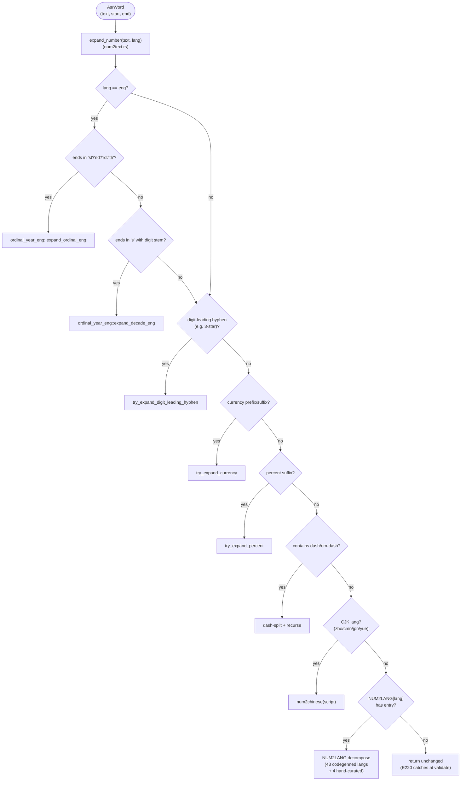
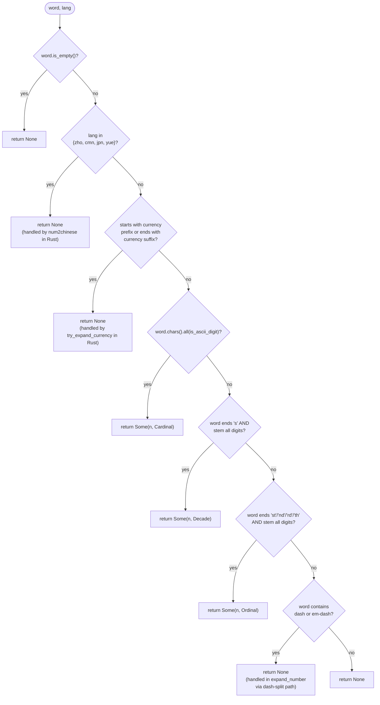

# Number Expansion in ASR Post-Processing

**Status:** Current
**Last updated:** 2026-05-19 20:10 EDT

This page is the **single source of truth** for how batchalign3 turns
ASR-emitted number tokens (`"3"`, `"$5"`, `"1950s"`, `"3rd"`,
`"80%"`, `"3-star"`) into CHAT-legal main-tier text. Both the current
implementation and the planned architectural rework live here. When
the implementation changes, this page must be updated in the same
patch — there is no other authoritative description.

## Why number expansion exists

CHAT was designed for human transcribers. Most languages forbid bare
Arabic digits in main-tier word position
(`talkbank-tools/crates/talkbank-model/src/validation/word/language/digits.rs`
permits digits only for `zho`, `cym`, `vie`, `tha`, `nan`, `yue`,
`min`, `hak`); the validator emits **E220** when it sees them
elsewhere. Human transcribers know to write `"three"` instead of
`"3"`.

ASR engines did not get the memo. They emit number-bearing tokens in
several shapes:

| Shape | Example | Why ASR returns it |
|------|---------|---------------------|
| Bare digits | `"3"`, `"100"` | Whisper, Whisper-Hub fine-tunes (esp. Indic/Malayalam), Rev.AI for large numbers |
| Spelled words | `"three"` | Most ASR for small English numbers |
| Decade | `"1950s"` | Year-context heuristic |
| Ordinal | `"3rd"`, `"21st"` | English-specific suffixes |
| Currency | `"$5"`, `"€3"` | Symbol-prefixed, locale-driven |
| Percent | `"80%"` | Symbol-suffixed |
| Digit-leading hyphen | `"3-star"`, `"17-year-old"` | Compound modifiers |
| CJK numerals | `"三"`, `"百"` | Tencent / FunASR / CJK-tuned Whisper |
| Dash range | `"5-7"`, `"5—6"` | Reading numeric ranges |

Number expansion bridges these to CHAT-legal forms per the target
language. It is **deterministic text rewriting** — no ML, no audio
context, no speaker inference. Pure function from `(token, lang)`
to `String`.

## Current architecture

### Stage placement

Number expansion lives in `stage_asr_postprocess`
(`crates/batchalign/src/pipeline/transcribe.rs`), which is
gated by `always_enabled` — it runs for **every** language on
**every** transcribe / transcribe_s job. It is not gated on Stanza
availability.

### Dispatch

Round 2 of the rework landed: **the Python `num2words` IPC is gone.**
Number expansion is now a single per-word Rust pass with no boundary
crossings:



After per-word expansion, `split_words_with_whitespace` widens
multi-token expansions (`"100"` → `"one hundred"`) into separate
`AsrWord`s so each fits in a single `ChatWordText`.

For Malayalam (the motivating case for the rework), the path is
`expand_number("3", "mal")` → `NUM2LANG["mal"]["3"]` → `"മൂന്ന്"`.
For English ordinals (`"13th"`) and decades (`"1950s"`), the
`ordinal_year_eng` module produces `"thirteenth"` and `"nineteen
fifties"` via deterministic composition rules cross-validated against
`num2words` at build time (fixture `data/eng_ordinal_year_fixtures.json`).

**Languages other than English with ordinal or decade ASR output
pass through unchanged.** This is an accepted limitation — empirical
audit of fleet jobs.db shows non-English transcribe jobs have not
needed those modes; cardinals (the common case) are covered for every
language in the registry. Add a per-language ordinal/decade expander
if a real corpus surfaces the need.

### Per-language registry (Layer 1)

`crates/batchalign/src/asr_postprocess/registry.rs::NUMBER_EXPANDERS`
declares each language's expander explicitly:

| Variant | Used for |
|---|---|
| `RustTable` | Languages with a `NUM2LANG` JSON entry (43 codegenned + 3 hand-curated, see below) |
| `Num2Chinese(Simplified)` | `zho`, `cmn` |
| `Num2Chinese(Traditional)` | `jpn`, `yue` |
| `LangAllowsDigits` | `cym`, `nan`, `min`, `hak`, `vie` (CHAT validator permits digits inline) |
| `NoCoverage { tracked_in: ... }` | Languages we transcribe but have no expander — surfaces as a documented gap, not a silent fallthrough |

Lookup via `expander_for(lang)` returns `Option<NumberExpander>`.
Unknown ISO codes return `None` so callers can fail-loud instead
of passing the digit through to E220.

### Codegen

The pre-Layer-1 `data/num2lang.json` was hand-curated and contained
several typos (`"ninety-sx"` for English 96, `"diecineuve"` for
Spanish 19, `"จ็ด"` for Thai 7, etc.). The current
`crates/talkbank-transform/data/num2lang.json` was generated by
invoking Python `num2words` for every ISO 639-3 → num2words mapping
and writing the result to that path. 43 languages × 0-99 + decades +
100/1000 anchors = ~4,700 entries.

Four languages stay hand-curated (the regeneration workflow must not
overwrite them):

- `mal` (Malayalam) — num2words has no `ml` backend
- `ell` (Greek) — num2words has no `el` backend; hand-curated entries
  preserved verbatim from pre-codegen file (known typos flagged for
  follow-up native-speaker review)
- `eus` (Basque) — num2words has no `eu` backend
- `hrv` (Croatian) — num2words falls back to Serbian, lower quality
  than the existing hand-curated table

The codegen tool itself is not currently committed to the repo. When
the table needs regeneration, the workflow is: extract the
ISO 639-3 → 2-char mapping from `registry.rs`, drive `num2words`
externally, and write the result back to
`crates/talkbank-transform/data/num2lang.json`, taking care to
preserve the four hand-curated entries.

### Module map

| File | Purpose |
|------|---------|
| `crates/batchalign/src/pipeline/transcribe.rs` | `stage_asr_postprocess`, `prepare_asr_chunks` (per-word Rust expansion + whitespace split + finalize) |
| `crates/talkbank-transform/src/asr_postprocess/num2text.rs` | `expand_number(word, lang)` — top-level Rust entry; `detect_expansion`; currency/percent/dash helpers; `NUM2LANG` static map |
| `crates/talkbank-transform/src/asr_postprocess/ordinal_year_eng.rs` | `expand_ordinal_eng`, `expand_year_eng`, `expand_decade_eng` (English-only deterministic composition; cross-validated against `num2words` via `data/eng_ordinal_year_fixtures.json`) |
| `crates/talkbank-transform/src/asr_postprocess/num2chinese.rs` | `num2chinese(n, script)` for CJK |
| `crates/talkbank-transform/src/asr_postprocess/registry.rs` | `NumberExpander` enum + `NUMBER_EXPANDERS` per-language registry |
| `crates/talkbank-transform/data/num2lang.json` | Per-language Rust tables (43 codegenned + 4 hand-curated) |
| `crates/talkbank-transform/data/eng_ordinal_year_fixtures.json` | Cross-validation fixtures for `ordinal_year_eng` |

### Per-language coverage matrix

This matrix is **load-bearing**: it determines which expander any
given token routes to. Update in lock-step with code changes.

| Lang | Wire token | Expander | Source |
|------|------------|----------|--------|
| `eng` | `"3"` | Rust NUM2LANG | `data/num2lang.json:eng` |
| `eng` | `"3rd"` | Rust `expand_ordinal_eng` | `ordinal_year_eng.rs` |
| `eng` | `"1950s"` | Rust `expand_decade_eng` | `ordinal_year_eng.rs` |
| `eng` | `"1950"` (year context) | Rust NUM2LANG cardinal — year-form expansion only fires for the decade-suffixed shape; bare 4-digit numbers route as cardinals | `num2text.rs` |
| any | `"$5"` | Rust `try_expand_currency` | `num2text.rs` |
| any | `"80%"` | Rust currency-style + `PERCENT_WORD_BY_LANG` | `num2text.rs` |
| 43 codegenned langs (eng/fra/deu/spa/por/ita/nld/…) | `"3"` | Rust NUM2LANG | `data/num2lang.json` |
| `mal`, `ell`, `eus`, `hrv` | `"3"` | Rust NUM2LANG (hand-curated overlay) | `scripts/codegen_num2lang.py::HAND_CURATED` |
| `zho` / `cmn` | `"3"` | Rust `num2chinese(simplified)` | `num2text.rs` |
| `yue` / `jpn` | `"3"` | Rust `num2chinese(traditional)` | `num2text.rs` |
| Languages whose validator allows digits (`cym`, `nan`, `min`, `hak`, `vie`) | `"3"` | `LangAllowsDigits` (no-op; E220 wouldn't fire anyway) | `registry.rs` |
| Non-eng `"3rd"` / `"1950s"` | passthrough | None — accepted limitation, no observed production traffic | (gap) |
| `hin`, `tam`, `mar`, `guj`, `pan`, `ori`, most African langs | `"3"` | **Nothing** — digit reaches CHAT, E220 fires | (gap) |

To add a `num2words`-supported language: add the ISO 639-3 → 2-char
mapping to `ISO3_TO_NUM2WORDS` in `scripts/codegen_num2lang.py` and
re-run the script. To add a hand-curated language: add to
`HAND_CURATED` in the same script (the codegen never overwrites those).

### Detection algorithm (`detect_expansion`)

`detect_expansion` classifies a token's expansion mode (`Cardinal` /
`Ordinal` / `Decade` / `Year`) for callers that need the decision
without doing the expansion. After Round 2 the dispatcher does not
use it directly — `expand_number` runs the full per-word pipeline
unconditionally — but it is kept as a public helper for testing and
future per-mode dispatch.



A `Some` result means the token will be sent to Python. `None` means
either the Rust safety pass handles it (CJK, currency, dash) or it
isn't a number at all (passes through unchanged).

### Decompose strategy for higher numbers

`decompose_with_table` at `num2text.rs:274` greedily subtracts the
largest table entry that fits. So `"234"` for German becomes
`"zweihundert" + "vierunddreißig"` if the table has `200` and `34`,
or `"zweihundert" + "dreißig" + "vier"` if it has `200`, `30`, `4`.
Recurses for hundreds-and-up multipliers (`1234` → `decompose(1)` +
`"thousand"` + `decompose(234)`).

If the table can't fully decompose (e.g., a 5-digit number when the
table only goes to 1000), `expand_number` returns the original
digit string unchanged. This is a **silent fallthrough** — the
validator E220 will catch it later, but at the call site there's no
typed signal that expansion failed.

### Currency and percent

- `CURRENCY_PREFIXES` and `CURRENCY_SUFFIXES` (`num2text.rs:53,63`)
  recognize `$ € £ ¥ ₹ ₩ ₽` and append the **English** word for the
  currency regardless of target language. Rationale (per inline
  comment): morphosyntax can re-tag in-language later; CHAT just
  needs a non-digit word here.
- `PERCENT_WORD_BY_LANG` (`num2text.rs:77`) lists per-language
  percent words for the languages we actively transcribe. Anything
  not listed falls back to `"percent"`.

These two tables are independent of the main `NUM2LANG` table — they
exist because currency/percent symbols are language-orthogonal but
the words attached to them are language-specific.

## Known limitations (post-Round-2)

Round 1 collapsed the dual-pass dispatch into the
per-language registry + cardinal codegen. Round 2
landed deterministic Rust ordinal/year/decade expansion for English
and removed the Python `num2words` IPC entirely. The CLAUDE.md
"Python is a pure ML model server" rule no longer has an exception
for number expansion. Remaining issues:

1. **Non-English ordinals/decades pass through.** The Rust
   `ordinal_year_eng` module is English-only. Spanish `"3º"`,
   German `"3."`, French `"1950s"` (rare) leave the digit in place.
   No fleet job has produced them since transcribe rolled out;
   add a per-language ordinal/decade module if a real corpus
   surfaces the need.
2. **Scattered token detection.** Currency, percent, ordinals,
   decades, dash-ranges, digit-leading hyphens are each detected by
   their own ad-hoc function. No unified parse phase. Adding a new
   token shape (e.g., phone numbers `555-1234`, time `3:30`) means
   touching every dispatch site. Layer 2 of the rework addresses this.
3. **Indic + African coverage gaps.** Hindi, Tamil, Marathi,
   Gujarati, Punjabi, Oriya, and most African languages have no
   expander — registry returns `None` and the digit reaches CHAT,
   triggering E220. Add to `HAND_CURATED` in
   `scripts/codegen_num2lang.py` as the languages come online.
4. **Hand-curated quality not native-reviewed.** Greek (`ell`),
   Basque (`eus`), and Croatian (`hrv`) tables were preserved
   verbatim from the pre-codegen file and contain known typos
   (e.g., Greek `"96": "ενενήντα-sx"` with English-suffix bleed).
   Native-speaker review needed; flagged in the script's HAND_CURATED
   block.
5. **No fail-loud signal at submission.** A language not in the
   registry only surfaces at validation time as E220. The
   registry could be consulted at job submission to reject the
   request with a clearer error ("no number expansion configured
   for language X — see book/src/architecture/number-expansion.md").

---

## Future architecture

Layer 1 (per-language registry + cardinal codegen) and Round 2
(English ordinal/decade in Rust + Python IPC removal) **both landed
earlier** — the relevant content moved into "Current architecture"
above. Layers 2 and 3 are still proposed.

### Layer 1 — Per-language registry

Replace the dual-pass dispatch with a single typed registry:

```rust,ignore
/// Where a language's number-expansion implementation lives.
/// Exactly one variant per language; routing is explicit.
pub enum NumberExpander {
    /// Hand-curated NUM2LANG-style table embedded at compile time.
    /// Preferred for any language we can curate; eliminates Python IPC.
    RustTable(&'static BTreeMap<String, String>),

    /// Delegate to Python `num2words` over IPC. Phase out as Rust
    /// tables grow; useful only for languages num2words handles
    /// well that we have not yet curated.
    Num2WordsBackend(&'static str),

    /// CJK numerals via `num2chinese`. Script is part of the variant
    /// (Simplified for zho/cmn, Traditional for jpn/yue).
    Num2Chinese(ChineseScript),

    /// Language permits Arabic digits in CHAT (per the validator
    /// allowlist). No expansion needed; pass-through is correct.
    LangAllowsDigits,

    /// Documented gap: we know we don't handle this language, with
    /// a tracking-doc reference. Distinct from `Unknown` (an
    /// untracked omission). The dispatcher emits a WARN-level log
    /// the first time a NoCoverage path fires per (job_id, lang).
    NoCoverage { tracked_in: &'static str },
}

static NUMBER_EXPANDERS: LazyLock<HashMap<LanguageCode3, NumberExpander>> =
    LazyLock::new(|| { /* one entry per supported language */ });
```

The dispatcher becomes:

```rust,ignore
async fn expand_word(word: &mut AsrWord, lang: LanguageCode3, py: &PyClient) {
    match NUMBER_EXPANDERS.get(&lang) {
        Some(NumberExpander::RustTable(t))      => apply_table(word, t),
        Some(NumberExpander::Num2WordsBackend(c)) => py.expand(word, c).await,
        Some(NumberExpander::Num2Chinese(s))    => num2chinese_expand(word, *s),
        Some(NumberExpander::LangAllowsDigits)  => { /* no-op */ }
        Some(NumberExpander::NoCoverage { tracked_in }) => {
            warn_once_per_job_lang(lang, tracked_in);
        }
        None => return Err(/* unregistered language: hard fail at dispatch */),
    }
}
```

**Properties:**
- Single pass over words; no dual-write race.
- Python IPC only for languages explicitly registered as
  `Num2WordsBackend` — Malayalam et al. don't pay the roundtrip cost.
- `NoCoverage` makes gaps a **first-class concept** with a doc
  reference, not silent fallthrough.
- Adding a language is one registry entry. Removing is one entry.
  No two-place coordination.
- Compile-time test enumerates every transcribe-supported language
  and asserts `NUMBER_EXPANDERS` has an entry. Adding a new lang
  to the system without registering an expander fails CI.

**Migration:**
1. Define the enum and registry, port every current code path into
   it (including the existing JSON tables and `ISO3_TO_NUM2WORDS`
   mapping).
2. Switch `prepare_asr_chunks_with_python_expansion` to drive from
   the registry.
3. Delete the now-unused dual-pass code.
4. Lock in with a coverage test.

Estimated scope: ~400 LOC change concentrated in `num2text.rs` and
`pipeline/transcribe.rs`, plus deletion of the dual-pass
orchestration. ~1 day with TDD.

### Layer 2 — Typed `NumberToken` parser

Replace the scattered detect/try/try cascade with a single parse
function returning a typed enum:

```rust,ignore
pub enum NumberToken<'a> {
    BareDigits(i64),
    Decade(i64),                                  // "1950s"
    Ordinal(i64, OrdinalStyle),                   // "3rd"
    DigitLeadingHyphen(i64, &'a str),             // "3-star", "17-year-old"
    Currency(CurrencySymbol, i64),                // "$5", "€3"
    Percent(i64),                                 // "80%"
    DashRange(i64, i64, DashKind),                // "5-7", "5—6"
    PassThrough(&'a str),                         // not a number
}

pub fn parse_number_token(s: &str) -> NumberToken<'_>;
```

Each `NumberExpander` then exposes a method per token variant:

```rust,ignore
trait Expand {
    fn cardinal(&self, n: i64) -> Cow<'_, str>;
    fn decade(&self, n: i64) -> Cow<'_, str>;
    fn ordinal(&self, n: i64, style: OrdinalStyle) -> Cow<'_, str>;
    fn currency(&self, sym: CurrencySymbol, n: i64) -> Cow<'_, str>;
    fn percent(&self, n: i64) -> Cow<'_, str>;
    fn dash_range(&self, lo: i64, hi: i64) -> Cow<'_, str>;
}
```

Default trait methods can fall back to `cardinal` + appended word
for currency/percent/etc., so simple languages only need to
implement `cardinal`. Languages with richer conventions (Indian
English number grouping, Japanese kanji counters, German
year-as-compound) override.

This collapses six ad-hoc detection functions into one parse and
makes the input space testable as a closed enum. Adding a new token
shape (phone numbers, time, etc.) means one new variant + one new
trait method with a sensible default — not surgery across the file.

Estimated scope: parser ~200 LOC, trait + 13 impls ~600 LOC, plus
test coverage. ~2-3 days with TDD.

### Layer 3 — `LinguisticNormalizer` per language

Number expansion is one of several language-specific text transforms
ASR post-processing needs. Today they're scattered:

- `PERCENT_WORD_BY_LANG` (per-lang percent word)
- `CURRENCY_PREFIXES`/`SUFFIXES` (currency words, but English-only output)
- Compound word handling (`compounds.rs`)
- Cantonese normalization (`cantonese.rs`, separate module)
- Per-lang reconciler logic in `nlp/lang_<code>.rs` modules

The principled architecture is **one `LinguisticNormalizer` per
language** that owns every per-lang text rule. Number expansion is
one method; currency words, percent words, ordinal forms, year
conventions, decade forms, language-specific punctuation are
sibling methods.

```rust,ignore
pub trait LinguisticNormalizer: Send + Sync {
    fn lang(&self) -> LanguageCode3;
    fn expand_number(&self, token: NumberToken<'_>) -> Cow<'_, str>;
    fn currency_word(&self, sym: CurrencySymbol) -> &'static str;
    fn percent_word(&self) -> &'static str;
    fn normalize_punctuation(&self, s: &str) -> Cow<'_, str>;
    // ... extension points as needs arise
}

static NORMALIZERS: LazyLock<HashMap<LanguageCode3, Box<dyn LinguisticNormalizer>>> = ...;
```

Layer 1's registry collapses into one method on this trait. Layer 2's
parser becomes the input pipe. The whole post-processing path becomes
"parse token → resolve normalizer → dispatch."

Estimated scope: significant — touches every per-language code path
in `asr_postprocess/`. Right size for a multi-week project tied to
the broader summer Malayalam expansion (rupee handling, Indian-style
year forms, ordinal suffixes like ആം). Not standalone.

### Migration order (remaining)

1. **Layer 2** (typed parser). Now-or-never refactor of detection.
   Best done before Layer 3 because Layer 3's normalizer methods
   consume `NumberToken`.
2. **Layer 3** (full normalizer). Tied to the broader summer
   Malayalam expansion; do this when the additional per-lang
   transforms (rupee, ordinals, year forms) are also being added.

Each layer is independently shippable. Don't bundle.

### Out of scope for this rearch

- **Probabilistic expansion** (LLM-based for ambiguous cases like
  `"1950"` → `"nineteen fifty"` vs `"one thousand nine hundred
  fifty"`). Discussed because it's interesting, but determinism is
  a hard project value. If/when we want LLM-assisted disambiguation,
  it goes in a separate adjudication layer per
  `feedback_feedback_adjudication_long_term`.
- **CLAN compatibility checks**. CLAN doesn't do ASR; the rework
  doesn't change CHAT semantics, only how we get there from ASR.
- **Validator changes**. The E220 allowlist is correct as designed;
  the rework doesn't widen it. The principled fix is per-language
  expansion, not loosening validation.

---

## Maintenance protocol

**When the implementation changes** (any patch touching number
expansion code), update:

1. The "Current architecture" section above to reflect the new
   reality. If you migrated something out of the proposal, move it
   from "Future architecture" up.
2. The per-language coverage matrix.
3. The module map if file paths or line numbers shifted.
4. The `Last updated` header at the top.
5. Cross-references: `book/src/reference/languages/<lang>.md` for
   any per-language pages that mention numbers; the
   `book/src/developer/adding-language-support.md` checklist
   ("Number expansion" section) if the procedure changes.

**When adding a new language** (transcribe support for a language
not already on the matrix):

1. Determine which expander applies (per the
   [Adding Language Support](../developer/adding-language-support.md)
   checklist's number-expansion section).
2. Either:
   - add the ISO 639-3 → 2-char mapping to `ISO3_TO_NUM2WORDS` in
     `scripts/codegen_num2lang.py` and re-run the script, OR
   - add a `HAND_CURATED` entry in the same script (one-shot codegen
     never overwrites the overlay).
3. Add the row to this page's coverage matrix.
4. Add a test in `num2text.rs::tests`.
5. If neither path covers the language, document it explicitly:
   add a row with "Nothing — digit reaches CHAT, E220 fires" so
   the gap is visible to future contributors.

**When updating `num2words` (Python lib version bump):**

The library is no longer a runtime dependency, but
`scripts/codegen_num2lang.py` invokes it to regenerate
`num2lang.json` and `eng_ordinal_year_fixtures.json`. After bumping:

1. Re-run `uv run python scripts/codegen_num2lang.py --output crates/batchalign/data/num2lang.json`.
2. Re-run the English ordinal/year fixture generator (see comments in
   `scripts/codegen_num2lang.py`).
3. Diff the generated files; any value change in a covered language
   is a behaviour change worth a callout in the commit.
4. Run `cargo test -p batchalign --lib`; the
   `ordinal_year_eng` cross-validation tests catch divergence.

**When changing the CHAT digit-allowlist** (rare, requires CHAT-spec
maintainer sign-off):

1. Update `talkbank-tools/.../digits.rs::DIGIT_ALLOWED_LANGS`.
2. Update the matrix's last row ("Lang allows digits") to reflect
   the new set.
3. Audit each newly-allowed language's expander entry — if a
   language was `NoCoverage` and now allows digits, change the
   variant to `LangAllowsDigits`.

## Cross-references

- [Adding Language Support](../developer/adding-language-support.md)
  — checklist for new-language work; has a "Number expansion" section
  that points here.
- [Malayalam Language Support](../reference/languages/malayalam.md)
  — concrete example of a language using the Rust `NUM2LANG` path
  after the fix.
- `crates/batchalign/CLAUDE.md` — `asr_postprocess/` module
  map; references `num2text.rs` for number expansion specifically.
- `crates/batchalign/CLAUDE.md` — Python boundary policy
  ("Locked de-Pythonization target"). After Round 2, number
  expansion no longer violates this rule.
- `talkbank-tools/crates/talkbank-model/src/validation/word/language/digits.rs`
  — the E220 validator and the `DIGIT_ALLOWED_LANGS` allowlist.
