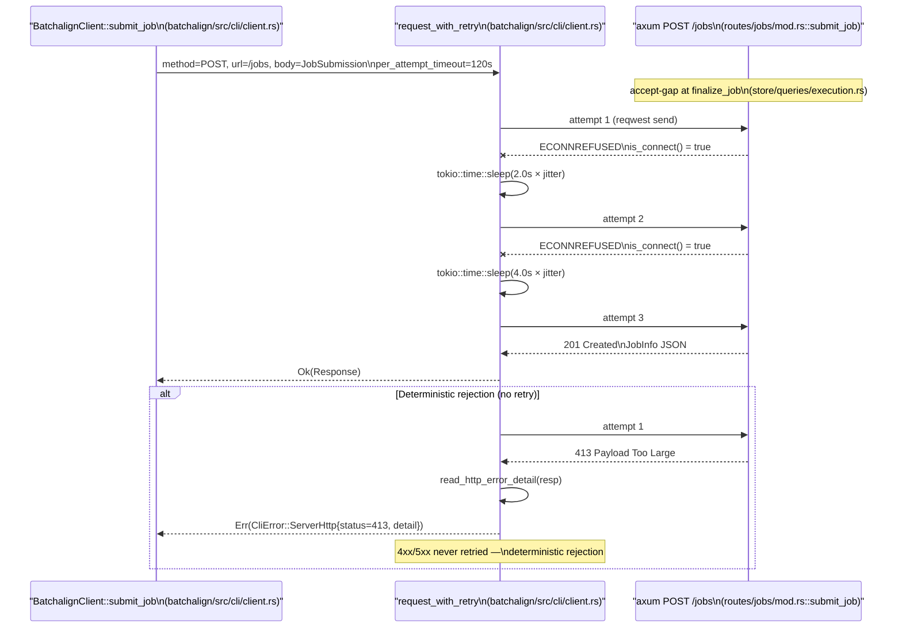

# Observability Architecture

**Status:** Current
**Last updated:** 2026-05-19 22:58 EDT

## Overview

The batchalign3 server processes jobs through a unified runner shared by
direct mode, embedded server, and Temporal. All three modes produce the
same `FileStatus` records, use the same error classification, and persist
to the same SQLite store. Fixing observability in the runner fixes it for
all modes.

## What Is Observable (shipped)

### Submit-path retries

`BatchalignClient::submit_job` (`crates/batchalign/src/cli/client.rs`)
goes through the shared `request_with_retry` helper. The contract is narrow on
purpose and load-bearing for fleet-scale runs:

- **Retry class:** transient `reqwest::Error::is_connect()` or `is_timeout()`
  only. These cover the daemon's accept-gap class — the brief window
  during job finalization when the local server is restarting and a
  new submission gets `Connection refused`.
- **No retry on HTTP 4xx/5xx.** A deterministic server rejection (413
  payload too large, 400 validation failure, 409 conflict, 5xx panic-catch)
  is surfaced immediately as `CliError::ServerHttp { status, detail }`.
  Re-sending the same payload cannot fix it, and retrying would hide real
  configuration bugs (e.g. a payload that genuinely exceeds
  `max_body_bytes_mb`).
- **Attempts and backoff:** `RETRY_ATTEMPTS = 3` total, exponential backoff
  starting at `RETRY_BACKOFF = 2.0 s` with `0.5×–1.5×` multiplicative jitter.
- **Per-attempt timeout:** submission passes 120 s (large request bodies);
  health and result GETs pass 30 s. This is a parameter on
  `request_with_retry`, so the choice is explicit at the call site.

Regression tests live next to the implementation in `client.rs::tests`:
`submit_job_retries_transient_connect_errors` (points at reserved port 1,
asserts elapsed ≥ one retry × backoff × min-jitter) and
`submit_job_does_not_retry_413_length_limit_exceeded` (raw TCP listener
answering 413, asserts exactly one connection attempt).

The following sequence shows a submission against a daemon with a transient
accept pause, and the alt branch for a deterministic 413 rejection:



Diagram verified against:
`crates/batchalign/src/cli/client.rs` (`submit_job`, `request_with_retry`,
`read_http_error_detail`, constants `RETRY_ATTEMPTS`/`RETRY_BACKOFF`),
`crates/batchalign/src/routes/jobs/mod.rs` (`submit_job` handler),
`crates/batchalign/src/routes/mod.rs` (`RequestBodyLimitLayer`),
`crates/batchalign/src/types/config/server.rs`
(`default_max_body_bytes_mb`).

### Per-file progress

Each file tracks: status (queued/processing/done/error), stage, current/total
counters. Published via `RunnerEventSink::set_file_progress()` to the store
and broadcast over WebSocket to the dashboard.

### Per-language-group batch progress

For batched commands (morphotag, utseg, translate, coref), `BatchInferProgress`
tracks per-language utterance counts. Published to the store at 2-second
intervals by the drain task in `infer_batched.rs`. Visible in:
- `JobInfo.batch_progress` (REST API)
- Dashboard `BatchProgressPanel` (React)
- CLI progress bars

**Per-language tagger.** The drain loop in `infer_batched.rs`
groups progress events by `event.stage`. The Python worker's
`batchalign/worker/_protocol.py::write_progress_event` hard-codes
`stage="stanza_processing"` regardless of language, so — before the fix —
three real language groups (eng / spa / zho ...) collapsed into a single
BTreeMap entry keyed `"stanza_processing"`. The resulting summaries were
nonsense (`"1/1 languages done, 453/274 utterances (165%)"`) and, critically,
the one collapsed group showed `completed >= total`, making
`incomplete_groups()` return `[]` — stall detection went blind.

The fix lives in `crates/batchalign/src/morphosyntax/worker.rs::infer_batch`:
a per-language tagger wrapper creates an inner `mpsc` channel, spawns a
forwarder task that reads events from the worker and rewrites `event.stage`
to the language code before forwarding to the outer `progress_tx`. The
existing drain loop sees distinct language keys and the heartbeat path
below can once again name stalled groups. Regression test:
`progress_events_from_multiple_languages_must_not_collapse_on_stage_label`
in `crates/batchalign/src/runner/util/batch_progress.rs`.

The following sequence shows where the relabel happens:

```mermaid
sequenceDiagram
    participant Py as "Python worker\n(batchalign/worker/_protocol.py)"
    participant Tag as "Per-language tagger\n(morphosyntax/worker.rs::infer_batch)"
    participant Drain as "Drain loop\n(runner/dispatch/infer_batched.rs)"
    participant Store as "BatchInferProgress\n(runner/util/batch_progress.rs)"

    Py->>Tag: progress event\nstage=&quot;stanza_processing&quot;, lang=&quot;eng&quot;
    Tag->>Tag: rewrite stage = lang (&quot;eng&quot;)
    Tag->>Drain: progress event\nstage=&quot;eng&quot;
    Py->>Tag: progress event\nstage=&quot;stanza_processing&quot;, lang=&quot;spa&quot;
    Tag->>Tag: rewrite stage = lang (&quot;spa&quot;)
    Tag->>Drain: progress event\nstage=&quot;spa&quot;
    Drain->>Store: key by event.stage\n(distinct per language)
    Store-->>Drain: incomplete_groups() sees real stalls
```

Diagram verified against: `batchalign/worker/_protocol.py`,
`crates/batchalign/src/morphosyntax/worker.rs`,
`crates/batchalign/src/runner/dispatch/infer_batched.rs`,
`crates/batchalign/src/runner/util/batch_progress.rs`.

### Job status authority: local store vs Temporal

The observability contract for **job status** depends on which backend
the server is running:

- **Direct / embedded backends** — the local SQLite store is authoritative.
  A file or utterance transitions through `Queued → Running → Completed`
  entirely inside one daemon's runner, and the store is mutated synchronously
  with the transition. What `JobStore` reports matches what actually happened.
- **Temporal backend** — the local store is a **cache**, not the source of
  truth. Temporal is authoritative. A job submitted on daemon A can be
  dispatched by Temporal to daemon B on a different fleet worker; B's activity
  completes the workflow, but A's local SQLite never hears about it through
  the runner path, because A never ran the job. Without explicit reconciliation
  A's store drifts: the job stays `Queued`/`Running` forever, even though
  Temporal knows it's `Completed`.

The drift matters beyond cosmetics. Conflict detection on resubmission reads
from the local store (`store/queries/mod.rs`). A submitter retrying the same
input files would hit a 409 Conflict against a ghost `Queued` job whose
workflow actually finished minutes ago on a peer.

**Fix:** a Temporal reconciler
(`crates/batchalign/src/temporal_reconciler.rs`) that pushes Temporal's
verdict back into the local store on two schedules:

1. A periodic background tick every `RECONCILER_TICK_S = 30` seconds
   (`temporal_backend.rs::bootstrap_temporal_server_backend`), sweeping
   every non-terminal local job.
2. An opportunistic scoped reconcile on every `submit_job`
   (`temporal_backend.rs::TemporalServerBackend::submit_job`), narrowed to
   the submitter via `reconcile_submitter(&submitted_by)`, and called
   **before** `store.submit(job)` so conflict detection sees fresh state.

The reconciler's decision is pure: given the local status, submission age,
runner-active hint, and Temporal's verdict, `reconcile_action()` returns
one of `NoChange`, `MarkCompleted`, `MarkCancelled`, or `MarkFailed { reason }`.
Reasons are typed (`TemporalTerminalFailure`, `WorkflowLost`) so log queries
and dashboards can discriminate without parsing messages. A `WorkflowLost`
sweep requires that Temporal reports not-found AND the job is older than
`RECONCILER_STALE_THRESHOLD_S = 300` seconds AND no runner is currently
attached — a young or actively-running job with `None` from Temporal is
treated as a transient visibility gap, not a lost workflow.

Temporal describes are fanned out **concurrently** via `FuturesUnordered`
(bound `MAX_CONCURRENT_DESCRIBES = 16`), because each describe is
network-bound and independent. Without this, a submitter with K stale jobs
would pay K × RTT synchronously inside the `submit_job` hot path.

The reconciler is *best-effort*: Temporal describe failures bump
`ReconcileReport.errored` and leave the job alone until the next tick. A
reconcile pass never blocks job progress; it converges store state toward
truth asynchronously.

The following sequence shows a completion propagating from a remote worker
back into the submitting daemon's local cache:

```mermaid
sequenceDiagram
    participant Remote as "Remote worker activity\n(temporal_backend.rs::BatchalignTemporalActivities)"
    participant TS as "Temporal server\n(&lt;temporal-host&gt;:7233)"
    participant Recon as "TemporalReconciler\n(temporal_reconciler.rs)"
    participant Query as "TemporalClientStateQuery\n(temporal_backend.rs)"
    participant Store as "JobStore\n(store/queries/mod.rs)"
    participant WS as "WebSocket broadcast\n(ws.rs)"

    Remote->>TS: activity completes\nworkflow result recorded
    Note over Recon: tokio::time::interval tick\n(RECONCILER_TICK_S = 30)
    Recon->>Store: reconcilable_snapshot(None)
    Store-->>Recon: Vec&lt;ReconcilableJobSnapshot&gt;
    Recon->>Query: query_workflow_outcome(job_id)\n(FuturesUnordered fan-out)
    Query->>TS: describe_workflow(workflow_id = job_id)
    alt Temporal reachable
        TS-->>Query: WorkflowExecutionStatus::Completed
        Query-->>Recon: Some(TemporalWorkflowOutcome::Completed)
        Recon->>Recon: reconcile_action(...) = MarkCompleted
        Recon->>Store: update_job_status(job_id, Completed, None)
        Store->>WS: emit status change
    else Temporal describe fails
        TS--xQuery: transport error
        Query-->>Recon: Err(ServerError)
        Recon->>Recon: report.errored += 1\n(leave job alone this tick)
    else Workflow not found, job young
        TS-->>Query: NotFound
        Query-->>Recon: Ok(None)
        Recon->>Recon: age &lt; stale_threshold_s\n=&gt; NoChange
    else Workflow not found, job stale, no runner
        TS-->>Query: NotFound
        Query-->>Recon: Ok(None)
        Recon->>Recon: age &gt; 300s AND !runner_active\n=&gt; MarkFailed{WorkflowLost}
        Recon->>Store: update_job_status(job_id, Failed, reason.message())
    end
```

Diagram verified against:
`crates/batchalign/src/temporal_reconciler.rs`,
`crates/batchalign/src/temporal_backend.rs`,
`crates/batchalign/src/store/queries/mod.rs`.

The opportunistic path on `submit_job` uses the same mechanism with
`reconcile_submitter(&submitted_by)` instead of `reconcile_all_active()`,
so the snapshot is narrower (same submitter only) and the reconcile fires
before conflict detection rather than on a fixed tick.

### Worker crash diagnostics

When a Python worker crashes, stderr is captured via an `mpsc` channel
and attached to `WorkerError::ProcessExited { code, stderr }`. The
user-facing error message includes the last 500 chars of stderr (the
Python traceback tail). Persisted to `FileStatus.error` in SQLite.

### Heartbeat gap detection

The drain task warns if no progress heartbeat arrives for 120 seconds,
naming the stalled language groups. This catches stuck workers without
needing Temporal.

Stall naming depends on the per-language tagger described above: without
the rewrite from `event.stage = "stanza_processing"` to the real language
code, every group would roll up under one key and `incomplete_groups()`
would always return `[]`. The per-language stage rewrite is a
load-bearing prerequisite for heartbeat-gap diagnostics.

### Language group timeouts

Each language group dispatch is wrapped in `tokio::time::timeout`
(default: `audio_task_timeout_s`, minimum 1800s). Timed-out groups
produce empty responses and a clear error — the batch continues with
other languages.

### Semaphore diagnostics

The bounded-concurrency semaphore in `batch.rs` logs:
- Total groups vs max concurrent before `join_all`
- Available permits on each acquire
- Language and item count per group

### Daemon log persistence

Daemon logs are appended on restart (not truncated). Previous session
diagnostics survive across daemon restarts.

### CLI failure hints

The failure summary shows the last 5 lines of worker stderr per file
and hints at the daemon log path.

## Known Observability Gaps

### Model loading is invisible

When a worker spawns, it loads ML models (Stanza, Whisper, Wave2Vec)
which can take 30-120 seconds. During this time, the job shows
"processing" with no progress. The worker emits a `ready` signal when
done, but this doesn't propagate to job-level progress.

**Needed:** A "loading models" stage at the job level. The worker pool
already knows when workers are spawning vs ready. This state should be
surfaced through `FileStatus.progress_stage` or a new job-level field.

**Files:** `worker/handle/mod.rs` (ready signal), `worker/pool/mod.rs`
(spawn tracking), `runner/util/file_status.rs` (stage reporting)

### Parse/validate phase is invisible

For batched commands, `run_morphosyntax_batch_impl` parses ALL files
sequentially before dispatching any workers. On 500 files with
validation warnings, this can take minutes. The job shows "0/N
processing" throughout.

**Needed:** A "parsing" stage with per-file progress during the parse
phase. Emit `set_file_progress` with `FileProgressStage::Parsing` as
each file is parsed.

**Files:** `morphosyntax/batch.rs` (parse loop at lines 49-83)

### Parsing is sequential

The parse/validate loop in `batch.rs` processes files one at a time.
For 500 files, this is slow. Parsing is CPU-bound (tree-sitter) and
could be parallelized with `rayon` or `tokio::spawn_blocking`.

**Architectural note:** Parallelizing parsing requires thread-safe
`TreeSitterParser` handles or per-thread instances. The parser is
not `Send` (tree-sitter limitation), so `rayon` with thread-local
parsers is the right approach.

**Files:** `morphosyntax/batch.rs` (parse loop)

## Source File Inventory

| File | What it observes |
|------|-----------------|
| `runner/util/file_status/` | `RunnerEventSink` trait, `set_file_progress`, `set_batch_progress` (split: `event_sink.rs`, `file_stage.rs`, `supervision.rs`, `tracker.rs`, `tests.rs`) |
| `runner/util/batch_progress.rs` | `BatchInferProgress` data model |
| `runner/dispatch/infer_batched.rs` | Drain task, heartbeat gap, progress publishing |
| `morphosyntax/batch.rs` | Language group dispatch, semaphore, timeouts |
| `worker/handle/lifecycle.rs` | Stderr capture, ready signal |
| `worker/error.rs` | `ProcessExited { code, stderr }` |
| `runner/util/error_classification.rs` | Error → user-facing message translation |
| `store/queries/file_state.rs` | Store methods for progress + WS broadcast |
| `temporal_reconciler.rs` | `reconcile_action()`, `TemporalReconciler`, `TemporalStateQuery`, `ReconcileAction`, `ReconcileFailureReason`, `ReconcileReport` |
| `temporal_backend.rs` | `TemporalClientStateQuery`, `map_temporal_status_to_outcome()`, `RECONCILER_TICK_S`/`RECONCILER_STALE_THRESHOLD_S`, opportunistic reconcile in `submit_job`, periodic tick in `bootstrap_temporal_server_backend` |
| `store/queries/mod.rs` | `ReconcilableJobSnapshot`, `JobStore::reconcilable_snapshot(submitted_by_filter)` |
