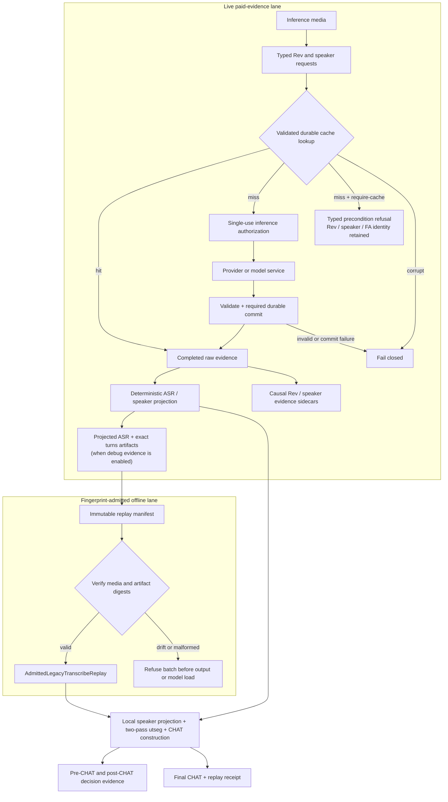
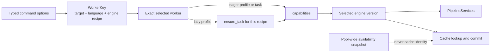
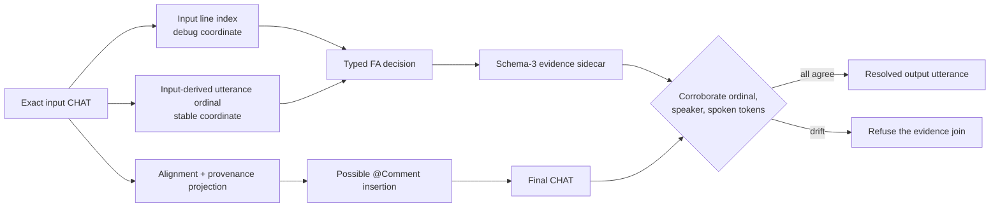
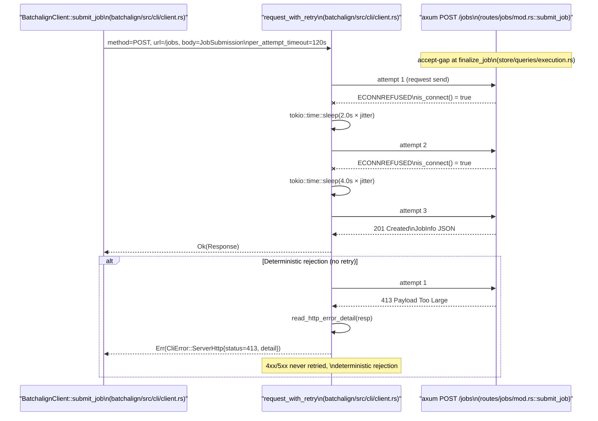
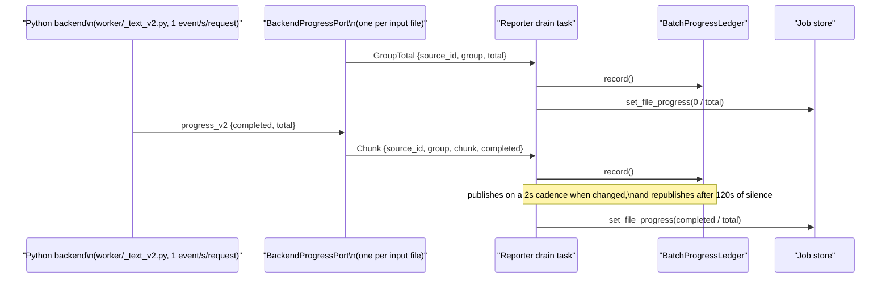

# Observability Architecture

**Status:** Current
**Last updated:** 2026-08-31 22:01 EDT

## Release boundary

This page describes the current source tree, not whichever build happens to be
running on a particular host. Treat `/health` runtime identities and the
reported build hash as the authority for a live server. A health response is
evidence about that executable and its admitted Python workers; it is never
evidence that an unverified checkout, wheel, or documentation tree was
deployed.

## Overview

The batchalign3 server processes jobs through a unified runner shared by
direct mode and the embedded/local server. Both modes produce the
same `FileStatus` records, use the same error classification, and persist
to the same SQLite store. Fixing observability in the runner fixes it for
all modes.

The current experiment architecture has two deliberately distinct entry
lanes. Live execution resolves raw paid-service evidence before projecting it.
Offline transcribe replay admits fingerprinted *projected* artifacts; it does
not mislabel an older `_asr_response.json` as raw Rev evidence.

```mermaid
flowchart TB
    subgraph LIVE["Live paid-evidence lane"]
        M["Inference media"] --> Q["Typed Rev and speaker requests"]
        Q --> C{"Validated durable cache lookup"}
        C -->|"hit"| E["Completed raw evidence"]
        C -->|"miss"| A["Single-use inference authorization"]
        C -->|"miss + require-cache"| R["Typed precondition refusal<br/>Rev / speaker / FA identity retained"]
        C -->|"corrupt"| F["Fail closed"]
        A --> S["Provider or model service"]
        S --> V["Validate + required durable commit"]
        V --> E
        V -->|"invalid or commit failure"| F
        E --> P["Deterministic ASR / speaker projection"]
        E --> CE["Causal Rev / speaker evidence sidecars"]
        P --> PA["Projected ASR + exact turns artifacts<br/>(when debug evidence is enabled)"]
    end

    subgraph REPLAY["Fingerprint-admitted offline lane"]
        PA --> MF["Immutable replay manifest"]
        MF --> AD{"Verify media and artifact digests"}
        AD -->|"valid"| LR["AdmittedLegacyTranscribeReplay"]
        AD -->|"drift or malformed"| RF["Refuse batch before output or model load"]
    end

    P --> LP["Local speaker projection + two-pass utseg + CHAT construction"]
    LR --> LP
    LP --> UTE["Pre-CHAT and post-CHAT decision evidence"]
    LP --> CHAT["Final CHAT + replay receipt"]
```

The layers answer different questions: raw caches prevent duplicate paid work;
causal sidecars prove what request and cache resolution produced a result;
projected artifacts support the present offline replay boundary; segmentation
evidence supports decoder-policy analysis; and final CHAT is the user-visible
product. None can silently stand in for another.

## Current source-tree behavior

### Selected-worker engine identity

Task availability and execution identity are different facts. A pool-wide
capability snapshot can say that forced alignment is installed, but it cannot
say which model served an engine-specific worker key. Current dispatch therefore
queries capabilities from the exact worker selected by command, language, and
typed engine recipe. Cache lookup and commit use that selected worker's live
engine version.

Lazy-profile workers retain the engine recipe in `WorkerKey` even though they
load the model on demand. Wave2Vec and Whisper requests therefore cannot share
a task-only worker or reuse its `already_loaded` state. The lazy load completes
before the selected worker reports the version used for cache identity. Shared
stdio and TCP workers serialize control operations across the entire
request/response round trip, so an `ensure_task` response cannot be delivered
to a concurrent capability request.

```mermaid
flowchart LR
    J[Typed command options] --> K[WorkerKey<br/>target + language + engine recipe]
    K --> W[Exact selected worker]
    W -->|lazy profile| L[ensure_task for this recipe]
    W -->|eager profile or task| C[capabilities]
    L --> C
    C --> I[Selected engine version]
    I --> R[PipelineServices]
    I --> H[Cache lookup and commit]
    P[Pool-wide availability snapshot] -.->|never cache identity| H
```

This distinction matters for experiments: a cache row labeled with another
worker's engine version is false provenance even if payload validation later
prevents the wrong engine from consuming it.

The one-time SQLite compatibility migration follows the same rule. Schema-2
FA evidence embeds the selected-worker version and may repair its row label
from that owned fact. Schema-1 evidence does not; a row whose requested engine
family contradicts its stored version family is copied byte-for-byte into
`cache_quarantine` with reason
`legacy_fa_raw_evidence_engine_namespace_unprovable`, then removed from live
lookup and never relabeled. Cache statistics therefore stop reporting the
known historical misnamespace without claiming a producer version the
evidence did not record, while the original row remains available for audit.
`batchalign3 cache stats` exposes the quarantined total and counts grouped by
that stable reason separately from live-entry counts.

### Rev paid-boundary identity

The current source tree makes the media identity used for a raw Rev cache
decision the same identity used at upload. `PreparedRevProviderMedia` records a
BLAKE3 digest, revisioned preparation recipe, and normalized upload filename.
`RevAsrEvidenceRequest` combines those with multipart MIME, language, expected
speaker count, request-policy revision, model alias, and request-identity
revision.

A cache miss is not merely a Boolean. It owns an inference lease and becomes a
single-use `RevAsrInferenceAuthorization`; consuming that authorization yields
one `AuthorizedRevEvidenceRun` and one private evidence-commit permit. The run
rereads and verifies the bytes before either Rev language ID or Rev
transcription can see them. Auto language legitimately makes both requests
inside that one run. A changed file fails as `ProviderMediaDrift`. The
old parallel pre-submission module and its optional provider-job-ID plumbing
have been removed, so no second path can submit before cache authorization.

For Rev transcribe and Rev-backed align UTR runs, `--debug-dir` now exports
that identity as a versioned, fail-closed `*_rev_evidence.json` causal record.
It joins source and prepared digests, recipe, exact multipart presentation,
request/model revisions, raw evidence key, cache outcome, transcript fidelity,
and ASR projection revision. It deliberately omits credentials and
machine-local source paths. UTR records carry their own named projection
revision and a stable
raw-key-derived logical identity, so multiple partial windows cannot overwrite
each other.

Dedicated speaker inference uses the same single-use shape. A validated
speaker-cache miss becomes `SpeakerInferenceAuthorization`; consuming it yields
one privately constructible `AuthorizedSpeakerEvidenceRun` plus one durable
commit permit. The resolver rereads the source and proves its digest before
constructing `VerifiedSpeakerEvidenceRun`; `SpeakerEvidenceInference` accepts
that verified run by value and Rust prepares worker PCM from its owned bytes.
This makes both the no-duplicate-paid-call rule and request/upload identity
part of the Rust API rather than adapter conventions, while the commit permit
retains the request identity and single-flight lease until validated evidence
is durable.

With `--debug-dir`, the same resolver-bound trace seed becomes a versioned
`*_speaker_evidence.json` causal receipt. It records the source digest,
preparation revision, backend, expected-speaker count, model revision, raw and
derived cache identities, normalization revision, cache outcome, and named
segment-projection revision. It also carries the segment count and a
versioned BLAKE3 digest over the validated segment timing and speaker labels,
so the causal receipt identifies the exact semantic projection rather than
only the cache slot that supplied it. It contains no source path. The companion
`<stem>.turns.json` remains the exact normalized segment set used for CHAT
projection. Both writes are fail-closed when requested, so causal identity and
the consumed turns cannot silently disappear from an experiment run.

The trace type separates semantic projection from causal origin. A cold run and
durable replay should have the same media/request identity, transcript
fidelity, named projection revision, and exact projected-segment digest, but
they must not claim the same cache outcome. The full transcribe regression compares that typed semantic projection
and requires byte-identical final CHAT and ASR debug output, while separately
requiring `inferred_not_found` then `replayed`. This avoids both extremes of
ignoring provenance and normalizing debug JSON with an untyped field-deletion
hack.

### Utterance-boundary decision evidence

Utterance segmentation has two observably different locations in transcribe.
Supported languages run a boundary model over timed, speaker-projected chunks
before CHAT construction; the optional `utseg` stage can run again over CHAT
main-tier words. `UtsegEvidencePhase::{PreChat, PostChat}` keeps those states
distinct, and the debug directory uses separate filenames for them.

Python's typed evidence preserves raw and applied semantic actions plus a
fixed-point sentence-end probability for every classified word. Omitted and
short-circuited words are explicit variants. The worker result carries model
ID, optional exact revision, and a vector parallel to the request words. Rust
admits the result into one of three source states only after checking payload
exclusivity and all vector lengths: boundary model with evidence, direct
assignments without evidence, or constituency projection. Only admitted
predictions can be applied.

An enabled `UtsegEvidenceSink` serializes a complete schema-2 trace before
opening its destination, writes through a same-directory temporary file,
fsyncs file and directory, and publishes atomically. It returns a typed error
instead of allowing a research run to succeed after losing requested evidence.
The trace keeps exact input words and assignments together with the source and
model evidence. This permits policy replay and confidence analysis without
another model invocation, while keeping the final CHAT free of dependent-tier
debug clutter.

### Forced-alignment decision evidence

When `align --debug-dir DIR` is enabled, BA3 writes a versioned, fail-closed
`<stem>_fa_evidence.json` causal trace. Version 0.3.0 writes schema 2. Version
0.4.0 writes schema 3,
which adds stable utterance ordinals to numeric monotonicity decisions while
retaining the schema-2 input-line coordinates for debugging.

The two coordinates deliberately name different spaces. `line_idx` addresses
the exact input `ChatFile.lines` collection. It must never be used to index the
final document: provenance serialization may insert an `@Comment` header and
shift every following line without changing any utterance. The utterance
ordinal survives that header-only transformation. Research tooling therefore
derives and corroborates the ordinal from the exact input, then resolves it in
the output while checking speaker identity and normalized spoken tokens.

```mermaid
flowchart LR
    I["Exact input CHAT"] --> L["Input line index<br/>debug coordinate"]
    I --> O["Input-derived utterance ordinal<br/>stable coordinate"]
    L --> D["Typed FA decision"]
    O --> D
    D --> E["Schema-3 evidence sidecar"]
    I --> P["Alignment + provenance projection"]
    P --> H["Possible @Comment insertion"]
    H --> F["Final CHAT"]
    E --> C{"Corroborate ordinal,<br/>speaker, spoken tokens"}
    F --> C
    C -->|"all agree"| R["Resolved output utterance"]
    C -->|"drift"| X["Refuse the evidence join"]
```

This is an observability contract, not a claim that the trace is a complete
repair history. Current FA evidence retains pre-injection timings, scores,
origin chains, and typed decisions, but final post-processing still lowers
word timings into CHAT before a group-shaped evidence value can own them. The
resulting CHAT remains necessary when evaluating final word boundaries.

### Submit-path retries

`BatchalignClient::submit_job` (`crates/batchalign/src/cli/client.rs`)
goes through the shared `request_with_retry` helper. The contract is narrow on
purpose and load-bearing for fleet-scale runs:

- **Retry class:** transient `reqwest::Error::is_connect()` or `is_timeout()`
  only. These cover the daemon's accept-gap class, the brief window
  during job finalization when the local server is restarting and a
  new submission gets `Connection refused`.
- **No retry on HTTP 4xx/5xx.** A deterministic server rejection (413
  payload too large, 400 validation failure, 409 conflict, 5xx panic-catch)
  is surfaced immediately as `CliError::ServerHttp { status, detail }`.
  Re-sending the same payload cannot fix it, and retrying would hide real
  configuration bugs (e.g. a payload that genuinely exceeds
  `max_body_bytes_mb`).
- **Attempts and backoff:** `RETRY_ATTEMPTS = 3` total, exponential backoff
  starting at `RETRY_BACKOFF = 2.0 s` with `0.5×, 1.5×` multiplicative jitter.
- **Per-attempt timeout:** submission passes 120 s (large request bodies);
  health and result GETs pass 30 s. This is a parameter on
  `request_with_retry`, so the choice is explicit at the call site.

Regression tests live next to the implementation in `client.rs::tests`:
`submit_job_retries_transient_connect_errors` (points at reserved port 1,
asserts elapsed ≥ one retry × backoff × min-jitter) and
`submit_job_does_not_retry_413_length_limit_exceeded` (raw TCP listener
answering 413, asserts exactly one connection attempt).

The following sequence shows a submission against a daemon with a transient
accept pause, and the alt branch for a deterministic 413 rejection:

```mermaid
sequenceDiagram
    participant Cli as "BatchalignClient::submit_job\n(batchalign/src/cli/client.rs)"
    participant Retry as "request_with_retry\n(batchalign/src/cli/client.rs)"
    participant Daemon as "axum POST /jobs\n(routes/jobs/mod.rs::submit_job)"

    Cli->>Retry: method=POST, url=/jobs, body=JobSubmission\nper_attempt_timeout=120s

    Note over Daemon: accept-gap at finalize_job\n(store/queries/execution.rs)
    Retry->>Daemon: attempt 1 (reqwest send)
    Daemon--xRetry: ECONNREFUSED\nis_connect() = true
    Retry->>Retry: tokio::time::sleep(2.0s × jitter)

    Retry->>Daemon: attempt 2
    Daemon--xRetry: ECONNREFUSED\nis_connect() = true
    Retry->>Retry: tokio::time::sleep(4.0s × jitter)

    Retry->>Daemon: attempt 3
    Daemon-->>Retry: 201 Created\nJobInfo JSON
    Retry-->>Cli: Ok(Response)

    alt Deterministic rejection (no retry)
        Retry->>Daemon: attempt 1
        Daemon-->>Retry: 413 Payload Too Large
        Retry->>Retry: read_http_error_detail(resp)
        Retry-->>Cli: Err(CliError::ServerHttp{status=413, detail})
        Note over Retry: 4xx/5xx never retried, \ndeterministic rejection
    end
```

Diagram verified against:
`crates/batchalign/src/cli/client.rs` (`submit_job`, `request_with_retry`,
`read_http_error_detail`, constants `RETRY_ATTEMPTS`/`RETRY_BACKOFF`),
`crates/batchalign/src/routes/jobs/mod.rs` (`submit_job` handler),
`crates/batchalign/src/routes/mod.rs` (`RequestBodyLimitLayer`),
`crates/batchalign/src/types/config/server.rs`
(`default_max_body_bytes_mb`).

### Per-file progress

Each file tracks: status (queued/processing/done/error), stage, current/total
counters. Published via `RunnerEventSink::set_file_progress()` to the store
and broadcast over WebSocket to the dashboard.

### Batch-inference progress

For the batched-text commands (morphotag today; utseg / translate / coref have
the same shape and are not wired yet), the Python backend reports utterance
counts as it works, and those counts reach the UI as **per-file** progress on
the same channel every other command uses: `progress_current` /
`progress_total` on the file's status entry, under `FileStage::Analyzing`.

There is deliberately **no job-level aggregate**. One existed
(`BatchInferProgress`, with a REST field, a dashboard panel and a CLI summary
line) and it was retired on 2026-07-30 because it could not be made honest.

| Concern | Where it lives |
|---|---|
| Provenance-carrying report from a backend | `BackendProgress` (`runner/util/batch_progress.rs`) |
| Declared work + completions per file | `BatchProgressLedger`, projected as `SourceProgress` |
| Publishing cadence and shutdown | `BatchProgressReporter` (`execution/morphotag/progress.rs`) |
| Per-file handle threaded to the dispatch site | `BackendProgressPort` |

**Two scope rules, both learned by getting them wrong.**

1. **A group DECLARES its work before dispatch; the denominator is never
   inferred from what has reported.** `infer_batch_homogeneous` calls
   `declare_group_total(lang, items.len())` before chunking. Without it, a file
   whose first chunk finished (375/375) looked complete while three chunks had
   not started, so the publisher skipped it as done and no per-file update was
   ever sent. Every unit test passed; a live run caught it.
2. **Completions are keyed (source, group, chunk) and summed.** A language group
   is split into up to `max_workers_per_key` chunks, each its own request with
   its own counts, so aggregating them by language alone displayed `453/274`
   (165%) before this feature was removed in May. The chunk index is the key,
   not the request id, because a retry reissues the same chunk under a fresh id.

**Why the job-level aggregate went.** Its denominator only covered files that
had already been dispatched, and files are dispatched `num_workers` at a time.
So "1250/1500 utterances (83%)" meant "83% of the handful of files in flight",
rendered next to `0/740 files`, drifting up toward truth over hours. Under the
pooled batching it was written for, the same field was honest: everything was
pooled up front, so the denominator really was the job. Making it honest again
would require parsing every file before dispatch, which is exactly the up-front
work that was deliberately removed for interfering with per-file processing. A
file's own total, by contrast, is exact the moment its payloads exist.

If a job-level view is wanted later, the honest form is a rate or ETA computed
from COMPLETED files, not a mid-flight utterance percentage.

Provenance comes from the dispatch site, which knows the file, the language and
the chunk for certain. The wire event's `stage` field is ignored:
`batchalign/worker/_protocol.py::write_progress_event` hard-codes
`stage="stanza_processing"` on every event, so it identifies nothing.

```mermaid
sequenceDiagram
    participant Py as "Python backend\n(worker/_text_v2.py, 1 event/s/request)"
    participant Port as "BackendProgressPort\n(one per input file)"
    participant Drain as "Reporter drain task"
    participant Ledger as "BatchProgressLedger"
    participant Store as "Job store"

    Port->>Drain: GroupTotal {source_id, group, total}
    Drain->>Ledger: record()
    Drain->>Store: set_file_progress(0 / total)
    Py->>Port: progress_v2 {completed, total}
    Port->>Drain: Chunk {source_id, group, chunk, completed}
    Drain->>Ledger: record()
    Note over Drain,Ledger: publishes on a 2s cadence when changed,\nand republishes after 120s of silence
    Drain->>Store: set_file_progress(completed / total)
```

Shutdown is an explicit `CancellationToken`, not "the channel closed": every
port holds a sender clone, so inferring shutdown from the channel would make
`finish()` hang whenever a caller held a port a moment too long.

Verified against: `batchalign/worker/_text_v2.py`,
`crates/batchalign/src/execution/morphotag/progress.rs`,
`crates/batchalign/src/morphosyntax/worker.rs`,
`crates/batchalign/src/runner/util/batch_progress.rs`.

#### History, because this surface misled readers for months

- `15c88de2` (2026-04-28): a working drain loop existed in the legacy
  batched-text dispatch, plus a designed replacement that nothing constructed.
- `e8235c13` (2026-05-03): the working loop, the channel and
  `RunnerEventSink::set_batch_progress` were all removed. From then until
  2026-07-29 the type, the REST field, the dashboard panel and the CLI line all
  existed with **no producer**: `batch_progress` was permanently `null`.
- `c2236ab3` (2026-05-06): morphotag stopped accepting a job-level `--lang`. The
  golden tests covering this feature still sent one, so every one of them failed
  at submission with HTTP 400 and the coverage went dark three days after the
  feature did.
- An earlier revision of this page claimed a per-language "tagger" had FIXED the
  `453/274` overflow. It had not; the tagger addressed a different bug (all
  languages collapsing onto the shared `stage` label) and could not address the
  overflow, which comes from aggregating CHUNKS by language.
- 2026-07-30: producer restored, then the aggregate retired for the scope reason
  above. What survives is one honest per-file number.

### Job status authority: the local store

The observability contract for **job status** is now simpler: the local
SQLite store is authoritative for the local server control plane.

A file or utterance transitions through `Queued → Running → Completed`
inside one daemon's runner, and the store is mutated synchronously with the
transition. Conflict detection on resubmission reads that same store, so
status freshness depends on normal shutdown/recovery behavior rather than on a
second orchestration system.

When the server restarts mid-job, persisted rows can move through
`Running → Interrupted → Queued` during recovery. That state machine is the
observable source of truth for whether work should resume.

### Content-addressed Python worker identity

`GET /health.worker_runtime_identities` reports the one Python runtime pinned
by this server process. A current stdio worker computes the identity once
before its ready signal and reports:

- Python semantic version;
- SHA-256 of the resolved Python executable bytes;
- SHA-256 of the executable `batchalign` package tree (relative names and file
  bytes, excluding bytecode caches, hidden/generated files, and the package's
  test subtree);
- SHA-256 of the exact loaded `batchalign_core` native extension bytes; and
- SHA-256 of the sorted installed-distribution name/version inventory.

The ready envelope contains no executable, environment, or package paths. Rust
parses it into `WorkerRuntimeIdentity`, whose private representation can exist
only after schema-version, nonempty-version, and lowercase full-digest checks.
The pool pins the first admitted identity rather than deriving identity from
the instantaneous idle-worker list, so the evidence remains visible while a
worker is checked out and after a crash. A later worker with a different
identity is destroyed before it can receive a job and produces a terminal
`RuntimeIdentityMismatch`; the server cannot silently mix code identities.
The websocket health snapshot carries the same field. Consequently the array
has exactly zero or one element, never a history of incompatible workers.

Package-tree admission is a typed operation rather than an open-ended `rglob`
inside the digest loop. Each admitted `RuntimePackageFile` owns both its
filesystem path and relative digest identity. Parallel-test scratch is outside
that type, so xdist can create or remove test files without changing or
crashing the worker identity handshake. If an admitted runtime file itself
vanishes while being read, observation fails with a controlled
`RuntimeIdentityError`; it does not publish a digest over a partial tree.
Changing an admitted runtime source or native/data file still changes the
identity. A regression test covers both halves of this policy.

The PyO3 extension has a separate admitted state, `LoadedNativeExtension`.
Construction requires the loaded module's `__file__` to name an existing file
with one of Python's recognized native-extension suffixes. A worker therefore
cannot become ready with only a package-version proxy for its Rust execution
path, and it cannot substitute an arbitrary file for the extension receipt.

An empty list has a precise meaning: this server has not yet observed a local
Python worker. It is normal before the first Python-hosted task, and a
Rust-owned Rev.AI-only workload may never start a Python worker. The current
stdio ready schema requires the identity, so a spawned local worker cannot
silently turn “identity missing” into an apparently complete health snapshot.
External TCP workers have their own registry and transport boundary and are not
represented as local stdio runtimes.

Implementation boundaries:

- Python observation and process-local freeze:
  `batchalign/worker/_runtime_identity.py`;
- ready emission: `batchalign/worker/_protocol.py`;
- validating Rust wire type:
  `crates/batchalign/src/worker/runtime_identity.rs`;
- ready retention: `worker/handle/{protocol,mod,lifecycle}.rs`;
- server-lifetime registry: `worker/pool/mod.rs`; and
- HTTP/websocket projection: `routes/health.rs`, `types/response.rs`, and
  `websocket.rs`.

### Worker crash diagnostics

When a Python worker crashes, stderr is captured via an `mpsc` channel
and attached to `WorkerError::ProcessExited { code, stderr }`. The
user-facing error message includes the last 500 chars of stderr (the
Python traceback tail). Persisted to `FileStatus.error` in SQLite.

### Heartbeat gap detection

The drain task warns if no progress heartbeat arrives for 120 seconds,
naming the stalled language groups. This catches stuck workers without
needing external orchestration.

Stall naming depends on the per-language tagger described above: without
the rewrite from `event.stage = "stanza_processing"` to the real language
code, every group would roll up under one key and `incomplete_groups()`
would always return `[]`. The per-language stage rewrite is a
load-bearing prerequisite for heartbeat-gap diagnostics.

### Language group timeouts

Each language group dispatch is wrapped in `tokio::time::timeout`
(default: `audio_task_timeout_s`, minimum 1800s). Timed-out groups
produce empty responses and a clear error, the batch continues with
other languages.

### Semaphore diagnostics

The bounded-concurrency semaphore in `batch.rs` logs:
- Total groups vs max concurrent before `join_all`
- Available permits on each acquire
- Language and item count per group

### Daemon log persistence

Daemon logs are appended on restart (not truncated). Previous session
diagnostics survive across daemon restarts.

### CLI failure hints

The failure summary shows the last 5 lines of worker stderr per file
and hints at the daemon log path.

## Known Observability Gaps

### Model loading is invisible

When a worker spawns, it loads ML models (Stanza, Whisper, Wave2Vec)
which can take 30-120 seconds. During this time, the job shows
"processing" with no progress. The worker emits a `ready` signal when
done, but this doesn't propagate to job-level progress.

**Needed:** A "loading models" stage at the job level. The worker pool
already knows when workers are spawning vs ready. This state should be
surfaced through `FileStatus.progress_stage` or a new job-level field.

**Files:** `worker/handle/mod.rs` (ready signal), `worker/pool/mod.rs`
(spawn tracking), `runner/util/file_status.rs` (stage reporting)

### Parse/validate phase is invisible

For batched commands, `run_morphosyntax_batch_impl` parses ALL files
sequentially before dispatching any workers. On 500 files with
validation warnings, this can take minutes. The job shows "0/N
processing" throughout.

**Needed:** A "parsing" stage with per-file progress during the parse
phase. Emit `set_file_progress` with `FileProgressStage::Parsing` as
each file is parsed.

**Files:** `morphosyntax/batch.rs` (parse loop at lines 49-83)

### Parsing is sequential

The parse/validate loop in `batch.rs` processes files one at a time.
For 500 files, this is slow. Parsing is CPU-bound (tree-sitter) and
could be parallelized with `rayon` or `tokio::spawn_blocking`.

**Architectural note:** Parallelizing parsing requires thread-safe
`TreeSitterParser` handles or per-thread instances. The parser is
not `Send` (tree-sitter limitation), so `rayon` with thread-local
parsers is the right approach.

**Files:** `morphosyntax/batch.rs` (parse loop)

## Source File Inventory

| File | What it observes |
|------|-----------------|
| `runner/util/file_status/` | `RunnerEventSink` trait, `set_file_progress` (split: `event_sink.rs`, `file_stage.rs`, `supervision.rs`, `tracker.rs`, `tests.rs`) |
| `runner/util/batch_progress.rs` | `ProgressReport`, `BackendProgress`, `BatchProgressLedger` and its `SourceProgress` projection |
| `execution/morphotag/progress.rs` | `BatchProgressReporter` (owns the ledger, publishing cadence, stall republish) and `BackendProgressPort` (per-file handle) |
| `runner/dispatch/infer_batched.rs` | Drain task, heartbeat gap, progress publishing |
| `morphosyntax/batch.rs` | Language group dispatch, semaphore, timeouts |
| `worker/handle/lifecycle.rs` | Stderr capture, ready signal |
| `worker/error.rs` | `ProcessExited { code, stderr }` |
| `runner/util/error_classification.rs` | Error → user-facing message translation |
| `store/queries/file_state.rs` | Store methods for progress + WS broadcast |
