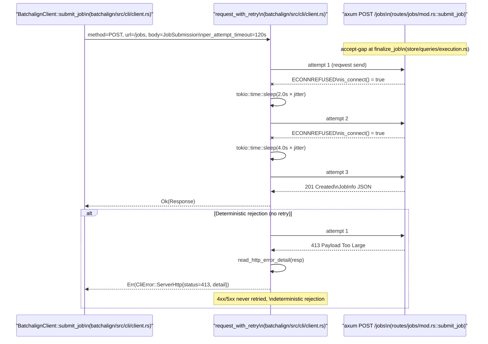
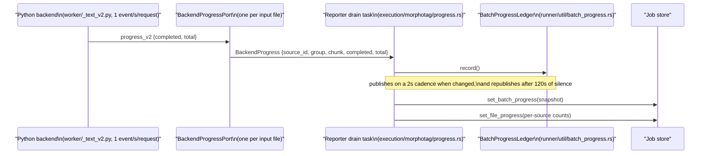

# Observability Architecture

**Status:** Current
**Last updated:** 2026-07-29 23:41 EDT

## Overview

The batchalign3 server processes jobs through a unified runner shared by
direct mode and the embedded/local server. Both modes produce the
same `FileStatus` records, use the same error classification, and persist
to the same SQLite store. Fixing observability in the runner fixes it for
all modes.

## What Is Observable (shipped)

### Submit-path retries

`BatchalignClient::submit_job` (`crates/batchalign/src/cli/client.rs`)
goes through the shared `request_with_retry` helper. The contract is narrow on
purpose and load-bearing for fleet-scale runs:

- **Retry class:** transient `reqwest::Error::is_connect()` or `is_timeout()`
  only. These cover the daemon's accept-gap class, the brief window
  during job finalization when the local server is restarting and a
  new submission gets `Connection refused`.
- **No retry on HTTP 4xx/5xx.** A deterministic server rejection (413
  payload too large, 400 validation failure, 409 conflict, 5xx panic-catch)
  is surfaced immediately as `CliError::ServerHttp { status, detail }`.
  Re-sending the same payload cannot fix it, and retrying would hide real
  configuration bugs (e.g. a payload that genuinely exceeds
  `max_body_bytes_mb`).
- **Attempts and backoff:** `RETRY_ATTEMPTS = 3` total, exponential backoff
  starting at `RETRY_BACKOFF = 2.0 s` with `0.5×, 1.5×` multiplicative jitter.
- **Per-attempt timeout:** submission passes 120 s (large request bodies);
  health and result GETs pass 30 s. This is a parameter on
  `request_with_retry`, so the choice is explicit at the call site.

Regression tests live next to the implementation in `client.rs::tests`:
`submit_job_retries_transient_connect_errors` (points at reserved port 1,
asserts elapsed ≥ one retry × backoff × min-jitter) and
`submit_job_does_not_retry_413_length_limit_exceeded` (raw TCP listener
answering 413, asserts exactly one connection attempt).

The following sequence shows a submission against a daemon with a transient
accept pause, and the alt branch for a deterministic 413 rejection:

```mermaid
sequenceDiagram
    participant Cli as "BatchalignClient::submit_job\n(batchalign/src/cli/client.rs)"
    participant Retry as "request_with_retry\n(batchalign/src/cli/client.rs)"
    participant Daemon as "axum POST /jobs\n(routes/jobs/mod.rs::submit_job)"

    Cli->>Retry: method=POST, url=/jobs, body=JobSubmission\nper_attempt_timeout=120s

    Note over Daemon: accept-gap at finalize_job\n(store/queries/execution.rs)
    Retry->>Daemon: attempt 1 (reqwest send)
    Daemon--xRetry: ECONNREFUSED\nis_connect() = true
    Retry->>Retry: tokio::time::sleep(2.0s × jitter)

    Retry->>Daemon: attempt 2
    Daemon--xRetry: ECONNREFUSED\nis_connect() = true
    Retry->>Retry: tokio::time::sleep(4.0s × jitter)

    Retry->>Daemon: attempt 3
    Daemon-->>Retry: 201 Created\nJobInfo JSON
    Retry-->>Cli: Ok(Response)

    alt Deterministic rejection (no retry)
        Retry->>Daemon: attempt 1
        Daemon-->>Retry: 413 Payload Too Large
        Retry->>Retry: read_http_error_detail(resp)
        Retry-->>Cli: Err(CliError::ServerHttp{status=413, detail})
        Note over Retry: 4xx/5xx never retried, \ndeterministic rejection
    end
```

Diagram verified against:
`crates/batchalign/src/cli/client.rs` (`submit_job`, `request_with_retry`,
`read_http_error_detail`, constants `RETRY_ATTEMPTS`/`RETRY_BACKOFF`),
`crates/batchalign/src/routes/jobs/mod.rs` (`submit_job` handler),
`crates/batchalign/src/routes/mod.rs` (`RequestBodyLimitLayer`),
`crates/batchalign/src/types/config/server.rs`
(`default_max_body_bytes_mb`).

### Per-file progress

Each file tracks: status (queued/processing/done/error), stage, current/total
counters. Published via `RunnerEventSink::set_file_progress()` to the store
and broadcast over WebSocket to the dashboard.

### Batch-inference progress

Restored 2026-07-29 after three months with no producer. Read the history at
the end of this section before changing anything here: this surface has been
wrong in three different ways.

For the batched-text commands (morphotag today; utseg / translate / coref have
the same shape and are not wired yet), the Python backend reports utterance
counts as it works, and `BatchProgressLedger` turns them into two projections:

| Projection | Type | Where it shows |
|---|---|---|
| Per language group, job-wide | `BatchInferProgress` | `JobInfo.batch_progress` (REST), dashboard `BatchProgressPanel`, CLI summary line, TUI header |
| Per input file | `SourceProgress` | the ordinary file-progress channel, so per-file rows and the CLI spinner get a denominator |

Both come from the same events, so they cannot disagree. The per-file
projection is the one that answers "is THIS long file moving", which is the
question the stage label `Analyzing` alone could not answer.

**The key is (source, group, chunk), and that is the whole design.**
`morphosyntax::worker::infer_batch_homogeneous` splits one language group into
up to `max_workers_per_key` chunks whenever it holds `2 * MIN_CHUNK_SIZE` items
or more (so: always, on a multi-worker host), and each chunk is a separate
backend request reporting its own `completed` / `total`. Totals are SUMMED
across chunks and the newest report per chunk wins. Keying on the chunk index
rather than the request id is deliberate: a retry reissues the same chunk under
a fresh request id, and a request-keyed ledger would double the denominator and
strand the abandoned attempt's count.

Provenance is supplied by the dispatch site, which knows the file, the language
and the chunk for certain. The wire event's `stage` field is ignored:
`batchalign/worker/_protocol.py::write_progress_event` hard-codes
`stage="stanza_processing"` on every event, so it identifies nothing.

```mermaid
sequenceDiagram
    participant Py as "Python backend\n(worker/_text_v2.py, 1 event/s/request)"
    participant Port as "BackendProgressPort\n(one per input file)"
    participant Drain as "Reporter drain task\n(execution/morphotag/progress.rs)"
    participant Ledger as "BatchProgressLedger\n(runner/util/batch_progress.rs)"
    participant Store as "Job store"

    Py->>Port: progress_v2 {completed, total}
    Port->>Drain: BackendProgress {source_id, group, chunk, completed, total}
    Drain->>Ledger: record()
    Note over Drain,Ledger: publishes on a 2s cadence when changed,\nand republishes after 120s of silence
    Drain->>Store: set_batch_progress(snapshot)
    Drain->>Store: set_file_progress(per-source counts)
```

Shutdown is an explicit `CancellationToken`, not "the channel closed": every
port holds a sender clone, so inferring shutdown from the channel would make
`finish()` hang whenever a caller held a port a moment too long.

Verified against: `batchalign/worker/_text_v2.py`,
`crates/batchalign/src/execution/morphotag/progress.rs`,
`crates/batchalign/src/morphosyntax/worker.rs`,
`crates/batchalign/src/runner/util/batch_progress.rs`.

#### History, because this surface misled readers for months

- `15c88de2` (2026-04-28): a working drain loop existed in the legacy
  batched-text dispatch, plus a designed replacement that nothing constructed.
- `e8235c13` (2026-05-03): the working loop, the channel and
  `RunnerEventSink::set_batch_progress` were all removed. From then until
  2026-07-29 the type, the REST field, the dashboard panel and the CLI line
  all existed with **no producer**: `batch_progress` was permanently `null`.
- `c2236ab3` (2026-05-06): morphotag stopped accepting a job-level `--lang`.
  The golden tests covering this feature still sent one, so every one of them
  failed at submission with HTTP 400 and the coverage went dark three days
  after the feature did.
- An earlier revision of this page claimed a per-language "tagger" had FIXED
  the `453/274` (165%) overflow. It had not. The tagger addressed a different
  bug (all languages collapsing onto the shared `stage` label) and could not
  address the overflow at all, because the overflow comes from aggregating
  CHUNKS of one language by language alone. Both are fixed now, by keying on
  (source, group, chunk) and by taking provenance from the dispatch site
  instead of rewriting a wire field.

### Job status authority: the local store

The observability contract for **job status** is now simpler: the local
SQLite store is authoritative for the local server control plane.

A file or utterance transitions through `Queued → Running → Completed`
inside one daemon's runner, and the store is mutated synchronously with the
transition. Conflict detection on resubmission reads that same store, so
status freshness depends on normal shutdown/recovery behavior rather than on a
second orchestration system.

When the server restarts mid-job, persisted rows can move through
`Running → Interrupted → Queued` during recovery. That state machine is the
observable source of truth for whether work should resume.

### Worker crash diagnostics

When a Python worker crashes, stderr is captured via an `mpsc` channel
and attached to `WorkerError::ProcessExited { code, stderr }`. The
user-facing error message includes the last 500 chars of stderr (the
Python traceback tail). Persisted to `FileStatus.error` in SQLite.

### Heartbeat gap detection

The drain task warns if no progress heartbeat arrives for 120 seconds,
naming the stalled language groups. This catches stuck workers without
needing external orchestration.

Stall naming depends on the per-language tagger described above: without
the rewrite from `event.stage = "stanza_processing"` to the real language
code, every group would roll up under one key and `incomplete_groups()`
would always return `[]`. The per-language stage rewrite is a
load-bearing prerequisite for heartbeat-gap diagnostics.

### Language group timeouts

Each language group dispatch is wrapped in `tokio::time::timeout`
(default: `audio_task_timeout_s`, minimum 1800s). Timed-out groups
produce empty responses and a clear error, the batch continues with
other languages.

### Semaphore diagnostics

The bounded-concurrency semaphore in `batch.rs` logs:
- Total groups vs max concurrent before `join_all`
- Available permits on each acquire
- Language and item count per group

### Daemon log persistence

Daemon logs are appended on restart (not truncated). Previous session
diagnostics survive across daemon restarts.

### CLI failure hints

The failure summary shows the last 5 lines of worker stderr per file
and hints at the daemon log path.

## Known Observability Gaps

### Model loading is invisible

When a worker spawns, it loads ML models (Stanza, Whisper, Wave2Vec)
which can take 30-120 seconds. During this time, the job shows
"processing" with no progress. The worker emits a `ready` signal when
done, but this doesn't propagate to job-level progress.

**Needed:** A "loading models" stage at the job level. The worker pool
already knows when workers are spawning vs ready. This state should be
surfaced through `FileStatus.progress_stage` or a new job-level field.

**Files:** `worker/handle/mod.rs` (ready signal), `worker/pool/mod.rs`
(spawn tracking), `runner/util/file_status.rs` (stage reporting)

### Parse/validate phase is invisible

For batched commands, `run_morphosyntax_batch_impl` parses ALL files
sequentially before dispatching any workers. On 500 files with
validation warnings, this can take minutes. The job shows "0/N
processing" throughout.

**Needed:** A "parsing" stage with per-file progress during the parse
phase. Emit `set_file_progress` with `FileProgressStage::Parsing` as
each file is parsed.

**Files:** `morphosyntax/batch.rs` (parse loop at lines 49-83)

### Parsing is sequential

The parse/validate loop in `batch.rs` processes files one at a time.
For 500 files, this is slow. Parsing is CPU-bound (tree-sitter) and
could be parallelized with `rayon` or `tokio::spawn_blocking`.

**Architectural note:** Parallelizing parsing requires thread-safe
`TreeSitterParser` handles or per-thread instances. The parser is
not `Send` (tree-sitter limitation), so `rayon` with thread-local
parsers is the right approach.

**Files:** `morphosyntax/batch.rs` (parse loop)

## Source File Inventory

| File | What it observes |
|------|-----------------|
| `runner/util/file_status/` | `RunnerEventSink` trait, `set_file_progress`, `set_batch_progress` (split: `event_sink.rs`, `file_stage.rs`, `supervision.rs`, `tracker.rs`, `tests.rs`) |
| `runner/util/batch_progress.rs` | `BackendProgress`, `BatchProgressLedger`, and its `BatchInferProgress` / `SourceProgress` projections |
| `execution/morphotag/progress.rs` | `BatchProgressReporter` (owns the ledger, publishing cadence, stall republish) and `BackendProgressPort` (per-file handle) |
| `runner/dispatch/infer_batched.rs` | Drain task, heartbeat gap, progress publishing |
| `morphosyntax/batch.rs` | Language group dispatch, semaphore, timeouts |
| `worker/handle/lifecycle.rs` | Stderr capture, ready signal |
| `worker/error.rs` | `ProcessExited { code, stderr }` |
| `runner/util/error_classification.rs` | Error → user-facing message translation |
| `store/queries/file_state.rs` | Store methods for progress + WS broadcast |
