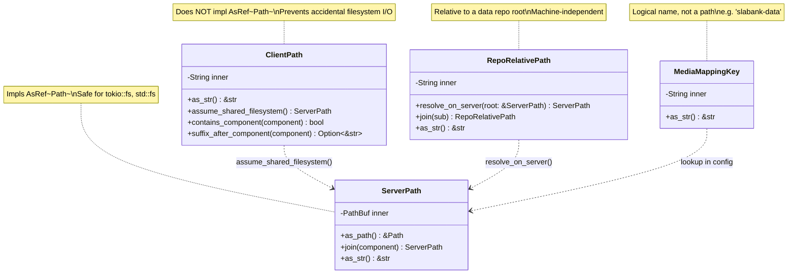
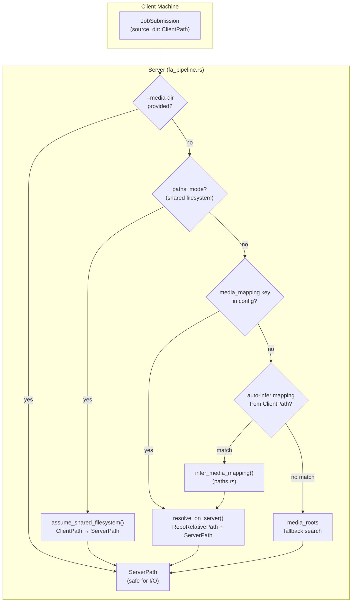

# Typed Path Provenance

**Status:** Current
**Last modified:** 2026-03-28 17:55 EDT

Paths in batchalign3 cross machine boundaries: a client submits paths from
their filesystem, the server resolves media on its own filesystem (potentially
different mount points), and media mappings translate logical repo names to
physical volume roots. Untyped `String`/`PathBuf` allowed mixing client and
server paths, causing repeated media resolution failures. The path newtype
system makes provenance explicit so the compiler prevents these bugs.

## The Problem

The batchalign3 server accepts job submissions from both local daemons (same
machine, shared filesystem) and remote clients (different machines, different
mount points). Before path newtypes, both cases used bare `String` or `PathBuf`:

```rust
// BEFORE: which machine is this path on?
pub struct JobSubmission {
    pub source_dir: String,       // Client's input dir — but server can't read it
    pub media_mapping: String,    // Logical name — not a path at all
    pub source_paths: Vec<String>, // Client paths — must not be opened on server
}
```

This caused bugs where the server attempted filesystem I/O on a client's
path (which did not exist on the server), or where a logical mapping key
was accidentally used as a filesystem path.

## The Solution: Four Path Newtypes

All defined in `crates/batchalign-types/src/paths.rs`:



<!-- Verified against: crates/batchalign-types/src/paths.rs -->

### ClientPath

A path on the submitting client's filesystem. The server receives this as
metadata but **must not** do filesystem I/O on it directly.

**Key invariant:** `ClientPath` deliberately does NOT implement `AsRef<Path>`.
This means passing a `ClientPath` to `tokio::fs::read_to_string()` or
`std::fs::metadata()` is a compile error. The compiler enforces the boundary.

The **only** sanctioned conversion to `ServerPath` is:

```rust
pub fn assume_shared_filesystem(&self) -> ServerPath
```

This asserts that the server shares the client's filesystem (true when the
server is a local daemon on the same machine). Callers must verify this
precondition -- using it on a remote client's path produces a `ServerPath`
that points to a nonexistent location.

`ClientPath` also provides string-level inspection methods for media mapping
inference:

- `contains_component("slabank-data")` -- checks if a repo name appears as
  a path component
- `suffix_after_component("slabank-data")` -- extracts the repo-relative
  portion (e.g., `"French/Newcastle/Photos"`)

These are pure string operations that never touch the filesystem.

### ServerPath

A path on the server's filesystem, safe for I/O. Implements `AsRef<Path>`
so it can be passed directly to filesystem operations:

```rust
let server_path: ServerPath = /* ... */;
let contents = tokio::fs::read_to_string(&server_path).await?;
```

Created from:
- `ClientPath::assume_shared_filesystem()` (shared-filesystem assertion)
- `RepoRelativePath::resolve_on_server(&root)` (combining a relative path
  with a server root)
- `ServerPath::new(pathbuf)` (direct construction from a known server path)
- Media mapping config deserialization (volume roots in `server.yaml`)

### RepoRelativePath

A path relative to a data repository root (e.g., `"French/Newcastle/Photos/13"`).
This is machine-independent -- it is valid on any machine that has the
repository cloned.

Must be combined with a `ServerPath` root to produce an absolute server path:

```rust
let root = ServerPath::new("/srv/talkbank/slabank");
let rel = RepoRelativePath::new("French/Newcastle/Photos/13");
let abs = rel.resolve_on_server(&root);
// → /srv/talkbank/slabank/French/Newcastle/Photos/13
```

### MediaMappingKey

A logical name that maps to a `ServerPath` via the server's `media_mappings`
configuration. Not a filesystem path at all -- it is an index into a
`BTreeMap<MediaMappingKey, ServerPath>` in `ServerConfig`.

Examples: `"slabank-data"`, `"childes-eng-na-data"`, `"aphasia-data"`.

## Data Flow: Media Resolution

The FA pipeline (`runner/dispatch/fa_pipeline.rs`) resolves audio files through
a multi-step cascade. The path newtypes make each step's provenance explicit.



<!-- Verified against:
  - crates/batchalign/src/runner/dispatch/fa_pipeline.rs (media resolution cascade)
  - crates/batchalign-types/src/paths.rs (all path types, infer_media_mapping)
  - crates/batchalign/src/types/config.rs (ServerConfig.media_mappings)
  - crates/batchalign/src/types/request.rs (JobSubmission fields)
-->

### Auto-Inference: `infer_media_mapping()`

When no explicit `media_mapping` key is provided, the server auto-infers the
mapping from the client's source directory path. This is the function in
`crates/batchalign-types/src/paths.rs`:

```rust
pub fn infer_media_mapping<'a>(
    client_dir: &ClientPath,
    mappings: impl IntoIterator<Item = (&'a MediaMappingKey, &'a ServerPath)>,
) -> Option<(MediaMappingKey, ServerPath, RepoRelativePath)>
```

It checks whether any key in `mappings` appears as a path component in
`client_dir`. Example:

- `client_dir`: `/Users/operator/chat-data/slabank-data/French/Newcastle/Photos`
- `mappings`: `{"slabank-data" → "/srv/talkbank/slabank"}`
- Returns: `("slabank-data", "/srv/talkbank/slabank", "French/Newcastle/Photos")`

This is a **pure string operation** on `ClientPath` -- it never touches the
filesystem. The `suffix_after_component()` method extracts the repo-relative
portion, which becomes a `RepoRelativePath`.

## Where Path Types Are Used

| Type | Used in | Field / Parameter |
|------|---------|-------------------|
| `ClientPath` | `JobSubmission` | `source_dir`, `source_paths`, `output_paths`, `before_paths` |
| `ClientPath` | `JobMetadata` | `source_dir` |
| `ClientPath` | `JobFilesystemConfig` | `source_dir` |
| `MediaMappingKey` | `JobSubmission` | `media_mapping` |
| `MediaMappingKey` | `ServerConfig` | `media_mappings` (key) |
| `ServerPath` | `ServerConfig` | `media_roots`, `media_mappings` (value) |
| `RepoRelativePath` | `JobSubmission` | `media_subdir` |
| `RepoRelativePath` | FA pipeline | Inferred corpus subdirectory |

## Design Decisions

### Why `ClientPath` stores `String`, not `PathBuf`

Client paths arrive as JSON strings over HTTP. They may reference Windows paths
(`C:\Users\...`) on a macOS server. `PathBuf` on the server would normalize
path separators, potentially corrupting the client's path. `String` preserves
the exact bytes the client sent.

### Why `ServerPath` stores `PathBuf`, not `String`

Server paths are used for actual filesystem I/O. `PathBuf` integrates with
`std::fs`, `tokio::fs`, and the `Path` trait ecosystem. The `AsRef<Path>`
implementation makes `ServerPath` a drop-in for any function that accepts paths.

### Why `From<&str>` on `ClientPath` is not `TryFrom`

`ClientPath` has no validation invariants -- any string a client sends is a
valid client path (it might not exist, but that is discovered at resolution
time). The `From<&str>` impl is genuinely infallible.

`MediaMappingKey` follows the same reasoning: any string is a valid key
(it might not match any config entry, but that is a lookup miss, not a
construction error).

### Relationship to `type-driven-design.md`

The path newtypes are an instance of Pattern 3 (Provenance Newtypes) from the
[type-driven design catalog](type-driven-design.md). The difference from text
provenance types (`ChatRawText`, `AsrNormalizedText`) is that path types also
encode **machine boundaries** -- which side of the client/server divide a value
lives on -- and enforce this through the presence or absence of `AsRef<Path>`.

## Key Source Files

| File | Role |
|------|------|
| `crates/batchalign-types/src/paths.rs` | All four newtypes + `infer_media_mapping()` |
| `crates/batchalign/src/types/request.rs` | `JobSubmission` uses `ClientPath`, `MediaMappingKey`, `RepoRelativePath` |
| `crates/batchalign/src/types/config.rs` | `ServerConfig.media_mappings: BTreeMap<MediaMappingKey, ServerPath>` |
| `crates/batchalign/src/runner/dispatch/fa_pipeline.rs` | Media resolution cascade using all four types |
| `crates/batchalign/src/submission.rs` | `ClientPath` to `PathBuf` bridge in `materialize_submission_job()` |
| `crates/batchalign/src/store/job/types.rs` | `JobFilesystemConfig` stores `ClientPath` for `source_dir` |
