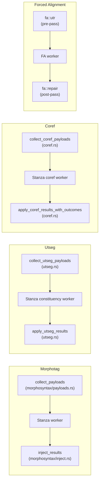
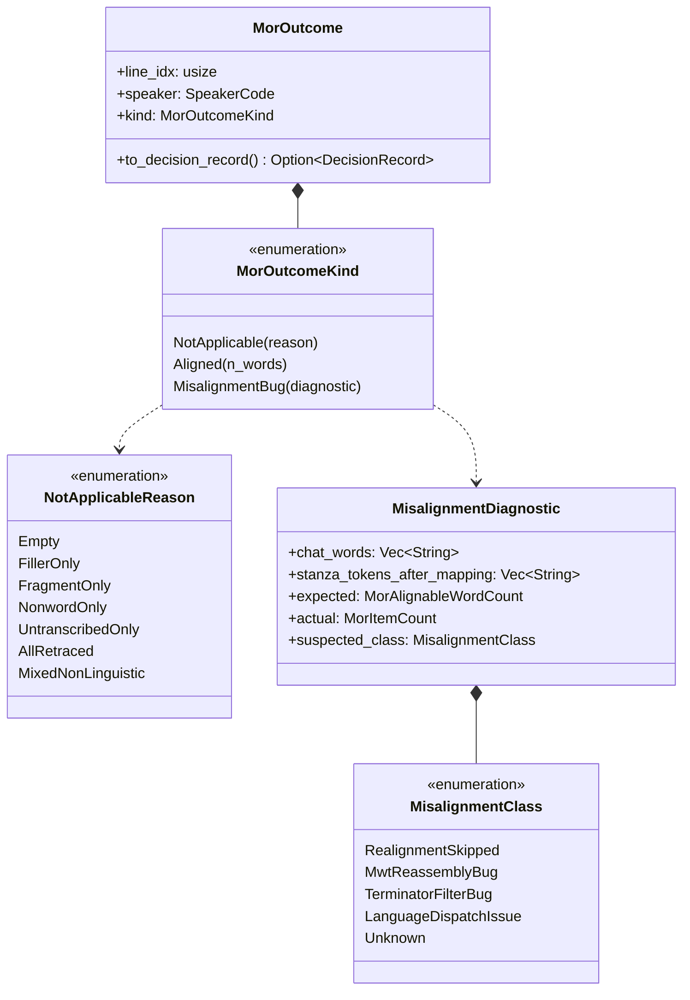
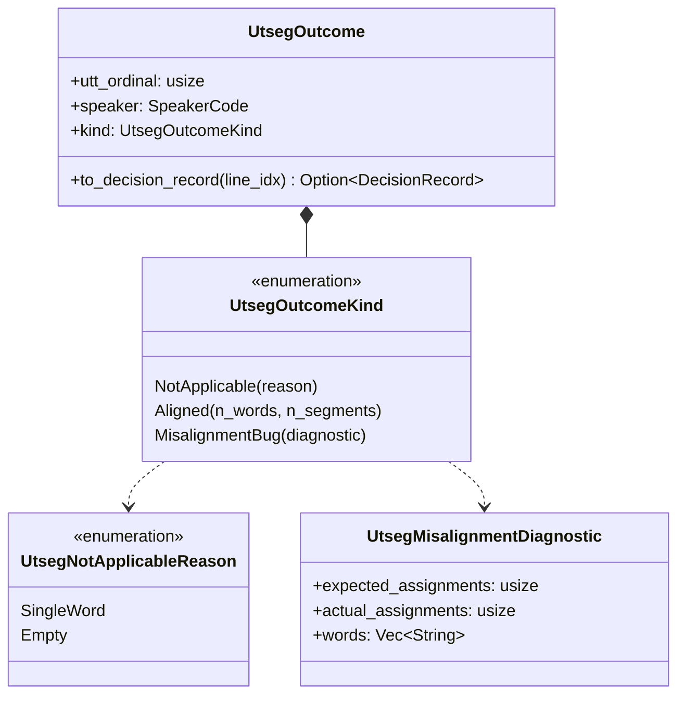
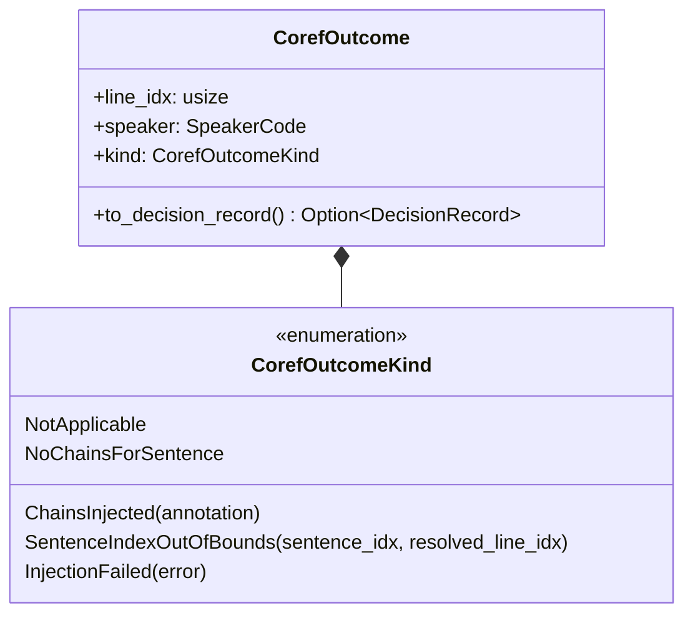
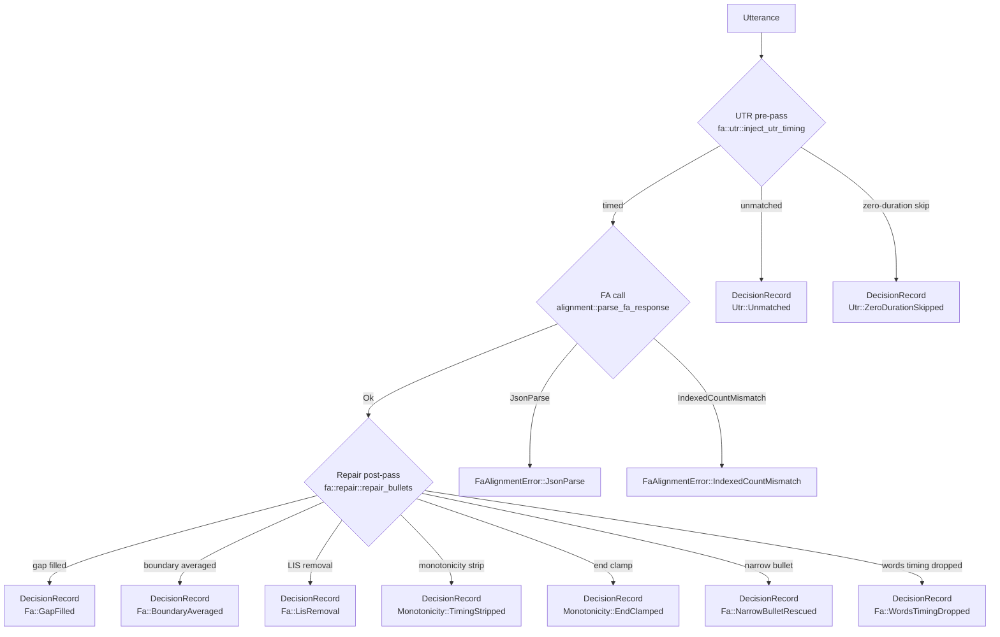
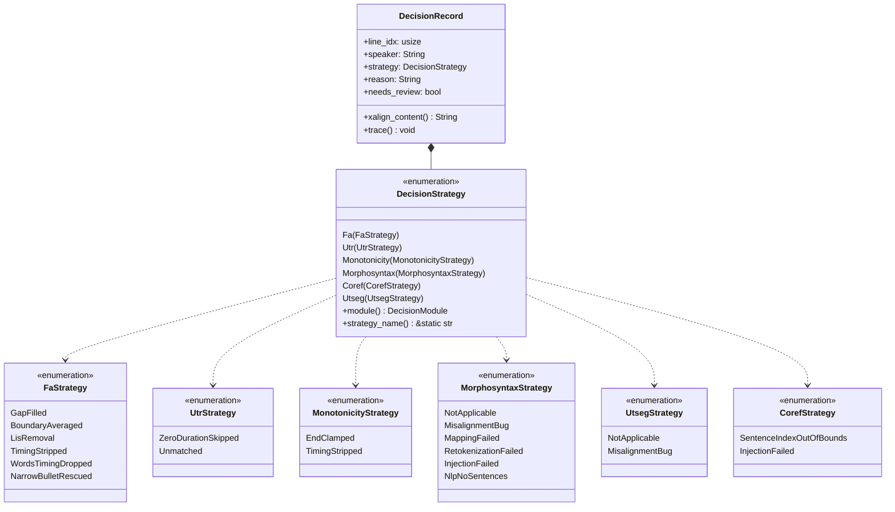
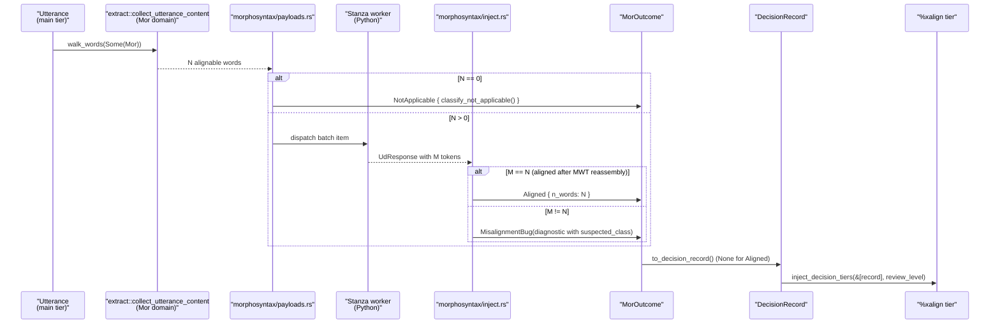
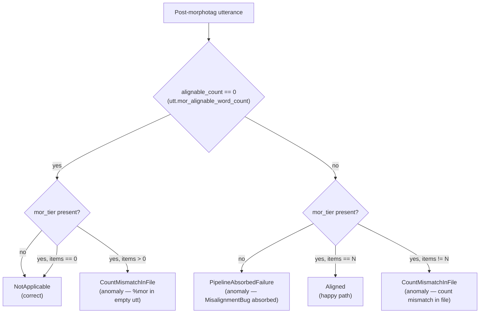

# NLP Pipeline Decision Architecture

**Status:** Current
**Last updated:** 2026-05-02 08:50 EDT

This chapter documents how batchalign3's four NLP pipelines (morphotag,
utseg, coref, forced alignment) represent per-utterance decisions, how
those decisions flow through a shared reporting surface, and how the
eval harness reads them back post-hoc. Every pipeline now emits typed
outcomes — a single place to add a new variant, compile-time errors for
typos, and loud typed diagnostics when invariants break. For the
morphotag-specific deep-dive into the 1-to-1 invariant that motivated
this architecture, see
[`Morphotag Reconciliation Invariants`](morphotag-invariants.md).

## Motivation

Every NLP pipeline has invariants a bug can silently break — Stanza
returning fewer tokens than the CHAT main tier contained, a worker
responding with the wrong number of assignments, a retokenize pass
losing a clitic. When one of those invariants is expressed as a raw
`Result<_, String>` or as a per-utterance `continue` that silently
skips a bad case, a single upstream regression can strip annotations
across thousands of utterances without any operator-visible signal.

The architecture below exists to make that class of failure impossible
to absorb silently. Each pipeline emits typed outcomes; every
non-happy-path outcome surfaces through a shared `DecisionRecord`
surface that serializes into the `%xalign` tier and structured
tracing; count mismatches at invariant boundaries return typed
diagnostics carrying enough context to triage without re-running.

Four pipelines participate, each with its own natural shape:

Each pipeline's invariant is different, but all four now emit typed
outcomes that flow through one shared reporting surface,
[`DecisionRecord`](#the-decisionrecord-surface), which serializes into
the `%xalign` tier and structured tracing output.

## Per-task outcome vocabulary

### Morphotag

Each utterance produces exactly one
``MorOutcome``
with one of three kinds:

`NotApplicable` is the common correct-by-construction case (filler-only
utterances, untranscribed, all-retraced). `Aligned` is the happy path.
`MisalignmentBug` is **always** a pipeline bug — never an expected
divergence — because the 1-to-1 invariant is deterministic by
construction when extraction, Stanza realignment, and MWT reassembly
cooperate. The `MisalignmentClass` classifier points a developer at
the most likely failing stage; see
[`Morphotag Reconciliation Invariants`](morphotag-invariants.md).

### Utterance segmentation

Utseg's invariant is simpler: the Python classifier must return exactly
one segment assignment per input word. The outcome space reflects that:

`NotApplicable::SingleWord` is the one that matters most for clarity:
previously single-word utterances were silently dropped from the batch
(they trivially segment to one segment, so dispatch is wasteful). The
typed outcome records that as a deliberate decision rather than silence.

### Coreference

Coref has a different shape because it is document-level and sparse:
the worker receives all sentences at once and returns annotations only
for the subset that actually participates in a chain. Most utterances
legitimately produce no annotation.

`NoChainsForSentence` is **named explicitly** so eval reports don't
misread a sparse-but-correct run as a high-anomaly run.
`SentenceIndexOutOfBounds` is the worker-contract violation —
always a real bug — and `InjectionFailed` covers CHAT validation
failures during `%xcoref` tier construction.

### Forced alignment

FA is intentionally different. Unlike morphotag/utseg/coref, a single
utterance passes through three independent decision points (UTR
pre-pass, the FA call itself, the bullet-repair post-pass), any of
which may emit decisions. Collapsing into one variant per utterance
would lose that temporal structure, so FA keeps per-stage typed
records and routes all of them through the shared `DecisionRecord`:

`FaAlignmentError` is a typed error (not a decision record — it's
returned up the call stack). All other FA events are emitted as
`DecisionRecord`s with typed `DecisionStrategy` tags. See
``fa/outcome.rs``
for the single-import bring-in of the FA decision vocabulary.

## The DecisionRecord surface

Every non-`Aligned` outcome across all four pipelines converges on one
type: `DecisionRecord`. This is what gets serialized into the
`%xalign` tier (user-visible review surface) and emitted via `tracing`
(developer-visible audit stream).

Why this shape:

- **Typos are compile errors.** Before, `strategy: "narow_bullet_rescud"`
  would compile and produce a novel label consumers couldn't match.
  Now `FaStrategy::NarowBulletRescud` fails to compile.
- **Adding a new strategy requires exactly one declaration.** The enum
  variant and its `as_str()` label live in one place; serialization,
  tracing, and all match arms derive from that single source.
- **Exhaustive matching is possible.** Consumers can write
  `match strategy { DecisionStrategy::Utseg(s) => … }` and trust the
  compiler to flag missing cases when a new variant is added.
- **Duplicates across modules are OK by construction.**
  `TimingStripped` exists under both `FaStrategy` and
  `MonotonicityStrategy` because both modules legitimately emit it;
  the outer `DecisionStrategy` discriminator distinguishes them. Same
  for `InjectionFailed` (Morphosyntax and Coref) and
  `NotApplicable` / `MisalignmentBug` (Morphosyntax and Utseg).
- **Wire format unchanged.** `DecisionRecord::xalign_content()` still
  emits `"{module}:{strategy} {reason}"`, so existing `%xalign`
  consumers keep working without migration.

## Outcome → DecisionRecord lifecycle

The per-task outcome is the pipeline-internal vocabulary; `DecisionRecord`
is the cross-task reporting surface. One canonical flow, traced here
for morphotag, applies by analogy to utseg and coref:

Aligned outcomes produce `None` from `to_decision_record()` — the happy
path does not flood the `%xalign` tier. NotApplicable and
MisalignmentBug both produce records, with `needs_review=false` and
`true` respectively.

## Eval harness observation model

The 19-pair L2 morphotag eval extends this architecture by adding an
external-observation variant
(``UtteranceOutcome``)
that reads a post-morphotag CHAT file and classifies every utterance
without access to the pipeline's internal `MorOutcome`. This is
deliberately asymmetric — the eval sees only what's written to the
file:

`PipelineAbsorbedFailure` is the most informative variant: it surfaces
every utterance the pipeline received but silently produced nothing
for. It is visible in the eval's `anomaly_rate` column per pair, so
any systemic increase shows up as a corpus-wide regression signal
rather than as a hard-to-spot drop in individual `@s`-word metrics.

`per-pair.csv` from the eval now includes five new columns:
`outcome_not_applicable`, `outcome_aligned`, `outcome_count_mismatch_in_file`,
`outcome_pipeline_absorbed_failure`, `anomaly_rate`. `summary.md`
surfaces a dedicated "Per-utterance outcome distribution" section.

## Typed counts at the invariant boundary

The morphotag invariant check is written against typed newtypes rather
than `usize` so that a refactor cannot accidentally swap
"Mor-alignable CHAT word count" and "`%mor` item count":

- ``MorAlignableWordCount``
  — what `Utterance::mor_alignable_word_count()` returns.
- ``MorItemCount``
  — what `mor_tier.items.len()` measures.

Both live in `talkbank-model::alignment::helpers::count` alongside the
existing `count_tier_positions` walker. The canonical N lives on
`Utterance` itself so every caller (morphotag injector, eval harness,
CHAT validators) consults the same source — enforced by an integration
test that walks the full 98-file reference corpus and asserts
agreement between the method and the `extract::collect_utterance_content`
walker.

## Source pointers

Core outcome types:

- `crates/talkbank-transform/src/morphosyntax/outcome.rs` — `MorOutcome`,
  `MisalignmentDiagnostic`, `classify_not_applicable`
- `crates/batchalign/src/utseg.rs` — `UtsegOutcome`,
  `validate_utseg_response`
- `crates/batchalign/src/coref.rs` — `CorefOutcome`,
  `apply_coref_results_with_outcomes`
- `crates/batchalign/src/fa/outcome.rs` — FA decision
  vocabulary (re-exports)
- `crates/batchalign/src/fa/alignment.rs` — `FaAlignmentError`
  (typed error for FA response parsing)
- `crates/batchalign/src/decisions.rs` — `DecisionRecord`,
  `DecisionStrategy`, all per-module strategy enums

Invariant enforcement:

- `crates/batchalign/src/inject.rs` —
  `inject_morphosyntax` (returns `Result<(), MisalignmentDiagnostic>`)
- `batchalign/inference/morphosyntax.py` —
  realignment-skipped WARN at the Python boundary
- `talkbank-tools/crates/talkbank-model/src/alignment/helpers/count.rs`
  — `MorAlignableWordCount` / `MorItemCount` newtypes and
  `count_tier_positions` walker

Tests that pin the architecture:

- `crates/batchalign/tests/mor_count_parity_reference_corpus.rs`
  — cross-walker count parity across the 98-file reference corpus
- `batchalign/tests/inference/test_morphosyntax_realignment_contract.py`
  — Python contract test pinning `tok_ctx.original_words` sequencing
- `crates/talkbank-transform/src/morphosyntax/outcome.rs`
  `#[cfg(test)]` — per-variant classification tests
- `crates/batchalign/src/eval_cmd/l2_morphotag/tests.rs`
  — `UtteranceOutcome` classifier truth table

Deep-dive pages:

- [`Morphotag Reconciliation Invariants`](morphotag-invariants.md)
  — the 1-to-1 invariant in full: what `counts_for_tier` defines as
  alignable, and why the three stages produce it by construction.

## How to investigate a `%xalign: misalignment_bug`

When a user reports a morphotag output with `%xalign:
morphosyntax:misalignment_bug`, the flow for a developer is:

1. **Read the `suspected_class` field** in the `reason`. Five values
   (`RealignmentSkipped`, `MwtReassemblyBug`, `TerminatorFilterBug`,
   `LanguageDispatchIssue`, `Unknown`) each point at a different
   stage.
2. **Compare `chat_words` and `stanza_tokens_after_mapping`** also in
   the `reason`. The word/token sequences usually show where they
   diverged — e.g. a comma dropped, an MWT split wrongly reassembled.
3. **Check the Python worker log** for a realignment-skipped WARN for
   the same file/language — if present, the dispatch-side context
   wasn't set and the `RealignmentSkipped` class is concrete.
4. **Rerun with `--review-level all`** to see the `%xalign` tier on
   every utterance (aligned or not), giving a positional sense of
   where the mismatch occurs in the document.

If the repro is reliable, add a failing regression test in
`batchalign` using `chatter trim` to produce a minimal
fixture from the affected real file. The `%xalign` tier's typed
strategy name maps directly to the enum variant for pattern matching
in the assertion.
