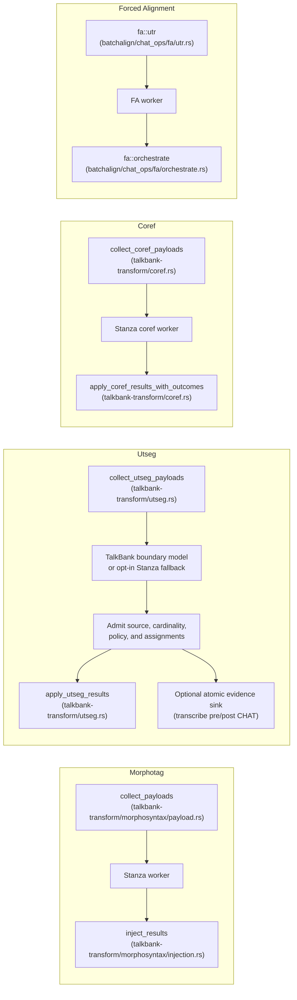
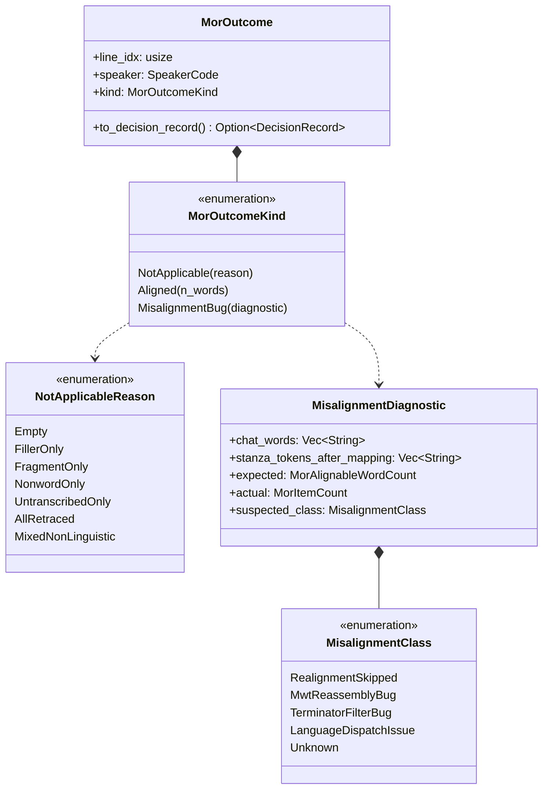
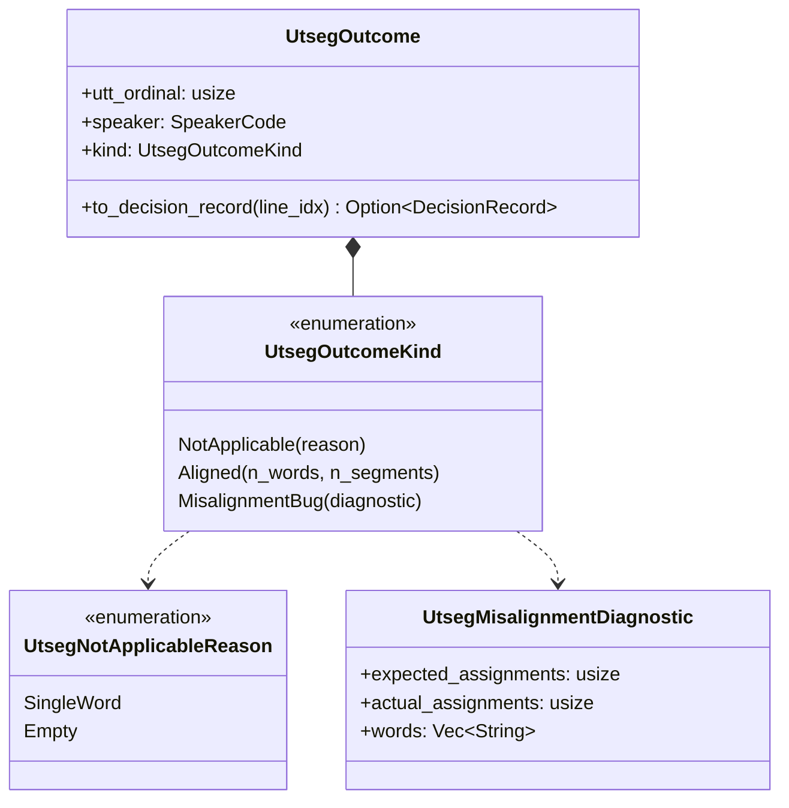
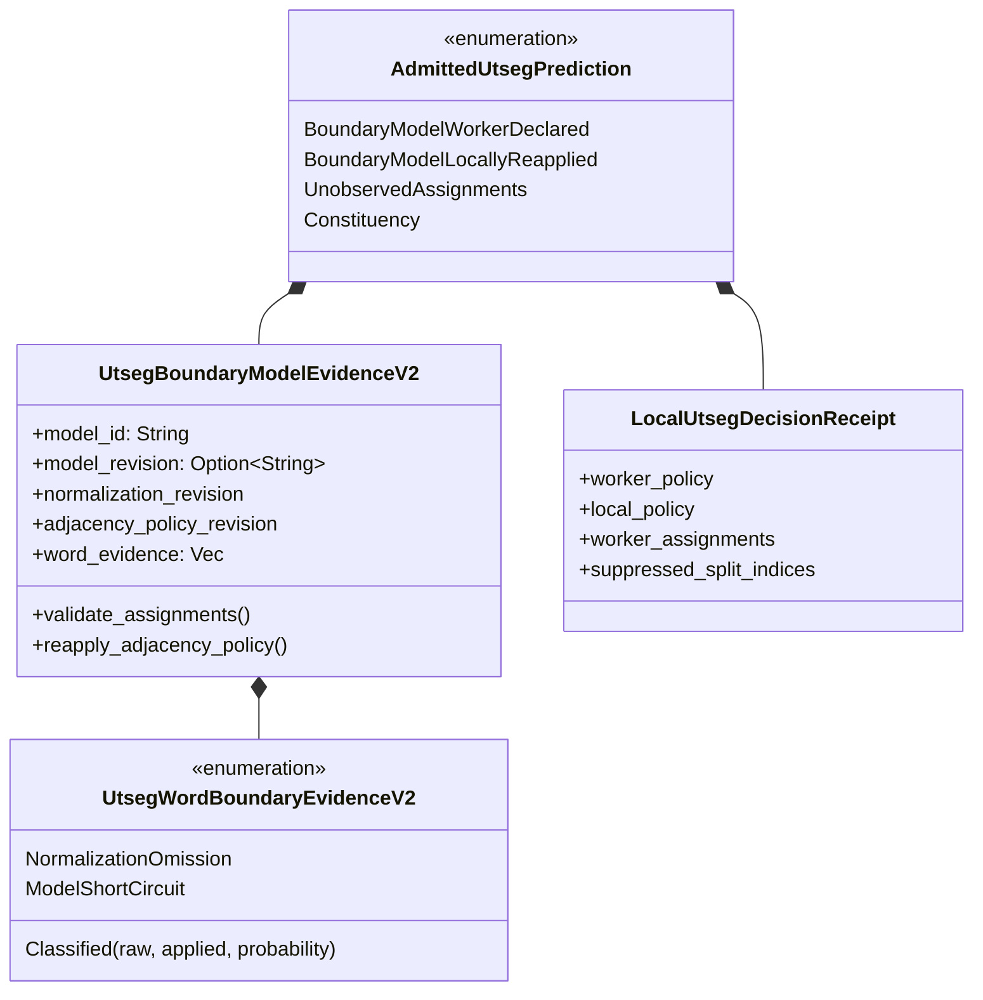
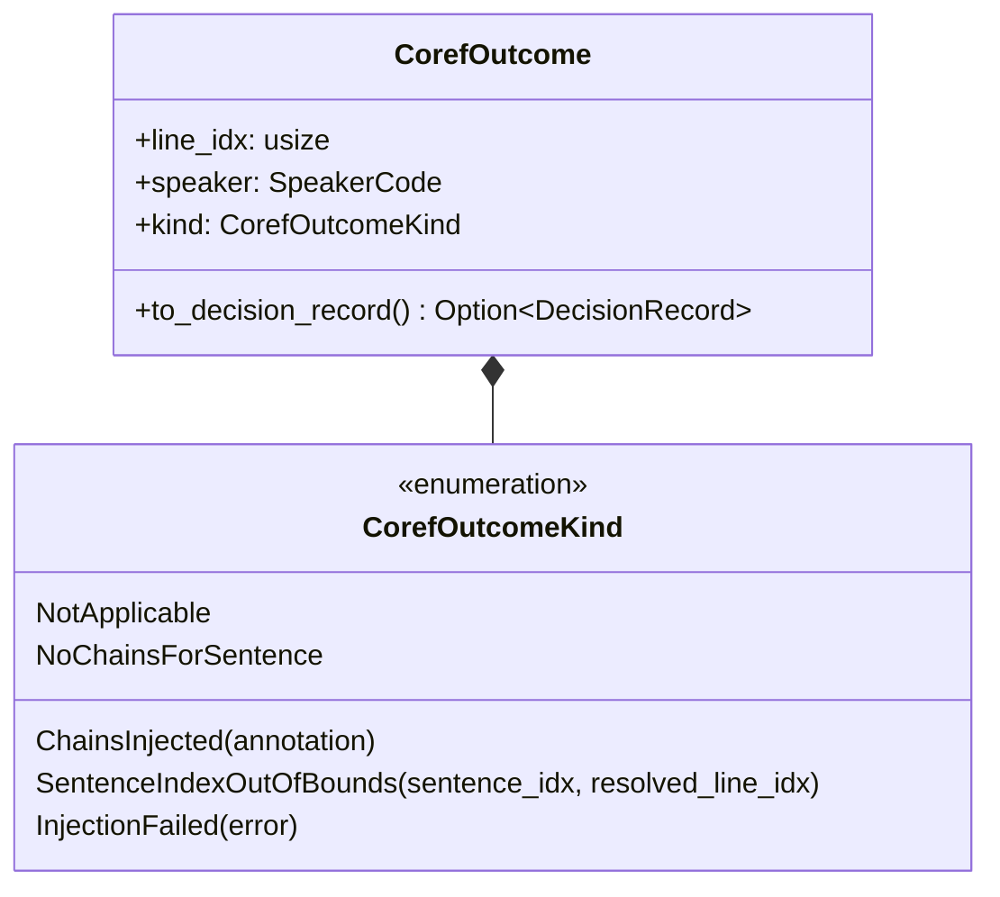
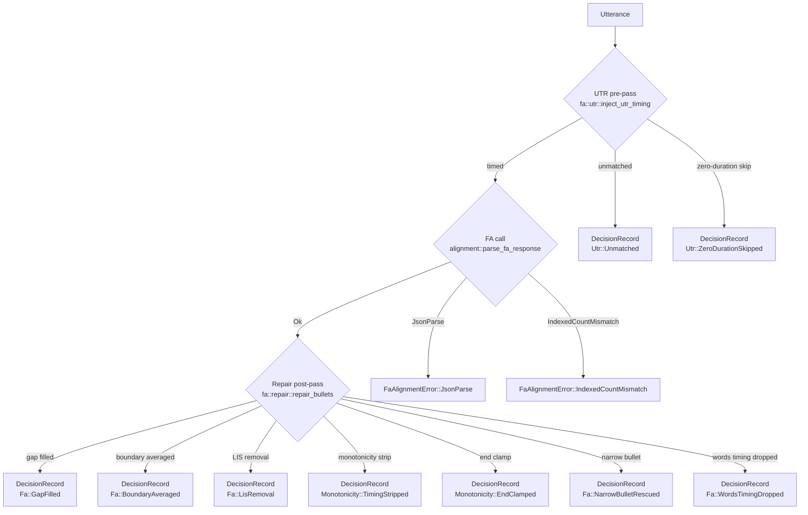
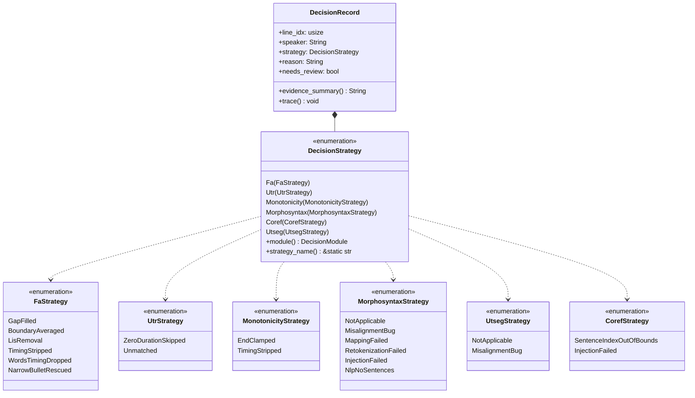
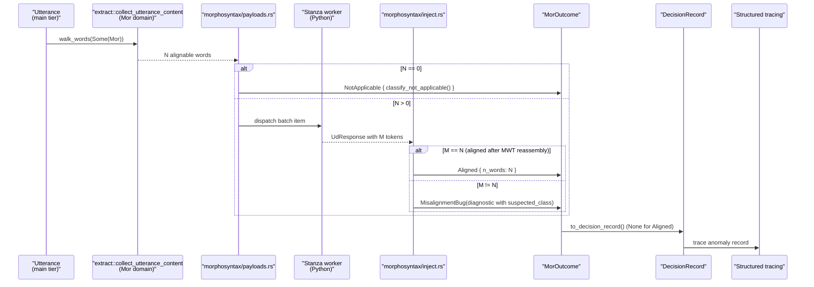
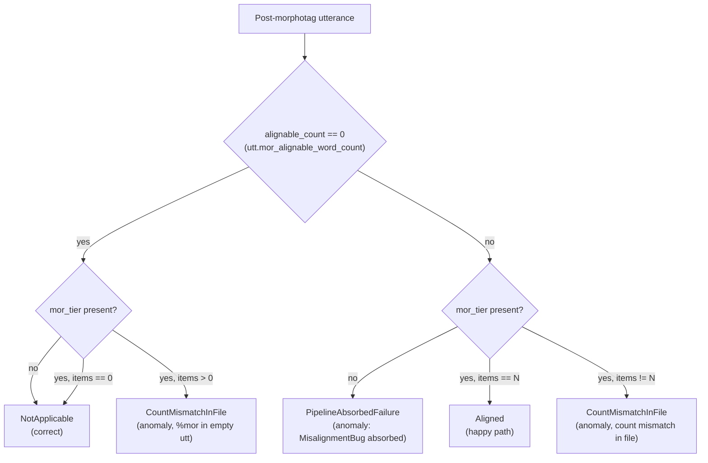

# NLP Pipeline Decision Architecture

**Status:** Current
**Last updated:** 2026-08-30 20:05 EDT

This chapter documents how batchalign3's four NLP pipelines (morphotag,
utseg, coref, forced alignment) represent per-utterance decisions, how
those decisions can flow through a shared reporting vocabulary, and how the
eval harness reads output back post-hoc. Every pipeline has typed outcomes,
a single place to add a new variant, compile-time errors for typos, and loud
typed diagnostics when invariants break. Durable decision persistence is
complete for forced alignment. Transcribe can also retain both of its
utterance-segmentation passes as schema-versioned debug evidence; standalone
utseg, morphotag, and coref do not yet have equivalent production sinks. The
[Decision Evidence](../developer/decision-provenance.md) chapter records that
boundary precisely. For the
morphotag-specific deep-dive into the 1-to-1 invariant that motivated
this architecture, see
[`Morphotag Reconciliation Invariants`](morphotag-invariants.md).

## Motivation

Every NLP pipeline has invariants a bug can silently break, Stanza
returning fewer tokens than the CHAT main tier contained, a worker
responding with the wrong number of assignments, a retokenize pass
losing a clitic. When one of those invariants is expressed as a raw
`Result<_, String>` or as a per-utterance `continue` that silently
skips a bad case, a single upstream regression can strip annotations
across thousands of utterances without any operator-visible signal.

The architecture below exists to make that class of failure harder to absorb
silently. Each pipeline defines typed outcomes and can convert anomalies into a
shared `DecisionRecord`. Forced alignment retains those records in structured
evidence; morphotag traces anomaly records but does not yet persist its
collection; utseg and coref do not yet have complete production sinks. Count
mismatches at invariant boundaries return typed diagnostics carrying enough
context to triage without re-running.

Four pipelines participate, each with its own natural shape:

```mermaid
flowchart LR
    subgraph Morphotag
        MP["collect_payloads<br/>(talkbank-transform/morphosyntax/payload.rs)"] --> MD["Stanza worker"]
        MD --> MI["inject_results<br/>(talkbank-transform/morphosyntax/injection.rs)"]
    end
    subgraph Utseg
        UP["collect_utseg_payloads<br/>(talkbank-transform/utseg.rs)"] --> UD["TalkBank boundary model<br/>or opt-in Stanza fallback"]
        UD --> UA["Admit source, cardinality,<br/>policy, and assignments"]
        UA --> UI["apply_utseg_results<br/>(talkbank-transform/utseg.rs)"]
        UA --> UE["Optional atomic evidence sink<br/>(transcribe pre/post CHAT)"]
    end
    subgraph Coref
        CP["collect_coref_payloads<br/>(talkbank-transform/coref.rs)"] --> CD["Stanza coref worker"]
        CD --> CI["apply_coref_results_with_outcomes<br/>(talkbank-transform/coref.rs)"]
    end
    subgraph "Forced Alignment"
        FU["fa::utr<br/>(batchalign/chat_ops/fa/utr.rs)"] --> FA["FA worker"]
        FA --> FP["fa::orchestrate<br/>(batchalign/chat_ops/fa/orchestrate.rs)"]
    end
```

Each pipeline's invariant is different, but all four define typed outcomes that
can map to one reporting vocabulary, [`DecisionRecord`](#the-decisionrecord-surface).
Only FA currently carries that vocabulary through a durable evidence sink.

> **No CHAT projection.** Decisions are recorded and traced, but current BA3
> never serializes them into `%xalign` or `%xrev`. Legacy `ReviewLevel` values
> remain accepted only for compatibility. See the
> [Review Tiers guide](../user-guide/review-tiers-guide.md).

## Per-task outcome vocabulary

### Morphotag

Each utterance produces exactly one
``MorOutcome``
with one of three kinds:

```mermaid
classDiagram
    class MorOutcome {
        +line_idx: usize
        +speaker: SpeakerCode
        +kind: MorOutcomeKind
        +to_decision_record() Option~DecisionRecord~
    }
    class MorOutcomeKind {
        <<enumeration>>
        NotApplicable(reason)
        Aligned(n_words)
        MisalignmentBug(diagnostic)
    }
    class NotApplicableReason {
        <<enumeration>>
        Empty
        FillerOnly
        FragmentOnly
        NonwordOnly
        UntranscribedOnly
        AllRetraced
        MixedNonLinguistic
    }
    class MisalignmentDiagnostic {
        +chat_words: Vec~String~
        +stanza_tokens_after_mapping: Vec~String~
        +expected: MorAlignableWordCount
        +actual: MorItemCount
        +suspected_class: MisalignmentClass
    }
    class MisalignmentClass {
        <<enumeration>>
        RealignmentSkipped
        MwtReassemblyBug
        TerminatorFilterBug
        LanguageDispatchIssue
        Unknown
    }
    MorOutcome *-- MorOutcomeKind
    MorOutcomeKind ..> NotApplicableReason
    MorOutcomeKind ..> MisalignmentDiagnostic
    MisalignmentDiagnostic *-- MisalignmentClass
```

`NotApplicable` is the common correct-by-construction case (filler-only
utterances, untranscribed, all-retraced). `Aligned` is the happy path.
`MisalignmentBug` is **always** a pipeline bug, never an expected
divergence, because the 1-to-1 invariant is deterministic by
construction when extraction, Stanza realignment, and MWT reassembly
cooperate. The `MisalignmentClass` classifier points a developer at
the most likely failing stage; see
[`Morphotag Reconciliation Invariants`](morphotag-invariants.md).

### Utterance segmentation

Utseg's invariant is simpler: the Python classifier must return exactly
one segment assignment per input word. The outcome space reflects that:

```mermaid
classDiagram
    class UtsegOutcome {
        +utt_ordinal: usize
        +speaker: SpeakerCode
        +kind: UtsegOutcomeKind
        +to_decision_record(line_idx) Option~DecisionRecord~
    }
    class UtsegOutcomeKind {
        <<enumeration>>
        NotApplicable(reason)
        Aligned(n_words, n_segments)
        MisalignmentBug(diagnostic)
    }
    class UtsegNotApplicableReason {
        <<enumeration>>
        SingleWord
        Empty
    }
    class UtsegMisalignmentDiagnostic {
        +expected_assignments: usize
        +actual_assignments: usize
        +words: Vec~String~
    }
    UtsegOutcome *-- UtsegOutcomeKind
    UtsegOutcomeKind ..> UtsegNotApplicableReason
    UtsegOutcomeKind ..> UtsegMisalignmentDiagnostic
```

`NotApplicable::SingleWord` is the one that matters most for clarity:
previously single-word utterances were silently dropped from the batch
(they trivially segment to one segment, so dispatch is wasteful). The
typed outcome records that as a deliberate decision rather than silence.

The production boundary model carries a richer, independently replayable state
than the transform outcome alone. Rust refuses to construct an admitted
prediction unless the response payload is exclusive, all vectors match the
request, the worker's applied actions follow its declared adjacency policy,
and assignments can be rederived from those actions.

```mermaid
classDiagram
    class AdmittedUtsegPrediction {
        <<enumeration>>
        BoundaryModelWorkerDeclared
        BoundaryModelLocallyReapplied
        UnobservedAssignments
        Constituency
    }
    class UtsegBoundaryModelEvidenceV2 {
        +model_id: String
        +model_revision: Option~String~
        +normalization_revision
        +adjacency_policy_revision
        +word_evidence: Vec
        +validate_assignments()
        +reapply_adjacency_policy()
    }
    class UtsegWordBoundaryEvidenceV2 {
        <<enumeration>>
        Classified(raw, applied, probability)
        NormalizationOmission
        ModelShortCircuit
    }
    class LocalUtsegDecisionReceipt {
        +worker_policy
        +local_policy
        +worker_assignments
        +suppressed_split_indices
    }
    AdmittedUtsegPrediction *-- UtsegBoundaryModelEvidenceV2
    UtsegBoundaryModelEvidenceV2 *-- UtsegWordBoundaryEvidenceV2
    AdmittedUtsegPrediction *-- LocalUtsegDecisionReceipt
```

The raw action and fixed-point boundary probability are model evidence. The
applied action is policy output. A locally replayed policy receives its own
receipt, including exact-retrace protections, so an experiment never presents
a heuristic decision as a fresh model prediction.

### Coreference

Coref has a different shape because it is document-level and sparse:
the worker receives all sentences at once and returns annotations only
for the subset that actually participates in a chain. Most utterances
legitimately produce no annotation.

```mermaid
classDiagram
    class CorefOutcome {
        +line_idx: usize
        +speaker: SpeakerCode
        +kind: CorefOutcomeKind
        +to_decision_record() Option~DecisionRecord~
    }
    class CorefOutcomeKind {
        <<enumeration>>
        NotApplicable
        NoChainsForSentence
        ChainsInjected(annotation)
        SentenceIndexOutOfBounds(sentence_idx, resolved_line_idx)
        InjectionFailed(error)
    }
    CorefOutcome *-- CorefOutcomeKind
```

`NoChainsForSentence` is **named explicitly** so eval reports don't
misread a sparse-but-correct run as a high-anomaly run.
`SentenceIndexOutOfBounds` is the worker-contract violation,
always a real bug, and `InjectionFailed` covers CHAT validation
failures during `%xcoref` tier construction.

### Forced alignment

FA is intentionally different. Unlike morphotag/utseg/coref, a single
utterance passes through three independent decision points (UTR
pre-pass, the FA call itself, the bullet-repair post-pass), any of
which may emit decisions. Collapsing into one variant per utterance
would lose that temporal structure, so FA keeps per-stage typed
records and routes all of them through the shared `DecisionRecord`:

```mermaid
flowchart TD
    U["Utterance"] --> UTR
    UTR{"UTR pre-pass<br/>fa::utr::inject_utr_timing"}
    UTR -->|"timed"| FA
    UTR -->|"unmatched"| UD1["DecisionRecord<br/>Utr::Unmatched"]
    UTR -->|"zero-duration skip"| UD2["DecisionRecord<br/>Utr::ZeroDurationSkipped"]
    FA{"FA call<br/>alignment::parse_fa_response"}
    FA -->|"Ok"| Rep
    FA -->|"JsonParse"| FE1["FaAlignmentError::JsonParse"]
    FA -->|"IndexedCountMismatch"| FE2["FaAlignmentError::IndexedCountMismatch"]
    Rep{"Repair post-pass<br/>fa::repair::repair_bullets"}
    Rep -->|"gap filled"| FD1["DecisionRecord<br/>Fa::GapFilled"]
    Rep -->|"boundary averaged"| FD2["DecisionRecord<br/>Fa::BoundaryAveraged"]
    Rep -->|"LIS removal"| FD3["DecisionRecord<br/>Fa::LisRemoval"]
    Rep -->|"monotonicity strip"| FD4["DecisionRecord<br/>Monotonicity::TimingStripped"]
    Rep -->|"end clamp"| FD5["DecisionRecord<br/>Monotonicity::EndClamped"]
    Rep -->|"narrow bullet"| FD6["DecisionRecord<br/>Fa::NarrowBulletRescued"]
    Rep -->|"words timing dropped"| FD7["DecisionRecord<br/>Fa::WordsTimingDropped"]
```

`FaAlignmentError` is a typed error (not a decision record, it's
returned up the call stack). All other FA events are emitted as
`DecisionRecord`s with typed `DecisionStrategy` tags. See
``fa/outcome.rs``
for the single-import bring-in of the FA decision vocabulary.

## The DecisionRecord surface

An anomaly outcome can converge on one type, `DecisionRecord`. FA retains and
traces it; morphotag traces anomaly records; the remaining production sinks are
not complete. No command serializes it into CHAT.

```mermaid
classDiagram
    class DecisionRecord {
        +line_idx: usize
        +speaker: String
        +strategy: DecisionStrategy
        +reason: String
        +needs_review: bool
        +evidence_summary() String
        +trace() void
    }
    class DecisionStrategy {
        <<enumeration>>
        Fa(FaStrategy)
        Utr(UtrStrategy)
        Monotonicity(MonotonicityStrategy)
        Morphosyntax(MorphosyntaxStrategy)
        Coref(CorefStrategy)
        Utseg(UtsegStrategy)
        +module() DecisionModule
        +strategy_name() &static str
    }
    class FaStrategy {
        <<enumeration>>
        GapFilled
        BoundaryAveraged
        LisRemoval
        TimingStripped
        WordsTimingDropped
        NarrowBulletRescued
    }
    class UtrStrategy {
        <<enumeration>>
        ZeroDurationSkipped
        Unmatched
    }
    class MonotonicityStrategy {
        <<enumeration>>
        EndClamped
        TimingStripped
    }
    class MorphosyntaxStrategy {
        <<enumeration>>
        NotApplicable
        MisalignmentBug
        MappingFailed
        RetokenizationFailed
        InjectionFailed
        NlpNoSentences
    }
    class UtsegStrategy {
        <<enumeration>>
        NotApplicable
        MisalignmentBug
    }
    class CorefStrategy {
        <<enumeration>>
        SentenceIndexOutOfBounds
        InjectionFailed
    }
    DecisionRecord *-- DecisionStrategy
    DecisionStrategy ..> FaStrategy
    DecisionStrategy ..> UtrStrategy
    DecisionStrategy ..> MonotonicityStrategy
    DecisionStrategy ..> MorphosyntaxStrategy
    DecisionStrategy ..> UtsegStrategy
    DecisionStrategy ..> CorefStrategy
```

Why this shape:

- **Typos are compile errors.** Before, `strategy: "narow_bullet_rescud"`
  would compile and produce a novel label consumers couldn't match.
  Now `FaStrategy::NarowBulletRescud` fails to compile.
- **Adding a new strategy requires exactly one declaration.** The enum
  variant and its `as_str()` label live in one place; serialization,
  tracing, and all match arms derive from that single source.
- **Exhaustive matching is possible.** Consumers can write
  `match strategy { DecisionStrategy::Utseg(s) => … }` and trust the
  compiler to flag missing cases when a new variant is added.
- **Duplicates across modules are OK by construction.**
  `TimingStripped` exists under both `FaStrategy` and
  `MonotonicityStrategy` because both modules legitimately emit it;
  the outer `DecisionStrategy` discriminator distinguishes them. Same
  for `InjectionFailed` (Morphosyntax and Coref) and
  `NotApplicable` / `MisalignmentBug` (Morphosyntax and Utseg).
- **Stable display format retained.** `DecisionRecord::evidence_summary()`
  formats `"{module}:{strategy} {reason}"` for evidence/reporting consumers;
  it no longer implies CHAT-tier generation.

## Outcome → DecisionRecord lifecycle

The per-task outcome is the pipeline-internal vocabulary; `DecisionRecord`
is the cross-task reporting surface. One canonical flow, traced here
for morphotag, applies by analogy to utseg and coref:

```mermaid
sequenceDiagram
    participant U as "Utterance<br/>(main tier)"
    participant E as "extract::collect_utterance_content<br/>(Mor domain)"
    participant P as "morphosyntax/payloads.rs"
    participant W as "Stanza worker<br/>(Python)"
    participant I as "morphosyntax/inject.rs"
    participant O as "MorOutcome"
    participant D as "DecisionRecord"
    participant T as "Structured tracing"

    U->>E: walk_words(Some(Mor))
    E-->>P: N alignable words
    alt N == 0
        P->>O: NotApplicable { classify_not_applicable() }
    else N > 0
        P->>W: dispatch batch item
        W-->>I: UdResponse with M tokens
        alt M == N (aligned after MWT reassembly)
            I->>O: Aligned { n_words: N }
        else M != N
            I->>O: MisalignmentBug(diagnostic with suspected_class)
        end
    end
    O->>D: to_decision_record() (None for Aligned)
    D->>T: trace anomaly record
```

Aligned outcomes produce `None` from `to_decision_record()`: the happy
path does not add a decision record. NotApplicable and MisalignmentBug both
produce records, with `needs_review=false` and
`true` respectively.

This diagram ends at tracing on purpose. Morphotag's `InjectionResult` carries
the records, but the command currently discards that collection after
injection. It must gain a typed command result before this diagram may grow a
durable-evidence participant.

## Eval harness observation model

The 19-pair L2 morphotag eval extends this architecture by adding an
external-observation variant
(``UtteranceOutcome``)
that reads a post-morphotag CHAT file and classifies every utterance
without access to the pipeline's internal `MorOutcome`. This is
deliberately asymmetric, the eval sees only what's written to the
file:

```mermaid
flowchart TD
    U["Post-morphotag utterance"] --> C1{"alignable_count == 0<br/>(utt.mor_alignable_word_count)"}
    C1 -->|"yes"| C2{"mor_tier present?"}
    C2 -->|"no"| NA["NotApplicable<br/>(correct)"]
    C2 -->|"yes, items == 0"| NA
    C2 -->|"yes, items > 0"| CM1["CountMismatchInFile<br/>(anomaly, %mor in empty utt)"]
    C1 -->|"no"| C3{"mor_tier present?"}
    C3 -->|"no"| PAF["PipelineAbsorbedFailure<br/>(anomaly: MisalignmentBug absorbed)"]
    C3 -->|"yes, items == N"| AL["Aligned<br/>(happy path)"]
    C3 -->|"yes, items != N"| CM2["CountMismatchInFile<br/>(anomaly, count mismatch in file)"]
```

`PipelineAbsorbedFailure` is the most informative variant: it surfaces
every utterance the pipeline received but silently produced nothing
for. It is visible in the eval's `anomaly_rate` column per pair, so
any systemic increase shows up as a corpus-wide regression signal
rather than as a hard-to-spot drop in individual `@s`-word metrics.

`per-pair.csv` from the eval now includes five new columns:
`outcome_not_applicable`, `outcome_aligned`, `outcome_count_mismatch_in_file`,
`outcome_pipeline_absorbed_failure`, `anomaly_rate`. `summary.md`
surfaces a dedicated "Per-utterance outcome distribution" section.

## Typed counts at the invariant boundary

The morphotag invariant check is written against typed newtypes rather
than `usize` so that a refactor cannot accidentally swap
"Mor-alignable CHAT word count" and "`%mor` item count":

- ``MorAlignableWordCount``
 , what `Utterance::mor_alignable_word_count()` returns.
- ``MorItemCount``
 , what `mor_tier.items.len()` measures.

Both live in `talkbank-model::alignment::helpers::count` alongside the
existing `count_tier_positions` walker. The canonical N lives on
`Utterance` itself so every caller (morphotag injector, eval harness,
CHAT validators) consults the same source, enforced by an integration
test that walks the full 98-file reference corpus and asserts
agreement between the method and the `extract::collect_utterance_content`
walker.

## Source pointers

Core outcome types:

- `crates/batchalign-transform/src/morphosyntax/outcome.rs`: `MorOutcome`,
  `MisalignmentDiagnostic`, `classify_not_applicable`
- `crates/batchalign-transform/src/utseg.rs`: `UtsegOutcome`,
  `validate_utseg_response`
- `crates/batchalign-transform/src/coref.rs`: `CorefOutcome`,
  `apply_coref_results_with_outcomes`
- `crates/batchalign/src/chat_ops/fa/outcome.rs`: FA decision
  vocabulary (re-exports)
- `crates/batchalign/src/chat_ops/fa/alignment.rs`: `FaAlignmentError`
  (typed error for FA response parsing)
- `crates/batchalign-transform/src/decisions.rs`: `DecisionRecord`,
  `DecisionStrategy`, all per-module strategy enums

Invariant enforcement:

- `crates/batchalign-transform/src/inject.rs`,
  `inject_morphosyntax` (returns `Result<(), MisalignmentDiagnostic>`)
- `batchalign/inference/morphosyntax.py`,
  realignment-skipped WARN at the Python boundary
- `chatter/crates/talkbank-model/src/alignment/helpers/count.rs`
 , `MorAlignableWordCount` / `MorItemCount` newtypes and
  `count_tier_positions` walker

Tests that pin the architecture:

- `crates/batchalign/tests/mor_count_parity_reference_corpus.rs`
 , cross-walker count parity across the 98-file reference corpus
- `batchalign/tests/inference/test_morphosyntax_realignment_contract.py`
 , Python contract test pinning `tok_ctx.original_words` sequencing
- `crates/batchalign-transform/src/morphosyntax/outcome.rs`
  `#[cfg(test)]`: per-variant classification tests
- `crates/batchalign/src/eval_cmd/l2_morphotag/tests.rs`
 , `UtteranceOutcome` classifier truth table

Deep-dive pages:

- [`Morphotag Reconciliation Invariants`](morphotag-invariants.md)
 , the 1-to-1 invariant in full: what `counts_for_tier` defines as
  alignable, and why the three stages produce it by construction.

## How to investigate a morphotag misalignment decision

When logs report `module=morphosyntax strategy=misalignment_bug`, use this
flow:

1. **Read the `suspected_class` field** in the `reason`. Five values
   (`RealignmentSkipped`, `MwtReassemblyBug`, `TerminatorFilterBug`,
   `LanguageDispatchIssue`, `Unknown`) each point at a different
   stage.
2. **Compare `chat_words` and `stanza_tokens_after_mapping`** also in
   the `reason`. The word/token sequences usually show where they
   diverged, e.g. a comma dropped, an MWT split wrongly reassembled.
3. **Check the Python worker log** for a realignment-skipped WARN for
   the same file/language, if present, the dispatch-side context
   wasn't set and the `RealignmentSkipped` class is concrete.
4. **Use the typed line index and speaker** in the trace to locate the
   utterance. `--review-level` is a legacy compatibility option and does not
   create a CHAT diagnostic tier.

If the repro is reliable, add a failing regression test in
`batchalign` using `chatter trim` to produce a minimal
fixture from the affected real file. The trace's typed strategy name maps
directly to the enum variant for pattern matching in the assertion.
