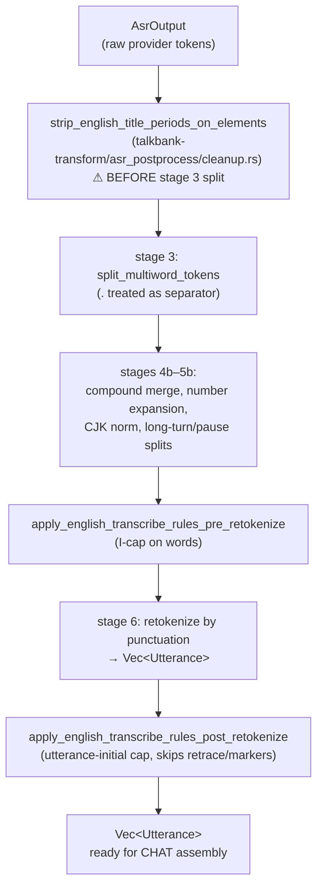

# Preprocessing and Postprocessing for Model Inference

**Status:** Current
**Last updated:** 2026-05-19 20:22 EDT

All domain logic — text normalization, alignment, result injection, and error recovery — lives in Rust. Python workers are stateless ML inference endpoints. This chapter documents the preprocessing that prepares data for inference and the postprocessing that incorporates results back into the CHAT AST.

## The Boundary Principle

Python receives structured payloads (lists of words, audio paths, language codes) and returns structured results (POS tags, timestamps, parse trees). It never sees CHAT text, never parses tiers, and never makes alignment decisions.

```text
Rust: CHAT AST → extract words → clean text → build payload
                                                    │
Python: load model → run inference → return structured output
                                                    │
Rust: validate response → align with AST → inject results → serialize CHAT
```

## Preprocessing by Task

### Morphosyntax

**Extract** (`talkbank-transform/morphosyntax/payload.rs::collect_payloads`):
1. Walk content with `walk_words(domain=Mor)`
2. Collect `cleaned_text()` for each alignable word
3. Replace special forms (`@c` → `"xbxxx"`, `@s` → language marker) — Stanza can't handle CHAT-specific markers
4. Build payload: `Vec<String>` of words per utterance

**Payload → Python:**
```json
{"words": ["I", "want", "cookie"], "lang": "eng"}
```

**Python returns:** Raw Stanza `to_dict()` output — POS tags, lemmas, dependency parse, features.

**Postprocess** (`talkbank-transform/morphosyntax/injection.rs`,
`talkbank-transform/retokenize/`, `talkbank-transform/morphosyntax/sentence_mapping.rs`):

Two injection paths diverge based on `TokenizationMode`:

- **Preserve** (default): `map_ud_sentence()` merges MWT Range tokens into clitic MOR items (1 MOR per CHAT word). `inject_morphosyntax()` adds %mor/%gra tiers without modifying the main tier.
- **StanzaRetokenize** (`--retokenize`): `map_ud_sentence_expanded()` produces per-component MOR items. Range parent tokens are filtered from the token vector. `retokenize_utterance()` rewrites the main tier with Stanza's expanded tokens and injects per-component %mor/%gra.

Both paths share GRA generation via `build_gra_and_validate()`.

Steps:
1. **Range token filtering** (Retokenize only): exclude `UdId::Range` parent entries from the token vector — only component words appear.
2. **Grammatical-invariant rewrites** (`apply_grammatical_invariants` at
   `talkbank-transform/morphosyntax/invariants.rs:14`,
   `talkbank-transform/morphosyntax/invariants/` for the per-rule modules):
   operate on the typed `UdSentence` BEFORE `map_ud_sentence` runs. English
   primary only today, dispatched via `lang2(&ctx.lang)` in
   `talkbank-transform/morphosyntax/sentence_mapping.rs`. The only rule
   shipped so far is `finite_verb_main_clause::rescue_english_copula_progressive`
   (at `invariants/finite_verb_main_clause.rs:9`) — detects `<noun>'s <-ing>`
   patterns that Stanza mis-parses as possessive-gerund and rewrites them
   into a coherent copula-progressive tree (PART → AUX `be`, root NOUN →
   VERB VerbForm=Part, governor deprel → nsubj). See
   [Stanza Limitations — Defect 1](../reference/stanza-limitations.md) for
   the defect description and re-evaluation procedure.
3. **UD → CHAT mapping:** Convert Universal Dependencies POS/features to TalkBank %mor format (category mappings, stem extraction, feature translation).
4. **MWT handling:** In Preserve mode, multi-word tokens produce one clitic MOR (`pron|it~aux|be`). In Retokenize mode, each component gets its own MOR.
5. **%gra construction:** Build dependency graph with chunk-based indexing (GRA indices are %mor chunk positions, not surface word positions).
6. **L2 splice** (default; opt out with `--no-l2-morphotag`): after primary injection, @s words with `L2|xxx` are routed to secondary Stanza models and spliced back with real morphology. L2 extracts its `l2_deferred` positions from the ORIGINAL `ud_responses` captured before `apply_grammatical_invariants` ran (`crates/batchalign/src/pipeline/morphosyntax.rs:352-356`, plus the L2 dispatch in `crates/batchalign/src/morphosyntax/batch.rs`), so the English rewrite cannot corrupt L2 position mapping.
7. **Validation:** Check word count alignment, GRA cycle detection, chunk count consistency.
8. **Injection:** Replace or add %mor and %gra dependent tiers on the utterance.

### Forced Alignment

FA preprocessing has two stages — UTR (Utterance Timing Recovery) and FA proper.
See [Forced Alignment](../reference/forced-alignment.md) for the complete pipeline.

**UTR:** Injects utterance-level timing from ASR tokens before FA runs. Supports
global single-pass and two-pass overlap-aware strategies. See
[Overlapping Speech](../reference/overlap-markers.md) for the two-pass algorithm
and CA marker-aware windowing.

**FA:** Groups utterances into time-windowed clusters, sends each group's words +
audio window to Python for word-level timestamp inference, then injects timing
back into the AST.

**Python receives:** Audio window (start_ms, end_ms) + word list.
**Python returns:** Per-word timestamps.
**Rust postprocessing:** Word end-time chaining, conditional word timing clamping
(only on re-alignment runs where `%wor` already exists — see
[Word timing clamping policy](../reference/forced-alignment.md#word-timing-clamping-policy)),
monotonicity enforcement, pause assignment, `%wor` tier generation.

### ASR (Automatic Speech Recognition)

ASR preprocessing is the most complex because raw ASR output needs extensive normalization before it becomes CHAT:

**ASR postprocessing pipeline** (`crates/batchalign-transform/src/asr_postprocess/`):

| Stage | Module | What it does |
|-------|--------|-------------|
| 1. Compound merging | `compounds.rs` | Join split compounds: `ice` + `cream` → `ice+cream` (3,584 pairs, O(1) HashSet) |
| 2. Timed word extraction | `mod.rs` | Convert seconds → milliseconds, extract ASR tokens, strip MOR_PUNCT, lowercase |
| 3. Multi-word splitting | `mod.rs` | Split space-separated tokens with timestamp interpolation |
| 4. **Number expansion** | `num2text.rs` + `ordinal_year_eng.rs` | Single Rust per-word pass: cardinals via per-language `NUM2LANG` (47 langs), CJK via `num2chinese`, currency via `try_expand_currency`, English ordinals/years/decades via `ordinal_year_eng`. No Python `num2words` IPC. See [Number Expansion](../reference/number-expansion.md). |
| 4b. Cantonese normalization | `cantonese.rs` | Simplified → traditional + domain replacements (31 entries, Aho-Corasick) |
| 5. Long turn splitting | `mod.rs` | Break turns > 300 words into separate utterances |
| 5b. Pause-based splitting | `mod.rs` | Long pauses in unpunctuated runs create utterance boundaries |
| 6. Retokenization | `mod.rs` | Split into utterances by punctuation boundaries |

All module filenames in the table above are under
`crates/batchalign-transform/src/asr_postprocess/`.

**Retokenization** (step 6) is particularly important: ASR produces one long stream of text, but CHAT needs it segmented into utterances. The retokenizer uses punctuation (`.`, `?`, `!`) as utterance boundaries and assigns timing from the ASR tokens.

#### English transcribe corrections

Three English orthographic corrections are woven into the pipeline at
specific points, gated on `lang == "eng"`. Each hook sits exactly where
the surrounding stage either produces or preserves the surface the rule
must see. See
[English Transcribe Corrections](../reference/english-transcribe-corrections.md)
for the full rule set and probe-verdict citations.



Why each hook lives where it does:

- **Title-period strip runs on raw `AsrElement`s, before stage 3.** Stage 3's
  `normalized_split_separator` treats `.` as a word separator, so `Dr.` would
  fragment into `Dr` + `.` before the allowlist could match. Stripping on
  the raw element keeps `Dr` a single token through every subsequent stage.
- **I-cap runs on per-word chunks, before retokenize.** At this point numbers
  are already expanded and compounds merged, but utterances have not yet
  been carved out of the stream — the rewrite is a local surface fix.
- **Utterance-initial cap runs after retokenize and after retrace detection.**
  The "real" first word of an utterance is only knowable once `WordKind`
  tags are assigned; the rule walks past `xxx/yyy/www`, `&`-prefixed
  tokens, and `WordKind::Retrace` copies to find it.

### Translation

**Extract:** Full utterance text (all words concatenated).
**Python:** Google Translate or SeamlessM4T → translated text.
**Inject:** Add `%xtra` dependent tier with the translated text.

### Utterance Segmentation

**Extract:** Words per utterance (same as morphosyntax).
**Python:** Stanza constituency parser → parse tree with boundary predictions.
**Postprocess:** Assign boundary codes (utterance break, clause break, continuation) based on constituency structure. Apply boundaries to merge/split utterances.

### Coreference

**Extract:** All sentences in the document (document-level, not per-utterance).
**Python:** Stanza coref → coreference chains.
**Inject:** Sparse `%xcoref` tiers on utterances that contain coreferent mentions.

## Retokenization: The Character-Level Bridge

When Stanza tokenizes differently than CHAT, the retokenizer (`retokenize/`) bridges the gap:

```text
CHAT words:     ["don't",    "wanna"]
Stanza tokens:  ["do", "n't", "wan", "na"]
```

The retokenizer:
1. Concatenates both word lists into character strings
2. Runs character-level DP alignment
3. Builds a deterministic mapping from Stanza token indices back to CHAT word indices
4. Uses this mapping to assign Stanza annotations (POS, lemma, depparse) to the correct CHAT words

This handles splits (`don't` → `do` + `n't`), merges, and even reorderings across languages. The mapping uses a length-aware fallback for ambiguous cases.

## Cache Keys

Each task computes a cache key from its input payload, so identical inputs skip inference:

| Task | Cache key formula |
|------|------------------|
| Morphosyntax | `BLAKE3("{words}|{lang}|mwt")` |
| Utseg | `BLAKE3("{words}|{lang}")` |
| Translation | `BLAKE3("{text}|{src_lang}|{tgt_lang}")` |
| FA | `BLAKE3("{audio_identity}|{start}|{end}|{text}|{pauses}|{engine}")` |
| UTR ASR | `BLAKE3("utr_asr|{audio_identity}|{lang}")` |
| Coref | No caching (document-level context) |

Cache keys are 64-char hex BLAKE3 hashes via the shared
`CacheKey::from_content` newtype (`crates/batchalign/src/chat_ops/cache_key.rs:23`).

Cache is tiered: moka in-memory (hot) → SQLite on-disk (cold).
